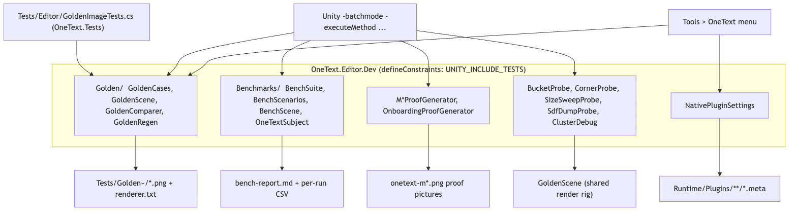
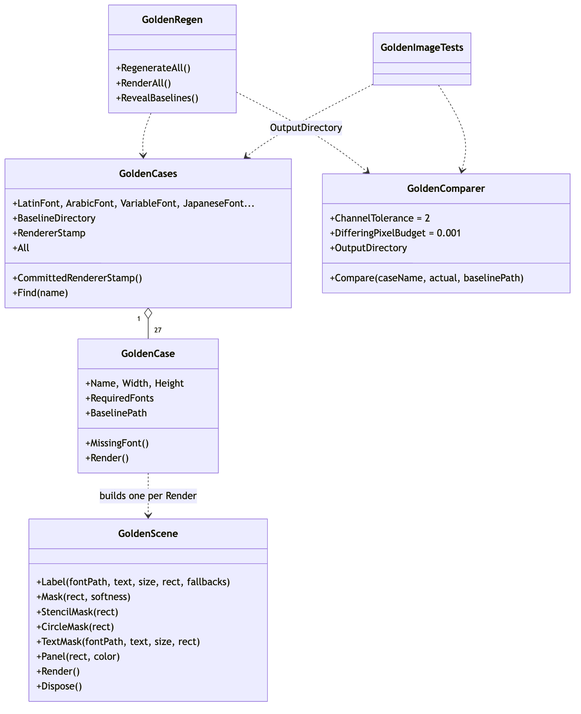
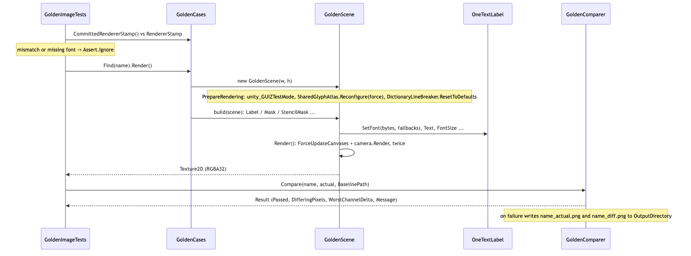
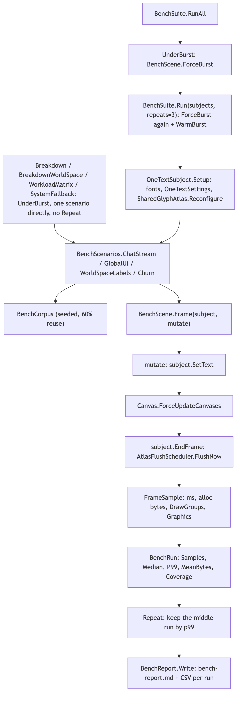
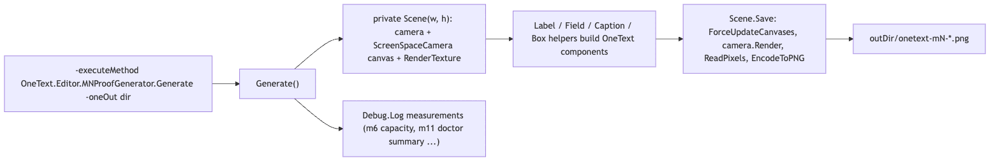

# Editor/Dev

`Editor/Dev/` is the development harness: the code that measures, pictures and approves the engine rather than the code that ships it. It holds the golden-image registry and comparer (`Golden/`), the compound benchmark suite (`Benchmarks/`), the batch-mode proof generators (`M2ProofGenerator` through `M15VerticalProofGenerator`, `OnboardingProofGenerator`), a handful of throwaway rendering probes (`BucketProbe`, `CornerProbe`, `SizeSweepProbe`, `SdfDumpProbe`, `ClusterDebug`) and the importer batch that stamps the vendored HarfBuzz binaries with their platform masks (`NativePluginSettings`). It sits after the whole pipeline (string -> parse -> analyze -> shape -> layout -> render -> frontend): everything here drives `OneTextLabel`, `OneTextInputField`, `GlyphAtlas` or `TextLayoutEngine` from the outside and reads pictures or timings back. Nothing in the runtime references it.

The folder is its own assembly, `OneText.Editor.Dev` (`OneText.Editor.Dev.asmdef`), with `"defineConstraints": ["UNITY_INCLUDE_TESTS"]` and `"includePlatforms": ["Editor"]`. Unity defines `UNITY_INCLUDE_TESTS` only for a project that lists the package under `testables` in its manifest, so a consumer who merely installs the package never compiles any of this and never sees the `Tools > OneText > Golden Images` menu. The test assembly `OneText.Tests` (`Tests/Editor/OneText.Tests.asmdef`) references `OneText.Editor.Dev` so that `GoldenImageTests.cs` can drive `GoldenCases`. The CHANGELOG records why: before the move every consumer compiled the harness and got a menu item for a baseline set they did not have. `.npmignore` additionally keeps `Editor/Dev/` out of a registry tarball, but a git-URL install still clones it, so the assembly constraint is the thing that actually keeps it out of a consumer's compile.

## Files

| File | Responsibility |
| --- | --- |
| `OneText.Editor.Dev.asmdef` | The assembly: references `OneText`, `OneText.UGUI`, `OneText.Mesh`, `OneText.Editor`, `UnityEngine.UI`, `UnityEditor.UI`, `Unity.Burst`; editor-only; `defineConstraints: UNITY_INCLUDE_TESTS`; `autoReferenced: true`. |
| `Golden/GoldenCases.cs` | `GoldenCase` (name, canvas size, required fonts, description, build delegate; `MissingFont()`, `Render()`) and the static registry `GoldenCases` (27 cases, font path constants, `BaselineDirectory`, `RendererStamp`, `CommittedRendererStamp()`, `All`, `Find`). |
| `Golden/GoldenScene.cs` | The deterministic render rig: orthographic camera into an `ARGB32` `RenderTexture` with `antiAliasing = 1`, a `ScreenSpaceCamera` canvas with `pixelPerfect = false`, per-process font byte cache, `Label`, `Mask` (RectMask2D), `StencilMask`, `CircleMask`, `TextMask`, `Panel`, `Render()` (two passes), `Dispose()`. |
| `Golden/GoldenComparer.cs` | `Compare(caseName, actual, baselinePath)` with `ChannelTolerance = 2` and `DifferingPixelBudget = 0.001`; writes `<name>_actual.png` and a yellow-to-red `<name>_diff.png` heatmap into `OutputDirectory` (`ONETEXT_GOLDEN_OUT` or `<temp>/onetext-golden`) on failure. |
| `Golden/GoldenRegen.cs` | The only writer of baselines: `RegenerateAll` (menu and `-executeMethod`), `RenderAll` (renders without approving), `RevealBaselines`. Writes `renderer.txt` after a successful regen. |
| `Benchmarks/ITextSubject.cs` | `ITextSubject` (a text system under test: `Setup`, `CreateLabel`, `SetText`, `EndFrame`, `TextureMemoryBytes`, `Describe`, `Teardown`), `ICoverageReporting` (`CountCoverage`), `IPrewarmable` (`Prewarm`). |
| `Benchmarks/OneTextSubject.cs` | `BenchFonts` (package fonts plus the first system CJK face found) and `OneTextSubject`, the OneText implementation of the three interfaces: builds a private `OneTextSettings` with the atlas budget and project fallbacks, forces `AtlasFlushScheduler.DeferOutsidePlayMode`, flags `prewarm` / `parity` (system fonts off) / `systemFallbackOnly`. |
| `Benchmarks/BenchCorpus.cs` | Seeded text generator (`Language.Korean/Japanese/English/Mixed`, 60 % reuse from a 220-word pool by default): `Line`, `Short`, `CommonCodepoints`. |
| `Benchmarks/BenchScenarios.cs` | The compound scenes: `ChatStream` (C2), `GlobalUi` (C1), `Churn` (C4, one workload-matrix cell), `WorldSpaceLabels` (C3). Each returns a `BenchRun`. |
| `Benchmarks/BenchHarness.cs` | `FrameSample`, `BenchRun` (median, p99, max, `MeanBytes`, `Coverage`, `MedianDrawGroups`), `BenchScene` (canvas + camera + `Frame()` measurement, `CountDrawGroups`, allocation gauge probing, `ForceBurst`/`RestoreBurst`, `BurstMethod`, `AllocationMethod`), `BenchReport.Write` (markdown table + CSV per run). |
| `Benchmarks/BenchSuite.cs` | Command-line entry points: `RunAll`, `Breakdown`, `BreakdownWorldSpace`, `RasterizeModes`, `AsianLayout`, `WorkloadMatrix`, `SystemFallback`; `Subjects()`, `Run(subjects, repeats)`, `Repeat` (middle run by p99), `-oneOut` parsing. |
| `M2ProofGenerator.cs` | Atlas dump and a first camera render (`Generate`), plus `M3Proof` (bidi), `SeamProof` (large Arabic joins) and `Diagnose` (vertex count, material, default-material comparison). |
| `M4ProofGenerator.cs` | Wrapping / alignment / justification, font fallback inside one label, variable-font weights (`onetext-m4-wrap/fallback/variable.png`). |
| `M5ProofGenerator.cs` | Input-field caret and selection including RTL and multiline, and `<link>` hit-test boxes drawn under the text via `OneTextCaret.SetGeometry`. |
| `M6ProofGenerator.cs` | Atlas packing before/after compaction (two atlases, `AutoCompact` off/on), `Headroom` until the next eviction, `CompactionIsInvisible` (pixel diff of the same text across a forced `Compact`), `CjkCapacity` (how many Hangul tiles a 1024x4 and 2048x4 budget hold at 48 px, system Korean font only). |
| `M10ProofGenerator.cs` | Punctuation compression at a line edge, kinsoku on the emergency break (box measured with `TextLayoutEngine` to the width of `ORDER8827`), and `locl` through `Tests/Fonts~/LoclRegional.ttf` under `null`, `ja`, `zh-Hans`. |
| `M11ProofGenerator.cs` | The Hub's views drawn without a window: the gallery (overflow measured the way the tab measures it), Doctor findings from `TextDoctor.Run(TextSourceScanner.Scan(...))` on a temp CSV, and the atlas pie from `GlyphAtlasStats` (`PrewarmedPixels`, `RuntimePixels`, `DemandTiles`). |
| `M12ProofGenerator.cs` | Input-method composition: a `ScriptedIme : IImeInput` registered through `ImeInput.Register`, Hangul steps, a Japanese clause, composing over a selection, a read-only field, and the focus-loss panel (`DeactivateInputField` after a pending composition). |
| `M14ProofGenerator.cs` | Decorations (`<outline>`, `<shadow>`, `<glow>`, nested, shaped Arabic) all in one canvas and one material, and `Precise` (SDF vs MSDF corners on `AW4Z` at 320 px, decorations on the MSDF field). |
| `M15ProofGenerator.cs` | Ruby: furigana, distributed slack, wider-than-base, overhang over punctuation, decorated, any-script annotation, and the unbreakable base+reading group at a narrow measure. |
| `M15VerticalProofGenerator.cs` | Vertical writing: a right-to-left column paragraph with kinsoku and compression, mixed Latin, the font's `vert` forms against the same string set horizontally, ruby beside a column, decorations in a column, and an untouched horizontal control. |
| `OnboardingProofGenerator.cs` | Walks the new-user path for real: copies two fonts into `Assets/OneTextOnboarding`, `OneFontAssetCreator.CreateFromFontFile`, sets `_defaultFont` and `_fallbackFonts` on `OneTextSettingsProvider.GetOrCreate()`, renders a label with no font assigned. |
| `BucketProbe.cs` | Temporary: `New Text` at 36 pt under canvas scale 1 and 3 versus 108 pt at scale 1, to picture bucket magnification (`GlyphAtlas.QuantizePixelsPerEm`). Writes to `ONETEXT_PROBE_OUT` or `<temp>/onetext-bucket`. |
| `CornerProbe.cs` | Temporary: SDF vs `Precise` at 36 pt and at 288 pt under `OneTextLabel.PpemCap` 128 and 256. |
| `SizeSweepProbe.cs` | Temporary: 12-32 pt under `TextQuality.Performance/Medium/High` plus a 4x supersampled "truth" render per size. |
| `SdfDumpProbe.cs` | Temporary: raw SDF tiles for `e x N o` at 128 and 512 ppem as `.bin` + `.json` (width, height, origin, units per pixel) for offline reconstruction experiments. |
| `ClusterDebug.cs` | Shapes an Arabic word, logs `CLUSTERDBG` lines for each glyph and cluster, rasterizes the first cluster through `GlyphAtlas.GetOrAddCluster`, dumps the tile raw and thresholded, and renders the word solo. |
| `NativePluginSettings.cs` | `Apply` (menu `Tools > OneText > Apply Native Plugin Settings`), `ApplyBatch` (batch entry, exits 0), `Report` (menu): sets `PluginImporter` platform/CPU/editor masks for every `libHarfBuzzSharp` binary under `Runtime/Plugins` from the `Targets` table. |

## Structure

Source: [diagrams/dev-harness-overview.mmd](diagrams/dev-harness-overview.mmd)

Four independent tool groups share one assembly and one idea: drive real components headlessly and write something a human can look at. The golden tier is the only group with a test behind it; the rest are command-line targets (`Unity -batchmode -quit -projectPath <dev> -executeMethod <Type>.<Method> -oneOut <dir>`) or menu items, and they print or write files rather than assert.

Source: [diagrams/golden-types.mmd](diagrams/golden-types.mmd)

`GoldenCases.All` is the registry: 27 `GoldenCase` entries, each a name, a canvas size, the fonts it needs on disk and an `Action<GoldenScene>` that builds the picture. `GoldenCase.Render()` opens a `GoldenScene`, runs the build delegate and returns the RGBA32 `Texture2D` (the caller owns it). `GoldenComparer.Compare` is the pass/fail rule. `GoldenRegen` is the only code allowed to write into `Tests/Golden~/`. `GoldenScene` is also the shared render rig the probes use (`BucketProbe`, `CornerProbe`, `SizeSweepProbe` all construct one) so that a probe picture and a golden picture cannot drift apart; the M-series proof generators predate it and, from `M4ProofGenerator` on, each carry a private `Scene` class with the same construction (`M2ProofGenerator` and `M6ProofGenerator` build the camera and canvas inline per method).

In `Benchmarks/`, `BenchSuite` is the entry point, `BenchScenarios` the scene definitions, `BenchScene` the per-frame instrument and `OneTextSubject` the only `ITextSubject` in the package. The TextMeshPro subject lives in the dev project (`Docs/BENCHMARKS.md` calls it `CompoundBench`) and calls `BenchSuite.Run` with its own subject factory, so the package never references TMP while both systems run the same strings and frame loop.

## Behaviour

### Golden images

Source: [diagrams/golden-compare-sequence.mmd](diagrams/golden-compare-sequence.mmd)

A test run (`Tests/Editor/GoldenImageTests.cs`, one NUnit case per registry entry via `TestCaseSource`) goes:

1. `RequireTheRendererTheBaselinesCameFrom()` compares `GoldenCases.CommittedRendererStamp()` (the contents of `Tests/Golden~/renderer.txt`, currently `Metal|Apple M4 Pro|Gamma`) with `GoldenCases.RendererStamp` (`SystemInfo.graphicsDeviceType|graphicsDeviceName|QualitySettings.activeColorSpace`). A mismatch is `Assert.Ignore`, not a failure: Metal and OpenGL disagree about the last bit of an antialiased edge and that is not a fact about the package. The Unity version is deliberately not in the stamp, so an editor upgrade that changes uGUI rasterization is reported.
2. `GoldenCase.MissingFont()` walks `RequiredFonts`; a coverage face that has not been fetched (`Tools/fetch_coverage_fonts.py`) is `Assert.Ignore`. A missing baseline is `Assert.Ignore` with the regen command in the message.
3. `GoldenCase.Render()` constructs a `GoldenScene(Width, Height)`. The constructor calls `PrepareRendering()`: sets the `unity_GUIZTestMode` shader global (a hand-driven canvas render never sets it and the SDF shader reads it for its ZTest), `SharedGlyphAtlas.Reconfigure(force: true)` (a stale atlas leaves the previous case's packing in this one's UV rectangles) and `Unicode.DictionaryLineBreaker.ResetToDefaults()` (the Asian typography tests install and clear word lists and a Thai paragraph wraps differently depending on which ran last). Camera: orthographic, solid colour `(0.10, 0.11, 0.13)`, MSAA and HDR off; target `RenderTexture(w, h, 24, ARGB32)` with `antiAliasing = 1`; canvas `ScreenSpaceCamera`, `planeDistance = 5`, `pixelPerfect = false`.
4. The build delegate calls `scene.Label(fontPath, text, size, rect, fallbacks...)` and friends. Rects are in pixels from the top-left of whatever the label lands inside (`anchorMin = anchorMax = pivot = (0,1)`, `anchoredPosition = (x, -y)`). After `Mask`, `StencilMask`, `CircleMask` or `TextMask` the parent switches to that mask, so later labels go inside it. `Label` reads font bytes through the static per-process `FontBytes` cache (`GoldenScene.Font`) and calls `label.SetFont(bytes, fallbacks)`.
5. `GoldenScene.Render()` runs `Canvas.ForceUpdateCanvases()` + `_camera.Render()` twice (the first pass discovers, rasterizes and uploads glyphs; a label that baked UVs before the atlas grew rebuilds against the new one), then `ReadPixels` into an RGBA32 texture.
6. `GoldenComparer.Compare` loads the baseline PNG, rejects a size mismatch, then per pixel takes the max absolute channel delta. A pixel is "different" when that delta exceeds `ChannelTolerance` (2). The case passes when the differing fraction is at most `DifferingPixelBudget` (0.1 %, 131 pixels of a 512x256 canvas). Two tolerances on purpose: a driver update shifts every antialiased edge by one 255th (many pixels, tiny delta) while a glyph that moved half an em changes few pixels by a lot; a single average would forgive the second to make room for the first. On failure it writes `<name>_actual.png` and `<name>_diff.png` (baseline greyed out, differing pixels painted yellow at the tolerance through red at delta 98+) into `OutputDirectory` and names both in the message.

Approving new pictures is a separate, manual act: `GoldenRegen.RegenerateAll` renders every case whose fonts are present, writes `Tests/Golden~/<name>.png`, and only when at least one baseline was written overwrites `renderer.txt` with the current stamp. It throws if any case failed to render, so a broken case cannot silently keep a stale baseline. `RenderAll` renders into `GoldenComparer.OutputDirectory` without touching baselines, for looking before approving.

The registry is chosen for breadth over depth. Latin rich text, inline metrics, the three SDF decoration channels, line decorations, alignment, justification, wrapping, variable weights; Arabic bidi and joining; Devanagari conjuncts; Thai dictionary wrapping; CJK kinsoku, vertical columns, vertical decorations, ruby; emoji sequences and a five-script fallback chain; then six `RectMask2D` cases (one per fragment-shader return plus softness plus the one case where clip-per-layer and clip-the-composite differ) and three stencil `Mask` cases (child, circle, text-as-mask). The comment above `mask-rect-decorations-soft` records the measurement that justifies it: rendering every baseline under both clipping orders changed exactly that picture, by 271 pixels.

### Benchmarks

Source: [diagrams/bench-flow.mmd](diagrams/bench-flow.mmd)

Run: `Unity -batchmode -quit -projectPath <dev> -executeMethod OneText.Benchmarks.BenchSuite.RunAll -oneOut <dir>`. Every public entry point wraps its body in `UnderBurst`, which calls `BenchScene.ForceBurst()` (Burst compilation on and synchronous) and restores the previous options in `finally`. Without that the editor's default (compile on, asynchronous) makes a short run measure the managed fallback; the comment records the SDF rasterizer reading 12x slower than it is (131 ms against 11 ms for the same 368k texels). `Run` forces it again and calls `WarmBurst` (bakes 32 Hangul tiles into a throwaway `GlyphAtlas`) so the one synchronous compile stall lands before the first timed frame.

`RunAllCore` builds `Subjects()` (OneText at 1024x4, 1024x4 + prewarm, 2048x4 + prewarm) and for each runs `ChatStream`, `GlobalUi` and `WorldSpaceLabels` through `Repeat(3, ...)`, which sorts the three `BenchRun`s by `P99` and keeps the middle one. Inside a scenario:

1. `using var scene = new BenchScene(...)` (1280x720 by default; `worldSpace: true` for C3 puts the canvas in `WorldSpace` with a perspective camera at z = -600). The constructor sets `unity_GUIZTestMode`.
2. `subject.Setup()`: `OneTextSubject` loads `BenchFonts.Latin`, `BenchFonts.Arabic` and the first existing `CjkCandidates` path (`AppleSDGothicNeo.ttc`, `Hiragino Sans GB.ttc`, `malgun.ttf`, `msgothic.ttc`), creates a private `OneTextSettings` with `_atlasTextureSize`, `_atlasLayerCount` and `_fallbackFonts` via `SerializedObject`, swaps it into `OneTextSettings.Instance`, `SharedGlyphAtlas.Acquire()` + `Reconfigure(force: true)`, and sets `AtlasFlushScheduler.DeferOutsidePlayMode = true` so uploads happen once per frame in `EndFrame` rather than inside every label rebuild.
3. `(subject as IPrewarmable)?.Prewarm(corpus.CommonCodepoints(), sizes)`: `AtlasPrewarm.Warm` over a `FontStack` of the loaded faces, then `FlushNow`. Only when the subject was built with `prewarm: true`.
4. Labels are created and filled; those fill frames are setup, and `run.SetupNotes = AtlasDiagnostics.TakeSetupSummary()` records their cost separately so it is not divided by the frame count.
5. The timed loop calls `scene.Frame(subject, mutate)` per frame. `Frame` reads `GC.CollectionCount(0)` and the allocation gauge, starts a `Stopwatch`, runs `mutate` (the `SetText` calls), `Canvas.ForceUpdateCanvases()`, `subject.EndFrame()` (`AtlasFlushScheduler.FlushNow`), stops the watch, reads the gauge again, renders the camera every `RenderEvery` (50) frames, and calls `CountDrawGroups` (distinct `(material, texture)` pairs across active `Graphic`s, a structural count because a hand-driven render never ticks the engine's batch statistics). A frame in which a GC happened is marked `AllocationUnreadable` rather than clamped to zero.
6. `run.TextureBytes`, `run.Notes = subject.Describe()` (atlas settings, tiles, occupancy, evictions, compactions, uploads, coverage of the last frame, system font files probed) and `CountCoverage` (drawn vs wanted characters, asked of `label.Fonts.Resolve(codepoint)`) are recorded, then `subject.Teardown()` restores `SystemFonts.Enabled` and `OneTextSettings.Instance`, sets `DeferOutsidePlayMode` back to `false` and releases the atlas.

`BenchReport.Write` emits `bench-report.md` (header disclosing `BenchScene.BurstMethod` and `AllocationMethod`, then a table of scenario, system, frames, median, p99, max (frame), draw groups, graphics, alloc/frame, GC frames, texture, coverage, us/char) and one CSV per run (`frame,ms,alloc_bytes,alloc_readable,draw_groups,graphics`). The allocation gauge is probed once (`ProbeAllocationCounter`): `GC.GetAllocatedBytesForCurrentThread` if it actually counts a 1 MB probe, otherwise `GC.GetTotalMemory(false)`, which resolves about a 4 KB page and is what the editor's Boehm collector leaves you with. The other entry points are variations: `Breakdown` and `BreakdownWorldSpace` turn `AtlasDiagnostics.Enabled` on and print the steady-state `AtlasDiagnostics.Report` (`Breakdown` additionally splits the rebuild into layout / glyph baking / mesh and the rest into upload / canvas); `WorkloadMatrix` runs `Churn` over four cells (5 or 50 rebuilds per frame x reuse 1 or 0); `RasterizeModes` times `GlyphRasterizer.Rasterize` with `GlyphRasterizer.Cull` on and off over 400 Hangul glyphs at five ppems; `AsianLayout` times `TextLayoutEngine.Layout` over a 4000-character Japanese corpus with kinsoku, punctuation compression and CJK-Latin spacing switched on cumulatively, one more rule per row; `SystemFallback` runs `ChatStream` with `systemFallbackOnly: true` twice each with `SystemFonts.RememberAnswers` on and off.

### Proof generators

Source: [diagrams/proof-generator-flow.mmd](diagrams/proof-generator-flow.mmd)

Each `M*ProofGenerator.Generate` is a batch target (`-executeMethod OneText.Editor.M14ProofGenerator.Generate -oneOut <dir>`; `-oneOut` defaults to `Path.GetTempPath()`). From M4 on they share a shape: a private `Scene(width, height)` that sets `unity_GUIZTestMode`, makes an orthographic camera into an `ARGB32` `RenderTexture` and a `ScreenSpaceCamera` canvas of that size; helper methods that place `OneTextLabel`, `OneTextInputField`, `Image` boxes and captions at top-left pixel rects; and `Scene.Save(path)` which calls `Canvas.ForceUpdateCanvases()`, renders, `ReadPixels`, `EncodeToPNG`, and destroys everything (M2 and M6 do the same steps inline, with a static `Save(rt, path, w, h)` / `Capture` helper). The point is stated in nearly every header comment: a test says a number moved, a picture says whether it looks right. Milestone-specific details worth knowing:

- `M2ProofGenerator.DumpAtlas` shapes Arabic and Latin into a fresh `GlyphAtlas`, `Flush()`es, and writes layer 0 of `atlas.Texture` as an R8 PNG. `Diagnose` invokes `Graphic.OnPopulateMesh` by reflection to count vertices and re-renders with `Canvas.GetDefaultCanvasMaterial()` to separate a shader failure from a canvas failure.
- `M6ProofGenerator.CompactionIsInvisible` renders two labels, floods `SharedGlyphAtlas.Atlas` with 14 ppem buckets of the sample string, calls `atlas.Compact()` and `Flush()`, dirties the labels, re-renders, and logs how many pixels differ (0 means the repack is invisible).
- `M10ProofGenerator` and `M11ProofGenerator` depend on system CJK/Korean/Thai faces under `/System/Library/Fonts/` and skip panels or rows when they are absent; `M12ProofGenerator` skips the composition panel without `AppleSDGothicNeo.ttc` and falls back to Latin for the focus-loss panel.
- `M12ProofGenerator` drives a real `OneTextInputField` through `ImeInput.Register(() => Ime)` with a `ScriptedIme` whose `TryGetComposition` returns whatever the panel set, then `field.UpdateEditing()` + `field.UpdateVisuals()`. The field is wired through `SerializedObject` (`_textComponent`, `_caretBlinkRate = 0`, `_caretWidth = 3`) and activated with `ActivateInputField()`. `ImeInput.Unregister()` runs in `finally`.
- `OnboardingProofGenerator` writes into the project (`Assets/OneTextOnboarding`) and into the project's `OneTextSettings` asset; it is the one generator with side effects outside `-oneOut`.

### Probes and the native importer

The probes (`BucketProbe.Run`, `CornerProbe.Run`, `SizeSweepProbe.Run`, `SdfDumpProbe.Run`, `ClusterDebug.Run`) are `-executeMethod` targets with no menu item. The first three render through `GoldenScene` and write PNGs to `ONETEXT_PROBE_OUT` (default `<temp>/onetext-<probe>`); `ClusterDebug` reads `-oneOut`. Their headers say "Temporary" and "Delete once the answer is in": `BucketProbe` flips `GlyphAtlas.RoundBucketUp` back to `false` at the end, `CornerProbe` restores `OneTextLabel.PpemCap` in `finally`, and both call `SharedGlyphAtlas.Reconfigure(force: true)` so the next thing in the process starts from a clean atlas.

`NativePluginSettings.Apply` walks the `Targets` table (macOS dylib; Windows x86_64, x86, ARM64 DLLs; Linux x86_64 .so; three Android ABIs; one iOS `.xcframework`; the WebGL `.a`), and for each `PluginImporter`: `SetCompatibleWithAnyPlatform(false)`, `SetCompatibleWithEditor(false)`, every `BuildTarget` off (obsolete negative members skipped, uninstalled platforms' `ArgumentException` swallowed), then exactly one platform on with its `CPU` platform data; desktop entries with an `EditorOs` (macOS, Windows x86_64 and ARM64, Linux; not Windows x86) additionally enable the editor with `OS` and `CPU` editor data; iOS gets `AddToEmbeddedBinaries = true`. `SaveAndReimport` writes the `.meta`, which is what the package ships. `Report` prints presence and size of each binary. `Tests/Editor/NativesTests.cs` asserts the resulting masks.

## Invariants and conventions

- **Nothing here is compiled in a consumer project.** The `UNITY_INCLUDE_TESTS` constraint is the guarantee; do not move a type out of `Editor/Dev/` into `Editor/` unless it is meant to ship.
- **Golden baselines are only written by `GoldenRegen`.** `GoldenImageTests` never writes a baseline and `GoldenComparer` never overwrites one. `renderer.txt` is written last and only when a baseline was actually written.
- **Golden determinism.** Fixed canvas, fixed font, fixed string, no clock, no randomness, no dependence on what ran before. `GoldenScene` pins MSAA off, `pixelPerfect` off, resets the shared atlas and the dictionary breaker, and renders twice. A case whose text fits inside its mask "proves only that nothing crashed", so every mask case cuts glyphs on both axes.
- **Tolerance numbers are measured, not chosen.** `ChannelTolerance = 2` is the observed run-to-run noise floor of the SDF edge antialiasing; `DifferingPixelBudget = 0.001` is far above that noise and far below any real glyph. Change either only with a new measurement.
- **Coverage fonts are optional everywhere.** `Tests/CoverageFonts~/` is gitignored and fetched; a missing face is a skip (`MissingFont()`), never a failure. System fonts under `/System/Library/Fonts/` are likewise a measurement, not a dependency.
- **Benchmarks disclose their instruments.** `BenchReport` prints `BurstMethod` and `AllocationMethod`; `FrameSample.AllocationUnreadable` is honoured rather than clamped; `Repeat` keeps the median run by p99. A number quoted from here without those caveats is wrong by construction.
- **Subjects restore global state.** `OneTextSubject.Teardown` puts back `SystemFonts.Enabled` and `OneTextSettings.Instance`, sets `AtlasFlushScheduler.DeferOutsidePlayMode` back to `false` and releases the atlas; `BenchSuite` restores `Debug.unityLogger.filterLogType` and the Burst options in `finally`. Anything new that flips a static must do the same.
- **Proof generators read `-oneOut`, probes read `ONETEXT_PROBE_OUT`, golden diffs read `ONETEXT_GOLDEN_OUT`.** Three conventions, all with temp-directory defaults.
- **Units.** Scene rects are screen pixels from the top-left; `GoldenScene.Label` sizes are `OneTextLabel.FontSize`; atlas budgets are `GlyphAtlasSettings { TextureSize, LayerCount }`; `RasterizeModes` converts ppem to `pixelsPerUnit = ppem / font.UnitsPerEm`.

## Extending

- **A new golden case**: add a `new GoldenCase(name, w, h, description, requiredFonts, scene => { ... })` to `GoldenCases.Build()`. Name it kebab-case (it becomes the PNG file name; `Every_Case_Has_A_Unique_Name_And_A_Baseline` checks uniqueness and file-name validity). List every font the build delegate touches in `requiredFonts` so the case skips cleanly. Render it with `RenderAll`, look at it, then `RegenerateAll` and commit `Tests/Golden~/<name>.png` and `renderer.txt` together. `GoldenImageTests` picks it up automatically through `TestCaseSource`.
- **A new scene primitive** (another mask type, a background): add a method to `GoldenScene` that goes through `Place` and sets `_parent` if children should nest under it, and `_created.Add` anything it makes so `Dispose` destroys it.
- **A new benchmark scenario**: add a static method to `BenchScenarios` that takes an `ITextSubject`, follows the setup / `TakeSetupSummary` / timed loop / `CountCoverage` / `Teardown` shape, and returns a `BenchRun`; add an entry point in `BenchSuite` wrapped in `UnderBurst`. If it needs a new per-frame metric, extend `FrameSample`, `BenchScene.Frame` and the `BenchReport` table together.
- **A new text system under test**: implement `ITextSubject` (and `ICoverageReporting`, `IPrewarmable` if it can) outside the package and call `BenchSuite.Run(() => yourSubjects)`.
- **A new proof picture**: copy the `Scene`/`Label`/`Caption`/`GetArg` scaffold from the nearest `M*ProofGenerator`, or better, build on `GoldenScene`; name the output `onetext-<milestone>-<what>.png`.
- **A new native binary**: add a `Target` row to `NativePluginSettings.Targets` with its `BuildTarget` name, CPU string and editor OS (or null), run `Apply`, commit the `.meta`, and extend `Tests/Editor/NativesTests.cs` (`EveryPlatformHasABinary`, `EveryBinaryIsTaggedForExactlyItsOwnPlatform`). `Docs/NATIVES.md` records provenance.
- Tests that exercise this folder: `Tests/Editor/GoldenImageTests.cs` (the only test that references `OneText.Editor.Dev` types); `Tests/Editor/NativesTests.cs` asserts the masks `NativePluginSettings` writes; `Tests/Editor/RasterizerCostTests.cs` and `Tests/Editor/AllocationTests.cs` measure the same stages the benchmarks do, with `AtlasDiagnostics` and the profiler recorder.

## Gotchas

1. **A golden run that skips everything is not green.** On a machine whose `RendererStamp` differs from `renderer.txt` every case is ignored, and CI (`.github/workflows/tests.yml`) says so: the golden tier is a pre-push tool on the baseline machine, not a gate. Check the ignore messages before reading a green run as a pass.
2. **Regenerating on the wrong machine rewrites `renderer.txt`.** `RegenerateAll` stamps whatever machine it ran on; a regen on a Linux GL box would silently make every Metal developer's run skip. Regenerate on the machine the stamp names, or change the stamp knowingly.
3. **Hand-driven canvas renders draw nothing without `unity_GUIZTestMode`.** Every scene here sets `Shader.SetGlobalFloat("unity_GUIZTestMode", Always)` first; a new generator that forgets it gets an empty picture and no error (`M2ProofGenerator.PrepareCanvasRendering`, `GoldenScene.PrepareRendering`).
4. **Render twice, or the picture depends on atlas warmth.** `GoldenScene.Render` loops two passes for this reason; `SmokeSelfTest` in `Tools/Smoke~` waits two frames for the same reason.
5. **The benchmark's allocation column is a floor with a 4 KB resolution** in the editor (`BenchScene.AllocationMethod`). Use `Tests/Editor/AllocationTests.cs` (GC.Alloc recorder, counts calls) to attribute allocations to a stage; use the benchmark only for whole-frame bytes averaged over hundreds of frames.
6. **A benchmark run without `ForceBurst` measures the interpreter.** `BenchSuite` entry points and `Run` both force it; a dev-project harness that calls `BenchScenarios` directly must call `BenchScene.ForceBurst()` itself or the report header will say so.
7. **`OneTextSubject` swaps `OneTextSettings.Instance`.** Anything that reads settings during a benchmark sees the benchmark's private asset; a crash between `Setup` and `Teardown` leaves it swapped for the rest of the editor session.
8. **`RenderEvery = 50`**: the benchmark camera renders only every 50th frame because tens of thousands of hand-driven renders exhaust the editor's graphics device. Draw groups are counted structurally every frame regardless.
9. **`M6ProofGenerator` and `OnboardingProofGenerator` touch shared state**: M6 floods `SharedGlyphAtlas.Atlas`; Onboarding writes assets under `Assets/OneTextOnboarding` and edits the project's `OneTextSettings`. Run them in a throwaway project or expect to clean up.
10. **The probes are meant to be deleted.** `BucketProbe`, `CornerProbe`, `SizeSweepProbe`, `SdfDumpProbe` each say so in their header. Do not build on them; build on `GoldenScene`.
11. **`NativePluginSettings` must start from "nothing".** The loop that disables every `BuildTarget` before enabling one is what prevents two `libHarfBuzzSharp` plugins being enabled for one platform, which Unity refuses at build time. Do not shortcut it to "set the one we want".
12. **`GoldenScene.FontBytes` is process-wide and never cleared.** The CJK face is 16 MB; the cache is deliberate (HarfBuzz pins the array read-only so faces can share a buffer), but it means a golden run holds those bytes for the editor session.

## Related

- [../../Tests/README.md](../../Tests/README.md): the tiers, `GoldenImageTests`, `Tests/Golden~/` and `Tests/CoverageFonts~/`.
- [../../Tools/README.md](../../Tools/README.md): `fetch_coverage_fonts.py` (the fonts the golden and coverage tiers need), the smoke runners.
- [../../Runtime/Core/Rendering/README.md](../../Runtime/Core/Rendering/README.md): `GlyphAtlas`, `SharedGlyphAtlas`, `AtlasPrewarm`, `AtlasDiagnostics`, which the benchmarks and M6/M11 drive.
- [../../Runtime/UGUI/README.md](../../Runtime/UGUI/README.md) and [../../Runtime/UGUI/Ime/README.md](../../Runtime/UGUI/Ime/README.md): `OneTextLabel`, `OneTextInputField`, `IImeInput` / `ImeInput.Register` used by the golden scene and M12.
- [../Hub/README.md](../Hub/README.md): `TextDoctor`, `TextSourceScanner` drawn by M11.
- [../../../Docs/BENCHMARKS.md](../../../Docs/BENCHMARKS.md): published numbers and the dev-project `CompoundBench`; [../../../Docs/NATIVES.md](../../../Docs/NATIVES.md): where the binaries `NativePluginSettings` tags come from.
