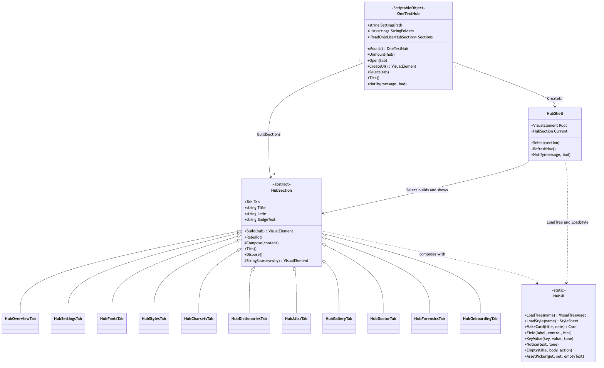
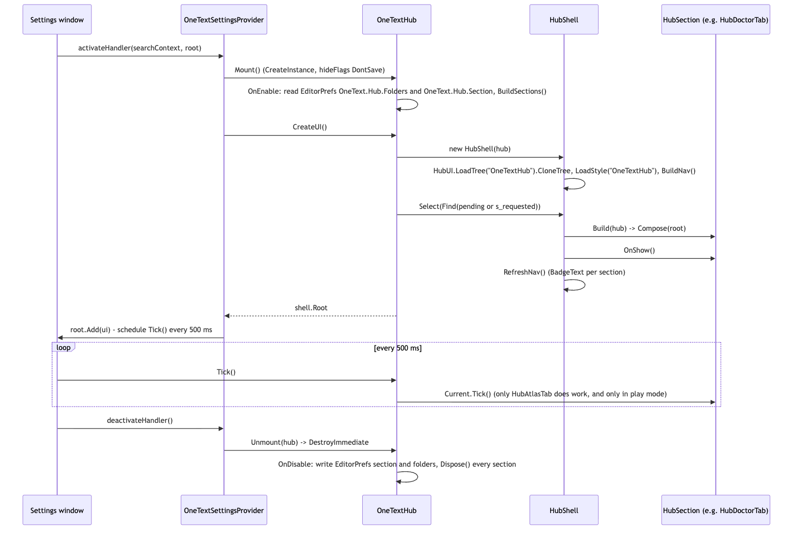
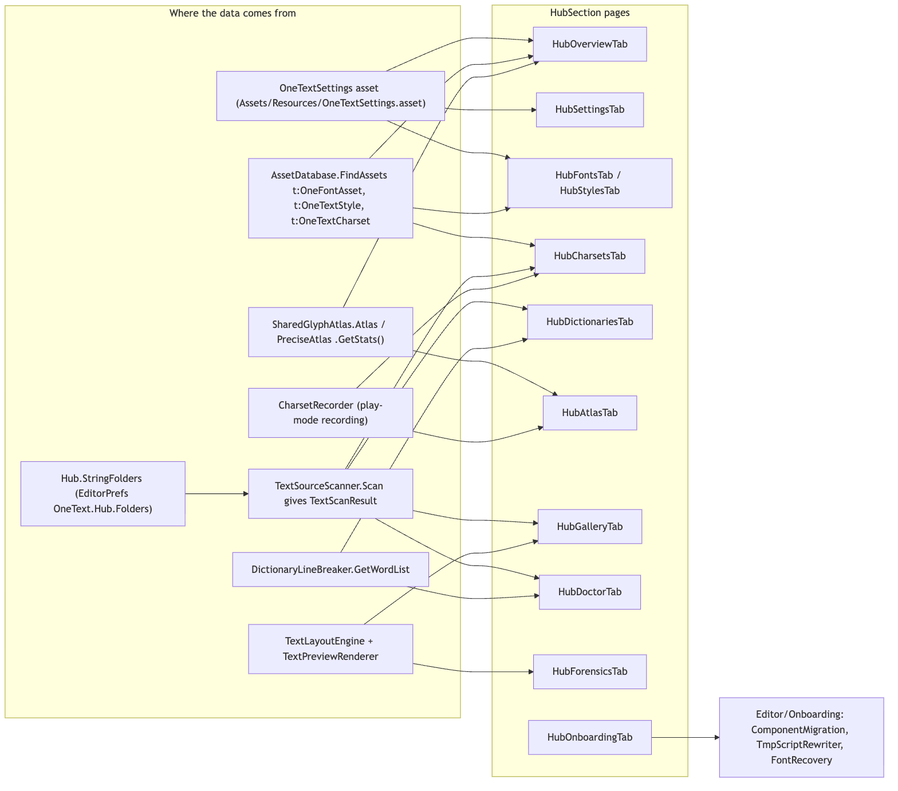
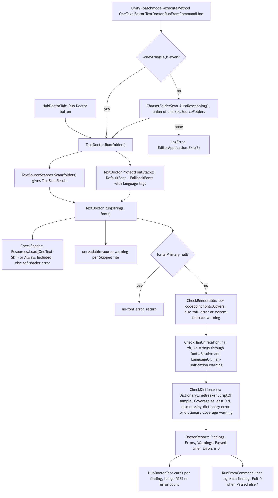
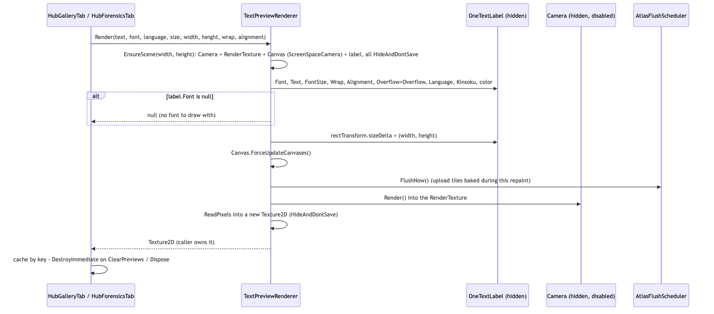

# Editor/Hub

`Editor/Hub/` is the **OneText Hub**: the page at `Project Settings > OneText` (also `Window > OneText > Hub`) that shows everything the package can say about a project's own text and offers the one action each view makes obvious. It sits entirely at the **frontend/authoring** end of the pipeline (string -> parse -> analyze -> shape -> layout -> render -> frontend): it reads the project's settings asset, font/style/charset assets, the live glyph atlas, the play-mode character recorder, and the project's string files, and it runs the real layout engine and renderer headless for the gallery, forensics and Doctor. It is built with **UI Toolkit** (UXML + USS + runtime `VisualElement`s, never IMGUI and never `UnityEditor.UIElements` controls such as `ObjectField`), so every section can be built, rebuilt and ticked with no window at all, which is how the tests and the proof generators drive it. The part of the Hub that matters for CI is `TextDoctor`: a renderability lint with a batch-mode entry point that exits 1 when a string cannot render.

## Files

| File | Responsibility |
|---|---|
| `OneTextHub.cs` | `OneTextHub : ScriptableObject`. Owns the `Tab` enum (11 values), the section list (`BuildSections`), the shared `StringFolders`, the mounted singleton (`Mount`/`Unmount`/`s_mounted`), `Open(Tab)` (opens the settings page and remembers the requested tab), `CreateUI()`, `Tick`, `Notify`, `RefreshNav`, and the project queries `AllFonts`, `AllStyles`, `FontCount`, `StyleCount`. Persists section and folders in `EditorPrefs`. |
| `HubShell.cs` | `HubShell`: the chrome. Clones `UI/OneTextHub.uxml` (sidebar, header, content `ScrollView`, toast), falls back to a hand-built shell if the UXML is missing, loads `UI/OneTextHub.uss`, builds the nav with group headings and badges, `Select(section)`, `RefreshNav`, `Notify` (toast, 3.6 s / 6 s for bad), the footer's "Star on GitHub" and "Documentation" links, the package version label. |
| `HubSection.cs` | `abstract HubSection`: `Tab`, `Title`, `Eyebrow`, `Lede`, `NavHint`, `NavGroup`, `BadgeText`/`BadgeTone`; `Build(hub)` creates `Root` once and calls `Rebuild()` -> `Root.Clear()` + `Compose(root)`; `OnShow`, `Tick`, `Dispose`; helpers `Refresh`, `Say`, `SayBadly`, `StringSources(why)` (the shared folder-list card), `AllFonts`, `AllStyles`, `FontCount`, `StyleCount`, `CreateAsset<T>`. |
| `HubUI.cs` | `HubTone` enum and the static `HubUI` vocabulary: `LoadTree`/`LoadStyle` (from `Packages/com.onetext.core/Editor/Hub/UI/`, with an `AssetDatabase.FindAssets` fallback), `Card` + `MakeCard` (clones `HubCard.uxml` or builds by hand), `Text`, `Box`, `Field`, `KeyValue`, `Primary`/`Ghost`/`Quiet`/`Danger`, `Pill`, `Segments`, `Badge`, `Notice`, `Empty`, `Tile`, `Meter`, `Disclose`, `Input`, `Knob`, `AssetPicker<T>` (button + `GenericMenu` + drag-and-drop), `Confirm`, `Percent`, `Mono`. |
| `HubCharts.cs` | `HubDonut` and `HubSparkline`: `VisualElement`s painted with `generateVisualContent` / `painter2D`. Used by `HubAtlasTab`. |
| `HubOverviewTab.cs` | `Tab.Overview`. Tiles (fonts, styles, charsets, string folders, atlas, Doctor), the "First steps" checklist that ticks itself, and a map of the other sections. |
| `HubSettingsTab.cs` | `Tab.Settings`, "Global Settings". Edits `OneTextSettings` through a fresh `SerializedObject` per edit (`Edit(field, assign, rebuildAtlas)`): default font + fallbacks + system-font tier, new-text defaults, atlas budget (quality, texture size, layers) with live memory/capacity readouts, prewarm charset and recorder toggle, word-list count, the asset path. Creates the asset via `OneTextSettingsProvider.GetOrCreate()` when missing. |
| `HubFontsTab.cs` | `Tab.Fonts` (`HubFontsTab`): project default card, one card per `OneFontAsset` with cost, language tag field + "Suggest..." menu from `FontLanguages`, packing row ("Pack smaller" -> `font.Repack(Smallest)`), import button. Also `Tab.Styles` (`HubStylesTab`): list of `OneTextStyle`s with `Describe`, create, sample text. |
| `HubCharsetsTab.cs` | `Tab.Charsets`. Picker, contents, source folders with "Rescan now" / "Rescan on import", prewarm, recorder card; `internal static Merge(a, b)` (sorted codepoint union without whitespace) shared with `HubAtlasTab`. |
| `CharsetFolderScan.cs` | `Rescan(charset)` -> `Report` (writes `charset.ScannedCharacters` from `TextSourceScanner.Scan(charset.SourceFolders)`), `AutoRescanning()`, and the `ImportHook : AssetPostprocessor` that rescans charsets whose `SourceFolders` an import touched. |
| `HubDictionariesTab.cs` | `Tab.Dictionaries`. Installed word lists per script (`DictionaryLineBreaker.GetWordList`), the bundled ICU lists under `Samples~/Dictionaries` installed as `OneTextDictionary` assets under `Assets/Samples/OneText/<version>/...` and registered in `OneTextSettings._dictionaries`, coverage before/after against the project's strings, custom import. `BundledLists` and `BundledWordListFolder()` are public for tests. |
| `HubAtlasTab.cs` | `Tab.Atlas`. One `AtlasPanel` per existing atlas (standard R8, precise RGBA32): donut of prewarmed/runtime/free, numbers, eviction sparkline (`EvictionSampler`, 120 one-second samples), demand verdict and `SmallestBudgetFor`. `Tick()` updates panels in place every 0.5 s in play mode. "Runtime discoveries" promotes `CharsetRecorder` characters into a charset. |
| `HubGalleryTab.cs` | `Tab.Gallery`. Two modes: every string (scan folders, `StringGallery.Measure`, filter by locale / problems only, previews for the first `PreviewBudget = 60` cells) and one string in every style and font. Owns a `TextPreviewRenderer` and a texture cache. |
| `StringGallery.cs` | `GalleryCell`, `GalleryOptions`, `StringGallery.Measure(entries, styles, options)`: lays each string out with `TextLayoutEngine` (unbounded height, `Overflow.Overflow`) and reports `Width`, `Height`, `LineCount`, `Overflow`, `WouldTruncate`, `MissingGlyphs`. |
| `TextPreviewRenderer.cs` | `IDisposable` offscreen renderer: hidden camera + render texture + canvas + one `OneTextLabel`, reused per call; `Render(...)` returns a new `Texture2D` the caller owns. Calls `AtlasFlushScheduler.FlushNow()` before `camera.Render()`. |
| `HubDoctorTab.cs` | `Tab.Doctor`. `StringSources` card, "Run Doctor" -> `TextDoctor.Run(Hub.StringFolders)`, one card per finding with a rule badge, "Show notes" pill, the CI command with a Copy button. `LastReport` is read by the overview. |
| `TextDoctor.cs` | `DoctorSeverity`, `DoctorFinding`, `DoctorReport`, and the static `TextDoctor`: `Run(TextScanResult, FontStack)`, `Run(folders)`, `ProjectFontStack()`, rules `CheckShader`, `CheckRenderable`, `CheckHanUnification`, `CheckDictionaries`, and `RunFromCommandLine()` (batch mode, exit codes 0/1/2). Utilities `Codepoints`, `PrimarySubtag`, `LanguageServes`. |
| `TextSourceScanner.cs` | `TextEntry`, `TextScanResult`, `TextSourceScanner.Scan(folders)`: reads `.csv`, `.tsv`, `.json`, `.txt`, `.md`, `.xml` (RFC-4180-ish separated values, hand-written JSON string-leaf walker, line files) plus Unity Localization `StringTable`s via reflection; locale detection (`IsLocaleCode`, `NormalizeLocale`, `LocaleFromFileName`); `ToProjectPath`. |
| `HubForensicsTab.cs` | `Tab.Forensics`. Text, font, language, size, box width inputs; lays the sample out with `TextLayoutEngine`, renders it with `TextPreviewRenderer`, hit-tests clicks against glyph boxes (`BoxOf`/`GlyphAt`), shows one `GlyphReport` and the full glyph list. Layout is deferred one frame (`_stage.schedule.Execute(FillStage).ExecuteLater(1)`); `FillStage()` is public for headless tests. |
| `GlyphForensics.cs` | `GlyphReport` and `GlyphForensics.Inspect(text, layout, fonts)`: per glyph, the cluster, the font family and language tag, `Substituted` (nominal glyph differs), `Positioned` (GPOS offset), line/run/direction, and at a line end the UAX #14 rule name (`LineBreaker.RuleAt`) plus a note for the rules people ask about. `FeatureSummary(FontData)`. |
| `HubOnboardingTab.cs` | `Tab.Onboarding`. The TextMesh Pro migration UI: scan/convert scenes and prefabs (`ComponentMigration`), scan/rewrite scripts (`TmpScriptRewriter`), per-container ticks, findings grouped by rule (`PerRule = 50` drawn, `OpenBelow = 20`), "What you have to fix by hand" (fonts via `FontRecovery`, asmdef patches via `TmpAssemblyGraph`, refused files, file groups, vendored files incl. DOTween notes), git confirmation via `OnboardingGit.ConfirmOverwrite`, CI command. `Adopt(report, converted)` is public for tests. The engine it drives lives in `Editor/Onboarding/` (see its README). |
| `GitHubStar.cs` | `internal static GitHubStar.StarAsync(Action<Outcome>)`: finds the `gh` CLI in the usual install folders, runs `gh api --method PUT user/starred/CodeOneLabs/OneText` off the main thread, calls back via `EditorApplication.delayCall`. Used by `HubShell`. |
| `UI/OneTextHub.uxml` | The shell layout: `hub-root` > `sidebar` (brand, `nav` ScrollView, `sidebar__foot` with `version`) + `main` (`page-header` with `eyebrow`/`title`/`lede`, `content` ScrollView, `toast`). |
| `UI/HubCard.uxml` | One card: `card` > `card-head` (`card-title`, `card-note`, `card-actions`) + `card-body`. |
| `UI/OneTextHub.uss` | The skin. Every selector is prefixed `.hub-root`; palette variables (`--bg`, `--green`, `--amber`, `--red`, ...) on `.hub-root`; resets for `Label`, `Button`, `TextField`, scrollers; classes for nav, cards, fields, kv rows, buttons, pills, segments, badges, notices, tiles, steps, charts, meters, cells, previews, glyph rows, disclosures, pickers, toast, `code`, `mono`. |

## Structure

Source: [diagrams/hub-structure.mmd](diagrams/hub-structure.mmd)

`OneTextHub` is a `ScriptableObject`, not an `EditorWindow`: it owns the sections, the shell and the shared state (`StringFolders`), and the settings page borrows all three. `OneTextSettingsProvider` (in `Editor/`) creates it with `OneTextHub.Mount()` and destroys it with `Unmount`. `CreateUI()` builds a `HubShell`, selects the pending tab (from `EditorPrefs["OneText.Hub.Section"]`, or whatever `OneTextHub.Open(Tab)` requested before the page existed) and returns `shell.Root`, a single `VisualElement` the host adds wherever it likes.

`HubShell` is the chrome: it clones `UI/OneTextHub.uxml`, queries the named elements (`nav`, `content`, `eyebrow`, `title`, `lede`, `toast`, `toast-text`, `version`), attaches `UI/OneTextHub.uss`, and builds one `Button.nav-item` per section with a badge host. If the UXML cannot be loaded it builds a minimal shell by hand (`BuildFallbackShell`) so the window still works.

`HubSection` is the unit of UI. Each subclass declares its identity (`Tab`, `Title`, `Eyebrow`, `Lede`, `NavHint`, `NavGroup`, `BadgeText`/`BadgeTone`) and implements `Compose(VisualElement content)`. There is **no binding system**: a section keeps its own fields between visits and calls `Refresh()` (= `Rebuild()` + `Hub.RefreshNav()`) after any state change, which clears `Root` and composes again. The comment in `HubSection.cs` says why: the data is a project scan or a live atlas, not a serialized object, and "clear and compose again" is the one thing that behaves the same on 2022.3 and Unity 6.

`HubUI` is the vocabulary every section composes from. It deliberately uses only runtime UI Toolkit controls (`Label`, `Button`, `TextField`, `Slider`, `Image`); the object field is rebuilt as `AssetPicker<T>` (a button that drops a `GenericMenu` listing `AssetDatabase.FindAssets("t:T")`, with `DragAndDrop` support) so the tree can be rendered to a texture outside an editor window and built without a GUI skin.

The eleven sections, in sidebar order with their `NavGroup`: Overview, Settings (Global Settings) [no group]; Fonts, Styles [Type]; Charsets, Dictionaries, Atlas [What gets baked]; Gallery, Doctor, Forensics [Checks]; Onboarding [Migrate]. `HubStylesTab` lives in `HubFontsTab.cs`.

Entry points a caller uses:

- `OneTextHub.Open()` / `Open(Tab)`: `SettingsService.OpenProjectSettings("Project/OneText")`, then selects the tab on the mounted Hub or stores it in `s_requested` for the Hub about to be mounted. The inspectors and other sections link here (`Hub.Go(Tab)` from inside a section).
- `OneTextHub.CreateUI()` on a `CreateInstance<OneTextHub>()`: build the whole tree with no host (tests, proof generators).
- `TextDoctor.Run(IEnumerable<string> folders)` / `Run(TextScanResult, FontStack)` / `RunFromCommandLine()`.
- `TextSourceScanner.Scan(folders)`, `StringGallery.Measure(...)`, `GlyphForensics.Inspect(...)`, `CharsetFolderScan.Rescan(charset)`: the headless halves, usable from any editor code.

## Behaviour

### Mounting, selecting, ticking

Source: [diagrams/hub-mount-sequence.mmd](diagrams/hub-mount-sequence.mmd)

1. The settings window calls the provider's `activateHandler`. `OneTextHub.Mount()` unmounts any previous instance, creates one with `hideFlags = DontSave`, and `OnEnable` reads `EditorPrefs["OneText.Hub.Folders"]` (newline-separated) into `StringFolders`, calls `BuildSections()`, and parses `EditorPrefs["OneText.Hub.Section"]` into `_pending`.
2. `CreateUI()` constructs the `HubShell`, applies `s_requested` if `Open(Tab)` set it, and `Select`s the section. `HubShell.Select` toggles `nav-item--on`, writes eyebrow/title/lede, calls `section.Build(hub)` (first call creates `Root` named `section-<Tab>` with class `section`; every call runs `Compose`), replaces the content ScrollView's children, resets scroll, calls `OnShow()`, then `RefreshNav()` which re-reads every section's `BadgeText`.
3. The provider schedules `hub.Tick()` every 500 ms; `OneTextHub.Tick` forwards to `_shell.Current.Tick()`. Only `HubAtlasTab.Tick` does anything (and only `Application.isPlaying`, throttled to 0.5 s).
4. On deactivate, `Unmount` destroys the instance; `OnDisable` writes the current tab and folders back to `EditorPrefs` and calls `Dispose()` on every section (which is where `HubGalleryTab` and `HubForensicsTab` destroy their preview textures and renderer).

Actions inside a section call `Say(...)` / `SayBadly(...)` -> `HubShell.Notify`, which sets `toast-text`, adds `toast--on` (and `toast--bad`), and schedules removal after 3600 ms (6000 ms for bad).

### How settings are persisted

There are three stores, and which one a value lives in decides whether a build sees it:

| What | Where | Written by | Read by runtime? |
|---|---|---|---|
| Default font, fallbacks, system-font tier, new-text defaults, quality, atlas size/layers, prewarm charset, recorder flag, dictionaries | `OneTextSettings` ScriptableObject at `Assets/Resources/OneTextSettings.asset` | `HubSettingsTab.Edit` (SerializedObject), `HubDictionariesTab.Register` (`_dictionaries`), `OneTextSettingsProvider.SetDefault`; created by `OneTextSettingsProvider.GetOrCreate()` | Yes, `OneTextSettings.Instance` via `Resources.Load` |
| Last open section, string folders | `EditorPrefs` keys `OneText.Hub.Section`, `OneText.Hub.Folders` | `OneTextHub.OnDisable` | No (per user, per machine) |
| Charset source folders, `AutoRescan`, scanned characters, sizes, ranges | the `OneTextCharset` asset | `HubCharsetsTab`, `CharsetFolderScan.Rescan`, `HubAtlasTab.Promote` | Yes (prewarm) |
| Font language tag, packing | the `OneFontAsset` | `HubFontsTab.SetLanguage` / `PackSmaller` | Yes |

Everything else on the page (Doctor report, gallery cells, forensics selection, coverage numbers, the picked charset) is section state and is lost when the page is deactivated.

### Where each page gets its data

Source: [diagrams/hub-data-sources.mmd](diagrams/hub-data-sources.mmd)

- **Overview**: `OneTextSettings.Instance` (default font, prewarm charset), `FontCount()`/`StyleCount()` (search-index counts, no asset loads), `AssetDatabase.FindAssets("t:OneTextCharset")`, `Hub.StringFolders.Count`, `SharedGlyphAtlas.Exists ? Atlas.GetStats()`, and `HubDoctorTab.LastReport` via `Hub.Find(Tab.Doctor)`. The "First steps" card: import a font (`OneFontAssetCreator.CreateFromFontFile`), set a default (opens Settings), add a string folder, run Doctor, set a prewarm charset.
- **Global Settings**: `OneTextSettingsProvider.Find()`. Every control writes through `Edit(field, assign, rebuildAtlas)`: a **fresh** `SerializedObject(_settings)` per edit, `ApplyModifiedProperties`, `EditorUtility.SetDirty`, `OneTextSettings.Invalidate()`, and `SharedGlyphAtlas.Reconfigure()` when the budget changed. Field names written: `_defaultFont`, `_fallbackFonts`, `_systemFontFallback`, `_defaultFontSize`, `_defaultAutoSizeMin/Max`, `_defaultWrap`, `_defaultRaycastTarget`, `_defaultRichText`, `_defaultParseEscapes`, `_defaultCanvasSize`, `_defaultWorldSize`, `_defaultQuality`, `_atlasTextureSize`, `_atlasLayerCount`, `_prewarmCharset`, `_recordCharsetInPlayMode`. Numbers are typed in delayed `TextField`s (`Number`) so "36" does not pass through 3. The atlas card keeps two `Label` readouts and rewrites them in place (`Sync`) rather than rebuilding, because rebuilding would destroy a slider mid-drag.
- **Fonts / Styles**: `AllFonts()` / `AllStyles()` (loads every asset); the language field writes `font.Language` under `Undo.RecordObject`; "Pack smaller" calls `font.Repack(OneFontAsset.FontPacking.Smallest)` behind a progress bar.
- **Charsets**: the picked `OneTextCharset` (`_selected`, not persisted), `charset.Codepoints()`, `Sizes`, `Ranges`, `SourceFolders`, `AutoRescan`; `CharsetFolderScan.Rescan` for "Rescan now"; `CharsetRecorder.Enabled/CodepointCount/CharactersAsString/SizesSorted` for the recorder card; `charset.Prewarm()`.
- **Dictionaries**: `DictionaryLineBreaker.EnsureDefaults()` + `GetWordList(script)` for Thai/Lao/Khmer/Myanmar; `OneTextSettings.Instance.Dictionaries`; the bundled folder resolved from `PackageInfo.FindForAssembly(...).resolvedPath + Samples~/Dictionaries` or `Packages/com.onetext.core/Samples~/Dictionaries`; coverage measured by `Measure(into)` over `TextSourceScanner.Scan(Hub.StringFolders)` sampled to 20 000 chars per script, `words.Coverage(sample)`.
- **Atlas**: `SharedGlyphAtlas.Exists` / `PreciseAtlasExists` checked first (never the getters, which would allocate an atlas), then `GetStats()` for prewarmed/runtime/free pixels, tiles, shelves, evictions, compactions, drops, uploads, demand. `bytesPerTexel = MemoryBytes / CapacityPixels` (1 for R8, 4 for the precise atlas).
- **Gallery**: `TextSourceScanner.Scan(Hub.StringFolders)` -> `StringGallery.Measure(entries, AllStyles(), _options)`; previews through `TextPreviewRenderer`.
- **Doctor**: see below.
- **Forensics**: `TextLayoutEngine.Layout` with a `FontStack` of the chosen (or default) font plus `OneTextSettings.FallbackFonts`; `GlyphForensics.Inspect`; `TextPreviewRenderer.Render` for the picture.
- **Onboarding**: `ComponentMigration.Scan/Apply`, `FontRecovery.Collect/Resolve/Recover`, `TmpScriptRewriter.ScriptsUnder/ScanProject/Rewrite`, `TmpAssemblyGraph.Patch`, `OnboardingGit.ConfirmOverwrite` (all in `Editor/Onboarding/`).

### Doctor: in the window and on CI

Source: [diagrams/doctor-pipeline.mmd](diagrams/doctor-pipeline.mmd)

`TextDoctor.Run(TextScanResult strings, FontStack fonts)`:

1. `CheckShader`: if `Resources.Load<Shader>(SharedGlyphAtlas.ShaderResourcePath)` (`"OneText-SDF"`) succeeds, fine. Else `Shader.Find(SharedGlyphAtlas.ShaderName)` (`"OneText/SDF"`): missing -> `sdf-shader` error "not in this project at all"; present but neither under Resources nor in `GraphicsSettings.m_AlwaysIncludedShaders` (read via `SerializedObject` on `ProjectSettings/GraphicsSettings.asset`) -> `sdf-shader` error "nothing pulls it into a build".
2. One `unreadable-source` warning per `strings.Skipped` entry.
3. `fonts == null || fonts.Primary == null` -> `no-font` error, return.
4. `CheckRenderable`: walks every codepoint of every entry (`Codepoints` handles surrogate pairs; `\n` and `\t` skipped), one finding per missing codepoint (not per string), counting occurrences. If `fonts.Covers(cp)` is false: `SystemFonts.NameOf(fonts.ResolveFromSystem(cp))` non-null -> `system-fallback` **warning** (this machine's OS font draws it; a player's device may not); else `tofu` **error** (message says whether system fallback was on).
5. `CheckHanUnification`: for entries whose locale's primary subtag is `ja`/`zh`/`ko` and that contain an ideograph, resolves each ideographic codepoint through `fonts.Resolve(cp, false, false, Presentation.Any, entry.Locale)` and asks `fonts.LanguageOf(font)`; a tag that does not serve the locale (`LanguageServes`, prefix rule) -> `han-unification` warning once per `locale/tag`. If two or more Han locales ship and **no** font in the chain is tagged -> one global `han-unification` warning.
6. `CheckDictionaries`: `DictionaryLineBreaker.EnsureDefaults()`, sample up to 20 000 chars per script via `DictionaryLineBreaker.ScriptOf(c)`; no word list -> `missing-dictionary` error; `words.Coverage(sample) >= MinimumDictionaryCoverage` (0.9) -> `dictionary-coverage` info; else `dictionary-coverage` warning.
7. `DoctorReport.Passed => Errors == 0`; warnings are advice.

`TextDoctor.Run(folders)` = `Run(TextSourceScanner.Scan(folders), ProjectFontStack())`, where `ProjectFontStack()` builds a `FontStack` from `OneTextSettings.Instance.DefaultFont` + `FallbackFonts` with each asset's `Language` tag (an empty stack if there is no settings asset).

**Headless**: `Unity -batchmode -projectPath 
 -executeMethod OneText.Editor.TextDoctor.RunFromCommandLine [-oneStrings a,b]`. `RunFromCommandLine` reads `-oneStrings` (comma-separated project-relative folders); without it, it unions `SourceFolders` of every charset returned by `CharsetFolderScan.AutoRescanning()` (charsets with `AutoRescan` on and at least one folder). No folders -> `LogError` + `EditorApplication.Exit(2)`. Otherwise every finding is logged at its severity (`LogError`/`LogWarning`/`Log`, prefixed `OneText Doctor`), then `Summary()`, then `EditorApplication.Exit(report.Passed ? 0 : 1)`. `HubDoctorTab.CiCard` shows that command with a Copy button. In the window, `HubDoctorTab` calls `TextDoctor.Run(Hub.StringFolders)` and renders one `HubUI.MakeCard(finding.Message)` per finding with a rule badge and a coloured left border.

### Scanning strings

`TextSourceScanner.Scan(folders)` enumerates every file under each folder (skipping `.meta`, de-duplicated by full path), dispatches by extension (`TextExtensions`: `.csv .tsv .json .txt .md .xml`), then `ScanLocalizationTables(folder, result)` which looks up `UnityEngine.Localization.Tables.StringTable, Unity.Localization` by name and, if present, reads `LocaleIdentifier.Code` and each row's `LocalizedValue`/`Value` and `Key`/`KeyId` by reflection (the package is optional). CSV/TSV: `ParseSeparated` handles quoted fields, doubled quotes and newlines inside quotes; the first row is a header if `LooksLikeHeader` (all cells identifier-like, <= 32 chars); column 0 is the key, other columns are locales named by the header; a single-column file is a list of strings. JSON: a hand-written walker that records every string leaf keyed by its dotted path; a top-level key that `IsLocaleCode` names the locale of its subtree; otherwise `LocaleFromFileName` (`strings.ko-KR.json`, `dialogue_ko.txt`). `.txt/.md/.xml`: one entry per non-empty line. Unparseable files land in `Skipped` rather than throwing. Every consumer (Doctor, gallery, dictionaries, charset rescans) uses this one reader.

### Previews without a scene

Source: [diagrams/preview-render-sequence.mmd](diagrams/preview-render-sequence.mmd)

`TextPreviewRenderer.EnsureScene` builds, once per size, a disabled orthographic `Camera` targeting an `ARGB32` `RenderTexture` (the returned `Texture2D` is `RGBA32`), a `ScreenSpaceCamera` `Canvas`, and a single `OneTextLabel` (`RectTransform` + `CanvasRenderer` added explicitly because batch-mode `AddComponent` ignores inherited `RequireComponent`), all `HideAndDontSave`. `Render` sets the label's font/text/size/wrap/alignment/language/kinsoku, sizes the rect, `Canvas.ForceUpdateCanvases()`, `AtlasFlushScheduler.FlushNow()` (tiles baked during this repaint must be uploaded now; outside play mode there is no later frame), `camera.Render()`, and reads the pixels into a new `Texture2D` that the caller owns. It returns null when the label has no font. `HubGalleryTab` caches textures by a string key and destroys them in `ClearPreviews`/`Dispose`; `HubForensicsTab` keeps one.

### Gallery: measuring every string

`HubGalleryTab.Scan()` clears the preview cache, runs `TextSourceScanner.Scan(Hub.StringFolders)`, and calls `StringGallery.Measure(_scan.Entries, AllStyles(), _options)`. `Measure` creates one `TextLayoutEngine` and one `TextLayoutResult`, builds the project `FontStack` once (`TextDoctor.ProjectFontStack()`) and caches a stack per style that sets a font (`StackFor`: the style's font on top of the project fallbacks). For each entry x style it fills `TextLayoutSettings.Default(fonts, size)` with `MaxWidth = BoxWidth`, `MaxHeight = 0`, `Overflow = TextOverflow.Overflow` (deliberately unbounded: the question is how big the text wants to be), the options' wrap and line spacing, `Language = entry.Locale`, `Kinsoku`, `KoreanWordWrap` when the locale is `ko`, `BaseDirection = BidiAlgorithm.AutoDirection`, lays out, and records `Width`, `Height`, `LineCount`, `Overflow` (wider or taller than the box by more than 0.5 px), `WouldTruncate` (overflow while `options.Overflow`, the gallery's own setting, is not `Overflow`), and `MissingGlyphs` (codepoints `fonts.Covers` rejects, ignoring newline/tab/space). `Ok` is `!Overflow && MissingGlyphs == 0`. The tab then filters by locale and "Problems only", draws a `cell` per row (`cell--bad`, status text from `Status`), and renders pictures for the first 60.

### Forensics: one glyph at a time

`HubForensicsTab.Compose` draws the input card, then (if a font exists) a `_stage` holding a "Laying the text out and rasterizing it..." notice and schedules `FillStage` one frame later. `FillStage` -> `BuildLayout` builds a `FontStack` (chosen or default font + project fallbacks), lays the text out with `MaxWidth = _boxWidth`, `Language`, `Kinsoku.Normal`, and calls `GlyphForensics.Inspect(text, layout, fonts)`. `Inspect` walks `layout.Runs` and their glyphs: `TextStart` = clamped `glyph.Cluster`, `TextLength` from `ClusterEnd` (next higher cluster value in the run, or the run's text end), `FontFamily` by matching `run.Font` against every `OneFontAsset.Font`, `FontLanguage = fonts.LanguageOf(run.Font)`, `NominalGlyphId = run.Font.NominalGlyph(codepoint)`, `Substituted` only for single-character clusters whose glyph differs from the nominal one, `Positioned` when `XOffset`/`YOffset` are non-zero, and at a line end `BreakRule = LineBreaker.RuleAt(text, boundary)` plus `NoteFor` for LB4/5/8/9/18/21/30a/31. `StageCard` renders the same text with `TextPreviewRenderer`, overlays a `selection-box` at `BoxOf(report)` (x from `run.X` plus advances scaled by `run.FontSize / UnitsPerEm`, y from `line.Baseline - line.Ascent`), and maps `MouseDownEvent` back through `GlyphAt`. `SelectionCard` prints characters with `U+XXXX` codes, glyph id (and the nominal one if substituted), font and tag (warn tone if untagged), line/run/direction/GPOS, the break rule, and `GlyphForensics.FeatureSummary(FontData)` (GSUB/GPOS feature tags).

### Charset rescans on import

`CharsetFolderScan.ImportHook.OnPostprocessAllAssets` gathers imported/deleted/moved paths, and for each charset from `AutoRescanning()` whose `SourceFolders` prefix-matches a touched path (ignoring the charset's own asset path, to avoid an import loop) calls `Rescan(charset)`. `Rescan` writes `charset.ScannedCharacters` (under `Undo.RecordObject`) only when the scanned string changed, and returns a `Report` with before/after counts and skipped files.

## Invariants and conventions

- **UI Toolkit only, runtime controls only.** No IMGUI, no `UnityEditor.UIElements` fields. `GenericMenu`, `EditorUtility` dialogs and `DragAndDrop` are the editor APIs used, and `HubUI.Mono` is a CSS class, not a font: dynamic OS fonts through `FontDefinition.FromFont` rendered wrong glyphs (comment in `HubUI.cs`).
- **USS selectors are all prefixed `.hub-root`** so every rule has the same specificity and file order decides; a bare `.card__title` would lose to the `.hub-root Label` reset.
- **Rebuild, do not bind.** State lives in section fields; `Refresh()` clears and recomposes. Two exceptions update elements in place because a rebuild would destroy the control under the pointer: `HubSettingsTab.AtlasCard` (`Sync` readouts) and `HubAtlasTab.AtlasPanel.Update`.
- **Persistence**: settings are the `OneTextSettings` asset at `Assets/Resources/OneTextSettings.asset` (created by `OneTextSettingsProvider.GetOrCreate`), written only through `SerializedObject` + `SetDirty` + `OneTextSettings.Invalidate()`. Hub-only state (`StringFolders`, last section) is `EditorPrefs` (`OneText.Hub.Folders`, `OneText.Hub.Section`), per user and machine. Charset source folders and `AutoRescan` live on the charset asset. Doctor reports, gallery cells, forensics layouts and coverage numbers are in-memory only and die with the section.
- **Never allocate an atlas from the UI**: check `SharedGlyphAtlas.Exists` / `PreciseAtlasExists` before touching `Atlas` / `PreciseAtlas` (`HubAtlasTab.Compose`, `HubOverviewTab.AtlasTile`, `HubSettingsTab.AtlasCard`).
- **Counts without loads**: `FontCount()`/`StyleCount()` use the search index; the sidebar badge asks on every `RefreshNav`, and loading forty font assets (each carrying a compressed `.ttf`) to print "40" is what made the window slow.
- **Ownership of native/engine objects**: `TextPreviewRenderer` owns its camera, render texture, canvas and label and destroys them in `Dispose`; returned `Texture2D`s belong to the caller. Sections that hold a renderer or textures override `Dispose`. `HubDonut`/`HubSparkline` paint in `generateVisualContent`, no textures.
- **Threading**: everything runs on the main thread except `GitHubStar.Star`, which runs on the thread pool and marshals back via `EditorApplication.delayCall`.
- **Doctor exit codes**: 0 pass, 1 errors, 2 no folders. `Passed` ignores warnings.
- **Doctor's missing-character verdict depends on the machine** (`system-fallback` vs `tofu`), so tests set `SystemFonts.Enabled = false` (`HubTests.SetUp`).
- **Forensics defers its expensive work** one frame (`ExecuteLater(1)`), and `Compose` nulls `_stage`/`_stageFont` first so a stale callback cannot fill a discarded tree.
- **Shared helpers**: `StringSources(why)` is the single folder-list card (used by Doctor, Gallery, Dictionaries); `HubCharsetsTab.Merge` is the single codepoint-union (used by Charsets and Atlas); `TextSourceScanner.ToProjectPath` is the single absolute-to-project path conversion (used everywhere, including `Editor/OneFontAssetEditor.cs`).
- **Units**: atlas figures are texels; `MemoryBytes` is bytes (= texels for R8, x4 for the precise atlas; `HubAtlasTab` applies `bytesPerTexel` once). Gallery box sizes and font sizes are pixels. Coverage is a 0..1 fraction formatted by `HubUI.Percent`.

## Extending

- **A new section**: subclass `HubSection`, add a value to `OneTextHub.Tab`, add `new YourTab()` in `OneTextHub.BuildSections` at the sidebar position you want, set `NavGroup` to an existing heading or a new one. Compose with `HubUI`. `Tests/Editor/HubWindowTests.cs` (`EverySection_BuildsWithoutThrowing`, `EveryTab_HasASection`, `EverySection_SaysWhatItIsFor`, `Shell_BuildsAndSelectsEverySection`) will pick it up automatically and fail if `Lede` is empty or `Build` throws; `HubOverviewTab.Map` lists it automatically.
- **A new Doctor rule**: add a `CheckX(strings, fonts, report)` in `TextDoctor` and call it from `Run`; name the rule in kebab-case in `DoctorFinding.Rule`; decide the severity knowing only `Error` fails CI. Add a test in `Tests/Editor/HubTests.cs` next to `Doctor_FindsCharactersNoFontCanDraw` (write files into a temp folder, `TextSourceScanner.Scan`, build a `FontStack`, assert on `report.Findings`).
- **A new string format**: add the extension to `TextSourceScanner.TextExtensions` and a case in `ScanFile`; fill `TextEntry.Key/Value/Locale/Source`. Tests: `Csv_*`, `Json_*`, `MalformedJson_*`, `LocaleCodes_*` in `HubTests.cs`.
- **A new settings field**: add it to `OneTextSettings` (Runtime), then a `HubUI.Field(...)` in `HubSettingsTab` writing through `Edit("_yourField", ...)`; pass `rebuildAtlas: true` if it changes the atlas. `Tests/Editor/SettingsPageTests.cs` (`The_Defaults_Section_Is_On_It`) and `ProjectDefaultsTests.cs`.
- **A new HubUI part**: add a static method in `HubUI` and its classes in `UI/OneTextHub.uss` under `.hub-root`. `HubWindowTests.Card_HasATitleAndABody` and `Layout_LoadsFromThePackage` cover the assets.
- **A new bundled dictionary**: add to `HubDictionariesTab.Bundled` and ship the file under `Samples~/Dictionaries`; `HubWindowTests.BundledWordLists_AreStillInThePackage` checks the list against disk.
- **Tests covering this folder**: `Tests/Editor/HubTests.cs` (scanner, Doctor rules, gallery, forensics, line-break rule names, atlas stats, dictionary round-trip and coverage), `HubWindowTests.cs` (every section builds/rebuilds/shows/ticks headless, shell, UXML/USS load, card, charts), `HubSelectionTests.cs` and `HubFindingsScaleTests.cs` (onboarding tab with adopted reports: partial conversion buttons, findings capped per rule), `SettingsPageTests.cs` (provider mounts the Hub, Forensics `FillStage`), `ShaderShippingTests.cs` (`Doctor_IsQuietWhenTheShaderWillShip`), `SystemFontTests.cs` (the `system-fallback` half of Doctor).

## Gotchas

1. **Drawing the atlas page must not create the atlas.** Use `SharedGlyphAtlas.Exists`, never `SharedGlyphAtlas.Atlas`, in anything that runs on compose.
2. **Rebuilding a card under a drag destroys the slider.** `HubSettingsTab.AtlasCard` and `HubAtlasTab.AtlasPanel` update labels in place for that reason; a new live readout should follow the `Sync`/`Update` pattern, not `Refresh()`.
3. **Deleting a fallback font needs two property calls**: `DeleteArrayElementAtIndex` on an object-reference element only clears it the first time; `HubSettingsTab` nulls the reference then deletes (comment in `FontCard`).
4. **Forensics in a headless test shows only the "Laying the text out..." notice** unless you call `HubForensicsTab.FillStage()` yourself; the scheduled callback never runs without a panel (`SettingsPageTests.Forensics_Still_Lays_Its_Sample_Out`).
5. **`OneTextHub.Open(Tab)` before the page exists does not select immediately**; it stores `s_requested`, and `CreateUI` applies it. Calling `Select` on an unmounted Hub is a no-op for the shell.
6. **Doctor reports one finding per missing codepoint, not per string**, and the tofu/system-fallback split depends on the OS fonts of the machine running it (a bare Linux CI runner and a Mac disagree about Hangul).
7. **The `-oneStrings` fallback is the charsets' folders**, and only for charsets with `AutoRescan` on; a project that set `Hub.StringFolders` in the window has not told CI anything (those live in `EditorPrefs`).
8. **`HubUI.Load` falls back to `FindAssets` by name** for a package copied under `Assets/`; the `[Icon]` paths in Runtime do not (see `../README.md`).
9. **The gallery draws at most `PreviewBudget` (60) pictures per pass** and shows plain text for the rest; filter to fewer strings to draw them all. Each render is a real layout + rasterize + `camera.Render`.
10. **Charset rescans can loop**: `ImportHook.TouchesAny` skips the charset's own asset path because a rescan saves the asset and the save comes back through the hook.
11. **`GitHubStar` spawns processes with a 5 s ceiling** and searches Homebrew paths before the bare `gh` name because an editor launched from the dock does not inherit a login shell's `PATH`. `Forget()` resets the cached lookup.
12. **Dictionary install without a settings asset** imports the assets but cannot register them, so the editor wraps Thai correctly and a build does not; `Install` asks once with `HubUI.Confirm`, `Register` shows a dialog.
13. **`TextPreviewRenderer` needs `AtlasFlushScheduler.FlushNow()`** before `camera.Render()`; without it the tiles baked for the preview are uploaded on a frame an editor window never has.
14. **`HubOnboardingTab` caps drawn findings** (`PerRule = 50`, fonts collapsed to one row per typeface in "What you have to fix by hand") because a real project produced 6 422 findings and one card each was a hang (`HubFindingsScaleTests`).

## Related

- [../README.md](../README.md): `Editor/` root, including `OneTextSettingsProvider` that mounts this Hub, `OneFontAssetCreator` and `FontLanguages` it calls.
- [../Onboarding/README.md](../Onboarding/README.md): the migration engine `HubOnboardingTab` drives.
- [../Dev/README.md](../Dev/README.md): proof generators that build sections headless and screenshot them.
- [../../Runtime/Core/README.md](../../Runtime/Core/README.md): `OneTextSettings`, `FontStack`, `SharedGlyphAtlas`, `CharsetRecorder`, `DictionaryLineBreaker`, `TextLayoutEngine` that the pages read.
- [../../../Docs/ARCHITECTURE.md](../../../Docs/ARCHITECTURE.md): assembly layout.
- [../../../CONTRIBUTING.md](../../../CONTRIBUTING.md) and [../../../CHANGELOG.md](../../../CHANGELOG.md): the move from an `EditorWindow` to the settings page and from IMGUI to UI Toolkit is described in the changelog.
