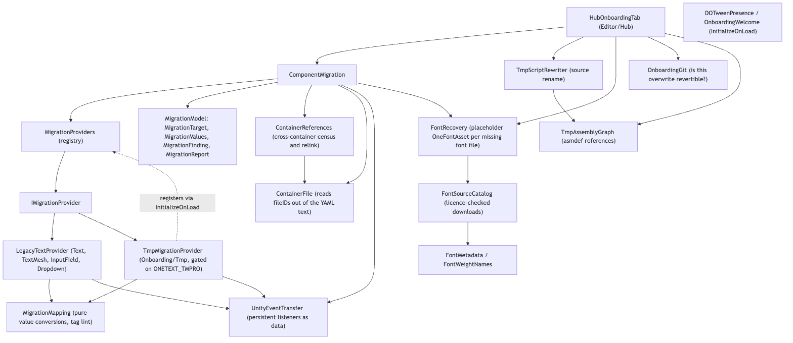
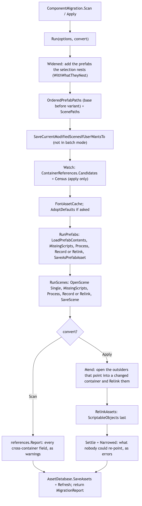
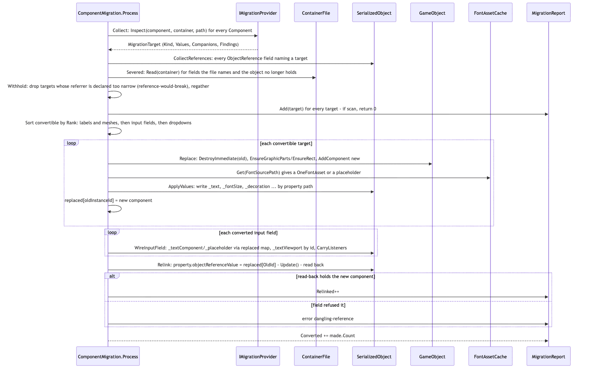
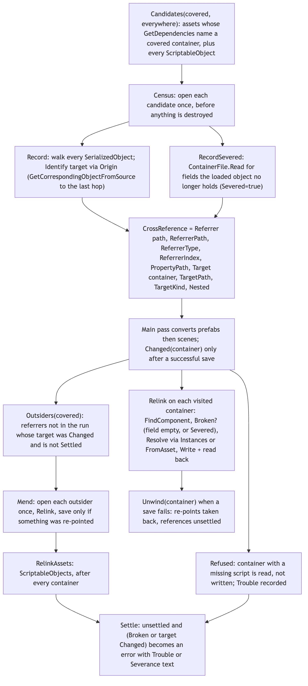
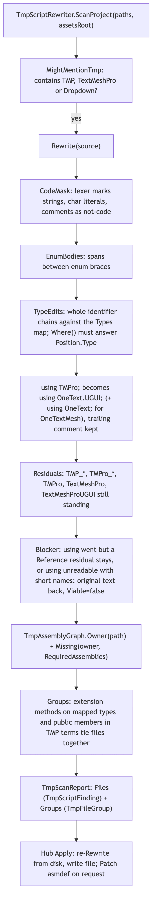

# Editor/Onboarding

`Editor/Onboarding/` is the TextMesh Pro (and legacy uGUI `Text`/`TextMesh`) to OneText migration tool. It sits entirely outside the text pipeline (string -> parse -> analyze -> shape -> layout -> render -> frontend): it never draws anything. It reads a project's scenes, prefabs, ScriptableObjects and C# files, reports what a conversion would and would not preserve, and — on a second, explicit pass — swaps text components in place, re-points every serialized reference to them (inside the same file and across files), carries UnityEvent listeners, creates `OneFontAsset`s (or placeholders when the font file is gone), and rewrites type names in source. The editor-side UI that drives it is `Editor/Hub/HubOnboardingTab.cs`; the module itself is UI-free and has a batch-mode entry (`ComponentMigration.RunFromCommandLine`).

The one design decision everything else follows from: the TextMesh Pro reader lives in a separate assembly (`Onboarding/Tmp/`) that only compiles when TMP is installed, and it is a *reader* only. All destruction, `AddComponent`, and serialized writes happen in the ungated `OneText.Editor` assembly, so the risky half is testable on a machine without TMP.

## Files

| File | Responsibility |
| --- | --- |
| `ComponentMigration.cs` | The engine. `Scan`/`Apply`/`ScanInPlace`/`ConvertInPlace`/`RunFromCommandLine`; container ordering, per-container `Process` (collect, withhold, swap, wire, relink), `FontAssetCache`, progress bar and cancel, `Mend` of outside containers, save-failure unwinding. |
| `MigrationModel.cs` | Data types: `MigrationKind`, `MigrationFinding`, `MigrationPersistentCall`, `MigrationValues`, `MigrationTarget`, `MigrationReport`. |
| `MigrationProviders.cs` | `IMigrationProvider` (`Inspect`, `KindOf`, `TryProjectFontDefaults`) and the static registry `MigrationProviders` (`Register`, `All`, `HasTextMeshPro`). |
| `MigrationMapping.cs` | Pure value conversions (alignment bitfield, line spacing, overflow, wrap, `TextAnchor`, TextMesh size) and the tag lints (`LintTags`, `LintMeshOnlyLosses`). No Unity objects touched; testable without TMP. |
| `LegacyTextProvider.cs` | Reader for `UnityEngine.UI.Text`, `TextMesh`, `InputField`, `Dropdown`. Always registered. |
| `ContainerReferences.cs` | Cross-container reference census and re-point: `CrossReference`, `Candidates`, `Census`, `Record`, `Relink`, `Refused`, `RelinkAssets`, `Outsiders`, `Unwind`, `Settle`, `Report`. |
| `ContainerFile.cs` | Reads `{fileID: n}` references out of a scene/prefab YAML text (`Read`, `Parse`, `KindOfScript`, `IsInside`) for fields the loaded object no longer holds. Not a YAML parser. |
| `UnityEventTransfer.cs` | Lifts persistent listeners out of a `UnityEvent` as `MigrationPersistentCall` data (`Read`) and writes them onto another event with target remapping and read-back (`Write`). |
| `FontRecovery.cs` | Missing-font manifest (`FontRecoveryEntry`, `FontRecoveryManifest`), placeholder `OneFontAsset` creation (`PlaceholderFor`, `PlaceholderForFile`, `EnsurePlaceholder`), filling placeholders from a file (`Fill`), `fvar` axis reading, `Recover`/`Resolve`, and the `FontRecoveryImporter` asset postprocessor. |
| `FontSourceCatalog.cs` | Hand-written list of openly licensed fonts (`Match`), Google Fonts repository lookup (`Resolve`, `Candidate`), `Download`/`Install` with sfnt signature check (`LooksLikeFont`). Network only on an explicit button. |
| `FontMetadata.cs` | Shallow parser for a Google Fonts `METADATA.pb` (family, licence id, file names, `PreferredFile`). |
| `FontWeightNames.cs` | Reads a weight/italic out of a face name (`Infer`) and turns it into `FontVariation`s clamped to a file's axes (`Variations`). |
| `TmpScriptRewriter.cs` | Source rewrite: `Rewrite(string)`, `Scan`, `ScanProject`, `ScriptsUnder`, `IsLikelyThirdParty`; result types `TmpRewriteResult`, `TmpRewriteChange`, `TmpResidual`, `TmpScriptFinding`, `TmpFileGroup`, `TmpScanReport`. A lexer, not a regex. |
| `TmpAssemblyGraph.cs` | Which `.asmdef` governs a script and whether it references OneText (`Build`, `Owner`, `Sees`, `Missing`); `Patch`/`WithReferences` add references preserving BOM, line endings and indent. |
| `OnboardingGit.cs` | Asks git whether the files about to be overwritten are committed, modified or untracked (`Ask`, `Classify`, `ParsePorcelain`, `Unquote`, `Execute`, `ConfirmOverwrite`). |
| `DOTweenPresence.cs` | `InitializeOnLoad`: keeps the `ONETEXT_DOTWEEN` scripting define in step with whether `DG.Tweening.DOTween` is loaded. |
| `OnboardingWelcome.cs` | `InitializeOnLoad`: one-time "OneText is installed" dialog, remembered in `EditorPrefs` per project path. |
| `Tmp/OneText.Editor.Onboarding.Tmp.asmdef` | The TMP-gated assembly (see below). |
| `Tmp/TmpMigrationProvider.cs` | `TmpMigrationBootstrap` (`InitializeOnLoad` registration) and `TmpMigrationProvider`: reads `TextMeshProUGUI`, `TextMeshPro`, `TMP_InputField`, `TMP_Dropdown`, material effects, font source files, TMP project defaults. |
| `Tmp/Dev/OneText.Editor.Onboarding.Tmp.Dev.asmdef` | Dev-only assembly (additionally constrained on `UNITY_INCLUDE_TESTS`). |
| `Tmp/Dev/TmpMigrationProofGenerator.cs` | Builds a scene of TMP/uGUI components, renders it, runs the real `Apply`, renders again (`-executeMethod OneText.Editor.TmpMigrationProofGenerator.Generate -oneOut <dir>`). |
| `Tmp/Dev/TmpDecorationProofGenerator.cs` | Same, for one decorated label and one TMP font asset's material (`-oneFont`, `-oneText`, `-oneSize`). |
| `Tmp/Dev/TmpTortureSceneGenerator.cs` | Menu `Tools > OneText > Dev > Build TMP Torture Scene`: writes a scene, two prefabs and a ScriptableObject under `Assets/OneTextTmpTorture` so that every scan rule fires; converts nothing. |

### How the TMP assembly is gated

`Tmp/OneText.Editor.Onboarding.Tmp.asmdef` has `"defineConstraints": ["ONETEXT_TMPRO"]` and obtains that define from `versionDefines`: `com.unity.textmeshpro` at `3.0.0` or newer, and separately `com.unity.ugui` at `2.0.0` or newer, both mapping to `ONETEXT_TMPRO` (the asmdef does not record why uGUI 2.x counts; the tests' `OneText.Tests.Tmp.asmdef` repeats the same pair). A second pair of entries (`com.unity.textmeshpro` `3.2.0`, `com.unity.ugui` `2.0.0`) defines `ONETEXT_TMP_WRAPMODE`, which `TmpMigrationProvider.ReadText` uses to choose between `text.textWrappingMode` and the older `text.enableWordWrapping`. The assembly references `OneText.Editor`, never the other way round: `OneText.Editor` cannot depend on an assembly that does not compile in half the projects. `TmpMigrationBootstrap`'s static constructor calls `MigrationProviders.Register(new TmpMigrationProvider())` on every domain reload; `MigrationProviders.HasTextMeshPro` is how the Hub and `RunFromCommandLine` tell the user whether TMP components were looked for. `Tests/Editor/Tmp/OneText.Tests.Tmp.asmdef` is gated the same way. The Dev asmdef adds `UNITY_INCLUDE_TESTS` so it never compiles into a consumer project.

## Structure

Source: [diagrams/onboarding-structure.mmd](diagrams/onboarding-structure.mmd)

Entry points a caller uses:

- `ComponentMigration.Scan(Options)` / `ComponentMigration.Apply(Options)` — the whole project, through the asset database. `Options` has `AllScenes`, `IncludeScenes`, `IncludePrefabs`, `OnlyContainers`, `AdoptProjectFontDefaults`, `CrossContainerReferences` (default true). Both return a `MigrationReport`.
- `ComponentMigration.ScanInPlace(roots)` / `ConvertInPlace(roots, container, createFontAssets)` — an already-open hierarchy; what tests and the Hub preview use. `ConvertInPlace` with `createFontAssets: false` writes no font assets.
- `ComponentMigration.WithWhatTheyNest(containers)` — the selection plus the prefabs it is built out of; public so the Hub can show the real list before the confirm dialog.
- `ComponentMigration.RunFromCommandLine` — batch scan, exit 1 when `report.Passed` is false, 2 when the scan threw. Args `-oneAllScenes`, `-oneNoPrefabs`.
- `TmpScriptRewriter.ScanProject(paths, assetsRoot)` then `TmpScriptRewriter.Rewrite(text)` per file on apply; `TmpAssemblyGraph.Patch(asmdefPath, assemblies)`.
- `FontRecovery.Collect(report, createPlaceholders)`, `FontRecovery.Fill(fontFilePath)`, `FontRecovery.Resolve(entry)`, `FontRecovery.Recover(entry)`.
- `OnboardingGit.ConfirmOverwrite(title, what, projectPaths, yes)` before any in-place write.

The provider seam: `IMigrationProvider.Inspect(component, container, path)` returns a `MigrationTarget` (or null, cheaply, for everything else). A target carries `Kind` (`Label`, `Mesh`, `InputField`, `Dropdown`, `ReportOnly`, `None`), `Source` (live component, valid only while its container is open), `Values` (a `MigrationValues` struct in OneText vocabulary — enums and primitives only), `Companions` (GameObjects a dropdown names, captured while they can be) and `Findings`. `IMigrationProvider.KindOf(Type)` answers the same question from a script type, for references that have to be read off the file. `MigrationReport.Add(target)` folds the target's findings into the report; `Passed` is `Errors == 0`.

## Behaviour

### Scan, report, convert

Source: [diagrams/migration-pipeline.mmd](diagrams/migration-pipeline.mmd)

`Scan` and `Apply` are the same `Run(options, convert)` with one flag. Apply never trusts a previous scan: every `Source` reference died when its container closed, so Apply re-reads everything from scratch and only then destroys anything.

1. `Widened`: if `OnlyContainers` is set, `WithWhatTheyNest` adds every prefab the selection depends on (recursively, via `AssetDatabase.GetDependencies`) and an info finding `nested-selection` says so. Converting a label inside a nested prefab from the host alone writes an override on top of a base that still holds the old component, and the object ends up with both when the base is converted later.
2. `OrderedPrefabPaths`: every prefab under `Assets`, sorted by dependency depth (base before variant, nested before host), ties by ordinal path so two runs produce the same report. Then `ScenePaths(all)`: build settings scenes, or all under `Assets`.
3. If any scene will be opened and the editor is interactive, `SaveCurrentModifiedScenesIfUserWantsTo`; a refusal is an error finding `cancelled` and nothing is scanned.
4. `Watch`: `Covered` is the set the run will open. For a scan, `ContainerReferences` is created over `covered` and recorded during the ordinary walk. For an apply, `Candidates(covered, Everywhere)` asks the asset database which prefabs, scenes and ScriptableObjects depend on a covered container, and `Census` opens each of those once, *before* anything is converted — the only moment the references still exist.
5. `AdoptDefaults` (apply with `AdoptProjectFontDefaults`): `TryProjectFontDefaults` on each provider; fills `OneTextSettings._defaultFont` and `_fallbackFonts` only when they are blank.
6. `RunPrefabs`, then `RunScenes`, under one cancelable `Progress` bar (silent in batch mode). Each container: open, `MissingScripts` check, `Process`, then `references.Record` (scan) or `references.Relink` (apply, saveable) or `references.Refused` (apply, has a missing script), then save if anything was made or relinked. A failed save calls `Unsaved`: `Converted` and `Relinked` are decremented, `references.Unwind(container)`, error `save-failed`. A successful save with swaps calls `references.Changed(path)`. Scene conversion uses `Undo` registration (`undo: convert`); prefab editing never does.
7. Scan: `references.Report` adds a warning per cross-container field that the apply will rewrite. Apply: `Mend` opens the `Outsiders` (censused containers not in the run whose target really changed), relinks and saves only those that changed; `RelinkAssets` handles ScriptableObject referrers last; `Settle` turns every unsettled reference into an error; `Narrowed` adds one warning when the run was narrow *and* something could not be mended.
8. `finally`: on apply, `AssetDatabase.SaveAssets()` and `Refresh()`.

Cancelling between containers is safe by construction: a container is either fully converted and written or not opened. `Mend` has its own progress bar because it must run even after the main bar was cancelled. The `cancelled` warning says "run it again to finish — it picks up where the project is".

### One component, one container

Source: [diagrams/component-swap-sequence.mmd](diagrams/component-swap-sequence.mmd)

`Process(roots, container, report, convert, fonts, undo, saveable)` in `ComponentMigration.cs`:

- `Collect`: every `Component` under the roots is offered to each provider in registration order (`LegacyTextProvider` is always inserted first by `EnsureBuiltIns`); the first non-null `MigrationTarget` wins. Provider exceptions are logged and skipped.
- If converting and `saveable` is false (a missing script was found), every target is reported and nothing is touched: Unity refuses to save a prefab holding a missing script, and a scene save drops the broken component.
- `Gather` = `CollectReferences` + `Severed`. `CollectReferences` walks every `SerializedObject` in the container for `ObjectReference` properties whose `objectReferenceInstanceIDValue` is a target's instance id, recording `Referrer` (`PropertyPath`, `DeclaredType` from `SerializedProperty.type` `PPtr<$Text>`, `Holds` = `WouldHold(declared, Replacement(kind))` by walking the replacement's base types). Components that are themselves targets are skipped. `Severed` adds the same-file references `ContainerFile.Read` still spells out but the loaded object reads as 0 (the script-rewrite-before-convert case); a file naming a field the component no longer has becomes error `severed-reference`.
- `Withhold` loop: any target named by a field that cannot hold its replacement (a `Text` field naming a label) is removed from `convertible` with error `reference-would-break` and `Remedy` text, and the references are gathered again, because a component that stopped being a target is a referrer again (the uGUI `InputField` whose `m_TextComponent` is declared `Text` is the case that forced the loop).
- Scan stops here after `report.Add(target)` for every target.
- `convertible.Sort` by `Rank`: labels and meshes (0), input fields (1), dropdowns (2).
- `Replace` per target, catching exceptions into error `convert-failed`:
  - Label/Mesh: `DestroyImmediate` the old component, `EnsureGraphicParts`/`EnsureRect` (a `Graphic`'s `RequireComponent` on a base class is not honoured by `AddComponent`; `AddComponent<RectTransform>` replaces a plain `Transform`, which is how a `TextMesh` gains a box), `Add<OneTextLabel|OneTextMesh>`, `ApplyValues`.
  - InputField (`ReplaceInputField`): `SelectableFields` (`m_Navigation`, `m_Transition`, `m_Colors`, `m_SpriteState`, `m_AnimationTriggers`, `m_Interactable`, `m_TargetGraphic`) are copied onto a hidden carrier `OneTextInputField` on a scratch `GameObject` with `SerializedObject.CopyFromSerializedProperty`, the old component is destroyed, the new one added, and the fields copied back. Then `ApplyValues`.
  - Dropdown (`ReplaceDropdown`): built before the old one goes, via the same carrier trick, with `CarryOptions` first (element by element: `m_Text`, `m_Image`, `m_Color` defaulting to white — TMP's `OptionData` has a colour, Unity's does not) and then `Carry` of `SelectableFields` + `DropdownFields` (`m_Template`, `m_CaptionImage`, `m_ItemImage`, `m_Value`, `m_OnValueChanged`, `m_AlphaFadeSpeed`). Options before `m_Value` because the component clamps the value against the options it can see. `m_CaptionText`/`m_ItemText` are set to the `OneTextLabel` now on the `Companions` objects; a negative `m_Value` (TMP placeholder) becomes 0; a companion with no label yet is warning `no-counterpart`.
  - `ApplyValues` writes through `SerializedObject` by private field name: `_font` (via `FontAssetCache.Get`), `_fallbackFonts`, `_text`, `_richText`, `_fontSize`, `_autoSize`, `_autoSizeMin/Max`, `_alignment`, `_verticalAlignment`, `_wrap`, `_overflow`, `_lineSpacing`, `_decoration.*` (field by field; `Color32` written as colour or as four ints depending on how Unity serialized it), `m_Color` and `_color`, `m_RaycastTarget`, and for input fields `_multiline`, `_readOnly`, `_characterLimit`, `_caretColor`, `_caretWidth`, `_caretBlinkRate`, `m_Interactable`. Then `Reenable` toggles `enabled` so a component that copied serialized state in `OnEnable` re-reads it.
- `WireInputField` second pass, after every label exists: `_textComponent`/`_placeholder` from `replaced[TextComponentId/PlaceholderId]`, `m_TargetGraphic` by `EditorUtility.InstanceIDToObject`, `_textViewport` by id (never replaced, so never remapped), then `CarryListeners` for `_onValueChanged`, `_onSubmit`, `_onEndEdit` via `UnityEventTransfer.Write` (targets retargeted through the `replaced` map keyed by the instance id captured while alive; `m_TargetAssemblyTypeName` updated when the target changed), counted by read-back into info/warning `event-listeners`. Finally `Reenable` and `OneTextInputField.UpdateVisuals()` so the placeholder's `enabled` flag is serialized correctly.
- `Relink`: every recorded in-container `Referrer` gets `objectReferenceValue = replaced[OldId]`, `ApplyModifiedPropertiesWithoutUndo`, `Update`, and a read-back. A field that silently refused (a `TMP_Text`-declared field) is error `dangling-reference`; success increments `report.Relinked`.

`FontAssetCache.Get(sourcePath, target)`: one `OneFontAsset` per source font file, at `<dir>/<base> Font.asset` beside the font, reused if it exists, created with `OneFontAssetCreator.CreateFromFontFile` otherwise (`FontsCreated++`). No source path -> `Recovered(target)`: the first `font-source-missing` finding on the target names the TMP font asset, and `FontRecovery.PlaceholderFor` makes or reuses a placeholder under `Assets/OneText/Recovered Fonts/<Face> Font.asset` (info `font-recovered`). A source path whose file cannot be read -> error `font-source-missing` plus `FontRecovery.PlaceholderForFile`.

### Cross-container references

Source: [diagrams/cross-container-references.mmd](diagrams/cross-container-references.mmd)

The in-container pass works because field and component are alive together. Across files they never are: a host prefab names a nested prefab's component by the nested file's identity; converting the nested file gives the component a new identity while the host is closed, and when the host is opened the field already reads None. `ContainerReferences` therefore records an identity made of strings that survive the rewrite: `Target` (asset path of the file the component is *written in*), `TargetPath` (hierarchy path inside it), `TargetKind`, plus where the field is (`Referrer`, `ReferrerPath`, `ReferrerType`, `ReferrerIndex` for several components of one type on one object, `PropertyPath`) and `Nested` (reached through an instance inside the referrer, vs named directly across files as a ScriptableObject does).

- Identity: `Cache.Identify` uses `AssetDatabase.GetAssetPath(component)` for an asset object, otherwise `Origin(component)` — `PrefabUtility.GetCorrespondingObjectFromSource` followed hop by hop (max 16) until it stops moving, because one hop lands on the middle file of a nested chain, which holds no components, converts nothing, is never written, and would therefore never be announced as `Changed`.
- `Candidates`: the universe is the covered containers, everything in `elsewhere` (every prefab and every scene in the project, whether or not selected — this is what makes a narrow run honest), and every `t:ScriptableObject`; an asset is a candidate when `AssetDatabase.GetDependencies(path, false)` names a covered container.
- `Census` (apply only) opens prefabs with `LoadPrefabContents`, scenes in `Single` mode (restoring the scene setup afterwards), ScriptableObjects with `LoadAllAssetsAtPath`, and calls `Record`/`Walk`. `Walk` skips `Transform` references and fields on components that are themselves convertible. `RecordSevered` adds `Severed = true` references read by `ContainerFile.Read` (target resolved by `PathInside` on the still-unconverted target file; referrer found by script guid via `MonoScript.FromMonoBehaviour`; `Unreachable = true` when no loaded component holds it).
- `Relink`/`Visit` on every container the main pass opens: `FindComponent` (by path, type name and index; falling back to `ByProperty` when the referrer was itself converted, e.g. a dropdown), `Broken` decides — property gone: `Trouble`; still holding something: settled (unless `Severed`, where the loaded value may be a self-healed `GetComponentInChildren` and the file is what ships); empty: `Broken = true`. `Resolve` picks the component on the referrer's own nested instance (`Instances`, keyed `Target|TargetPath`) when `Nested`, else `FromAsset`; `Made` picks `OneTextInputField`, `OneTextMesh` or `OneTextLabel` by kind. `Write` assigns, reads back, and adds info or error under rule `cross-container-reference`.
- `Changed` is only said after a successful save; `Outsiders` only lists referrers whose target is in `_changed`; `Unwind` puts a failed container's re-points back into the unsettled pile.
- `Settle` reports what is left: unsettled and (`Broken`, or target `Changed`). The message distinguishes `Trouble`, `Severance` (unreachable script vs rewrite-emptied field) and "never opened".

Scan never censuses: it destroys nothing, so every container it opens anyway still holds whole references, and `Record` runs on the ordinary walk; `Report` then lists them as warnings.

### Script rewrite

Source: [diagrams/script-rewrite-flow.mmd](diagrams/script-rewrite-flow.mmd)

`TmpScriptRewriter.Rewrite` is pure text processing: it never loads TMP and works in a project that does not compile. `CodeMask` marks comments, all four string forms (`"..."`, `@"..."`, `$"..."`, `$@"..."`, holes included) and char literals as not-code. `TypeEdits` matches whole dotted identifier chains against the `Types` map (qualified `TMPro.X` and short forms; `UnityEngine.UI.Dropdown` always, bare `Dropdown` only when the file contains `using UnityEngine.UI;`) and only substitutes where `Where` answers `Position.Type`: after an `Introducers` token (`(`, `,`, `<`, `=`, `new`, `public`, ...), after an attribute's `]` but not an array's, never inside an enum body's member list, never after another identifier (that is a declaration). `using TMPro;` becomes `using OneText.UGUI;` (and `using OneText;` when anything became `OneTextMesh`), keeping a trailing comment; a file with no TMPro using but a new OneText name gets the using after its last `using`. `Residuals` lists leftover `TMP_*`, `TMPro_*`, `TMPro`, `TextMeshPro`, `TextMeshProUGUI` with kind `Reference`, `Qualified` or `Declaration`. `Blocker` refuses the whole file (original text back, `Viable` false) when the using would go while a `Reference` residual stays, or when the using line could not be read and short names were introduced. `ScanProject` gates files with `MightMentionTmp`, asks `TmpAssemblyGraph` which `.asmdef` governs each and which of `OneText`, `OneText.UGUI`, `OneText.Mesh` it is missing (asmdef references are not transitive), and computes `Groups` — files that must be applied together because one exports an extension method on a mapped type, or a public member written in TMP terms, that another uses (minus extension names OneText itself already offers, read off the loaded assemblies).

## Invariants and conventions

- **Providers only read.** No provider destroys, adds or writes; `ComponentMigration` does all of it. `Inspect` must be cheap for the null case. `KindOf` must agree with the `Inspect` switch (both providers say "keep the two together").
- **Apply re-reads; nothing is persisted between runs in memory.** `MigrationTarget.Source`, `Referrer.Component` and every `SerializedObject` are valid only while the container is open. Idempotence is the contract: a second run finds no old components, and `ConvertingTwice_FindsNothingTheSecondTime` tests it. What *is* persisted is on disk: converted scenes/prefabs, `<base> Font.asset` beside each font file, placeholders under `Assets/OneText/Recovered Fonts/` (reused, never recreated, and a filled one stays filled), `OneTextSettings` defaults (only filled when blank), rewritten `.cs` and patched `.asmdef`, the `ONETEXT_DOTWEEN` define, and the `EditorPrefs` key `OneText.Onboarding.Asked.<hash of dataPath>`.
- **Per-domain caches** (survive nothing else): `MigrationProviders.Registered` (keyed by `Name`, so a double `Register` is a no-op), `TmpScriptRewriter._replacedExtensions`, `TmpMigrationProvider.s_shaderSource` (`Shader` -> shader source text, never cleared), `FontRecovery.Cache` (font asset name -> path, cleared on every `Collect`). `ContainerReferences.Cache` lives for one container.
- **Ordering.** Prefabs by depth then path, before scenes. Within a container: labels/meshes, input fields, dropdowns. Cross-container: census before the first save; `Mend` after the main loops; `RelinkAssets` after every container; `Settle` last. Options first, `m_Value` second in a dropdown.
- **Counts come from read-back, not from writes.** `Relinked`, `event-listeners` and cross-container success are all measured by re-reading the property. `Unsaved`/`Unwind` subtract what a failed save discarded.
- **Ids, not references, across destruction.** `MigrationValues.TextComponentId/PlaceholderId/TargetGraphicId/ViewportId` and `MigrationPersistentCall.TargetId` are instance ids captured while alive; a destroyed `Object` compares `== null` but keeps its id as a dictionary key.
- **Units.** `LineSpacing` is OneText's multiplier (TMP offset 10 -> 1.1). TextMesh size is `points * characterSize` (ten points per world unit). Material effects: `_OutlineWidth`, `_UnderlaySoftness`, `_GlowOuter` 0..1 and offsets -1..1 are multiplied by TMP's `_ScaleRatioA/B/C` and by `ReachFactor` (TMP's `_GradientScale / pointSize` over OneText's `GlyphRasterizer.SpreadPixels / ppem` at the label's current size); `_GlowInner` is not ratio-scaled; `OutlineWidth` is the outer edge (`faceDilate + thickness`), and face dilate loses half the outline thickness.
- **Threading.** Everything runs on the editor main thread; `OnboardingGit.Execute` is the one place with worker threads (two pipe readers per git call), bounded by `TimeoutMs` 5000 per call and `BudgetMs` 10000 per dialog. No allocation rule applies here: this is editor tooling.
- **Network only on a button.** `FontSourceCatalog.Match` is offline; `Resolve` and `Download` make requests and are never called from a scan or a loop. `FontRecovery.Suspended` keeps the `FontRecoveryImporter` out of the way while `Recover` fills placeholders itself.
- **Rule names are an API.** The Hub filters on them: `cancelled`, `nested-selection`, `unreadable-container`, `unsaveable-container`, `save-failed`, `severed-reference`, `reference-would-break`, `convert-failed`, `dangling-reference`, `cross-container-reference` (`ContainerReferences.Rule`), `no-counterpart`, `event-listeners`, `font-source-missing` (`FontRecovery.Rule`), `font-recovered` (`FontRecovery.RecoveredRule`), `font-default`, `project-default`, `alignment-approximated`, `overflow-approximated`, `line-spacing-approximated`, `margin-lost`, `font-style`, `unsupported-tag`, `material-effect`, `size-approximated`, `rect-added`. `FontRecovery.NamedFont` parses the quoted font asset name out of a `font-source-missing` message, so that message shape is load-bearing.

## Extending

- **A new source component family** (another text package): implement `IMigrationProvider` in its own gated assembly that references `OneText.Editor`, register from an `[InitializeOnLoad]` static constructor, read values into `MigrationValues`, and put every value conversion in `MigrationMapping` (or a sibling pure class) so it is testable without the package. If the new component has no OneText counterpart, return `MigrationKind.ReportOnly` — the report can carry it, nothing converts it.
- **A new `MigrationKind`**: `Replacement`, `Rank`, `Replace`, `ContainerReferences.Convertible`/`Made`, `ContainerFile.KindOfScript` (via `KindOf`), and `MigrationTarget.Convertible` all switch on it. Note `ContainerReferences.Convertible` currently excludes `Dropdown` (cross-container references to dropdowns are not tracked; unclear from the source whether deliberate).
- **A new serialized field on `OneTextLabel`/`OneTextInputField`**: add it to `MigrationValues`, read it in both providers, write it in `ApplyValues` by its private name. The writer helpers (`SetString`, `SetInt`, ...) silently skip a missing property, so a typo converts cleanly and carries nothing — add an assertion to `ComponentMigrationTests.UiText_BecomesALabelCarryingItsValues` or `Tmp/TmpMigrationTests.TextMeshProUGUI_BecomesALabelCarryingItsValues`.
- **A new TMP tag OneText learns to parse**: remove it from `MigrationMapping.UnsupportedTags` and update `MigrationMappingTests.TagLint_StopsReportingTheTagsThatNowWork`.
- **A new type rename**: add to `TmpScriptRewriter.Types` (longest name first within a dotted family; qualified and short forms), to `Mapped` if it should tie files into groups, and a `[TestCase]` in `TmpScriptRewriteTests.EveryMappedType_IsRenamed`. Check `Assemblies` if the target lives outside `OneText.UGUI`.
- **A new catalogue font**: one `Entries` line in `FontSourceCatalog` with licence name, URL, licence file and `Note`; `FontRecoveryTests.The_Catalogue_Answers_With_A_Licence_Before_Anything_Is_Fetched` checks a single entry (`Cairo`: https download and licence URLs, licence name, licence file, `Note`) plus the `JosefinSans`/`Josefin Sans` spelling case; no test iterates `Families`, so a new entry needs its own assertion.
- **Covering tests** (`Tests/Editor`): `ComponentMigrationTests` (uGUI labels/meshes, ordering, cross-container prefab/scene/ScriptableObject cases using `CrossContainerHolder`, narrow runs, save-failed), `ContainerFileTests` (the YAML dialect), `SeveredInsideTests`, `WithheldReferenceTests`, `InputFieldMigrationTests`, `DropdownMigrationTests`, `MissingFontTests` (placeholders for missing files), `FontRecoveryTests` (manifest, placeholders, fill, `fvar`, weight names, metadata, catalogue), `MigrationMappingTests`, `TmpScriptRewriteTests` (rewrite, residuals, blockers, asmdef graph, groups), `OnboardingGitTests` (porcelain parsing, classification, real repositories, timeouts), `HubSelectionTests`, `TmpApiParityTests`; under `Tests/Editor/Tmp` (TMP installed only): `TmpMigrationTests`, `MaterialEffectTests`, `TmpEnumParityTests`.

## Gotchas

1. **A `Text`-declared field holds a label back, permanently.** The rewriter deliberately never renames `Text` (too common), so `Withhold` leaves that label unconverted with `reference-would-break`; the remedy is to declare the field as the OneText type yourself. TMP-typed fields are different: run the script rewrite, recompile, convert again.
2. **Rewrite before convert empties fields Unity cannot bind.** A field retyped to `OneTextLabel` while the file still names a `TextMeshProUGUI` reads 0 in `SerializedObject` (both `objectReferenceValue` and `objectReferenceInstanceIDValue`); only `ContainerFile` sees it. Same-file cases are mended in `Severed`; cross-file ones are recorded `Severed` and only mended or reported if this run converted the target. Binary-serialized projects (`%YAML` missing) get nothing from `ContainerFile`.
3. **Missing scripts block a whole container.** `MissingScripts` -> `unsaveable-container`, nothing inside is converted, and its references into converted containers are `Refused` (read, reported, not written). Asset packs are full of these.
4. **`Inside` cannot tell two components of one type on one object apart** in a prefab (ids are mapped by path + type from the asset copy), so neither is claimed and the reference is reported unmended rather than written to the wrong one. `ByProperty` and `Holder` refuse ties the same way.
5. **Self-healing scripts hide severed references.** `if (!label) label = GetComponentInChildren<...>()` makes the loaded object hold a value the file does not; `Broken` therefore does not trust a non-empty property for a `Severed` record. Measured on a real project (`ContainerReferences.Broken` comment).
6. **`GetCorrespondingObjectFromSource` one hop is the wrong file** for nested chains; `Origin` walks to the end. A reference recorded against the middle file waits forever.
7. **Narrow runs still touch the whole project's referrers.** `Everywhere` is every prefab and scene, not the selection; `Mend` opens and writes files you did not tick when a field in them pointed at something you converted. The diff will show them.
8. **Material effects are the look.** On Five-Dice 69 of 70 TMP materials carried an effect. `DecorationOf` reads `m_fontMaterial`/`m_sharedMaterial` through `SerializedObject` — never `TMP_Text.fontMaterial`, which instantiates a material during a scan that promises to write nothing. Outline is gated on `OUTLINE_ON` only where the shader source declares it (desktop `TMP_SDF.shader` does not; 166 labels lost their outline before `Declares` existed); underlay and glow are gated on `UNDERLAY_ON`/`GLOW_ON` (reading values alone put shadows on ~2,800 labels). Face dilate is always carried. `ReachFactor` converts at the label's current size; auto-sized labels drift (`material-effect` note).
9. **TMP font source file, three places.** `sourceFontFile` is null for every statically baked atlas; `m_SourceFontFileGUID`, then `m_SourceFontFile_EditorRef`, then `m_SourceFontFilePath` are tried. A font asset with no file anywhere becomes a placeholder, not a null; dropping the `.ttf` into the project fills every label at once (`FontRecoveryImporter`). A file with no weight axis is refused when several faces of the family are waiting (`Fill(string)`), because a wrong weight is quieter than a missing one.
10. **Dropdown and input field are `Selectable`s.** Colour block, navigation, transition are structures and cannot live in `MigrationValues`; losing them means a field that stops highlighting. Hence the carrier object. Dropdown labels must be converted first; `Companions` are captured at scan time because by swap time the old dropdown's fields read None. `[RequireComponent(typeof(Dropdown))]` on a project script stops the swap — rewrite that script first (this is why `MightMentionTmp` looks for `Dropdown`).
11. **`AddComponent` after `OnEnable`.** Values are written after the component enabled against defaults; `Reenable` (disable/enable) is what makes the input field's editing model and placeholder visibility correct without reloading the scene.
12. **Legacy `InputField` event names lie.** The inspector's On End Edit is `m_OnDidEndEdit`, and `m_OnSubmit` is the old `m_OnEndEdit`. `LegacyTextProvider.FromInputField` reads by backing field.
13. **The rewriter's `Introducers` list is deliberately incomplete.** Reading a name as a type renames a declaration (and a serialized field renamed is silently emptied in every scene); reading a type as a name only loses a rewrite the compiler will point at. DOTween Pro's `enum TargetType { TextMeshPro, TextMeshProUGUI }` is the motivating case. Interpolated string holes are never rewritten.
14. **`TMPro_EventManager` vs `TMP_`.** Residual detection checks both prefixes; a gate that knew only `TMP_` once let a file through into a non-compiling state.
15. **asmdef references are not transitive.** A file under somebody else's `.asmdef` needs `OneText` *and* `OneText.UGUI` (and `OneText.Mesh` for `OneTextMesh`); `TmpAssemblyGraph.Patch` keeps BOM/newlines/indent and recognises OneText's own GUIDs so a `GUID:` reference is not duplicated by name.
16. **git "clean" has a fourth answer.** Untracked/ignored files are quiet in `git status` exactly like committed ones; `OnboardingGit.Ask` runs `ls-files` separately. Paths are never passed on the command line (thousands of them overflowed it); `-z` output is the only shape where a path is the path (Korean names arrive as octal otherwise). `GIT_OPTIONAL_LOCKS=0` and `GIT_TERMINAL_PROMPT=0` are set; a git that misses its budget is killed with its children.
17. **`DOTweenPresence` writes Project Settings** (scripting defines) on `delayCall` after every reload, in both directions, because an Asset Store DOTween has no package manifest for `versionDefines` to see.
18. **Known non-carried values** (all reported, none silent): TMP margins (`margin-lost`), font style (`font-style`), baseline/midline/capline alignment, overflow Masking/ScrollRect/Page/Linked, TMP line spacing pixels, content type and character validation, dropdown multi-select and placeholder, `UNDERLAY_INNER`, underlay dilate, glow power, non-white `_FaceColor`, outline reach > 1, unsupported tags (`indent`, `margin`, `pos`, `gradient`, `uppercase`, `sprite index=`, `sprite anim=`, ...), sprites and animation tags on `OneTextMesh`.

## Related

- `../Hub/README.md` — the `HubOnboardingTab` UI that drives Scan/Convert/Rewrite and shows findings and the font recovery list.
- `../../Runtime/UGUI/README.md` — `OneTextLabel`, `OneTextInputField`, `OneTextDropdown`, `TmpCompat` (the alignment bitfield `MigrationMapping` delegates to).
- `../../Runtime/Mesh/README.md` — `OneTextMesh`, the world-text target.
- `../../Runtime/Core/README.md` — `OneFontAsset` placeholders (`InitializePlaceholder`, `IsPlaceholder`, `OneFontRecovery`), `OneFontAssetCreator`.
- `../../Tests/README.md` — the EditMode suites listed under Extending.
- `../../../Docs/ARCHITECTURE.md` — where the editor tooling sits relative to the runtime.
