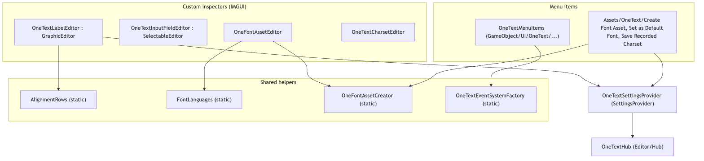
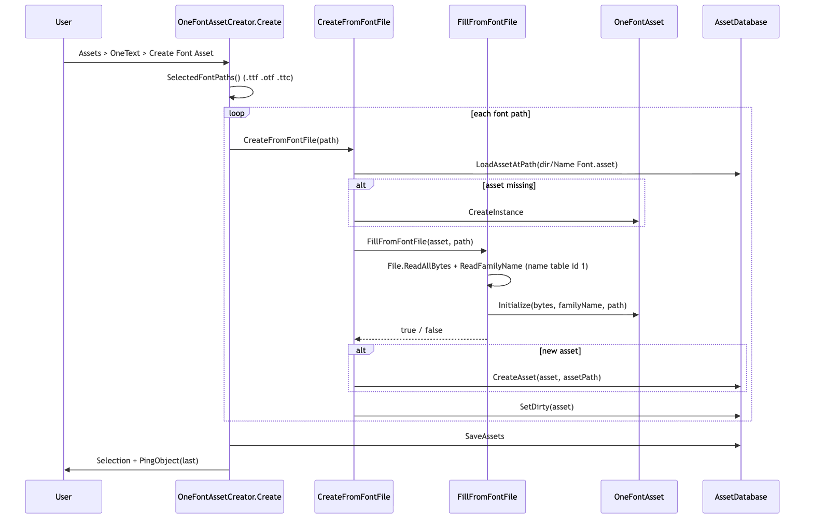
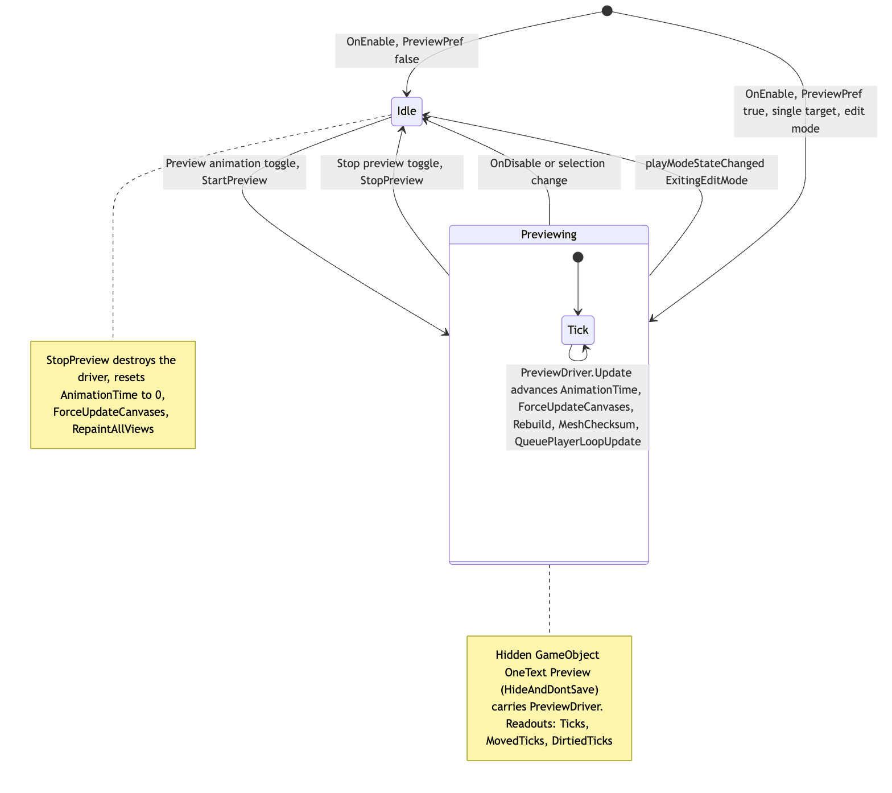
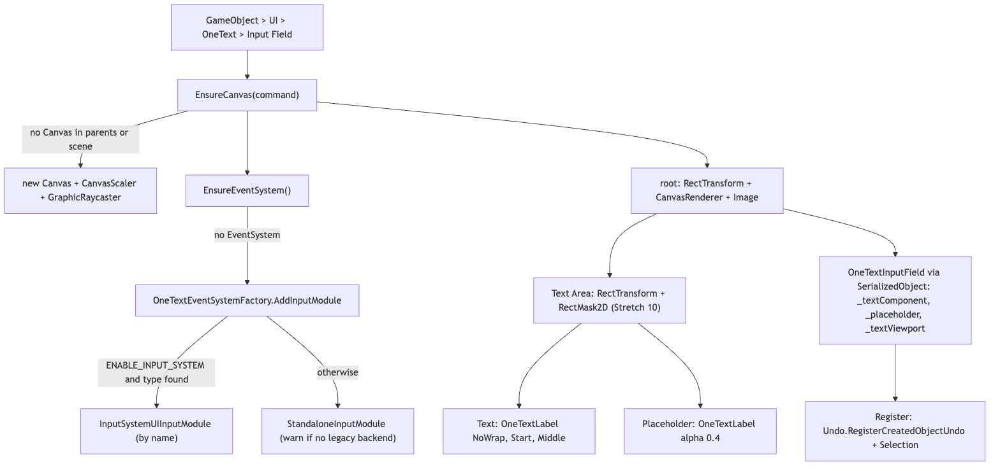

# Editor

`Editor/` is the `OneText.Editor` assembly: everything that runs only inside the Unity editor. It sits at the very end of the pipeline (string -> parse -> analyze -> shape -> layout -> render -> **frontend**) and on the authoring side of it: it turns `.ttf/.otf` files into `OneFontAsset`s, draws the inspectors for the uGUI components and the asset types, adds the `GameObject > UI > OneText` menu entries, mounts the Hub at `Project Settings > OneText`, and ships the Project-window icons for the six asset types. Nothing here runs in a player build (`includePlatforms: ["Editor"]` in the asmdef).

The ten `.cs` files directly in `Editor/` are documented here. The three sub-folders have their own READMEs:

| Sub-folder | Doc | What it is |
|---|---|---|
| `Editor/Hub/` | [Hub/README.md](Hub/README.md) | The Project Settings > OneText page: defaults, fonts, charsets, dictionaries, gallery, atlas, Doctor, forensics, onboarding |
| `Editor/Onboarding/` | [Onboarding/README.md](Onboarding/README.md) | TextMesh Pro migration: component conversion, script rewrite, font recovery (written separately) |
| `Editor/Dev/` | [Dev/README.md](Dev/README.md) | Proof generators, probes, benchmarks, golden images; its own `OneText.Editor.Dev` assembly (written separately) |

## Files

| File | Responsibility |
|---|---|
| `OneText.Editor.asmdef` | Assembly `OneText.Editor`, root namespace `OneText.Editor`, editor-only. References `OneText`, `OneText.UGUI`, `OneText.Mesh`, `UnityEngine.UI`, `UnityEditor.UI`, `Unity.Burst`. `autoReferenced: true`, no unsafe code. |
| `OneTextLabelEditor.cs` | `[CustomEditor(typeof(OneTextLabel))]`, multi-object. Text area on top, then four tabs (Style, Layout, Animation, Interaction) remembered in `EditorPrefs`. Effect table, decoration table, variable-axis sliders, typewriter slider, markup reference, link summary, and the edit-mode animation preview (`PreviewDriver`). |
| `OneTextInputFieldEditor.cs` | `[CustomEditor(typeof(OneTextInputField))]` extending `SelectableEditor`. References, content, caret/selection colours, events; live "Composing: ..." readout in play mode; diagnoses a missing `_textViewport` and offers `AddTextArea` (one undo group). |
| `OneFontAssetEditor.cs` | `[CustomEditor(typeof(OneFontAsset))]`. Family name, read-only "Imported from", Replace/Choose file (copies the file under `Assets` if needed), Bold face slot with sibling-file detection, language popup backed by `FontLanguages`, letter spacing, and a per-selection probe of the face (ideographs, `wght` axis). |
| `OneTextCharsetEditor.cs` | `[CustomEditor(typeof(OneTextCharset))]`: default inspector plus character/tile counts, an atlas-budget warning, "Add recorded characters", "Scan project labels", "Add range..." (from `OneTextCharset.Presets`), "Prewarm now". Also `CharsetRecorderMenu` (`Assets/OneText/Save Recorded Charset`). |
| `OneFontAssetCreator.cs` | `Assets/OneText/Create Font Asset` and the public `CreateFromFontFile` / `FillFromFontFile` / `FamilyNameOf` used by the inspector, the Hub and the migration. Reads the font's `name` table (id 1) for the family name. |
| `OneTextSettingsProvider.cs` | `[SettingsProvider]` at `OneTextHub.SettingsPath` (`Project/OneText`): mounts the Hub (`OneTextHub.Mount()` / `CreateUI()`), schedules `Tick()` every 500 ms, unmounts on deactivate. Also `Find()` / `GetOrCreate()` for the settings asset and `Assets/OneText/Set as Default Font`. |
| `OneTextMenuItems.cs` | `GameObject/UI/OneText/{Label, Input Field, Dropdown}` and `GameObject/3D Object/OneText/Text Mesh`. Builds fully wired hierarchies (canvas, event system, masked viewport, dropdown template) and registers undo. |
| `OneTextEventSystemFactory.cs` | `AddInputModule(GameObject)`: picks `InputSystemUIInputModule` (looked up by name under `ENABLE_INPUT_SYSTEM`) or `StandaloneInputModule`, warning when neither backend can work. |
| `AlignmentRows.cs` | `internal static` IMGUI rows of icon buttons for `TextAlignment` and `VerticalAlignment`, relabelled for vertical writing mode; draws the three icons Unity lacks (`onetext:justify`, `onetext:start`, `onetext:end`) as `Texture2D`s. |
| `FontLanguages.cs` | The four language tags that change a glyph (`ja`, `zh-Hans`, `zh-Hant`, `ko`) plus "Any language", with `IndexOf` / `LabelOf`. Used by `OneFontAssetEditor` and `HubFontsTab`. |
| `Icons/*.png` (+ `.meta`) | Six 64x64 RGBA icons: `OneFontAsset`, `OneTextCharset`, `OneTextDictionary`, `OneTextSettings`, `OneTextSpriteSheet`, `OneTextStyle`. Imported as `textureType: 2` (Editor GUI and Legacy GUI), `maxTextureSize: 64`. |

### Icons

Each runtime asset type declares its icon with the `[Icon]` attribute by package path, e.g. in `Runtime/Core/OneTextSettings.cs`:

```csharp
[Icon("Packages/com.onetext.core/Editor/Icons/OneTextSettings.png")]
public sealed class OneTextSettings : ScriptableObject
```

The same pattern appears on `OneFontAsset`, `OneTextCharset`, `OneTextDictionary`, `OneTextSpriteSheet` and `OneTextStyle`. Nothing in `Editor/` loads the PNGs by code; the attribute is the only reference. The files are generated by `Tools/gen_asset_icons.py` (see `CHANGELOG.md`: drawn as distance fields, "drawn fat" because the size that matters is 16 px in the Project window). The path is hard-coded to `Packages/com.onetext.core/...`, so a project that copies the package under `Assets/` loses the icons (unclear from the source whether anything compensates; the Hub's `HubUI.Load` has such a fallback for UXML/USS but the `[Icon]` paths do not).

## Structure


<sub>Source: [diagrams/editor-structure.mmd](diagrams/editor-structure.mmd)</sub>

Three kinds of code live here. **Inspectors** (`OneTextLabelEditor`, `OneTextInputFieldEditor`, `OneFontAssetEditor`, `OneTextCharsetEditor`) are IMGUI `UnityEditor.Editor` subclasses that write through `SerializedObject`/`SerializedProperty` so undo and multi-object editing work. **Menu items** (`OneTextMenuItems`, `OneFontAssetCreator`, `OneTextSettingsProvider.SetDefault`, `CharsetRecorderMenu`) create objects and assets. **Helpers** (`AlignmentRows`, `FontLanguages`, `OneTextEventSystemFactory`) are static: `AlignmentRows` is used by the label inspector only, `FontLanguages` by the font inspector and `HubFontsTab`, `OneTextEventSystemFactory` by `OneTextMenuItems` only.

`OneTextSettingsProvider` is the bridge to `Editor/Hub/`: `Create()` returns a `SettingsProvider` whose `activateHandler` calls `OneTextHub.Mount()` and adds `hub.CreateUI()` to the settings window root (UI Toolkit), and whose `deactivateHandler` calls `OneTextHub.Unmount(hub)`. The Hub itself is UI Toolkit; the inspectors in this folder are IMGUI. That split is deliberate and documented in `Hub/README.md`.

Entry points a caller uses from other code:

- `OneFontAssetCreator.CreateFromFontFile(string fontPath)` -> `OneFontAsset` beside the file (used by `OneFontAssetEditor.AssignBold`, `HubOverviewTab.ImportFont`, `HubFontsTab.ImportFont`).
- `OneFontAssetCreator.FillFromFontFile(OneFontAsset, string)` -> fills an existing asset (used by `OneFontAssetEditor.PickFontFile` and the migration's placeholder recovery).
- `OneFontAssetCreator.FamilyNameOf(string)` -> family name from the `name` table, or the file stem.
- `OneTextSettingsProvider.Find()` / `GetOrCreate()` -> the `OneTextSettings` asset at `Assets/Resources/OneTextSettings.asset`.
- `OneTextEventSystemFactory.AddInputModule(GameObject)` -> a `BaseInputModule` that works under the project's input backend.
- `OneTextMenuItems.CreateLabel/CreateInputField/CreateDropdown/CreateWorldText(MenuCommand)` -> public, called by tests.
- `AlignmentRows.InlineAxis(SerializedProperty, bool)` / `BlockAxis(...)` -> `internal`, for any inspector that has the two alignment enums.

## Behaviour

### Creating a font asset


<sub>Source: [diagrams/font-asset-creation.mmd](diagrams/font-asset-creation.mmd)</sub>

1. `OneFontAssetCreator.ValidateCreate` enables `Assets/OneText/Create Font Asset` only when `SelectedFontPaths()` finds a `.ttf`, `.otf` or `.ttc` among `Selection.assetGUIDs`.
2. `Create()` calls `CreateFromFontFile(path)` per selected file. The asset path is `<dir>/<stem> Font.asset`. If an asset already exists there it is overwritten in place (same object, so references survive).
3. `FillFromFontFile` reads the bytes, shows a progress bar (`"Packing {name} ({MB} MB)..."`), calls `asset.Initialize(bytes, ReadFamilyName(bytes, baseName), fontPath)`, and logs the stored size ratio. `ReadFamilyName` walks the OpenType table directory to the `name` table and returns the first non-blank name-id-1 record (UTF-16BE for platform 0/3, ASCII otherwise); a malformed table falls back to the file stem, never to an exception.
4. `Create()` then `SaveAssets`, selects and pings the last asset.

`OneFontAssetEditor` reuses this: "Replace..." / "Choose the font file..." goes through `PickFontFile` -> `IntoProject` (copies a file from outside `Assets/` in after a dialog, or reuses one already there by name) -> `Undo.RecordObject` -> `FillFromFontFile`. The Bold face button path (`AssignBold`) uses `CreateFromFontFile`, so a bold made from the inspector is the same kind of asset as one made from the menu, and running it twice on the same file returns the same asset.

### The label inspector and its preview

`OneTextLabelEditor.OnInspectorGUI` draws `_text`, `_richText` (with the collapsible markup reference) and `_parseEscapes`, then a `GUILayout.Toolbar` over `s_tabs` whose index is stored in `EditorPrefs["OneText.LabelEditorTab"]`, then one of `DrawStyleTab` / `DrawLayoutTab` / `DrawAnimationTab` / `DrawInteractionTab`, then `ApplyModifiedProperties`. While previewing it calls `Repaint()` so the clock readout stays live (this window only).

Two tables edit structured data through a flat UI:

- **Effects** (`DrawEffectToggles`): `PeelWraps` splits leading whole-text effect/decoration wraps off `_text.stringValue` (`<shake><wave amp=3>hi</wave></shake>` -> `[shake, wave amp=3]` over `hi`). One row per `BuiltInEffects.Names`; toggling the name inserts/removes a wrap, cells edit `amp`/`freq`/`speed`/`for` (`ParamCell`: NaN = unset, shown as the tag's default; a parameter the effect does not read draws as a grey dash; `for` 0 = for ever). `WriteWraps` rebuilds the string, after clearing `GUIUtility.keyboardControl` so a focused text area does not write its stale buffer back over the edit. `BuildArgs` formats with `CultureInfo.InvariantCulture` because the parser reads invariant.
- **Decorations** (`DrawDecorationTable`): edits the component's `_decoration` field (`TextDecoration`) through `ReadDecoration`/`WriteDecoration`, not the text. Rows: outline, shadow, glow, face. Turning a part on seeds it with `RowDefaults(name)` (the bare tag's defaults via `RichTextParser.TryParseDecoration`, or `FaceDilate = 0` for face). `DrawDecorationTagMigration` offers to move legacy whole-text decoration wraps from the string onto the component.


<sub>Source: [diagrams/label-editor-preview.mmd](diagrams/label-editor-preview.mmd)</sub>

The edit-mode animation preview: `StartPreview` creates a hidden `GameObject("OneText Preview")` with a `PreviewDriver` (`[ExecuteAlways]` MonoBehaviour), registers `_driver.NoteDirty` as the label's dirty-vertices callback, subscribes `OnPlayModeChanged`, and kicks `EditorApplication.QueuePlayerLoopUpdate()`. Each `PreviewDriver.Update` advances `Label.AnimationTime` by wall-clock delta, calls `Canvas.ForceUpdateCanvases()` **and** `Label.Rebuild(CanvasUpdate.PreRender)` (the queued player loop never runs the canvas pass in edit mode, so the rebuild is forced by hand), computes `MeshChecksum` over `DrawnQuads` (position, size, rotation, colour) to count `MovedTicks`, re-queues the loop and repaints scene views only. `StopPreview` tears it down, resets `AnimationTime = 0`, forces a canvas update and `RepaintAllViews`. The on/off state is stored in `EditorPrefs["OneText.LabelEditorPreview"]` and restored in `OnEnable` (single target, not playing) so the preview survives selection changes. The inspector shows three readouts (effect tags, clock, mesh ticks) and `StalledPreviewReport` when ticks run but nothing moves.

### GameObject menu: Input Field


<sub>Source: [diagrams/menu-create-input-field.mmd](diagrams/menu-create-input-field.mmd)</sub>

`EnsureCanvas` returns the context's transform if it sits under a `Canvas`, else the first `Canvas` in the scene, else a new `Canvas` (ScreenSpaceOverlay) with `CanvasScaler` and `GraphicRaycaster`; on the last two paths it also calls `EnsureEventSystem` (the early return for a context already under a Canvas skips it; `CreateInputField` and `CreateDropdown` call `EnsureEventSystem` again themselves before `Register`, `CreateLabel` does not), which adds an `EventSystem` only if none exists and delegates the input module to `OneTextEventSystemFactory.AddInputModule`. `CreateGraphicObject` adds `RectTransform` + `CanvasRenderer` explicitly because inherited `RequireComponent` is not honoured by `AddComponent`. The input field gets a masked `Text Area` (`RectMask2D`, not `Mask`: no stencil, no extra draw call) holding the `Text` and `Placeholder` labels, and the field's `_textComponent`, `_placeholder`, `_textViewport` are written through a `SerializedObject` with `ApplyModifiedPropertiesWithoutUndo`; `Register` then records one undo for the root.

`CreateDropdown` builds the template hierarchy `OneTextDropdown` searches at runtime (a `Toggle` one level under the template, an `OneTextLabel` under the Toggle, content sized one row plus padding: height 52 = 44 + 4 + 4) and deactivates the template **before** adding the component so the list is never open for a frame. `CreateLabel` and `CreateWorldText` take their sizes from `OneTextSettings.ProjectDefaults.CanvasSize` / `.WorldSize`; the other defaults arrive through the component's `Reset`.

### The font asset inspector

`OneFontAssetEditor.OnInspectorGUI` draws, in order: `_familyName`; **Font file** (`DrawFontFile`: a placeholder from the TMP migration shows a warning naming `font.Recovery.ExpectedFileName`, otherwise a disabled "Imported from" field with `_sourcePath` and a `DrawSizes` line "N KB font, M KB stored (P%), packed for size|import speed"; then "Replace..."/"Choose the font file..." and "Show in project"); **Weight** (`DrawBold`); **Language** (`DrawLanguage`); **Spacing** (`DrawLetterSpacing`, `_letterSpacingEm`, with an info box when |value| > 0.25 em).

`DrawBold` has four outcomes, decided in this order: (1) multi-selection draws the raw `_bold` field; (2) `BoldOf(font)` finds another `OneFontAsset` whose `Bold` is this one (via `AssetDatabase.GetDependencies` over `t:OneFontAsset`, loading only the asset that depends on this path) and says "This is the bold face of X"; (3) `Probe(font)` reports a `wght` axis and says `<b>` interpolates; (4) otherwise the `_bold` slot, a "Use <sibling>.ttf" button if `SiblingBold` finds `<stem>bold.*` beside the source, a file-panel button, and a warning that `<b>` will be faked by thickening. `Probe` samples the face once per selection: `HasGlyph('一') || HasGlyph('あ') || HasGlyph('가')` for ideographs and `GetVariationAxes()` for `wght`.

`DrawLanguage` shows a popup over `FontLanguages.Choices` plus an "Other..." entry; picking Other sets `_typingCustomTag` and reveals the raw `_language` text field (BCP 47, prefix-matched). `DrawLanguageNote` then says whether the tag does anything: untagged face with ideographs (info: chain order decides), tagged face without ideographs (info: the tag is read for nothing else).

### The charset inspector

`OneTextCharsetEditor` draws the default inspector, then `charset.Codepoints().Count` and the tile count (`codepoints * max(1, Sizes.Count)`), a warning when `pairs * 56 * 56` exceeds `AtlasSettings.MemoryBytes * charset.FillLimit`, and four buttons: "Add recorded characters" (`CharsetRecorder.CharactersAsString()` merged via `Merge`, sizes via `SizesSorted()`), "Scan project labels" (every `OneTextLabel` in every prefab from `AssetDatabase.FindAssets("t:Prefab")` and every loaded scene), "Add range..." (`GenericMenu` over `OneTextCharset.Presets`), "Prewarm now" (`charset.Prewarm()`, logged). `CharsetRecorderMenu.SaveRecorded` (`Assets/OneText/Save Recorded Charset`) creates a new charset asset from the recorder at a path chosen with `SaveFilePanelInProject`. The same `Merge` logic exists as `HubCharsetsTab.Merge` in `Editor/Hub/`.

### Settings provider

`OneTextSettingsProvider.Create()` (the `[SettingsProvider]`) builds a `SettingsProvider(OneTextHub.SettingsPath, SettingsScope.Project)` labelled "OneText" with search keywords. On activate: `OneTextHub.Mount()`, `hub.CreateUI()`, `minHeight = 460`, `overflow = Hidden` (so the settings window's scroll view does not re-measure the Hub's full height every layout pass), and `root.schedule.Execute(() => mounted.Tick()).Every(500)` because nothing else ticks a settings page and the atlas section watches a running game. On deactivate: `OneTextHub.Unmount(hub)`.

## Invariants and conventions

- **Write through `SerializedProperty`, never the target**, in every inspector (`AlignmentRows.Row`, `OneTextInputFieldEditor`, `OneFontAssetEditor`, the decoration table). That is what keeps undo and multi-object editing correct; a mixed selection shows no button pressed.
- **Settings asset location**: `Assets/Resources/OneTextSettings.asset` (`OneTextSettingsProvider.SettingsPath`); `Find()` tries `AssetDatabase.LoadAssetAtPath` then `Resources.Load(OneTextSettings.ResourcePath)`. After creating or editing it through a `SerializedObject`, call `OneTextSettings.Invalidate()` so the runtime's cached `Instance` is re-read.
- **Font asset naming**: `<stem> Font.asset` beside the source file; `CreateFromFontFile` overwrites rather than duplicates.
- **Bold sibling matching is strict** (`OneFontAssetEditor.SiblingBold`): `Normalize(stem) + "bold"` must equal the candidate's normalised stem, so SemiBold/ExtraBold/BoldItalic are never auto-offered.
- **`AlignmentRows.Button.Value` is compared to `enumValueIndex`**, which is a declaration position, not the numeric value. Both enums are declared from zero without gaps; giving either an explicit value breaks this (comment in `AlignmentRows.cs`).
- **Icon cache** (`AlignmentRows.Icon`): keyed by name, flushed when `EditorGUIUtility.isProSkin` or `pixelsPerPoint` changes; drawn textures are `HideAndDontSave` and destroyed on flush. Drawn icons use `FilterMode.Point`, no mips, gamma space.
- **`OneFontAssetEditor` probes once per selection** (`_probed`, `_boldOfProbed`): parsing the face or walking the project's font assets in `OnInspectorGUI` every repaint is what it avoids. `Probe` never touches a placeholder (`IsPlaceholder` / `FontFileSize == 0`) because asking it for a face makes it borrow the project default and warn.
- **Variable-axis sliders snap** `wght`/`wdth` to steps of 10 (`SliderStep`): every distinct axis value is its own font instance and atlas tiles.
- **Preview driver lifetime**: created only in `StartPreview`, destroyed only in `StopPreview`; `OnPlayModeChanged` stops it at `ExitingEditMode`, before play begins; `StopPreview` also runs from `OnDisable` so the handler is always dropped.
- **Threading**: everything here is main-thread editor code. `OneFontAssetCreator.FillFromFontFile` blocks with a progress bar.
- **Input module choice** must go through `OneTextEventSystemFactory`; `typeof(StandaloneInputModule)` hard-coded in a `new GameObject(...)` throws every frame under "Input System Package (New)".

## Extending

- **A new label field**: add the `SerializedProperty` in `OneTextLabelEditor.OnEnable`, draw it in the right tab. If it is an alignment-like enum, reuse `AlignmentRows`. Tests touching the label inspector indirectly: `Tests/Editor/AnimationTests.cs`, `DecorationTests.cs`, `RevealTests.cs` exercise the runtime side the tables write to.
- **A new GameObject menu entry**: add a `[MenuItem("GameObject/UI/OneText/...")]` in `OneTextMenuItems`, build with `CreateGraphicObject`, call `EnsureCanvas`/`EnsureEventSystem`, finish with `Register`. `Tests/Editor/DropdownCreationTests.cs` and `Tests/Editor/InputFieldViewportTests.cs` call `OneTextMenuItems.CreateDropdown` / `CreateInputField` directly and assert on the hierarchy; follow that shape.
- **A new font language tag**: do not add one by analogy. `FontLanguages.Choices` is the complete list of tags that change a glyph (see the class comment); anything else is typed by hand in the "Other..." field.
- **A new asset type with an icon**: add a 64x64 PNG to `Editor/Icons/` via `Tools/gen_asset_icons.py`, import as Editor GUI texture, and put `[Icon("Packages/com.onetext.core/Editor/Icons/<Name>.png")]` on the runtime class.
- **A new settings field**: add it to `OneTextSettings` (Runtime), then draw it in `Editor/Hub/HubSettingsTab.cs` through `Edit(field, ...)`; `Tests/Editor/ProjectDefaultsTests.cs` and `SettingsPageTests.cs` cover the defaults and the page.
- **Tests covering this folder**: `Tests/Editor/SettingsPageTests.cs` (`OneTextSettingsProvider.Create`, activate/deactivate, `OneTextHub.SettingsPath`), `DropdownCreationTests.cs`, `InputFieldViewportTests.cs` (the menu's `CreateInputField` hierarchy and the runtime field's self-mask; it builds its own Text Area by hand and never calls the inspector's `AddTextArea`), `FontAssetTests.cs` (the `OneFontAsset` the creator fills), `ProjectDefaultsTests.cs`. There is no direct test of `AlignmentRows`, `FontLanguages`, `OneFontAssetEditor`, `OneTextCharsetEditor`, `OneTextLabelEditor` or `OneTextInputFieldEditor` (no test creates an editor).

## Gotchas

1. **Hard-coded StandaloneInputModule throws under the new Input System** (`OneTextEventSystemFactory.cs`). The module for the other backend cannot be referenced by type because the assembly may not exist; it is resolved by `Type.GetType("UnityEngine.InputSystem.UI.InputSystemUIInputModule, Unity.InputSystem")` and only under `ENABLE_INPUT_SYSTEM` (package installed is not the same as backend enabled).
2. **Edit mode draws effects finished.** A label with `<wave>` looks still until the preview runs; the inspector says so under the Preview button (`DrawPreviewControls`). The queued player loop does not run the canvas pass in edit mode, so `PreviewDriver.Update` calls `Rebuild` itself.
3. **`RepaintAllViews` per frame turns the preview into a slideshow**; the driver repaints scene views only, the inspector repaints itself.
4. **A focused IMGUI text field writes its buffer back** on the next frame; `WriteWraps` clears `GUIUtility.keyboardControl` and `editingTextField` before setting `_text.stringValue`.
5. **The source path on a font asset is provenance, not input.** `OneFontAssetEditor` draws it disabled; replacing the font goes through the file picker and `FillFromFontFile`. Picking a file outside `Assets/` used to "succeed" and record `/Users/.../Foo.ttf`; `IntoProject` now copies it in first.
6. **`FillFromFontFile` on a placeholder** (TMP migration leftover) fills that asset so the labels pointing at it recover; `CreateFromFontFile` would make a second asset beside the file.
7. **Missing `_textViewport` is three states, not one** (`OneTextInputFieldEditor.DrawViewportOffer`): label not under the field (cannot clip, warning), already under a mask (info, assign it), or neither (offer "Add Text Area"). A `RectMask2D` on the label's own object does not count (`MaskAbove` starts at `label.parent`).
8. **Drop-down caption and row labels must have `raycastTarget = false`** (`OneTextMenuItems.CreateDropdown`): `OneTextLabel` handles pointer clicks, so a caption that takes clicks is a dropdown that never opens.
9. **Only two graphics on a dropdown row**, both belonging to the Toggle; a third child Image is adopted as the option picture and tinted.
10. **Icon names are checked against 6000.0** (`AlignmentRows`); an unresolved built-in name draws the word instead of a blank button (`Face` falls back to `Button.Words` when `Icon` returns null); the lookup is cached per name in `s_icons`, so whatever Unity's `IconContent` logs for it is logged once per cache fill, not per repaint.
11. **`OneTextCharsetEditor`'s "Prewarm now" is disabled** when not playing and `charset.BuildFontStack().Primary == null` (no font anywhere to rasterise with).
12. **Atlas-budget estimate in the charset inspector** uses 56x56 texels per tile as the CJK order of magnitude; it is a warning, not a measurement.

## Related

- [Hub/README.md](Hub/README.md): the Project Settings page mounted by `OneTextSettingsProvider`.
- [Onboarding/README.md](Onboarding/README.md): migration code that calls `OneFontAssetCreator.FillFromFontFile` / `FamilyNameOf`.
- [Dev/README.md](Dev/README.md): proof generators that build the same UI headless.
- [../Runtime/UGUI/README.md](../Runtime/UGUI/README.md): `OneTextLabel`, `OneTextInputField`, `OneTextDropdown` that these inspectors and menus target.
- [../Runtime/Core/Fonts/README.md](../Runtime/Core/Fonts/README.md): `OneFontAsset`, `OneTextCharset`, `OneTextStyle`.
- [../../Docs/ARCHITECTURE.md](../../Docs/ARCHITECTURE.md): assembly table (`OneText.Editor` row).
- [../../CHANGELOG.md](../../CHANGELOG.md): history of the inspectors, icons and menu entries.
