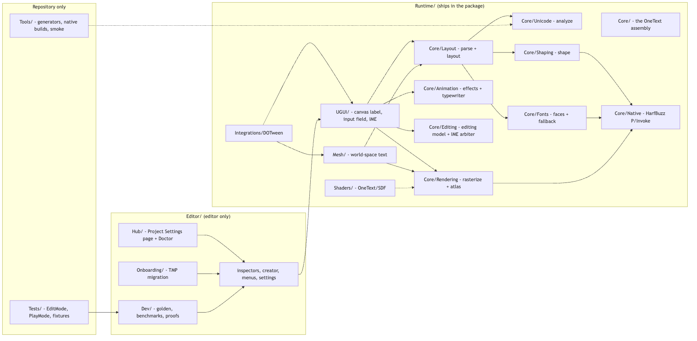
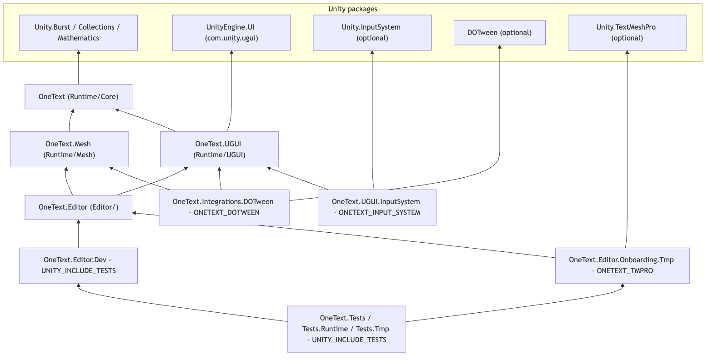

# OneText contributor documentation

One document per source folder, each with diagrams of the module's structure and
behaviour, written for someone who wants to change the code rather than use the
package. The user-facing material stays where it was: [README.md](../README.md),
[Docs/ARCHITECTURE.md](../Docs/ARCHITECTURE.md), [Docs/BENCHMARKS.md](../Docs/BENCHMARKS.md),
[Docs/NATIVES.md](../Docs/NATIVES.md), [Docs/ROADMAP.md](../Docs/ROADMAP.md),
[CONTRIBUTING.md](../CONTRIBUTING.md).

The folder name ends in `~`, so Unity's importer skips it: a project that installs
the package never sees these files in its Asset Database and never pays an import
for the images. They are for GitHub and for your editor.

**This folder mirrors the source tree.** The document for `Runtime/Core/Layout/` is
`Documentation~/Runtime/Core/Layout/README.md`; its diagram sources are in the
`diagrams/` folder beside it, each with a rendered `.png` so nothing needs a browser
or a Mermaid plugin to read.


<sub>Source: [diagrams/repo-map.mmd](diagrams/repo-map.mmd)</sub>

## Index

### Runtime (ships in the package)

| Folder | Doc | What it is |
|---|---|---|
| `Runtime/Core/` | [Runtime/Core](Runtime/Core/README.md) | The `OneText` assembly: the whole string-to-quads pipeline with no UI-framework reference. Root files are identity and project configuration (`OneTextInfo`, `OneTextSettings`, `TextQuality`). |
| `Runtime/Core/Unicode/` | [Unicode](Runtime/Core/Unicode/README.md) | Font-independent analysis: UAX #9 bidi, UAX #14 line breaking, UAX #29 segmentation, UAX #50 vertical orientation, East Asian tailorings (kinsoku, Korean wrap, punctuation compression), dictionary breaking for Thai/Lao/Khmer/Myanmar, `KoreanJosa`. Tables generated by `Tools/gen_*_tables.py`. |
| `Runtime/Core/Shaping/` | [Shaping](Runtime/Core/Shaping/README.md) | `Shaper` over one `hb_buffer_t`; `ShapedGlyph` in font units; vertical runs rotated into "flow space" so layout walks both directions the same way. |
| `Runtime/Core/Fonts/` | [Fonts](Runtime/Core/Fonts/README.md) | `OneFontAsset` (Brotli-packed bytes), `FontData` (native face + per-thread fonts), `FontStack` (the fallback chain queried per codepoint), `SystemFonts` (cmap-probed OS fonts), charsets, styles, sprite sheets. |
| `Runtime/Core/Layout/` | [Layout](Runtime/Core/Layout/README.md) | `RichTextParser` (markup to display text + side tables) and `TextLayoutEngine` (itemize, measure, wrap, emit lines, ruby, vertical, justify, bidi reorder, align). Output: `TextLayoutResult`; `TextHitTest` for carets; `TextQuad` is the seam to the mesh. |
| `Runtime/Core/Rendering/` | [Rendering](Runtime/Core/Rendering/README.md) | Outline extraction through hb-draw, Burst SDF/MSDF rasterization in batches, the `Texture2DArray` `GlyphAtlas` (shelf packing, LRU, compaction, `Version`), `SharedGlyphAtlas` + the one material, colour glyphs, prewarm, diagnostics. |
| `Runtime/Core/Native/` | [Native](Runtime/Core/Native/README.md) | `HarfBuzzApi`: the only P/Invoke surface (HarfBuzz only, no FreeType). Handle ownership, threading, per-platform library names, and the `Runtime/Plugins/` layout. |
| `Runtime/Core/Animation/` | [Animation](Runtime/Core/Animation/README.md) | `ITextEffect` + `BuiltInEffects` registry, `TextAnimator` (an `ITextQuadModifier`), `RevealUnits` (grapheme / cluster / syllable) and the typewriter's step table. |
| `Runtime/Core/Editing/` | [Editing](Runtime/Core/Editing/README.md) | `TextEditingModel` (value, caret, selection, IME composition, framework-free) and `ImeCommitArbiter` (the grace-window state machine that keeps a committed syllable from being paid twice). |
| `Runtime/UGUI/` | [UGUI](Runtime/UGUI/README.md) | `OneTextLabel` (MaskableGraphic): three-tier cache, rebuild path, vertex channels, auto-size, TMP aliases; `AtlasFlushScheduler`, `AtlasInvalidation`, `StyleInvalidation`, `ScreenPpem`, `OneTextDropdown`, `textInfo` facade, diagnostics. |
| `Runtime/UGUI/` (input field) | [InputField](Runtime/UGUI/InputField.md) | `OneTextInputField` + `OneTextCaret`: focus, the per-update order (IME poll, `Tick`, key queue), selection, caret-follow scrolling, self-clipping, soft keyboard, events. |
| `Runtime/UGUI/Ime/` | [Ime](Runtime/UGUI/Ime/README.md) | `IImeInput` contract and its backends: `ImguiImeInput` (built-in), `InputSystemImeInput` (gated by `ONETEXT_INPUT_SYSTEM`), `MobileTextInput`. One Korean syllable traced from the OS to the model. |
| `Runtime/Mesh/` | [Mesh](Runtime/Mesh/README.md) | `OneTextMesh`: the same pipeline through a MeshRenderer, no Canvas; points-to-units scale, world material, its own flush timing. |
| `Runtime/Shaders/` | [Shaders](Runtime/Shaders/README.md) | `OneText/SDF`: which vertex channel carries what (this is the contract `OneTextLabel.AddVert` fills), atlas-array sampling by discriminator, shadow/glow/outline/face compositing, clip and stencil variants. |
| `Runtime/Integrations/DOTween/` | [DOTween](Runtime/Integrations/DOTween/README.md) | DOTween Pro's TMP shortcuts on `OneTextLabel` and `OneTextMesh`; how the assembly is switched on without referencing DOTween. |

### Editor (editor only)

| Folder | Doc | What it is |
|---|---|---|
| `Editor/` | [Editor](Editor/README.md) | Inspectors, `OneFontAssetCreator`, `GameObject > UI > OneText` menu items, the settings provider that mounts the Hub, icons. |
| `Editor/Hub/` | [Hub](Editor/Hub/README.md) | Project Settings > OneText (UI Toolkit): defaults, fonts, charsets, dictionaries, atlas view, gallery, forensics, onboarding, and `TextDoctor`, the renderability lint that runs in `-batchmode` and exits 0/1/2. |
| `Editor/Onboarding/` | [Onboarding](Editor/Onboarding/README.md) | The TMP / legacy `Text` migration: scan, report, swap components, re-point references across prefabs and scenes, carry listeners, rewrite source; what is recorded before the first write and what the tool refuses. |
| `Editor/Dev/` | [Dev](Editor/Dev/README.md) | Golden-image harness, benchmarks, proof generators, the native-plugin importer batch; compiled only under `UNITY_INCLUDE_TESTS`. |

### Repository only

| Folder | Doc | What it is |
|---|---|---|
| `Tests/` | [Tests](Tests/README.md) | The tiers (EditMode, PlayMode, TMP-gated), fixtures, conformance suites, `[perf]` budgets, allocation tests, golden tests, and a table mapping every test file to the module it covers. |
| `Tools/` | [Tools](Tools/README.md) | Table generators, native build scripts, smoke-test runners, the IME probe project. |

### Assemblies


<sub>Source: [diagrams/assemblies.mmd](diagrams/assemblies.mmd)</sub>

## How a module doc is laid out

Every `README.md` under here follows the same headings, so you can open any of
them and know where to look:

1. **Summary** — what the folder is responsible for and where it sits in the
   pipeline (string, parse, analyze, shape, layout, render, frontend).
2. **Files** — one line per source file.
3. **Structure** — a diagram of the main types and the entry points a caller uses.
4. **Behaviour** — diagrams and a walkthrough of the runtime path: data flow,
   a sequence for the hot path, a state diagram where there is state. This is
   the section to read before changing anything.
5. **Invariants and conventions** — threading, the no-per-frame-allocation rule,
   native handle lifetime, caches and when they are invalidated, units.
6. **Extending** — "to add X, touch Y", and the tests that cover the module.
7. **Gotchas** — distilled from the long comments in the source, most likely first.
8. **Related** — sibling docs and the top-level Docs/ files.

## Contributing to these docs

**Prose.** Edit the `README.md`. Keep claims tied to the code: name the type and
method, and prefer "unclear from the source" over a guess. When you change code
in a folder, the matching README is part of the change.

**Diagrams.** Edit the `.mmd` beside the README, re-render, and commit both the
`.mmd` and the `.png`. The PNG is what GitHub shows and what people read offline;
the `.mmd` is the thing you edit.

```bash
./Documentation~/render-diagrams.sh --changed
```

That renders every `.mmd` newer than its `.png`. It needs Node.js; the first run
lets `npx` fetch `@mermaid-js/mermaid-cli`, which pulls a headless Chromium. To
reuse a browser you already have instead, see the comment at the top of the
script (`PUPPETEER_CONFIG`). One module at a time:

```bash
./Documentation~/render-diagrams.sh Runtime/Core/Layout
```

**Mermaid that renders headlessly.** The CLI is stricter than GitHub's live
renderer. Rules that have already cost time:

- Use `flowchart`, `sequenceDiagram`, `classDiagram`, `stateDiagram-v2`.
- Quote any node label that is more than letters, digits and spaces:
  `A["TextEditingModel.Apply()"]`.
- No `;` in sequence-diagram message text or notes — it ends the statement.
  No `,` in a `participant X as ...` alias. Use ` - ` instead.
- No `<br>`, no emoji, no markdown inside labels, no `%%{init}` directives.
- Keep a diagram to roughly 6-25 nodes; two small diagrams beat one large one.
- File names kebab-case: `label-rebuild-sequence.mmd`.

**Adding a module.** Create `Documentation~/<same path>/README.md` with the
headings above and a `diagrams/` folder, then add a row to the index here.

## Why not Docs/

`Docs/` is imported by Unity (it has `.meta` files) and is the user-facing set:
architecture, benchmarks, native provenance, roadmap. This folder is the
contributor set and is large — dozens of images — so it lives where the importer
does not look. Both are excluded from the registry tarball by `.npmignore`; a
git-URL install clones the repository as it stands, and the `~` keeps it inert.
