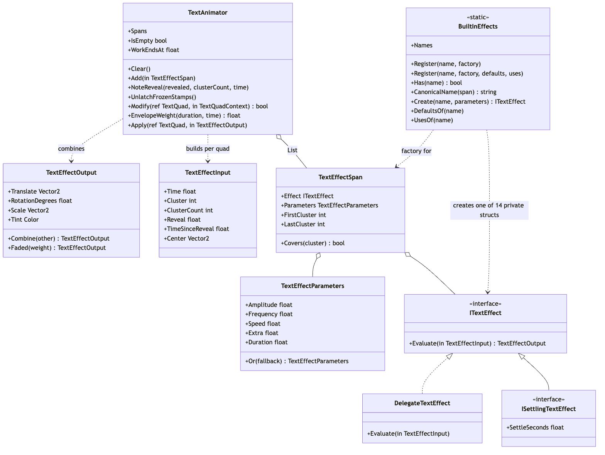
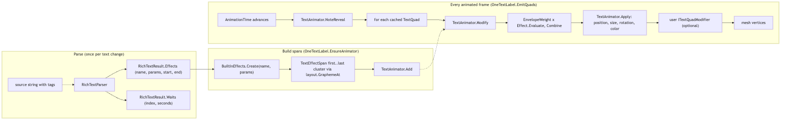
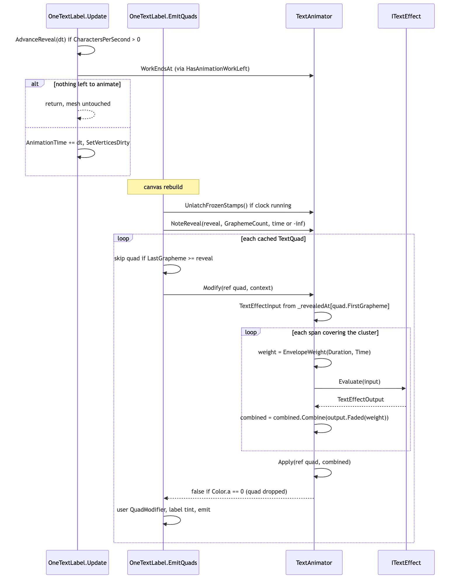
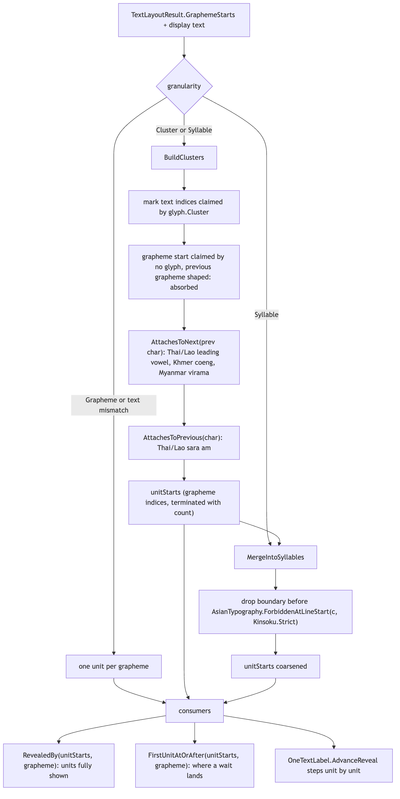
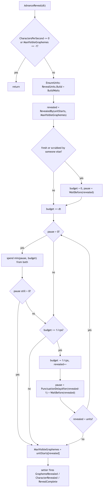

# Runtime/Core/Animation

The per-cluster animation layer: effect tags (`<wave>`, `<shake>`, `<fade for=0.5>` ...) become
`TextEffectSpan`s that `TextAnimator` evaluates against cached quads every frame, and
`RevealUnits` decides what "one step" of a typewriter is. It sits entirely *after* layout in the
pipeline (string -> parse -> analyze -> shape -> layout -> render -> **frontend**): nothing in this
folder re-shapes or re-wraps text. `TextAnimator` is an `ITextQuadModifier` (declared in
`../Layout/TextQuad.cs`) that rewrites quad position, size, rotation and colour in place; the
typewriter only moves `OneTextLabel.MaxVisibleGraphemes`, which rebuilds the mesh, not the layout.
Everything is addressed by grapheme cluster because that is the unit the layout hands back and the
only unit that survives ligatures, Hangul syllables and ZWJ sequences.

## Files

| File | Responsibility |
|---|---|
| `TextEffect.cs` | The effect contract: `ITextEffect`, `ISettlingTextEffect`, the value types `TextEffectInput`, `TextEffectOutput`, `TextEffectParameters`, `TextEffectSpan`, and `DelegateTextEffect` for one-line user effects. |
| `BuiltInEffects.cs` | The registry (`Register`, `Has`, `CanonicalName`, `Create`, `Names`, `DefaultsOf`, `UsesOf`), the `EffectParamUse` flags, and the 14 shipped effects as private readonly structs. |
| `TextAnimator.cs` | Holds the span list, the per-cluster reveal stamps, and implements `ITextQuadModifier.Modify`; owns the `for=` envelope (`EnvelopeWeight`), `WorkEndsAt`, and `Apply`. |
| `RevealUnits.cs` | `RevealGranularity` (Grapheme / Cluster / Syllable), `PunctuationDelay` + `PunctuationDelays.Recommended`, and the static `RevealUnits` table builder and lookups (`Build`, `RevealedBy`, `FirstUnitAtOrAfter`, `AttachesToNext`, `AttachesToPrevious`). |

The typewriter driver itself (`AdvanceReveal`, `SkipToEnd`, `RestartReveal`, `CharactersPerSecond`,
`PunctuationDelays`, `CharacterRevealed`, `GraphemeRevealed`, `RevealComplete`) lives in
`Runtime/UGUI/OneTextLabel.cs` and calls into this folder; it is described here because the
folder's types are meaningless without it.

## Structure

Source: [diagrams/effect-types.mmd](diagrams/effect-types.mmd)

An effect is a pure function `ITextEffect.Evaluate(in TextEffectInput) -> TextEffectOutput`. The
input is `(Time, Cluster, ClusterCount, Reveal, TimeSinceReveal, Center)`; the output is a
translate, a rotation in degrees, a scale and a tint, with `TextEffectOutput.Identity` as the
no-op. Outputs compose with `Combine` (translations and rotations add, scales and tints multiply)
and attenuate with `Faded(weight)` (lerp toward identity). `ISettlingTextEffect` adds
`SettleSeconds` so the animator can tell an appearance effect (fade, rise, swell, pop, drop)
that finishes by itself from an ambient one (wave, shake, ...) that never does.

`TextEffectParameters` is the fixed set of four floats a tag can carry (`Amplitude`, `Frequency`,
`Speed`, `Extra`) plus `Duration` (the `for=` value). Unset values are `NaN`, not zero: each
effect's constructor substitutes its own default for `NaN`, and the registry's `DefaultsOf` mirrors
those defaults so the inspector can show them. `TextEffectSpan` is an effect instance plus its
parameters plus an inclusive `[FirstCluster, LastCluster]` range; `Covers(cluster)` is the per-quad
test.

`BuiltInEffects` is a static, process-wide registry keyed by ordinal name:
`Register(name, factory)` (or the four-argument overload that also declares defaults and an
`EffectParamUse` mask) adds or replaces; `Has` is what `RichTextParser` asks to decide whether an
unknown tag name is an effect; `CanonicalName(ReadOnlySpan<char>)` returns the registry's own
string instance for a case-insensitive match so the parser never allocates a lower-cased copy;
`Create(name, parameters)` builds the instance. The shipped names are
`wave shake wobble bounce glitch stretch` (movement), `flash rainbow pulse` (colour/scale) and
`fade rise swell pop drop` (appearance, all `ISettlingTextEffect`).

`TextAnimator` is the one instance per `OneTextLabel` (`_animator`). Entry points, in the order the
label calls them: `Clear`/`Add` when the text is re-parsed (`OneTextLabel.EnsureAnimator`);
`UnlatchFrozenStamps` + `NoteReveal` at the top of every `EmitQuads`; `Modify` per quad;
`WorkEndsAt` from `Update` to decide whether to keep ticking. `EnvelopeWeight` and `Apply` are
public statics, used by tests and by the above.

`RevealUnits.Build(layout, text, granularity, unitStarts)` turns a `TextLayoutResult` into a list of
grapheme indices with the same shape as `TextLayoutResult.GraphemeStarts` (terminated with the
count, so unit `u` covers graphemes `[unitStarts[u], unitStarts[u+1])`). `RevealedBy` and
`FirstUnitAtOrAfter` are the two binary searches the label needs per step.

## Behaviour

### From a tag to a vertex

Source: [diagrams/tag-to-vertex.mmd](diagrams/tag-to-vertex.mmd)

1. **Parse.** `RichTextParser` (`../Layout/RichTextParser.cs`) meets `<wave amp=2 freq=1.5>`.
   The name is canonicalised through `BuiltInEffects.CanonicalName`; in the tag `switch` the
   `default` branch asks `BuiltInEffects.Has(name)` and, if true, pushes an `Open` entry with
   `ParseEffectParameters(arg)`. A bare number (`<shake=3>`) is the amplitude; otherwise
   `amp|amplitude`, `freq|frequency`, `speed|time`, `extra|arg` and `for|dur|duration` are
   read as `key=value` tokens separated by spaces or commas. On close the tag becomes an entry in
   `RichTextResult.Effects` as `(Name, Parameters, Start, End)` in display-text indices. Effects
   never enter `TextStyle`, so they never split runs and never re-shape anything. A name nothing
   recognises stays literal text.
2. **Build spans.** `OneTextLabel.EnsureAnimator` waits for a layout (cluster indices come from
   it), then for each entry calls `BuiltInEffects.Create(name, parameters)` and
   `_animator.Add(new TextEffectSpan(effect, parameters, layout.GraphemeAt(start),
   layout.GraphemeAt(max(start, end-1))))`. A null effect (name no longer registered) is skipped.
   This runs once per text change, guarded by `_animatorBuilt`.
3. **Tick.** `OneTextLabel.Update` (play mode only) first runs the typewriter, then, if
   `Animate` is on and `HasAnimationWorkLeft()` (built on `TextAnimator.WorkEndsAt`), advances
   `AnimationTime` by `Time.deltaTime`, which calls `SetVerticesDirty`. A script may instead set
   `AnimationTime` itself with `Animate` off; a paused game then pauses its text.
4. **Emit.** `OneTextLabel.EmitQuads` runs per canvas rebuild (diagram below).

### The per-frame hot path

Source: [diagrams/modify-sequence.mmd](diagrams/modify-sequence.mmd)

`EmitQuads` first decides whether a clock is running (`(Application.isPlaying && _animate) ||
_animationTime > 0f`). If so it calls `UnlatchFrozenStamps`; `NoteReveal(reveal,
GraphemeCount, clockRunning ? _animationTime : float.NegativeInfinity)` then runs either way.

`NoteReveal` maintains `_revealedAt[cluster]`, the seconds at which each cluster was first revealed:

- `-1` means not yet revealed; the first `NoteReveal` that finds the cluster under the reveal
  point stamps it with the current time and never re-stamps it while it stays revealed.
- Clusters past the reveal point are reset to `-1`, so rewinding a typewriter rewinds its fades.
- `float.NegativeInfinity` is the "revealed, but no clock is running" stamp. `Modify` turns it
  into `TimeSinceReveal = float.MaxValue`, so appearance effects draw finished rather than at
  t=0 (alpha 0): a designer typing `<fade>` in the Scene view must not watch the text vanish.
  `UnlatchFrozenStamps` converts those back to `-1` once a clock starts, so the effect then plays.
- `_latestReveal` and `_revealPending` are recomputed whole every call (reveal is not monotonic)
  and feed `WorkEndsAt`.

`Modify(ref quad, in context)` is then called once per drawn quad, after the label has already
dropped quads with `LastGrapheme >= reveal` (a merged tile is shown only when every cluster under
it is revealed) and before the user's `QuadModifier` and the label tint. It builds a
`TextEffectInput` from `quad.FirstGrapheme`'s stamp, walks every span whose `Covers(cluster)` is
true, multiplies each output by `EnvelopeWeight(span.Parameters.Duration, context.Time)` via
`Faded`, and `Combine`s them. `Apply` then scales about `quad.Center`, adds the translation, adds
degrees to `quad.Rotation` (the emitter rotates the four corners; the animator cannot do it by
moving the centre) and multiplies `quad.Color` by the tint. `Modify` returns `false` when the
resulting alpha is 0, which drops the quad from the mesh.

`EnvelopeWeight(duration, time)` is 1 for `NaN`/non-positive durations, 0 once `time >= duration`,
and a smoothstep from 1 to 0 over the last `min(0.15s, 25% of duration)`. Effects never see
`Duration`; the animator applies it on top, so every effect, including user-registered ones, is
time-limitable for free.

### When does the label stop ticking?

`TextAnimator.WorkEndsAt` is the last clock time at which any span can still change a pixel:
`-inf` for no spans (null-effect spans are ignored), `+inf` while any un-enveloped ambient effect
exists, otherwise the maximum over spans of `Duration` (for `for=` spans, so the envelope's
ease-out is included) or `SettlesAt(effect)` (`_latestReveal + SettleSeconds` for an
`ISettlingTextEffect`, `+inf` while `_revealPending` or for anything else).
`OneTextLabel.HasAnimationWorkLeft` compares `_animationTime` against it and additionally keeps
ticking while a typewriter is mid-reveal. This is recomputed every call, never latched: new text,
new markup, a pooled label, or a script scrubbing `AnimationTime` backwards all restart the tick by
themselves.

### The typewriter

Source: [diagrams/reveal-units.mmd](diagrams/reveal-units.mmd)

`RevealUnits.Build` always produces a *coarsening* of the grapheme table, never a re-cut; every
unit boundary is a grapheme boundary, which is what keeps carets, effect spans and the merged-tile
rule compatible with it.

- `Grapheme`: one UAX #29 extended grapheme cluster per step (the default and the historical
  behaviour). Also the fallback when `text` does not match the layout
  (`GraphemeStarts[graphemes] != text.Length`).
- `Cluster`: `BuildClusters` marks every text index that some `layout.Glyphs[i].Cluster` claims.
  A grapheme start no glyph claims, whose previous grapheme did produce a glyph, was absorbed by
  the shaper (ligature, reordered mark, conjunct) and is not a boundary. Then the script rules:
  a boundary is dropped if the previous char `AttachesToNext` (Thai/Lao leading vowels
  U+0E40..U+0E44 / U+0EC0..U+0EC4, Khmer coeng U+17D2, Myanmar virama U+1039) or the current
  char `AttachesToPrevious` (Thai sara am U+0E33, Lao am U+0EB3).
- `Syllable`: additionally `MergeIntoSyllables` drops any boundary in front of a character for
  which `AsianTypography.ForbiddenAtLineStart(c, Kinsoku.Strict)` is true (。、っゃー and the
  rest of the 行頭禁則 set), compacting `unitStarts` in place. Strict on purpose, regardless of the
  label's own kinsoku setting.

A thread-static `bool[] t_clusterStarts` is reused between calls, so `Build` allocates nothing
once it has grown.

Source: [diagrams/typewriter-step.mmd](diagrams/typewriter-step.mmd)

`OneTextLabel.AdvanceReveal(dt)` (called from `Update` when `CharactersPerSecond > 0`, public so a
cutscene clock or a test can drive it) keeps two accumulators: `_revealBudget` (seconds banked
toward the next unit) and `_revealPause` (seconds still owed before the next unit may appear). A
pause is paid out of the same budget as the steps, so a pause ending mid-frame lets the rest of the
frame type. After each unit is revealed, the next pause is `PunctuationDelayAfter(revealed-1) +
WaitBefore(revealed)`: they add. If the reveal was moved by somebody else since the last step
(`revealed != _revealCursor`), the banked time is discarded and only a `<wait>` standing in front
of the new position is honoured.

- **Punctuation delays**: `PunctuationDelayAfter(unit)` scans every char of the *whole* unit
  (under Syllable granularity 。 is attached to the char before it) against the label's
  `PunctuationDelays` table and takes the longest matching `Seconds`, not the sum. The table is
  empty by default; `PunctuationDelays.Recommended(list)` fills the starter rows (CJK full stops
  0.35 s, commas 0.15 s, ellipses/dashes 0.45 s, danda/khan/Arabic marks 0.35 s, Thai ฯๆ๚๛ 0.25 s)
  and the inspector offers it as a button.
- **`<wait=0.5>`**: parsed into `RichTextResult.Waits` as `(text index, seconds)`; rejected
  (stays literal) if the number is missing, NaN, infinite or negative. `OneTextLabel.BuildWaits`
  resolves each to a unit via `GraphemeAtOrAfter` + `RevealUnits.FirstUnitAtOrAfter`, so a wait
  written inside a cluster lands on the next unit boundary, and two waits at one point sum.
  A wait before the first character holds the whole line.
- **Skip**: `SkipToEnd()` zeroes the accumulators, sets `MaxVisibleGraphemes = -1` and raises
  `RevealComplete` once; it fires no per-unit events. `RestartReveal()` rewinds to 0 (only if
  `CharactersPerSecond > 0`) and re-arms `RevealComplete`. Setting `CharactersPerSecond` from 0
  to positive in play mode restarts; setting it to 0 leaves the reveal where it is.
- **Callbacks**: the `MaxVisibleGraphemes` setter calls `FireRevealEvents(previous, current)`:
  `RevealComplete` when `current < 0` or `>= GraphemeCount` (re-armed when the reveal moves back);
  then, only for walks (neither end is -1), `GraphemeRevealed(i)` for each cluster crossed and
  `CharacterRevealed(u)` for each *fully* revealed unit between `RevealedBy(previous)` and
  `RevealedBy(current)`. A Thai syllable whose consonant is still to come does not fire.
- **Appearance effects and the reveal**: `NoteReveal` stamps each cluster at the time its turn
  came, so `<fade>` on a typing label fades each cluster in as it appears, not from label start.

## Invariants and conventions

- **No per-frame allocation.** `TextEffectInput`/`TextEffectOutput`/`TextEffectParameters`/
  `TextEffectSpan` are structs; `Evaluate` must not allocate; `_revealedAt` grows geometrically
  and is reused. `AllocationTests.cs` asserts
  `IsAnimating` is allocation-free. `BuiltInEffects.CanonicalName` walks the registry keys rather
  than allocating a lower-cased string.
- **Effects are pure functions of their input.** `Shake` and `Glitch` use the deterministic
  `Noise(x)` hash, never `Random`, so two labels with the same text move identically and a paused
  game stays still (`AnimationTests.Animation_IsAPureFunctionOfTime`).
- **Cluster addressing.** Spans, stamps and `TextEffectInput.Cluster` are grapheme-cluster
  indices into `TextLayoutResult.GraphemeStarts`; `quad.FirstGrapheme` is the lookup key. Text
  indices appear only in `RichTextResult.Effects`/`Waits` and are converted once in the label.
- **Units.** Translate/amplitude values are in layout pixels (quad space); rotation in degrees;
  scale is a multiplier about the quad centre; tint is a multiplier on `quad.Color`; all times in
  seconds of `AnimationTime`, which is not wall time.
- **`NaN` means "unset"** throughout `TextEffectParameters`; `Duration <= 0` or `NaN` means no
  envelope. `EnvelopeWeight` and `WorkEndsAt` must keep reading "no duration" identically (the
  source says so explicitly), or the clock stops under an effect still being drawn.
- **Reveal stamp sentinels**: `-1` not revealed, `>= 0` revealed at that time, `-inf` revealed
  with no clock. `Modify` and `NoteReveal` both depend on these three meanings.
- **Caches and invalidation.** The span list is rebuilt only by `Clear`+`Add` from
  `EnsureAnimator` (text/markup change). The unit table in the label is keyed on `_layoutRuns`
  and `_revealGranularity`, not on the layout generation, because a rect resize re-lays out
  without bumping the generation. The registry is static and survives domain reloads only as far
  as the static constructor re-registers the built-ins; user registrations are lost on reload.
- **Ordering in `EmitQuads`**: reveal cull, then `TextAnimator.Modify`, then the user
  `QuadModifier`, then the label colour multiply. A custom modifier therefore sees the tags'
  result and may override it.
- **Thread safety**: none intended. `RevealUnits.t_clusterStarts` is `[ThreadStatic]` only so a
  worker calling `Build` would not share a buffer; everything else is main-thread.

## Extending

- **A new effect from user code**: `BuiltInEffects.Register("slide", p => new DelegateTextEffect(
  (input, prm) => ..., p))` or a struct implementing `ITextEffect`. Use the four-argument
  `Register` to declare defaults and an `EffectParamUse` mask so the inspector's effect table
  (`Editor/OneTextLabelEditor.cs`, which reads `Names`, `DefaultsOf`, `UsesOf`) shows honest
  knobs. Markup finds it with no parser change (`RichTextParser`'s `default` branch). If the
  effect finishes by itself, also implement `ISettlingTextEffect` or the label will tick forever
  under it. Test: `AnimationTests.RegisteredEffect_BecomesATag`.
- **A new built-in effect**: add a private readonly struct in `BuiltInEffects.cs` following the
  existing pattern (NaN-substituting constructor, `Evaluate` that starts from
  `TextEffectOutput.Identity`), register it in the static constructor with mirrored defaults, and
  add a behaviour test in `Tests/Editor/AnimationTests.cs` (see `Pop_OvershootsPastFullSize_...`,
  `Glitch_IsDeterministic_AndMostlyStill`). Names are clean-room: the file header points at
  CONTRIBUTING.md's rule against borrowed vocabulary.
- **A new tag parameter name**: `RichTextParser.ParseEffectParameters` is the only place; the
  inspector reads tag arguments through the same method.
- **A new output channel** (e.g. per-quad UV offset): `TextEffectOutput` + `Combine` + `Faded`
  + `TextAnimator.Apply` + the `TextQuad` field it writes + the emitter.
- **A new reveal granularity or attach rule**: `RevealGranularity` enum, `RevealUnits.Build`,
  the `[Tooltip]` on `OneTextLabel._revealGranularity` and the `GUIContent` in
  `Editor/OneTextLabelEditor.cs` (`DrawReveal`), which is the tooltip the inspector actually
  shows. New script-specific attach characters go in `AttachesToNext`/`AttachesToPrevious`.
  Tests: `Tests/Editor/TypewriterTests.cs` (`Granularity_*`, `CharacterRevealed_*`,
  `PunctuationDelay_*`, `Wait_*`, `SkipToEnd_*`).
- **Covering tests**: `Tests/Editor/AnimationTests.cs` (spans, purity, combine, envelope,
  settle, no re-layout), `Tests/Editor/TypewriterTests.cs`, `Tests/Editor/RevealTests.cs`
  (reveal by cluster, merged-tile rule, `ITextQuadModifier` contract),
  `Tests/Runtime/RuntimeTypewriterTests.cs` (real frames: advances on its own, stops rebuilding
  when finished), `Tests/Editor/PerformanceTests.cs` (`IsAnimating` goes false when work ends
  and comes back when the clock is rewound or spans are replaced), `Tests/Editor/AllocationTests.cs`.

## Gotchas

1. **An effect that never says it settles keeps the label re-emitting its mesh forever.** A
   `<pop for=0.3>` damage number still holds its span a minute later; only `WorkEndsAt` stops
   the tick, and it relies on `Duration` or `ISettlingTextEffect.SettleSeconds`. Ambient effects
   are unbounded by design. (`TextAnimator.cs`, `WorkEndsAt` comment.)
2. **`SettlesAt` is measured from the reveal, not the label clock.** While `_revealPending` it is
   `+inf`, so a typewriter mid-reveal is always "work" whatever the effects declare.
3. **The `-inf` stamp.** Outside play mode or before anyone sets `AnimationTime`, appearance
   effects are shown finished, not unstarted. `UnlatchFrozenStamps` must run before `NoteReveal`
   once a clock starts, and the label's `_animationTime > 0f` test is what makes a script-driven
   clock count as running. `AnimationTests.AppearanceEffects_ShowFinished_WhenNothingIsAdvancingTheClock`.
4. **`AnimationTime` setter uses exact compare**, not `Mathf.Approximately`: with a large clock a
   whole frame's delta falls inside the relative tolerance and the animation silently stops.
5. **Rotation is carried as degrees on `TextQuad.Rotation`**, not applied by displacing the
   centre (that is identically zero about the centre). `Apply` adds to it; the emitter rotates
   the corners (`EmitRotatedQuad`).
6. **Span end index**: `EnsureAnimator` uses `GraphemeAt(max(start, end-1))` because
   `RichTextResult.Effects` ranges are exclusive at `End`; an empty range still maps to one
   cluster.
7. **`RevealUnits.Build` silently falls back to per-grapheme** when the text length does not match
   the layout; pass the display text (after markup removal), not the source string.
8. **`GraphemeAtOrAfter` vs `GraphemeAt`** for waits: `TextLayoutResult.GraphemeAt` clamps into
   the last cluster, so a `<wait>` at the very end of the string would pause before the last
   character. The label has its own binary search for this reason.
9. **A stale serialized reveal in edit mode**: `OneTextLabel.EffectiveMaxVisibleGraphemes` draws
   everything in the Scene view while a typewriter is configured and nothing in this session has
   moved the reveal (`_revealMoved`). Tests that assert on a hidden label outside play mode must
   move the reveal first (`TypewriterTests.EditorPreview_ShowsEverything_UntilSomethingDrivesTheReveal`).
10. **`SkipToEnd` fires nothing per unit and leaves the reveal at -1**, not at the grapheme
    count. A dialogue system listening to `CharacterRevealed` for sounds must also listen to
    `RevealComplete`.
11. **Effect defaults exist twice** (struct constructor and the `Register` call in the static
    constructor). Change both or the inspector lies.
12. **Domain reload with user registrations**: `BuiltInEffects.s_registry` is static; a project
    that registers effects must do so again after reload (e.g. from `RuntimeInitializeOnLoadMethod`),
    or its tags revert to literal text. Not stated in the source; inferred from the static field.

## Related

- `../Layout/README.md` — `TextQuad`, `ITextQuadModifier`, `TextQuadContext`, `TextLayoutResult`
  (grapheme table, `Glyphs[i].Cluster`), `RichTextParser` (effect and wait tags).
- `../Unicode/README.md` — `AsianTypography.ForbiddenAtLineStart` used by Syllable granularity.
- `../../UGUI/README.md` — `OneTextLabel` (`EnsureAnimator`, `EmitQuads`, `Update`,
  `AdvanceReveal`, the reveal events), `Editor/OneTextLabelEditor.cs` effect table.
- `../../Integrations/DOTween/README.md` — `DOText`/`DOMaxVisibleCharacters` drive the same
  `MaxVisibleGraphemes` counter.
- `../../../../Docs/ARCHITECTURE.md`
