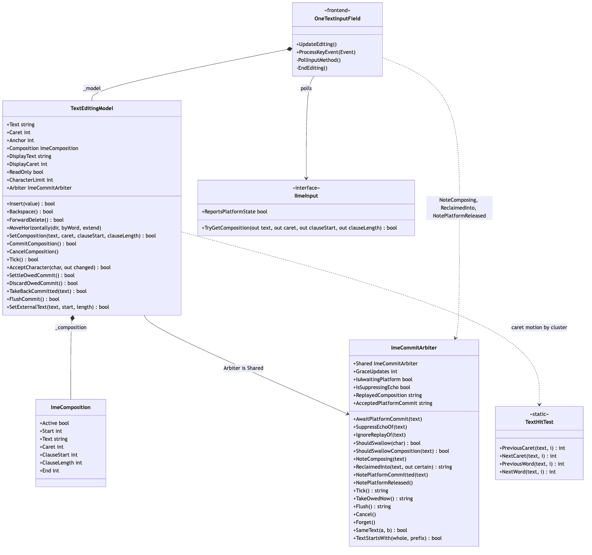
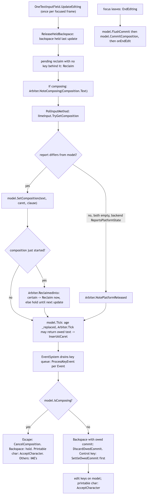
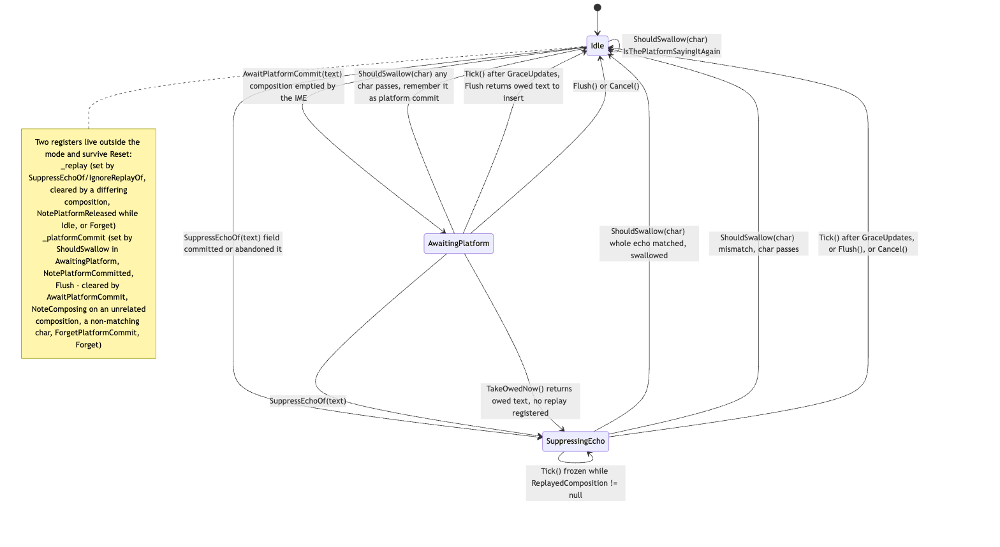
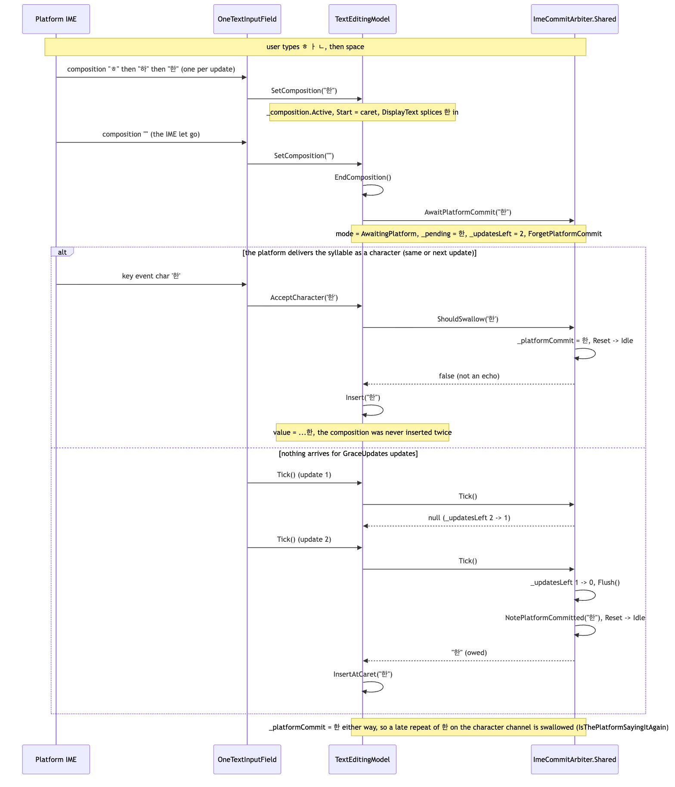
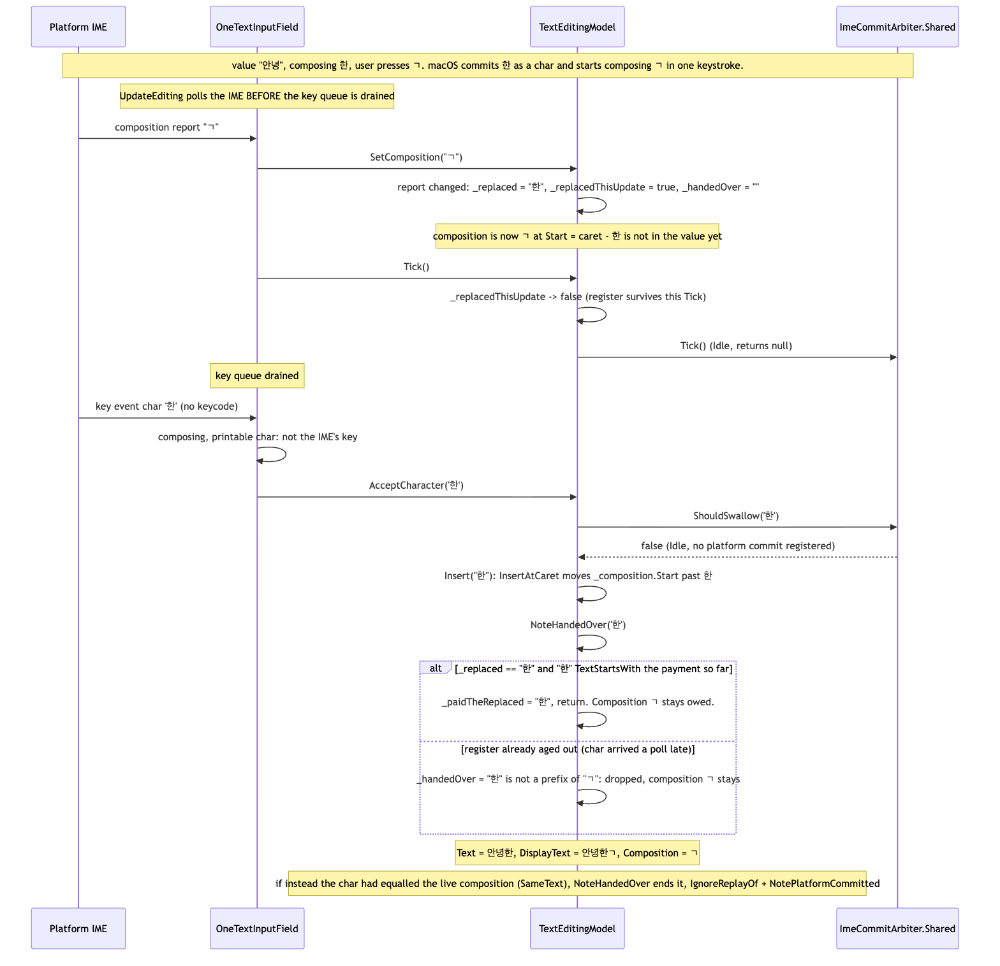

# Runtime/Core/Editing

The input field's state, with no scene, canvas or input method attached: `TextEditingModel` owns
the committed string, the caret/anchor, the edits, and the `ImeComposition` an IME parks on top of
the text; `ImeCommitArbiter` decides who inserts a composition once the IME lets go of it. The
module sits at the **frontend** end of the pipeline (string -> parse -> analyze -> shape ->
layout -> render -> frontend): `OneTextInputField` (`Runtime/UGUI`) polls an `IImeInput`, feeds
this model, and draws `DisplayText` through a `OneTextLabel`. Indices are UTF-16 code units
matching `string`; caret motion steps by grapheme cluster through `TextHitTest`
(`../Layout/TextHitTest.cs`). Most of the code, and nearly all of the comments, exist for one
problem: a platform IME that hands a finished syllable back on two channels (the composition
report and the character queue) that are not synchronised, and that sometimes hands it back twice
or never. The files carry the history; this page distils it.

## Files

| File | Responsibility |
|---|---|
| `TextEditingModel.cs` | Value, caret, anchor, selection, insert/delete/move, composition lifecycle (`SetComposition`, `CommitComposition`, `CancelComposition`), the per-update `Tick`, the character channel (`AcceptCharacter` + `NoteHandedOver`), owed-commit helpers (`SettleOwedCommit`, `DiscardOwedCommit`, `FlushCommit`, `TakeBackCommitted`), `SetExternalText` for the mobile keyboard, `CharacterLimit`/`ReadOnly`. |
| `ImeCommitArbiter.cs` | The process-wide (`Shared`) three-mode grace window (Idle / AwaitingPlatform / SuppressingEcho) plus two evidence-retired registers (`ReplayedComposition`, `AcceptedPlatformCommit`); the Hangul-aware comparisons `SameText`, `TextStartsWith`, `Decomposed` (NFD), `Folded` (NFKD); `ReclaimedInto`; session-end resets. |
| `ImeComposition.cs` | Plain struct: `Active`, `Start` (index into committed text), `Text`, `Caret` (offset inside `Text`), `ClauseStart`/`ClauseLength` (Japanese conversion clause), `End`, `None`. |

## Structure

Source: [diagrams/editing-types.mmd](diagrams/editing-types.mmd)

`TextEditingModel` is a sealed class with no Unity dependencies beyond `Mathf`. Its value is
`Text`; `DisplayText` is `Text` with `Composition.Text` inserted at `Composition.Start` (cached,
`_displayDirty`), `DisplayCaret`/`DisplaySelectionStart`/`DisplaySelectionEnd` are the display-space
caret (collapsed while composing), and `TryGetCompositionRange`/`TryGetClauseRange` give the
frontend the ranges to underline. The model never stores a composition in `Text`.

`ImeCommitArbiter.Shared` is a static singleton and `TextEditingModel.Arbiter` simply returns it.
It was a per-model field for four rounds of fixes; it became shared because a syllable abandoned in
one field is handed by the platform to whichever field polls next, and only a process-wide register
can see that. The model calls the arbiter on every composition and character event; the field
calls three methods on it directly (`NoteComposing`, `ReclaimedInto`, `NotePlatformReleased`)
because they need information only the field has (update boundaries, which backend is in use).

Entry points a caller uses, per update, in this order (see the next section): `SetComposition`,
`Tick`, then `AcceptCharacter`/`Backspace`/... per key event; `FlushCommit` then
`CommitComposition` when focus leaves; `SetExternalText` instead of all of that when a mobile
soft keyboard owns the buffer.

## Behaviour

### One editing update

Source: [diagrams/update-order.mmd](diagrams/update-order.mmd)

`OneTextInputField.UpdateEditing` runs once per focused frame, **before** the EventSystem drains
the key queue into `ProcessKeyEvent`. That ordering is the root of most of what follows: on the
frame a Hangul syllable is committed, the field reads the *next* composition first and receives
the *finished* syllable's character second.

1. `ReleaseHeldBackspace`: a Backspace still held from the last update is applied now if the
   composition did not survive it (see Gotchas 4). The same call runs again at the end of
   `OnUpdateSelected`, once this update's key queue is drained, which is where a held Backspace is
   normally judged.
2. A reclaim held from the last poll (`_reclaimIfNoKeyFollows`) is applied if no key event carried
   a keycode or character behind it.
3. `Arbiter.NoteComposing(Composition.Text)` if composing: retires the repeat register unless the
   composition is the accepted commit being carried on.
4. `PollInputMethod`: `IImeInput.TryGetComposition`; if it differs from the model,
   `SetComposition(...)`; if a composition just started, `Arbiter.ReclaimedInto` (certain ->
   `Reclaim` now, uncertain -> hold one update). If both sides are empty and the backend
   `ReportsPlatformState` (ImguiImeInput, not InputSystemImeInput), `Arbiter.NotePlatformReleased()`.
5. `model.Tick()`: ages the `_replaced` register by one update and advances the arbiter's grace
   window; any text the arbiter hands back is inserted at the caret.
6. Key events: while composing, Escape -> `CancelComposition`, Backspace -> held, a printable
   unmodified character -> `AcceptCharacter` (the IME's commit rides the character channel),
   everything else belongs to the IME and is dropped. Not composing: a Backspace while a commit is
   owed -> `DiscardOwedCommit`; a key carrying no text -> `SettleOwedCommit` first; then the
   ordinary edit keys; a printable character -> `AcceptCharacter`.

On focus loss `EndEditing` calls `FlushCommit()` **then** `CommitComposition()` (the other order
would arm the echo guard and immediately disarm it), then raises `onEndEdit`.

### The model's own edits

`Insert` deletes the selection then `InsertAtCaret`; `Backspace`/`ForwardDelete` remove one
grapheme cluster (`TextHitTest.PreviousCaret`/`NextCaret`) or the selection; `MoveHorizontally`
collapses a selection to the edge a plain (non-word) arrow points at, else steps by cluster or word. `SetCaret`,
`SetSelection`, `SelectAll` clamp through `Clamp` -> `BoundaryBefore`, which moves an index off the
low half of a surrogate pair. `CharacterLimit` truncates on a boundary rather than dropping an
insert; `ApplyLimit` does the same for assignments. Assigning `Text` clamps caret and anchor
independently (a selection that still fits survives), drops any composition and tells the arbiter
(`SuppressEchoOf` for a live composition, `Cancel` for an awaited commit).

`InsertAtCaret` moves `_composition.Start` to the new caret when a composition is active: the
syllable a Hangul IME commits on the character channel arrives a poll after the composition has
flipped to the next syllable, and without this the display would read "ㄱ한" instead of "한ㄱ".

### Composition lifecycle

`SetComposition(composing, caret, clauseStart, clauseLength)`:

- `ReadOnly` -> `CancelComposition`, refuse.
- Not composing and `Arbiter.ShouldSwallowComposition(composing)` -> refuse without touching
  anything (the platform is replaying a composition this field already finished with).
- Not composing and non-empty -> delete the selection, `Active = true`, `Start = caret`.
- Empty while composing -> `EndComposition()` then `Arbiter.AwaitPlatformCommit(previous)`.
- Text changed (ordinal) -> remember the old text in `_replaced` for exactly one update
  (`_replacedThisUpdate`), clear `_handedOver`/`_paidTheReplaced`.
- Caret/clause offsets are clamped and snapped with `BoundaryBefore` (a candidate window reporting
  "one" for an emoji lands mid-pair otherwise).

`CommitComposition` (focus leaving, or the app asking) inserts the text itself and
`Arbiter.SuppressEchoOf(composed)`. `CancelComposition` (Escape) inserts nothing but also calls
`SuppressEchoOf` (or `Cancel` when nothing was composing but a commit was awaited), because the
platform may go on reporting or delivering the abandoned text. `SetExternalText` ends any
composition and replaces value and selection wholesale.

### The arbiter's state machine

Source: [diagrams/arbiter-states.mmd](diagrams/arbiter-states.mmd)

Three modes, one `_pending` string, and a window counted in **updates** (`GraceUpdates`, default
`DefaultGraceUpdates = 2`), never in seconds:

- **AwaitingPlatform** (`AwaitPlatformCommit`): the IME emptied a non-empty composition on its own.
  If any character arrives (`ShouldSwallow` returns false) it *is* the commit: the arbiter records
  `_platformCommit = _pending`, resets to Idle and lets it through. If the window closes
  (`Tick` -> `Flush`), the owed text is returned for the model to insert and is recorded with
  `NotePlatformCommitted`. `TakeOwedNow` hands it over early and switches to SuppressingEcho
  without registering a replay (the platform announced this one itself).
- **SuppressingEcho** (`SuppressEchoOf`): the field committed or abandoned the composition
  itself and the platform was not told. Characters are accumulated into `_echo` and compared
  *decomposed* against `_pendingDecomposed`: whole match -> swallowed, Reset; prefix -> swallowed,
  still arriving; anything else -> the user typed something new, Reset, let it through.
  `SuppressEchoOf` also sets the **replay register** (`RegisterReplay`), and while that is set
  `Tick` does not count down at all: a platform holds a composition for seconds, not frames, and
  on the Input System backend silence is "no news".
- **Idle**: `ShouldSwallow` defers to `IsThePlatformSayingItAgain`.

Two registers live outside the mode machine and survive `Reset`:

- `_replay` / `ReplayedComposition`: the composition the platform is believed to still be holding
  after the field finished with it. `ShouldSwallowComposition` refuses a report that `SameText`s
  it; a *different* report retires it (only the composition channel can retire a replay; an
  earlier version that cleared it on a character was the bug coming back). `NotePlatformReleased`
  retires it only while Idle, and only the IMGUI backend calls it.
- `_platformCommit` / `AcceptedPlatformCommit`: the last commit the platform made and the field
  accepted, which macOS can deliver a second time across a focus gap. `IsThePlatformSayingItAgain`
  swallows a repeat (accumulated, decomposed, prefix-tolerant) and stays armed after a full match;
  a non-matching character or `AwaitPlatformCommit` (a fresh announcement) or `NoteComposing` on
  an unrelated composition retires it. Set from three doors: `ShouldSwallow` in AwaitingPlatform,
  `NotePlatformCommitted` (called by `NoteHandedOver` and `SettleOwedCommit`), and `Flush`.

`Cancel` is `Reset` (mode only). `Forget` clears everything including both registers and runs at
play-session start (`RuntimeInitializeOnLoadMethod(SubsystemRegistration)`), on every
`SceneManager.sceneLoaded`, and in the editor on `ExitingPlayMode`/`EnteredEditMode`.

### A Korean composition commit, end to end

Source: [diagrams/korean-commit-sequence.mmd](diagrams/korean-commit-sequence.mmd)

The canonical two-direction case (`EditingTests.A_Commit_The_Platform_Never_Sends_Is_Made_By_The_Field`,
`A_Commit_The_Platform_Does_Send_Is_Not_Made_Twice`): the composition report goes
`ㅎ -> 하 -> 한 -> ""`. On `""` the model ends the composition and the arbiter awaits. Either a
`'한'` character arrives (inserted once, arbiter idle again, `_platformCommit` armed) or nothing
does and after two `Tick`s `Flush` returns `"한"` for `InsertAtCaret`. In both branches
`_platformCommit` ends up `한`, so a second delivery of 한 on the character channel, even a hundred
frames later after a click away and back, is swallowed.

### The syllable boundary (the hard case)

Source: [diagrams/syllable-boundary-sequence.mmd](diagrams/syllable-boundary-sequence.mmd)

On macOS a Hangul IME commits the finished syllable on the character channel *before* (or in the
same update as) the composition report changes, and the field polls before it drains keys. So when
the user types ㄱ after 한, the model sees `SetComposition("ㄱ")` first and `AcceptCharacter('한')`
second, while ㄱ is live. `NoteHandedOver` is what makes this land correctly:

1. `SetComposition` noticed the report changed and wrote `_replaced = "한"` for this update.
2. `AcceptCharacter('한')` -> `ShouldSwallow` is Idle and has no platform commit -> `Insert("한")`
   (moving `_composition.Start` past it) -> `NoteHandedOver('한')`.
3. If `_replaced` still holds 한 and `TextStartsWith(_replaced, _paidTheReplaced + char)`, the
   character is credited to the replaced composition and the live one stays owed. This is what
   lets "아 아 아" type three 아: the split of 앙 into 아+아 commits a character that is ordinally
   identical to the live composition, and crediting it to the live one ended that composition as
   paid, registered it as a replay, and lost the third 아.
4. Otherwise the character is appended to `_handedOver`; when that `SameText`s the live
   composition, the composition is ended on the spot, `IgnoreReplayOf(spent)` refuses the
   platform's continued report of it, and `NotePlatformCommitted(spent)` arms the repeat guard.
   A total that stops being a prefix is trimmed to the last character if that character alone is
   a prefix, otherwise emptied (닭 -> 달 + 가 hands over 달, which is no part of 가).

`Tick` ages `_replaced` out after the update it was written in plus the key events of that update
(`_replacedThisUpdate` survives the first `Tick`, the register is cleared by the second).

### Reclaim, and the backspace that empties a composition

A Hangul IME does not edit a committed syllable by sending edits; it takes the syllable back into
composition (살 -> 사, 살 -> 삸, 요 -> 용, 아 -> 앙). `ReclaimedInto(composition, out certain)`
compares the new composition against `_platformCommit` in NFKD (`Folded`, so a lone compatibility
ㅇ U+3147 matches the conjoining U+110B inside 에) and reports the commit when they share at least
all but the commit's last jamo and at least one jamo — `certain` when two or more are shared, and a
one-jamo match counts only when the composition is itself that single jamo. The
field then `TakeBackCommitted` removes that text from the value, moves the composition start back,
and `ForgetPlatformCommit`. An uncertain single-jamo match is held one update and applied only if
no key event with a keycode or character arrived behind it.

A Backspace while composing is **held** (`_backspaceHeld`) and judged once the update's key queue
is drained (`ReleaseHeldBackspace`, at the end of `OnUpdateSelected` and again at the start of the
next `UpdateEditing`): composition still live -> it was the IME's, dropped; composition gone -> it was the press
that emptied it, and the field first `DiscardOwedCommit`s (the syllable the IME announced is one
the user deleted; the platform's copy will be swallowed) or else `SettleOwedCommit` + `Backspace`.
Not composing, a Backspace arriving while a commit is owed does the same discard; the
stray keycode-less, character-less event macOS sends ahead of the real press is ignored outright,
and `_swallowingCompositionTail` drops the repeated Backspace that follows.

## Invariants and conventions

- **`Text` never contains an unfinished composition**; `DisplayText` is the only place they meet.
  Everything the frontend draws comes from `DisplayText`/`DisplayCaret`.
- **Indices are UTF-16 code units**, clamped off low surrogates by `BoundaryBefore`. Caret motion
  is by grapheme cluster / word via `TextHitTest`, never by `char`.
- **Every cross-channel string comparison goes through `SameText` / `TextStartsWith`** (NFD), and
  `ReclaimedInto` through `Folded` (NFKD). Ordinal equality is used only where the question is
  "did the report change shape" (`SetComposition`) or as the free fast path. A new comparison
  written with `==` will silently fail on macOS, which composes 한 as U+D55C and may deliver
  U+1112 U+1161 U+11AB.
- **The grace window counts updates, not seconds**, and nothing in the arbiter retires on
  silence any more: the replay register, the repeat register, and the frozen echo window all wait
  for *evidence* (a differing composition, a character, a fresh announcement). Do not add a
  timeout.
- **Allocation**: `Decomposed` and `Folded` are one-entry memos (`s_memoRaw`/`s_memoDecomposed`,
  `s_foldedRaw`/`s_folded`) because the composition channel asks the same question every frame
  while a replay is refused; `_pendingDecomposed`/`_replayDecomposed`/
  `_platformCommitDecomposed` are computed where set, never per poll. The echo accumulates one
  small string per character, accepted. `DisplayText` is cached behind `_displayDirty`.
- **Ownership**: `ImeCommitArbiter.Shared` is process-wide static state; the invariant that
  makes sharing the *debt* safe is that `EndEditing` flushes before focus can move and
  `OnDisable` ends editing, so no field is handed another field's owed syllable. `Forget` runs
  at play-session start, scene load and play-mode exit so a stale register cannot refuse the first
  keystroke of a new session (matters with domain reload off).
- **Ordering per update**: poll -> `Tick` -> key queue, and `FlushCommit` before
  `CommitComposition` on focus loss. `_replaced` is valid for exactly the update it was set in.
- **No threading**: main thread only; the static memos are not thread-safe.

## Extending

- **A new edit operation** (e.g. delete-word): add it to `TextEditingModel` using `TextHitTest`
  for boundaries, `SetCaret(.., false)` for the caret, and return whether the value changed; wire a
  key in `OneTextInputField.ProcessKeyEvent`'s non-composing `switch`. Make sure it runs after the
  `SettleOwedCommit` line so it edits the whole value. Test in `Tests/Editor/EditingTests.cs`
  ("the model" region).
- **A new IME backend**: implement `IImeInput` (`Runtime/UGUI/Ime/IImeInput.cs`); decide
  `ReportsPlatformState` honestly (true only if an empty report means the platform holds
  nothing), because `NotePlatformReleased` is gated on it. No change to this folder should be
  needed. Test with the `FakeIme` pattern in `EditingTests.cs` ("the field" region).
- **A new arbiter rule**: it almost certainly belongs in one of the two registers, not on the
  clock. Write it as "refuse on evidence, retire on evidence", compare decomposed, and add a test
  replayed from a recording (see `Typing_An_Then_Backspacing_The_Jamo_Off_It_Replayed_From_A_Recording`);
  `OneTextInputField` has a `Trace` log of composition reports and key events for exactly this.
- **Covering tests**: `Tests/Editor/EditingTests.cs` (67 tests: model, arbiter, backend choice,
  field-level replays of every recorded bug, focus/click), `Tests/Editor/InputFieldViewportTests.cs`
  (caret/viewport drawing), `Tests/Runtime/RuntimeInputFieldTests.cs` (play-mode field).
  `Editor/Dev/M12ProofGenerator.cs` renders batch-mode visual proofs of a field mid-composition
  through a scripted `IImeInput`.

## Gotchas

Ordered by how likely a change is to hit them; each is documented at length in the source.

1. **Clearing the replay register on a character.** `ShouldSwallow` deliberately does not touch
   `_replay`: at a syllable boundary the platform commits one syllable and keeps composing the
   next in the same step, so a character is not evidence it let go. An earlier version that
   cleared it here re-opened the "last Korean character entered twice" report. (`ImeCommitArbiter.ShouldSwallow`)
2. **Counting the echo window while a replay is registered.** `Tick` returns early in
   SuppressingEcho while `_replay != null`; the Input System backend empties its cache when a
   session ends, so the updates after focus returns report nothing whether or not the platform
   still holds the syllable. Counting there let the guard down before the duplicate arrived.
   (`ImeCommitArbiter.Tick`)
3. **Crediting a boundary commit to the live composition.** Without `_replaced`, typing 아 three
   times loses the third (`NoteHandedOver` comment; `EditingTests.The_Same_Syllable_Typed_Over_And_Over_Advances_Every_Time`).
   The register lives one update; `Tick` is what ages it; `EndComposition` clears it.
4. **Dropping the Backspace while composing.** On macOS the press that empties a composition is
   let through by the IME after it hands back the remainder; dropped, the user's backspace does
   nothing; applied immediately, it deletes committed text in front of an owed syllable (강ㄱ ->
   both gone). Hence held-then-judged, plus `DiscardOwedCommit`. (`OneTextInputField.ReleaseHeldBackspace`,
   `ProcessKeyEvent`)
5. **`NotePlatformReleased` outside Idle.** Retiring the replay while the echo guard is armed lets
   the window close across a focus gap: 안녕, click away, click back, 안녕녕. It only acts while
   Idle and is only called by the backend whose empty report is the platform's own answer.
6. **`Flush` must record what it hands over.** Text the field inserts because the platform never
   sent it is still text the platform announced and may deliver a thousand frames later; `Flush`
   calls `NotePlatformCommitted(owed)`. For four milestones it did not.
7. **`NoteComposing` keeps the register only on "strictly longer and starts with"; equality
   retires it, on purpose.** A composition strictly longer than the accepted commit and beginning
   with it is the platform carrying that syllable on (아, click away/back, ㅇ -> 앙); the repeat it
   hands over when it splits 앙 back into 아 + 아 lands in the same update as the adoption, which is
   why the field asks at the start of the update, before it polls. Retiring on "something is being
   composed" threw the guard away one update early (안녕하세요요).
8. **`onEndEdit` listeners that assign `Text`.** The `Text` setter `SuppressEchoOf`s a live
   composition or `Cancel`s an awaited one instead of clearing the replay; a listener that trims
   the value one line after the commit used to hand the duplicate back.
9. **Ordinal vs `SameText`.** `SetComposition`'s "did the report change" test is ordinal on
   purpose; every "is this the same syllable" test is not. Mixing them up either re-arms
   `_replaced` every frame or misses a decomposed echo.
10. **`ShouldSwallowComposition` is conservative by design**: a composition typed in a single
    keystroke that happens to equal the one the field just took is refused until the next
    keystroke changes the string (one keystroke drawn late, and since the register is shared, it
    can be the first keystroke in a *different* field). Refusing the user's composition is a
    glitch; adopting a replay is the bug report.
11. **`Decomposed`/`Folded` swallow `ArgumentException`**: a composition caught mid-keystroke can
    hold half a surrogate pair and `Normalize` throws; it is compared as-is instead.
12. **Session ends.** `Shared` is a static that survives entering play mode with domain reload
    off; `ForgetOnPlaySession` unsubscribes before subscribing `sceneLoaded` so the handler is not
    added once per session.
13. **Japanese conversion** replaces the whole composition (へんかん -> 変換) and sends no
    character; this is why `AcceptCharacter` while composing goes through the arbiter *without*
    arming it (`ProcessKeyEvent` comment) — arming would make `Tick` insert a second copy.
14. **`TakeBackCommitted` refuses unless the value really ends with the commit at the composition
    start**; everything upstream is inference and the cost of being wrong is a typed character.

## Related

- `../Layout/README.md` — `TextHitTest` (caret/word boundaries), `OneTextLabel.GetCaretRect` used
  for the candidate window position.
- `../../UGUI/README.md` — `OneTextInputField` (the driver: `UpdateEditing`, `ProcessKeyEvent`,
  `EndEditing`, `Trace`), `Runtime/UGUI/Ime/IImeInput.cs`, `ImguiImeInput.cs`,
  `InputSystem/InputSystemImeInput.cs`, `MobileTextInput.cs` (calls `SetExternalText`).
- `../../../../Docs/ARCHITECTURE.md`, `../../../../CHANGELOG.md` (the IME entries name the recordings
  each rule came from).
