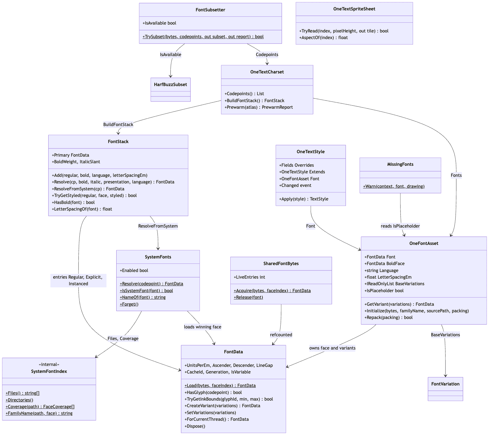
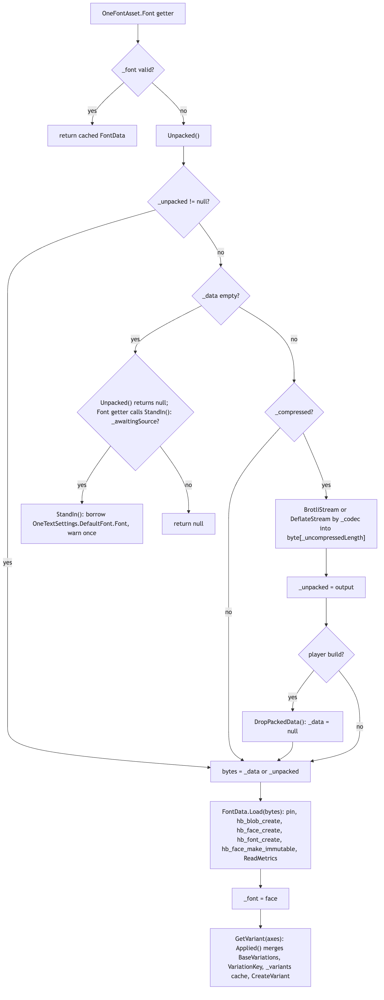
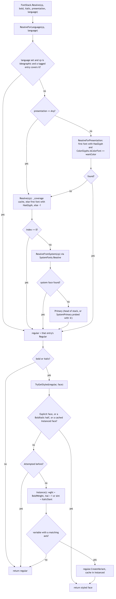
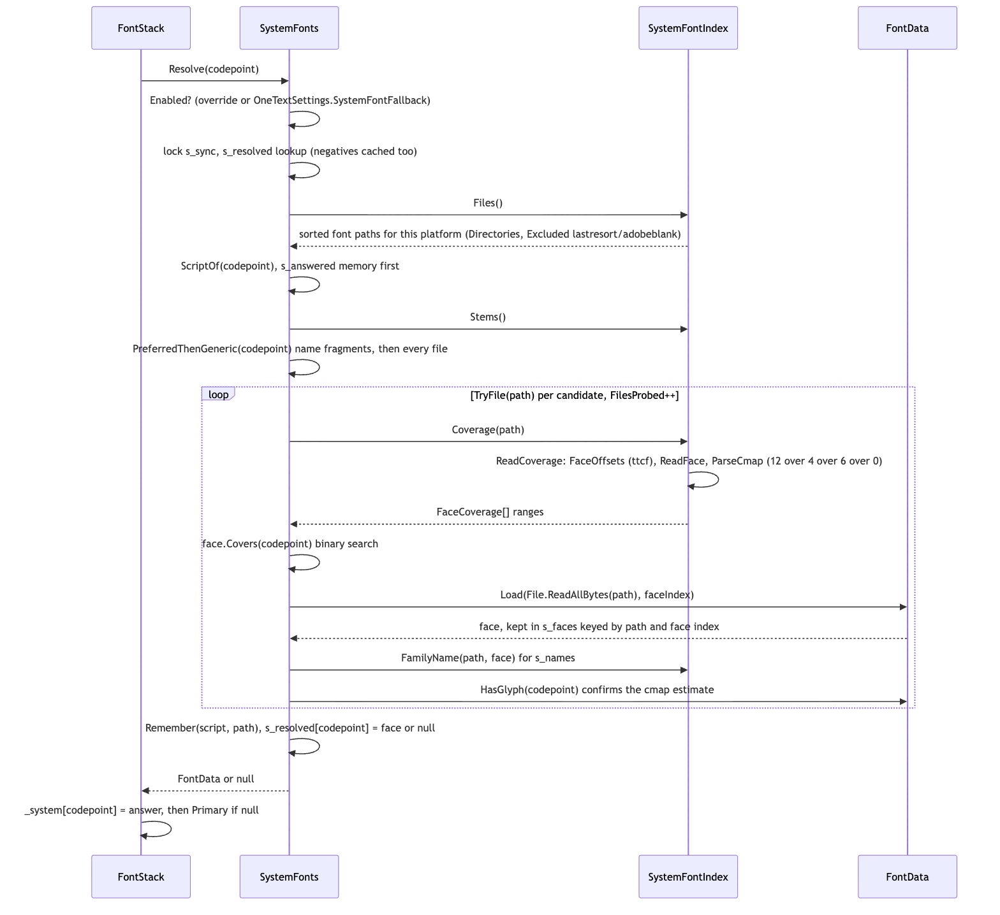
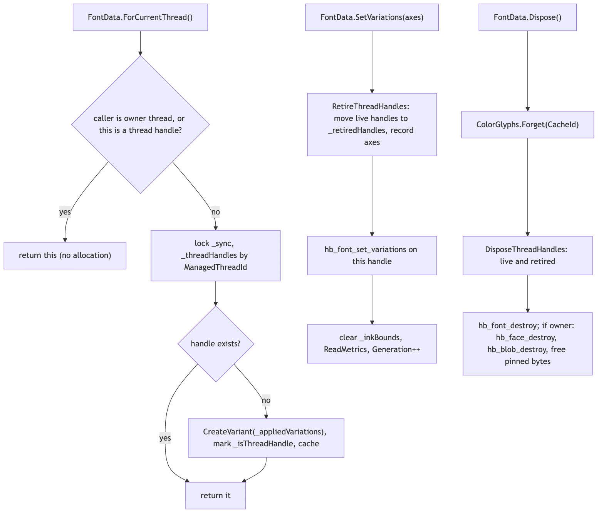

# Runtime/Core/Fonts

This module turns font files into HarfBuzz faces and decides which face draws which character. It owns the font asset (`OneFontAsset`, the `.ttf`/`.otf` stored Brotli-packed inside a ScriptableObject), the loaded face (`FontData`, the native `hb_blob`/`hb_face`/`hb_font` handles plus metrics), the fallback chain (`FontStack`), and the last tier under that chain, the operating system's own fonts (`SystemFonts`, `SystemFontIndex`). Around those sit the charset asset used for prewarming and subsetting (`OneTextCharset`), the style asset (`OneTextStyle`), the inline-sprite sheet (`OneTextSpriteSheet`), the hb-subset binding (`FontSubsetter`), a refcounted face cache for labels fed raw bytes (`SharedFontBytes`), and the once-per-reason missing-font warning (`MissingFonts`). In the pipeline (string -> parse -> analyze -> shape -> layout -> render -> frontend) this module sits between "analyze" and "shape": the layout engine's itemizer asks `FontStack.Resolve` for a `FontData` per grapheme, the shaper calls `hb_shape` on `FontData.Font`, and the atlas keys its tiles by `FontData.CacheId` and `FontData.Generation`.

## Files

| File | Responsibility |
|---|---|
| `FontData.cs` | A loaded face: pins the bytes, creates the HarfBuzz blob/face/font, reads metrics (`UnitsPerEm`, `Ascender`, underline/strikeout positions), answers `HasGlyph`/`NominalGlyph`/`LayoutFeatures`, caches ink bounds, creates variants (`CreateVariant`, `SetVariations`) and per-thread handles (`ForCurrentThread`). |
| `FontStack.cs` | The ordered fallback chain. `Add` families (regular plus explicit bold/italic, language tag, letter-spacing correction), `Resolve` a codepoint by language, presentation and style, instance bold/italic from variable axes (`TryGetStyled`), and fall through to `SystemFonts` then `Primary`. |
| `FontSubsetter.cs` | `TrySubset`: cuts a font file down to a set of codepoints through `hb_subset_*`, keeping GSUB/GPOS correct. Returns a `Report`. |
| `FontVariation.cs` | `FontVariation` (tag + value, serializable) and `FontAxis` (tag, min/default/max, `Clamp`). |
| `HarfBuzzSubset.cs` | `IsAvailable`: probes once whether the loaded HarfBuzz binary exports the subset API. |
| `MissingFonts.cs` | `Warn(context, font, drawing)`: one console warning per distinct missing-font reason, never per component. |
| `OneFontAsset.cs` | The font asset: packed bytes, codec and packing level, `Font`/`GetVariant`, `BaseVariations`, `Bold`/`BoldFace`, `Language`, `LetterSpacingEm`, migration placeholders (`IsPlaceholder`, `OneFontRecovery`, `StandIn`), `Initialize`/`Repack`/`DropPackedData`. |
| `OneTextCharset.cs` | `CodepointRange` and the charset asset: characters, ranges, scanned characters, sizes, fonts, `Codepoints()`, `BuildFontStack()`, `Prewarm()`, `Presets`. |
| `OneTextSpriteSheet.cs` | A list of Unity sprites addressable by index or name; `TryRead` copies a sprite's pixels into a `ColorGlyph` tile for the RGBA atlas. |
| `OneTextStyle.cs` | The style asset: `Fields` override flags, one level of `Extends`, resolved properties, `Apply(TextStyle)`, runtime setters that raise the static `Changed` event. |
| `SharedFontBytes.cs` | One `FontData` per distinct font file content for labels that pass raw bytes: `Acquire`/`Release`, refcounted, FNV-1a keyed, `ConditionalWeakTable` identity shortcut. |
| `SystemFontIndex.cs` | Internal. Lists the platform's font directories, reads each file's `cmap` into coverage ranges without loading the font, reads the `name` table for a family name. |
| `SystemFonts.cs` | The system-font tier: `Enabled`, `Resolve(codepoint)`, per-script preference lists and answer memory, process-wide caches of faces and negative answers, `Forget`. |

## Structure

Source: [diagrams/structure-overview.mmd](diagrams/structure-overview.mmd)

`FontData` is the unit everything else trades in. It is created three ways: `OneFontAsset.Font` (the project's fonts, one parse per asset shared by every label), `SharedFontBytes.Acquire` (labels handed a `byte[]` at runtime, one parse per distinct content), and `SystemFonts.Resolve` (faces read from disk when the project's fonts miss). `FontData.Load(byte[], faceIndex)` is the only constructor path; it pins the array and hands HarfBuzz a read-only blob, so the bytes must outlive the face and must never be written to.

`FontStack` is what the layout engine holds (`TextLayoutSettings.Fonts`). A frontend builds one from assets: `OneTextLabel` does `_fonts.Add(main.GetVariant(axes), main.BoldFace, main.Language, main.LetterSpacingEm)` and then `Add(asset.Font, asset.Language, asset.LetterSpacingEm)` for its own fallbacks and `OneTextSettings.FallbackFonts`. Each `Add` makes an `Entry` with a `Regular` face, up to three `Explicit` faces indexed by `FontStack.Face`, a parallel `Instanced` array for faces built from variable axes, and an `Attempted` array so a failed instancing is not retried. The entry points a caller uses are `Resolve(codepoint, bold, italic, presentation, language)` (the itemizer, `TextLayoutEngine.ResolveFont`), `HasBold(font)` (to decide synthetic bold), `LetterSpacingOf(font)`, `LanguageOf(font)` (diagnostics) and `Primary` (metrics for empty lines, the notdef box).

`SystemFonts` and `SystemFontIndex` are static and process-wide. `OneTextCharset`, `OneTextStyle`, `OneTextSpriteSheet` and `OneFontAsset` are ScriptableObjects authored in the editor (see Related for the creators and inspectors). `FontSubsetter` and `HarfBuzzSubset` are a library-only binding: nothing under `Runtime/` or `Editor/` calls `TrySubset` today; only `Tests/Editor/SubsetTests.cs` does.

## Behaviour

### From asset to face

Source: [diagrams/font-asset-load.mmd](diagrams/font-asset-load.mmd)

1. `OneFontAsset.Font` returns the cached `_font` when it is valid. Otherwise it calls `Unpacked()`.
2. `Unpacked()` returns `_unpacked` if it exists. If `_data` is empty it returns null (with a `LogError` canary when the asset once held a compressed font), and the `Font` getter then answers `StandIn()`, which returns null unless `_awaitingSource` is set (a migration placeholder): that borrows `OneTextSettings.Instance.DefaultFont.Font`, guarded against recursion by `s_standingIn`, and logs one warning per asset. If `_data` is present and `_compressed` is false, `_data` is the font. Otherwise it decompresses through `BrotliStream` or `DeflateStream` depending on `_codec` into a `byte[_uncompressedLength]`, keeps it as `_unpacked`, and in a player build (`#if !UNITY_EDITOR`) calls `DropPackedData()` to null `_data`.
3. `FontData.Load` pins the array (`GCHandle.Alloc(Pinned)`), calls `hb_blob_create` (read-only), `hb_face_create`, `hb_font_create`, reads `UnitsPerEm`, marks the face immutable with `hb_face_make_immutable` (HarfBuzz's rule for cross-thread sharing) and runs `ReadMetrics`: `hb_font_get_h_extents` or a 0.8/0.2 em fallback, then underline/strikeout via `hb_ot_metrics_get_position_with_fallback` with floors (thickness at least `UnitsPerEm / 20`, strikeout offset `Ascender * 0.32` if the face reports zero or below).
4. `OneFontAsset.GetVariant(variations)` merges the asset's `BaseVariations` with the request tag by tag (`Applied`), returns the base face when the merge is empty, otherwise looks up a `VariationKey` string (`tag=value;...`) in `_variants` and calls `FontData.CreateVariant` on a miss. A variant shares the face (`_ownsFace = false`) and gets its own `hb_font`.
5. `Initialize(bytes, familyName, sourcePath, packing)` is the editor-side writer: it records the length and names, clears `_awaitingSource` and `_baseVariations`, packs with `Pack` and keeps the packed copy only if it is smaller, sets `_codec = Codec.Brotli`, and calls `Release()` so the old face and variants go away. `Repack(packing)` re-runs it at the other `FontPacking` level; `InitializePlaceholder` sets up an asset with no bytes and an `OneFontRecovery` record.

Packing is Brotli. `Pack` uses `BrotliEncoder.TryCompress` with quality 10 for `FontPacking.Smallest` and 6 for `FontPacking.Fast` (window 22), falling back to `BrotliStream` Optimal/Fastest where the encoder struct is missing. Import uses `Fast`; `Repack(Smallest)` is the Hub's "Pack smaller" button. The numbers that decided this are in the `Initialize` comment: on Noto Sans CJK KR (15.7 MB) q6 is 0.4 s -> 12.6 MB, q9 3.2 s -> 11.96 MB, q10 17.2 s -> 11.12 MB, q11 35.1 s -> 10.93 MB, so ten is the last quality whose seconds buy something. `Codec.Deflate` exists only so assets packed before Brotli still load; the enum's zero value is Deflate and `FontPacking`'s zero value is `Smallest` for the same reason (old assets deserialize to zero). Brotli is the decided codec: the alternatives were measured and rejected, and the source carries only the decision plus the quality-versus-seconds numbers above (the CHANGELOG's "Importing a font no longer freezes the editor" entry records the same measurements).

### Resolving a character

Source: [diagrams/font-resolve-flow.mmd](diagrams/font-resolve-flow.mmd)

`FontStack.Resolve(cp, bold, italic, presentation, language)` is the hot path the itemizer calls per grapheme start:

1. `ResolveForLanguage`: only when a language is given and the codepoint is in the BMP and `Unicode.AsianTypography.IsIdeographic` says yes. The first entry whose `Language` matches (`LanguageMatches`: equal, or a prefix on a `-` boundary, so "zh" serves "zh-Hans" and "zh-Hant" does not) and whose `Regular.HasGlyph` wins. This is the Han-unification fix; it deliberately does not move Latin or digits into the tagged CJK face.
2. Otherwise, with `Presentation.Any`, `Resolve(cp)`: `_coverage` maps codepoint to the index of the first font whose `HasGlyph` is true, or -1 for "nobody", and both answers are cached. On -1 it calls `ResolveFromSystem(cp)` (cached in `_system`, delegating to `SystemFonts.Resolve`), and failing that returns `Primary` so the caller still draws a notdef box. With `Presentation.Text` or `Emoji` (from U+FE0E/U+FE0F), `ResolveForPresentation` takes the first covering font whose `ColorGlyphs.IsColorFont` matches the request, and falls back to `Resolve(cp)`.
3. If bold or italic was asked, `TryGetStyled(regular, face, out styled)`: the entry's `Explicit` face, else for `BoldItalic` whichever single half exists, else a cached `Instanced` face, else (once, tracked by `Attempted`) `Instance()`, which reads the regular's axes and builds a variant with `wght = BoldWeight` (700), `ital = 1` or `slnt = ItalicSlant` (-10). A static font with no axes returns false and the regular face; the layout engine then decides about synthetic bold via `HasBold`.

`Primary` is the head of the stack, or when the stack is empty, `SystemPrimary`: a system face resolved once for 'A' and remembered, including a null result. `IsSystemOnly` reports the empty-stack-with-system-head case. `Covers(cp)` answers for the project chain alone, never the system tier.

### The system-font tier

Source: [diagrams/system-font-probe.mmd](diagrams/system-font-probe.mmd)

`SystemFonts.Resolve(codepoint)` returns null immediately when `Enabled` is false (an explicit override, else `OneTextSettings.SystemFontFallback`). Under `s_sync` it checks `s_resolved`, which caches negative answers too, then runs `Probe`:

1. `SystemFontIndex.Files()` lists every `.ttf/.otf/.ttc/.otc` under `Directories()` once (macOS, Windows including the per-user folder, Android, iOS/tvOS/visionOS, Linux; Web yields nothing), skipping `lastresort` and `adobeblank`, sorted, with `Stems()` (file names without extension) computed alongside.
2. `ScriptOf(codepoint)` buckets the character (emoji, Korean, kana, Han, Arabic, Hebrew, Thai, Devanagari, Bengali, Tamil, Ethiopic, Cyrillic/Greek, other). Files that already answered for that bucket (`s_answered`, at most `RememberedPerScript` = 8, most recent first) are tried first. Then the `Preferred(codepoint)` file-name fragments for that block followed by the `Generic` list, matched case-insensitively against the stems. Then every remaining file.
3. `TryFile(path, cp)` increments `FilesProbed`, asks `SystemFontIndex.Coverage(path)` (reads the sfnt header, walks `ttcf` collections, picks the best `cmap` subtable by `Score` with format 12 over 4 over 6 over 0, turns it into sorted ranges, never reads format 13), checks `FaceCoverage.Covers` by binary search, and only then `Load`s the file (`File.ReadAllBytes` + `FontData.Load(bytes, faceIndex)`, cached in `s_faces` by path and face index, family name from the `name` table kept in `s_names` by `CacheId`). Because cmap ranges over-estimate, `font.HasGlyph` gives the final answer.
4. The winner is moved to the front of its script's memory by `Remember`, and the answer is stored in `s_resolved`.

`IsSystemFont`, `NameOf`, `NameFor` are what Doctor and the Hub use to say "this character only draws because of the machine". `Forget()` disposes every loaded face and clears all caches; the editor calls it before assembly reload.

### Threads, variants and disposal

Source: [diagrams/thread-handles.mmd](diagrams/thread-handles.mmd)

An `hb_face` is immutable and shared; an `hb_font` carries variation coordinates and a shaping cache and is not safe to share between threads. `ForCurrentThread()` returns the font itself on the thread that loaded it, otherwise a per-thread variant keyed by `ManagedThreadId`, created under `_sync` (not `GetOrAdd`, whose factory can run twice and leak an `hb_font`). `SetVariations` first `RetireThreadHandles` (moves them to `_retiredHandles` instead of destroying them, because a worker may be inside `hb_shape`), applies `hb_font_set_variations`, clears `_inkBounds`, re-reads metrics and bumps `Generation`. `Dispose` forgets the font in `ColorGlyphs`, disposes live and retired handles, destroys the `hb_font`, and only the owning instance destroys the face, the blob and the pin. No runtime code calls `ForCurrentThread` yet; `OutlineExtractor` documents it as the contract for multi-threaded extraction and `ThreadSafetyTests` exercises it.

`TryGetInkBounds(glyphId, out min, out max)` asks `hb_font_get_glyph_extents` (falling back to `OutlineExtractor.Extract` into a `[ThreadStatic]` scratch `GlyphOutline`), measured outside the lock, cached per glyph in `_inkBounds`. Results are in font units.

### Shared bytes, charsets, subsetting, styles, sprites, warnings

`SharedFontBytes.Acquire(bytes, faceIndex)` keys by an FNV-1a hash of the whole array xor'd with the face index, remembered per array instance in a `ConditionalWeakTable` so identity hits never rehash. Each acquire bumps `Refs`; `Release` disposes at zero and ignores faces it never issued. A dead entry (face invalid after a play-session boundary with Domain Reload off) is dropped and reloaded.

`OneTextCharset.Codepoints()` deduplicates `_characters`, then `_scannedCharacters`, then `_ranges` (skipping controls, whitespace and surrogate codepoints; surrogate pairs are combined). `Prewarm(atlas)` builds a `FontStack` from the charset's own `_fonts` or, if empty, `OneTextSettings.DefaultFont` plus `FallbackFonts`, refuses when `stack.Count == 0` (an empty stack would prewarm a system face), and calls `AtlasPrewarm.Warm(atlas, stack, codepoints, _sizes, _fillLimit)`.

`FontSubsetter.TrySubset(bytes, codepoints, out subset, out report)` creates a blob/face, an `hb_subset_input`, adds every non-negative codepoint to its unicode set, sets `NoHinting`, clears `GlyphNames` and `RetainGids`, calls `hb_subset_or_fail`, copies the result blob out, and destroys everything in `finally`. It refuses empty bytes, an empty codepoint set, and a HarfBuzz without subsetting (`HarfBuzzSubset.IsAvailable`, which tries `hb_subset_input_create_or_fail` once and catches `EntryPointNotFoundException`/`DllNotFoundException`). The `OneTextCharset` overload feeds `Codepoints()`.

`OneTextStyle.Resolved(field)` returns this style if `_overrides` has the flag, else `_extends` if it has the flag, else null; every property reads through it, so inheritance is exactly one level. `Apply(TextStyle)` fills size, colour and letter spacing only where the incoming style has none, and ORs in `Bold`/`Italic`. `SetColor`/`SetFontSize`/`SetFont`/`SetLetterSpacing`/`SetDecoration`/`ClearOverride` set the override flag and raise `Changed`. `Decoration` assembles a `TextDecoration` from the outline/shadow/glow parts that are set and returns it `Clamped()`.

`OneTextSpriteSheet.TryRead(index, pixelHeight, out tile)` rejects unreadable textures with one `LogError` per sprite instance, then `GetPixels` on the sprite rect, point-samples to a tile of height clamped to 1..512 and proportional width, and returns a `ColorGlyph` with `OriginUnits = zero`, `UnitsPerPixel = 1`. `AspectOf` feeds layout before anything is drawn.

`MissingFonts.Warn(context, font, drawing)` builds a reason string (`Reason`: no font assigned and no settings / no default / default has no file; placeholder awaiting a named file; asset has no file) and logs once per reason + drawing/blank combination (`s_said`). `Forget()` clears it for tests.

## Invariants and conventions

- **Threading.** `OneFontAsset`, `FontStack`, `SharedFontBytes`, `OneTextCharset`, `OneTextStyle`, `OneTextSpriteSheet` are main-thread, like the label lifecycle. `SystemFonts` locks `s_sync` around every cache. `FontData` locks `_sync` only around `_inkBounds` and the thread-handle table; the face is immutable (`hb_face_make_immutable`), the `hb_font` is per thread. A thread that shapes must use `ForCurrentThread()`.
- **Ownership.** `OneFontAsset` owns `_font` and `_variants`; never dispose `OneFontAsset.Font`. `SystemFonts` owns its faces; never dispose what `SystemFonts.Resolve` returns. `FontStack(ownsFonts)` disposes entry faces only when true, but always disposes the faces it instanced. `SharedFontBytes` disposes at refcount zero. A variant or thread handle borrows its parent's face: dispose the stack before the fonts it holds, and the variant before the font it came from.
- **Pinned bytes.** `FontData.Load` pins the array for the life of the face. The array handed in must not be mutated (`OneFontAsset.GetFontBytes` returns a clone for that reason) and must not be reused.
- **Caches and invalidation.** `FontStack._coverage`, `_system` and the `SystemPrimary` memo are cleared by `Add` and `Clear`; `Instanced`/`Attempted` per entry by `Clear` and `DropStyledInstances(regular)`. `OneFontAsset.Release()` (from `OnDisable`, `Initialize`, `InitializePlaceholder`, `SetBaseVariations`) disposes face and variants and drops `_unpacked` unless it is the only copy of the font (`_compressed && _data == null`). `FontData.SetVariations` clears `_inkBounds` and bumps `Generation`; the atlas keys tiles by `CacheId` + `Generation`. `SystemFonts.Forget()` clears everything and is wired to `AssemblyReloadEvents.beforeAssemblyReload` in the editor. `ColorGlyphs.Forget(CacheId)` runs in `FontData.Dispose` so a recycled native address cannot revive a stale answer.
- **Ordering.** `Add` order is fallback priority. A language tag beats position only for ideographic characters. Explicit faces beat instanced ones. `Add` of a font after the system tier answered clears `_system`, so the project's font wins. `BoldWeight` and `ItalicSlant` are read once per family, on first instancing; set them before the first draw.
- **Units.** `FontData` metrics and ink bounds are design units (`UnitsPerEm` per em). `LetterSpacingEm` (asset, stack, style) is ems. `BoldWeight` is in the `wght` axis's units, `ItalicSlant` in degrees. `OneTextCharset.Sizes` are em sizes (atlas density buckets). Sprite tiles use `UnitsPerPixel = 1`.
- **Allocation.** The steady state of `Resolve` is dictionary lookups. `Instance` allocates once per family per style. `ForCurrentThread` on the owning thread allocates nothing. `OneFontAsset.GetVariant` with non-empty axes allocates the merged array and key string on every call, so it belongs in a rebuild, not a frame. `SystemFonts` allocates only on the first miss of a character; a second occurrence is a lookup.
- **Serialized defaults.** `_codec` defaults to `Codec.Deflate` and `_packing` to `FontPacking.Smallest` (both zero) because assets written before those fields existed were deflate-packed and packed hard; do not reorder either enum.

## Extending

- **A new script in the system tier.** Add the range to `SystemFonts.Preferred` (file-name fragments in the order a native reader wants) and to `SystemFonts.ScriptOf` (the memory bucket); keep the two range lists identical. Cover it in `Tests/Editor/SystemFontTests.cs` (`A_Character_The_Chain_Misses_Comes_Back_From_The_System`) and `Tests/Editor/SystemFontMemoryTests.cs`.
- **A new platform font directory.** `SystemFontIndex.Directories()` under the matching `#if`, and `Docs/NATIVES.md` if the platform's fallback story changes. `SystemFontTests.The_Platform_Has_Somewhere_To_Look` checks the listing.
- **A new cmap or name-table case.** `SystemFontIndex.Score` / `ParseCmap` / `ParseFormatN`; `ReadFamilyName` for naming. Remember format 13 is excluded on purpose.
- **A new style field.** Add a `Fields` flag, a serialized field, a property through `Resolved`, a branch in `Apply` if markup can also set it, a setter that ORs the flag and calls `NotifyChanged`, and the inspector in `Editor/`. `Tests/Editor/StyleTests.cs` and `Tests/Editor/DecorationTests.cs` cover the existing ones.
- **A new face slot on the asset** (the way `Bold` was added): a serialized `OneFontAsset` field plus a `BoldFace`-style accessor on `OneFontAsset`, a `FontStack.Add` overload carrying it into `Entry.Explicit`, and the callers that build stacks (`Runtime/UGUI/OneTextLabel.cs`, `Runtime/Mesh/OneTextMesh.cs`). `Tests/Editor/FontAssetTests.cs` and `Tests/Editor/StyleTests.cs`.
- **A new codec or packing level.** `OneFontAsset.Codec`/`FontPacking` (append, never reorder), `Unpacked()` and `Pack()`. Brotli is the decided codec; measure before proposing another. `FontAssetTests.Font_File_Round_Trips_Through_Compression` and the `Dropped_Asset` tests cover load/drop/repack.
- **A charset preset.** `OneTextCharset.Presets`. `Tests/Editor/AtlasTests.cs` uses the charset; `Tests/Editor/SubsetTests.cs` (`CharsetOverload_UsesTheSameAssetPrewarmDoes`) too.
- **An editor action for subsetting.** `FontSubsetter.TrySubset` is complete and tested (`Tests/Editor/SubsetTests.cs`, including Latin ligatures, Arabic joining, Hangul and variable axes surviving the renumbering); there is no importer or Hub button yet. `Tests/Editor/NativesTests.cs` asserts `HarfBuzzSubset.IsAvailable` on the host binary (other platforms are checked at vendor time, see `Docs/NATIVES.md`).
- **Tests that exercise this module.** `FontAssetTests`, `FontShareTests` (`SharedFontBytes`), `SystemFontTests`, `SystemFontMemoryTests`, `MissingFontTests` (empty stacks, `MissingFonts`, placeholders), `SubsetTests`, `ThreadSafetyTests` (thread handles, concurrent variations, ink bounds), `InkBoundsTests`, `StyleTests`, `ColorGlyphTests` (`OneTextSpriteSheet`, presentation), `AsianTypographyTests` (language-tagged stacks), `VariableSweepTests` (`FontVariation`), `FontRecoveryTests` (placeholders and `BaseVariations` from the migration), `HubTests`, `DomainReloadTests`, `AllocationTests`.

## Gotchas

1. **An empty `FontStack` is not a null `Primary`.** With the system tier on, `Primary` is a system face resolved for 'A', and `Resolve` still routes every character through `ResolveFromSystem`. Code that used an early return on `Count == 0` is why labels with no font once drew nothing on a machine full of fonts (`FontStack.Resolve` comment). Prewarm checks `Count`, not `Primary`, for the opposite reason.
2. **Never dispose `OneFontAsset.Font`, a `SystemFonts` face, or a font the stack instanced.** Dispose a `FontStack` before the fonts it holds; instanced faces borrow the parent face (`FontStack` class comment). `SystemFonts.Forget()` makes every layout result holding a system face stale.
3. **`GetFontBytes()` is a full unpack plus a clone.** Noto Sans CJK KR is 93 ms and 15.7 MB per call on the author's machine (`OneFontAsset.GetFontBytes` comment). Do not call it per label.
4. **The packed copy is dropped only in a player.** In the editor the object is the asset on disk and `DropPackedData` would be saved as an empty asset; `Repack` and `StoredSize` also need the packed bytes. In a player `Release` keeps `_unpacked` when it is the last copy; the `LogError` in `Unpacked()` is a canary for a path that lost both.
5. **`Bold` on a variable font is ignored.** `BoldFace` returns null when the regular `IsVariable`, because an explicit face beats an instanced one in the stack and the interpolated bold is the better answer. It also returns null when the bold is the same file as the regular.
6. **Language tags only move ideographs.** A font tagged "ja" does not take a Japanese label's Latin text (`ResolveForLanguage`). Matching is prefix-on-a-hyphen, not BCP 47 negotiation.
7. **`BoldWeight`/`ItalicSlant` are one-shot per family**; instanced faces are cached, and their glyphs are already in the atlas under that face's identity. `DropStyledInstances(regular)` exists for a caller that moved the regular's axes underneath the stack.
8. **`SetVariations` on a shared face changes it for everyone.** `SharedFontBytes` never hands out variated faces; labels keep those private. Retired thread handles are not destroyed until the font is, by design (a worker may be inside `hb_shape`).
9. **`hb_font` is not thread-safe; `ForCurrentThread()` is the contract.** Thread ids are recycled by the pool; a design that spawns a fresh thread per job grows the handle table without bound. Tiles baked from a worker thread do not share atlas entries with the main thread (different handle, different `CacheId`).
10. **Apple Color Emoji does not draw through the system tier**: its payload is sbix, which `ColorGlyphs` does not read. Bundle a colour emoji font (`SystemFonts` class comment). Web has no font directory, so the tier finds nothing there.
11. **`SystemFontIndex` coverage over-estimates on purpose** and skips cmap format 13 (macOS `LastResort.otf` would answer for all of Unicode with boxes); `lastresort` and `adobeblank` are excluded by file name too.
12. **Negative answers are cached process-wide** in `SystemFonts.s_resolved` and in `FontStack._system`. Adding a font to a stack clears the stack's copy, not `SystemFonts`'.
13. **Style inheritance is one level.** `OnValidate` warns and the third style is ignored; `Resolved` never walks further.
14. **Inline sprites need readable textures.** `TryRead` logs once per sprite and returns false; the fix is Read/Write Enabled on the importer.
15. **Subsetting cuts against unpredicted text.** A subset face cannot draw a chat message nobody enumerated; it is opt-in and library-only (`FontSubsetter` class comment).
16. **Legacy enum zeros.** `Codec.Deflate` and `FontPacking.Smallest` are zero because old assets deserialize to zero; old assets were packed at Brotli q11 (smaller than today's q10 `Smallest`) and `Repack` declines to redo a font already at the requested level.
17. **`OneFontAsset.Changed` is editor-only**; `OneTextStyle.Changed` fires in both editor and player, because a style is a theming API and a font asset is authored data.
18. **`MissingFonts` warns once per reason and `OneFontAsset.StandIn` once per asset** (`_warned`), never per component; tests call `MissingFonts.Forget()` to reset.
19. **With Domain Reload off**, statics survive a play-session boundary while native handles do not; `SharedFontBytes.Acquire` checks `IsValid` and reloads a dead entry rather than handing it out.
20. **Metric floors.** A face that reports zero underline or strikeout thickness gets `UnitsPerEm / 20`, and a strikeout offset at or below the baseline becomes `Ascender * 0.32` (`FontData.ReadMetrics`).

## Related

- `../Shaping/README.md` — `Shaper` calls `hb_shape` on `FontData.Font`.
- `../Layout/README.md` — `TextLayoutEngine.ResolveFont` and `NeedsSyntheticBold` consume `FontStack`.
- `../Rendering/README.md` — `GlyphAtlas` keys by `CacheId`/`Generation`; `ColorGlyphs` (colour detection, `IsColorFont`); `AtlasPrewarm`, `CharsetRecorder`, `OutlineExtractor`.
- `../Unicode/README.md` — `AsianTypography.IsIdeographic`, used by the language rule.
- `../Native/README.md` — `HarfBuzzApi` bindings, including `hb_subset_*` and `hb_ot_var_*`.
- `../../../Editor/README.md` — `OneFontAssetCreator` (Assets > OneText > Create Font Asset, calls `Initialize`), `OneFontAssetEditor`, `OneTextCharsetEditor` and `CharsetRecorderMenu`, `FontLanguages`; `Editor/Hub/HubFontsTab.cs` (Repack), `Editor/Hub/TextDoctor.cs` (system-font warnings), `Editor/Onboarding/FontRecovery.cs` (placeholders, `BaseVariations`).
- `../../../../Docs/NATIVES.md` — which binaries export `hb_subset_*`, and why Web has no system fonts.
- `../../../../Docs/ARCHITECTURE.md` — assembly layout and the "fallback configured once" goal.
- `../../../../CHANGELOG.md` — the Brotli quality measurements and the import/repack split.
