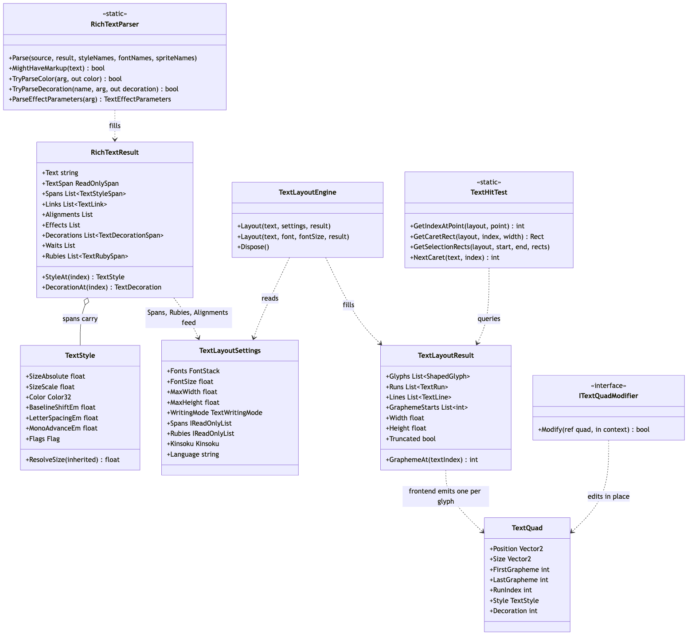
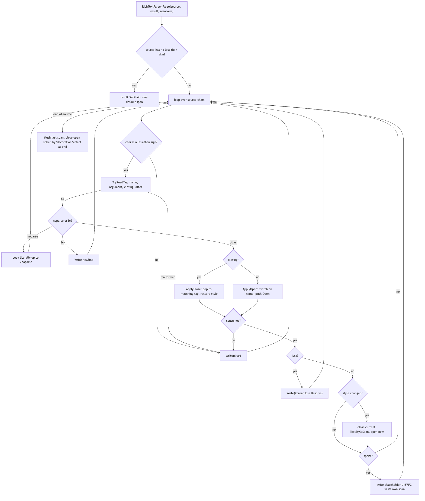
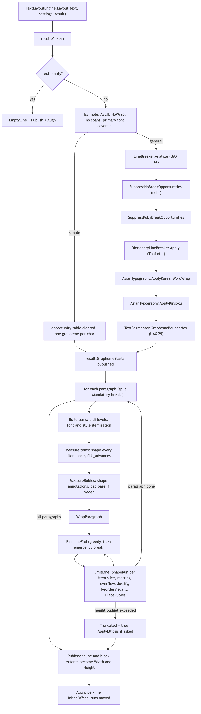
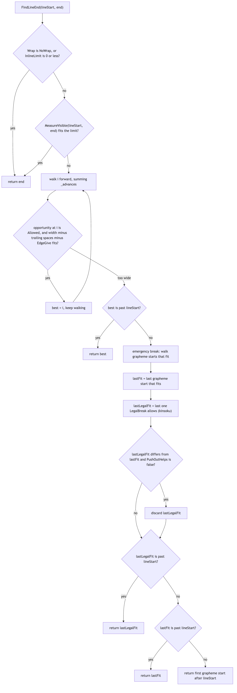
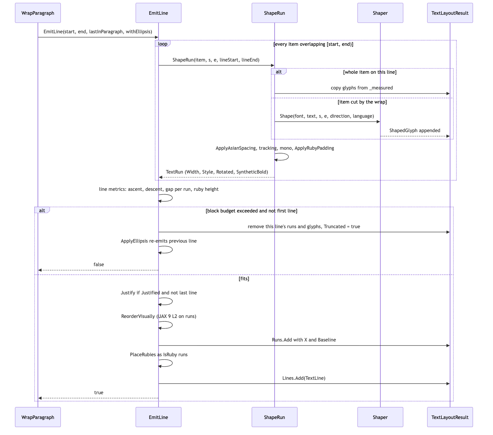

# Runtime/Core/Layout

This folder is stages 1 and 4 of the pipeline (string -> **parse** -> analyze -> shape -> **layout** -> render -> frontend), plus the value types that carry layout output to whoever renders or edits it. `RichTextParser` turns a marked-up string into plain display text and side tables (style spans, links, alignments, rubies, decorations, effects, waits). `TextLayoutEngine` takes that display text and a `TextLayoutSettings`, calls into `Runtime/Core/Unicode` for line-break, grapheme and bidi analysis and into `Runtime/Core/Shaping` for glyphs, and fills a `TextLayoutResult`: positioned `TextRun`s grouped into `TextLine`s, each pointing into one flat `ShapedGlyph` list.

Nothing here knows about a UI framework. `TextHitTest` answers caret and selection geometry over a result; `TextQuad` and `ITextQuadModifier` are the seam between a result and the mesh a frontend builds. Auto-size lives in the uGUI frontend (`OneTextLabel`), not here: the engine only lays out at the size it is given.

## Files

| File | Responsibility |
|---|---|
| `RichTextParser.cs` | `RichTextResult` (display text buffer + every side table markup produces) and the static `RichTextParser` that fills it: tag reader, per-tag `ApplyOpen`/`ApplyClose`, colour/size/em/alpha/alignment/decoration/effect argument parsers. |
| `EscapeParser.cs` | `EscapeParser.Unescape`: backslash escapes (`\n \t \v \r \\ \uXXXX \UXXXXXXXX`) into characters, leaving anything unrecognized verbatim. Runs before the rich-text parse. |
| `TextStyle.cs` | `TextStyle` (the value a style span carries: size, colour, mark, baseline shift, letter spacing, mono advance, alpha, named style, font override, flags, sprite) and `TextStyleSpan`. |
| `TextDecoration.cs` | `TextDecoration` (outline / shadow / glow / face-dilate parameters, all in "reaches"), its `Over`/`Clamped`/`WithSyntheticBold` and the byte-packing helpers the vertex channels use; `TextDecorationSpan`. |
| `TextLink.cs` | `TextLink`: a `<link=id>` range in display-text indices. |
| `TextRuby.cs` | `TextRubySpan` (annotation string + base range) and `RubyPlacement`, the pure arithmetic of simple ruby placement (scale, distribution, overhang, neighbour blank). |
| `TextLayoutTypes.cs` | Enums (`TextAlignment`, `VerticalAlignment`, `TextWritingMode`, `TextWrap`, `TextOverflow`), the input `TextLayoutSettings`, and the output `TextRun`, `TextLine`, `TextLayoutResult`. |
| `TextLayoutEngine.cs` | The engine: break analysis and tailorings, itemization, measuring, greedy wrapping with emergency break and push-out, line emission, overflow/ellipsis, justification, bidi reordering, ruby measuring and placement, East Asian spacing, vertical writing orientation, alignment. |
| `TextHitTest.cs` | Geometry over a finished `TextLayoutResult`: point -> index, index -> caret rect, selection rects, vertical caret movement, grapheme/word caret stepping. |
| `TextQuad.cs` | `TextQuad` (one drawn tile after atlas lookup), `ITextQuadModifier` and `TextQuadContext`: the post-layout hook animation and reveal use. |

## Structure

Source: [diagrams/layout-structure.mmd](diagrams/layout-structure.mmd)

There are two entry points and they are deliberately separate. `RichTextParser.Parse(source, result, styleNames, fontNames, spriteNames)` is static and runs once per text change. It writes the display text into `RichTextResult.Buffer` (read back as `TextSpan` without allocating, or as `Text` which builds a string lazily once) and fills the side tables.

The three resolver delegates map `<style=name>`, `<font=name>` and `<sprite=name>` to indices; pass null and `<style>`/`` stay literal in the text (a numeric `<sprite=N>` still works without a resolver). `RichTextParser.MightHaveMarkup` is the cheap pre-check; `RichTextResult.SetPlain` is what a caller uses when it already knows there is no markup.

`TextLayoutEngine` is an instance (it owns a `Shaper`, which owns native HarfBuzz buffers, hence `IDisposable`) and is reused across layouts. `Layout(ReadOnlySpan<char> text, in TextLayoutSettings settings, TextLayoutResult result)` is the real entry; the `string` overload and the `(text, FontData, fontSize, result)` convenience wrap it.

The caller fills `TextLayoutSettings` from its own state and from the `RichTextResult`: `Spans`, `Alignments` and `Rubies` are copied across as `IReadOnlyList` references, `ResolveFontOverride`/`ResolveNamedStyle`/`ResolveSpriteAspect` are how markup indices become fonts, styles and sprite widths (only the frontend knows), and `Language`, `Kinsoku`, `KoreanWordWrap`, `CjkLatinSpacing`, `PunctuationCompression`, `WritingMode` choose the tailorings.

The output is `TextLayoutResult`, which the caller owns and the engine `Clear()`s and refills.

**What goes to rendering:** `Glyphs` (flat `ShapedGlyph` list, metrics in font design units), `Runs` (each a `TextRun` with `Font`, `GlyphStart/GlyphCount`, `TextStart/TextLength`, `X`, `Baseline`, `Width`, `Level`, `FontSize`, `Style`, `BaselineShift`, `SyntheticBold`, `IsRuby`, `Rotated`), `Lines` (each a `TextLine` with its run range in visual order, text range, `Width`, `Baseline`, `Ascent/Descent/Height`, `InlineOffset`, `ParagraphLevel`, `IsParagraphEnd`), `Width`/`Height` in render units, `WritingMode`, `FontSize`, `Truncated`, and `GraphemeStarts`.

A frontend walks runs, scales each glyph by `run.FontSize / run.Font.UnitsPerEm`, looks it up in an atlas and emits a `TextQuad`; `ITextQuadModifier.Modify` is then called per quad in draw order so reveal and effects can move or drop tiles without re-laying out.

## Behaviour

### Parsing

Source: [diagrams/rich-text-parse.mmd](diagrams/rich-text-parse.mmd)

`Parse` walks the source once. A character that is not `<` is written to the buffer. At `<`, `TryReadTag` reads `</`?, a name of letters/digits/`-`/`_`, then either ` attr list>` (used by effect and decoration tags), `=arg>` (quoted or unquoted, newline-terminated), or `>`; anything else returns false and the `<` is written as text. The name is matched case-insensitively against `KnownNames` (and `BuiltInEffects.CanonicalName` for registered effects) so the switch compares interned strings.

`<noparse>...</noparse>` and ` ` are handled in the loop itself because they write text rather than change style. Everything else goes to `ApplyOpen` (push an `Open` record, mutate the pending `TextStyle`, or record a side-table entry) or `ApplyClose` (find the matching name anywhere in the stack, report the ranges of everything popped above it, restore `Open.Previous`).

If the tag was consumed and the resulting style differs from the current span's, the current `TextStyleSpan` is closed and a new one opened; a `<sprite>` writes one `U+FFFC` placeholder in a one-character span with `Flag.Sprite`. `<josa=...>` writes `Unicode.KoreanJosa.Resolve(result.TextSpan, josa)` straight into the text. At end of source the last span is flushed and anything still open (link, ruby, decoration, effect) is closed at the text's end.

The rules that decide every ambiguous case: a tag that is not well formed stays in the text verbatim; tags that take no argument (`b i u s nobr sup sub`) are malformed if given one; an unknown close tag is literal; `</>` closes whatever is on top; unterminated tags run to the end.

Size accepts `N`, `N%` (relative to the inherited scale) and `+N`/`-N` (only against an absolute base). `<alpha>` accepts only `#XX`. `<cspace=0>` is a real request (it sets `HasLetterSpacing`); `<mspace=0>` is refused. `<ruby>` inside `<ruby>` is refused. `<wait=s>` records a point, never stacks.

Alignment, effects, decorations, links, waits and rubies are kept out of `TextStyle` on purpose: they do not change shaping, so they must not split runs.

### Layout

Source: [diagrams/layout-pipeline.mmd](diagrams/layout-pipeline.mmd)

1. **Setup.** `result.Clear()`; bail if there is no primary font or `FontSize <= 0`. Empty text still gets one `EmptyLine` so a caret has somewhere to be. `EnsureCapacity` grows the per-character scratch arrays (`_opportunities`, `_advances`, `_startGive`, `_endGive`, `_graphemeStart`).
2. **Fast path decision.** `IsSimple` is true only for printable ASCII, `TextWrap.NoWrap`, horizontal, no spans, no rubies, base direction not explicitly RTL, and every character covered by `Fonts.Primary`. Then break analysis, dictionary segmentation, kinsoku, grapheme segmentation and bidi are all skipped because their answer is forced.
3. **Break analysis (general path).** `LineBreaker.Analyze` fills `_opportunities` (UAX #14: `None`/`Allowed`/`Mandatory` per position). Tailorings then edit that table in this order: `SuppressNoBreakOpportunities` (`<nobr>` spans), `SuppressRubyBreakOpportunities` (a base and its ruby are unbreakable), `DictionaryLineBreaker.Apply` (Thai and the other scripts UAX #14 defers to dictionaries), `AsianTypography.ApplyKoreanWordWrap` (if `settings.KoreanWordWrap`), `AsianTypography.ApplyKinsoku` (per `settings.Kinsoku`). Mandatory breaks survive every tailoring.
4. **Graphemes.** `TextSegmenter.GraphemeBoundaries` fills `_graphemes`/`_graphemeStart`; `result.GraphemeStarts` is published from it (plus a terminator at `text.Length`).
5. **Per paragraph.** Paragraphs split at `Mandatory` opportunities; the newline characters themselves (`IsMandatoryBreakChar`: BK/CR/LF/NL) are trimmed off `contentEnd` and never rendered.
   - `BuildItems` resolves bidi levels (`BidiRuns.GetLogicalRuns`; vertical mode forces one level-0 run) and then walks each bidi run per grapheme start, resolving style (`ResolveStyle`, a forward cursor over `settings.Spans` with `ResolveNamedStyle` folded in), size (`TextStyle.ResolveSize`), font (`ResolveFont`: `` override first, else `FontStack.Resolve(cp, bold, italic, presentation, language)`, with `PresentationAt` reading a following U+FE0E/U+FE0F) and, vertically, orientation (`IsRotated`, UAX #50 plus a font probe for the `Tr` class). A new `Item` starts when font, style, size, orientation changes or either side is a sprite. Each `Item` also carries `LetterSpacingEm` resolved once by `ResolveLetterSpacing` (style flag > label flag > `FontStack.LetterSpacingOf(font)`).
   - `MeasureItems` shapes every item once (`Shaper.Shape` with `DirectionOf`: RTL/LTR horizontally, `TopToBottom` for upright vertical items) into `_measured`, and accumulates `_advances[cluster]` in render units including tracking plus either the mono cell or `AsianSpacingFor` (a mono item gets no Asian spacing). Sprites are not shaped; they get `SpriteAdvance`. With `PunctuationCompression` on, `_startGive`/`_endGive` record what each compressible mark would give back at a line edge.
   - `MeasureRubies` shapes every `TextRubySpan` overlapping the paragraph at `RubyPlacement.ResolveScale(settings.RubyScale)` times the base's size, via `ShapeRuby`/`AddRubySegment` (split per fallback font). If the annotation is wider than its base, `RubyPlacement.Overhang` takes what the neighbours' blank (`AsianTypography.RubyOverhangBefore/After`, `RubyPlacement.BlankOf`) allows and the rest becomes `PadLeft/PadRight`, added to `_advances` so the wrapper sees it.
   - `WrapParagraph` loops `FindLineEnd` -> `EmitLine` until the paragraph is consumed or `EmitLine` returns false (block budget exhausted).
6. **Publish and align.** `Publish` maps the inline/block extents to `result.Width/Height` (swapped for vertical). `Align` computes each line's `InlineOffset` from `AlignmentFor(settings, line.TextStart)` (`settings.Alignment` overridden by the `<align>` table; a negative entry means `</align>`, back to the label's own) and shifts the line's runs by it. A `Justified` line already fills the box, so `Align` offsets only the last line of an RTL paragraph (to its start edge); an LTR last line stays at 0.

### Line breaking

Source: [diagrams/line-break-decision.mmd](diagrams/line-break-decision.mmd)

`FindLineEnd` is greedy. The inline limit is `InlineLimit(settings)`: `MaxWidth` horizontally, `MaxHeight` vertically. If the remainder fits (`MeasureVisible`, which subtracts trailing whitespace and `EdgeGive`), the line ends at the paragraph end. Otherwise it walks forward accumulating `_advances` and remembers the last `Allowed` opportunity at which the visible width still fits.

If none fits, the emergency break walks grapheme starts instead and picks the last that fits; with kinsoku on, `LegalBreak` marks which of those are legal, and the legal one is preferred (push-out, 追い出し) **only if `PushOutHelps`**, i.e. the line that would start there can itself end legally inside the box or finish the text. That guard is what keeps a run of `！！！！` wider than the box from collapsing the layout. Failing everything, the line takes the first grapheme after `lineStart`, never zero length.

### Emitting a line

Source: [diagrams/emit-line-sequence.mmd](diagrams/emit-line-sequence.mmd)

`EmitLine(start, end, lastInParagraph, withEllipsis, paragraphLevel, ref cursorY)`:

- For each `Item` overlapping `[start, end)`, `ShapeRun` produces a `TextRun`. If the line took the whole item (`start == item.Start && end == item.End`) the glyphs are copied from `_measured`; a wrapped item is re-shaped for just its slice, because a slice of a shaped result is not the same as shaping the slice. Then, in this order and written into the glyphs' own advances: `ApplyAsianSpacing` (CJK-Latin quarter-em gap via `AsianTypography.WantsLatinGap`; adjacency compression via `CompressionFor`; line-edge compression via `LineEdgeCompressionFor`, which moves an opening bracket's `XOffset` too; skipped entirely for a mono item), tracking (`TrackingFor`, skipping zero-advance marks) and mono cells (`MonoFor`, centring the glyph in its cell), then `ApplyRubyPadding`. A sprite item emits one synthetic glyph (id 0) with the sprite's advance in font units. `SyntheticBold` is recorded per run via `NeedsSyntheticBold` (`Style.Bold`, no `` override, `!FontStack.HasBold(font)`).
- Line metrics: per run, `ascent`/`descent` from `Font.Ascender/Descender` scaled by the run's own `FontSize` plus `BaselineShift`; `gap` from `LineGap`. A sprite rises a full em. Vertically, an upright run contributes half its em each way and a rotated run half its line box. Rubies overlapping the line raise `ascent` to `BaseAscentOf(ruby) + ruby.Ascent + ruby.Descent`. `height = (ascent + descent + gap) * LineSpacing`.
- Overflow: if `settings.Overflow != TextOverflow.Overflow`, `BlockLimit(settings) > 0`, at least one line already exists and `cursorY + height` exceeds the budget, the line's runs and glyphs are removed, `result.Truncated = true`, and for `TextOverflow.Ellipsis` `ApplyEllipsis` removes the previous line, shortens its text range by whole graphemes until `MeasureVisible + ellipsisWidth` fits, and re-emits it with `withEllipsis` (which appends `ShapeEllipsis`, a run with `TextLength = 0`). The first line is never dropped.
- `Justify` runs when `AlignmentFor` says `Justified`, the line is not the paragraph's last and it is narrower than the limit: slack is split evenly over `IsExpandableSpace` clusters and written into those glyphs' `XAdvance`.
- `ReorderVisually` applies UAX #9 L2 at run granularity (reverse runs from the highest level down to the lowest odd level). Runs are then placed left to right with `X` and a shared `Baseline = cursorY + (height - (ascent + descent)) / 2 + ascent`.
- `PlaceRubies` adds one `IsRuby` run per ruby segment: `BaseExtent` finds the base's placed edges, `RubyPlacement.Distribute` spreads slack for ideographic readings (`IsDistributable`) or centres otherwise, wide rubies start at `x0 - OverhangLeft` (clamped to 0 at a line start), the baseline is `baseline - BaseAscentOf(ruby) - ruby.Descent`, and each ruby glyph's `Cluster` is mapped onto a base grapheme by `BaseClusterFor` so reveal and effects follow the base.
- `Lines.Add(TextLine)`; `cursorY += height`.

### Vertical writing

`TextWritingMode.VerticalRightToLeft` is the same engine with the axes renamed. `TextRun.X` is the distance down the column from its top, `Baseline` is the column's centre line measured leftward from the block's right edge, and `TextLayoutResult.Width/Height` are swapped by `Publish`.

Upright items (Han, kana, Hangul, and anything `VerticalOrientationLookup.Resolve` says is upright) are shaped `TopToBottom` so `vert` forms and `vmtx` advances apply; rotated items (Latin etc.) are shaped horizontally and only drawn turned, and `TextRun.CrossAxisBaselineOffset` says how far their horizontal baseline sits from the column centre.

Bidi is not resolved in vertical mode (one level-0 run). Spaces never start a new item for orientation. `HasVerticalForm` probes the font by shaping a codepoint both ways and caches per `(font.CacheId, codepoint)` in `_verticalForms`. Ruby in a column is upright beside the base, or rotated when the whole reading is `Rotated` under UAX #50 (`IsRotatedRuby`).

### Hit testing

`TextHitTest` works in layout space (x from the block's left edge, y downward from its top). `GetLineAt` uses `Baseline - Ascent` and `Height`; `GetIndexAtPoint` ignores `IsRuby` runs, clamps to the first/last run's logical edge with `EdgeIndex`, and inside a run walks glyph advances with `IndexInRun` (second half of a glyph snaps to the next cluster; RTL reverses).

`GetCaretX` uses `line.InlineOffset` when a line has no runs, which is why `TextLine.InlineOffset` exists. `GetSelectionRects` takes the min/max caret x over every run piece a range touches, so mixed-direction selections come out as one rect per line.

`NextCaret`/`PreviousCaret`/`NextWord`/`PreviousWord`/`GetWordAt` step over `TextSegmenter` grapheme and word boundaries on the string, not the layout. `TextHitTest` is written against `TextRun.X`/`Baseline` as the inline/block axes, so it works unchanged in vertical mode; the frontend maps between its local space and that frame (`OneTextLabel.LocalToLayout`/`LayoutToLocal` in `Runtime/UGUI/OneTextLabel.cs`, which swap axes when `IsVertical`).

## Invariants and conventions

- **One measurement, two passes.** The width the wrapper measures (`MeasureItems` into `_advances`) and the width `ShapeRun` writes into glyphs must be the same number. That is why `AsianSpacingFor`, `LineEdgeCompressionFor`, `TrackingFor`, `MonoFor` and `SpriteAdvance` are the single shared functions, why ruby padding is added to `_advances` in `MeasureRubies` and written into glyphs in `ApplyRubyPadding`, and why Asian spacing is applied before tracking in both passes. A change that adds width in one pass and not the other lets a line be accepted as fitting and drawn wider than the box.
- **Units.** `ShapedGlyph` metrics and everything `ApplyAsianSpacing`, tracking, mono and justification write are font design units; convert with `run.FontSize / run.Font.UnitsPerEm` (per run, not per label: a `<size>` run has its own `FontSize`). `_advances`, `TextRun.X/Width/Baseline`, `TextLine` metrics and `TextLayoutResult.Width/Height` are render units. `TextStyle.BaselineShiftEm`, `LetterSpacingEm`, `MonoAdvanceEm` are ems of the run's resolved size. `TextDecoration` distances are "reaches" (0..1 of the SDF spread). `TextHitTest.ScaleOf` uses `layout.FontSize`, not `run.FontSize` (see Gotchas).
- **Indices.** Every index in `RichTextResult` side tables, `TextRun.TextStart`, `TextLine.TextStart`, `ShapedGlyph.Cluster` and `GraphemeStarts` is a UTF-16 code-unit offset into the *display* text (after markup removal), not the source string. Ruby runs reuse the base's `TextStart/TextLength` and map their clusters onto base graphemes.
- **Ordering.** `Runs` within a line are in visual (left-to-right) order after `ReorderVisually`; `TextRun.Level` odd means RTL and its glyphs come out of shaping in visual order with descending clusters. `RichTextResult.Spans` are contiguous, ordered and cover the whole text (`StyleAt` binary-searches on that). `Alignments` and `Waits` are in source order. `Decorations` are in open order and `DecorationAt` lays later over earlier. The tailoring order in `Layout` (nobr, ruby, dictionary, Korean, kinsoku) is deliberate.
- **Allocation.** `Layout` allocates nothing in steady state for text without `<ruby>` or `<align>`: scratch arrays grow in `EnsureCapacity`, `_measured`/`_items`/`_lineRuns`/ruby lists are reused, spans are iterated by index (`foreach` over an `IReadOnlyList` boxes an enumerator; see `SuppressNoBreakOpportunities`; `SuppressRubyBreakOpportunities` and `AlignmentFor` still `foreach` their `IReadOnlyList`s). `RichTextParser` reuses a `[ThreadStatic]` stack and writes into the result's own `Buffer`; the only allocations left are the strings cut for `<style>`/``/`<sprite>`/`<link>`/`<josa>`/`<ruby>` arguments and an unknown tag's name. `RichTextResult.Text` builds its string at most once per parse. `TextHitTest.Boundaries`/`WordBoundaries` reuse `[ThreadStatic]` lists. `Tests/Editor/AllocationTests.cs` asserts this.
- **Threading.** Single-threaded by design. `TextLayoutEngine` holds mutable scratch state and a `Shaper` (native HarfBuzz buffers) and is not safe to share; `RichTextParser` uses `[ThreadStatic]` statics and is not reentrant (`s_result` is a field for the duration of a parse).
- **Lifetime.** `TextLayoutEngine` must be `Dispose()`d (it disposes its `Shaper`). `TextLayoutResult` is caller-owned and refilled; it holds `FontData` references in `TextRun.Font` that are only valid while the `FontStack` that resolved them lives. `TextLayoutSettings` is a struct passed by `in`; its `FontStack` and delegates are borrowed.
- **Caches.** `_verticalForms` (`(font.CacheId << 21) | codepoint` -> bool) persists across layouts for the engine's lifetime and is never invalidated; a `FontData` that reuses a `CacheId` would read a stale answer. `_measured` is valid only between `BuildItems` and the end of `WrapParagraph` for that paragraph. `_rubies` are per paragraph (`MeasureRubies` clears them; an empty paragraph clears them too so a blank line does not draw the previous paragraph's ruby).
- **Named styles** resolve in `ResolveStyle` at layout time through `settings.ResolveNamedStyle`, not in the parser, so editing a style asset needs a re-layout but not a re-parse.
- **Sprites** never merge into a neighbouring item, even when styles compare equal, and are never shaped; the placeholder is `RichTextParser.SpritePlaceholder` (U+FFFC).
- **Empty paragraphs/labels are real lines** with `EmptyLineMetrics` from the primary font, so carets, `GetLineAt` and `ContentSizeFitter`-style consumers see the same line box as a blank line between paragraphs.

## Extending

- **A new style tag that changes layout** (like `<cspace>`): add the field and flag to `TextStyle` and include them in `Equals`/`GetHashCode`/`ToString`; add the name to `RichTextParser.KnownNames` and a case in `ApplyOpen` (return false on any malformed argument so the tag stays literal); if it changes advances, add it to **both** `MeasureItems` and `ShapeRun` through one shared helper; if it changes which items merge, check the `BuildItems` comparison (style equality already covers new fields). Tests: `Tests/Editor/RichTextTests.cs`, `StyleTests.cs`, `LayoutTests.cs`, `AsianTypographyTests.cs` (for spacing rules), `AllocationTests.cs` if you touch the parse or layout hot path.
- **A new tag that does not change layout** (an effect, a decoration parameter, a point marker): keep it out of `TextStyle`. Effects are found through `BuiltInEffects.Has`/`CanonicalName` (`Runtime/Core/Animation/BuiltInEffects.cs`), so a new effect registers there and needs no parser change; its arguments come through `ParseEffectParameters`. A new decoration parameter goes into `TextDecoration` (field, `Over`, `Clamped`, `Equals`, `GetHashCode`), `TryParseDecoration`, and the frontend's channel packing (`OneTextLabel.AddVert`, see `TextDecoration` header comment). Tests: `DecorationTests.cs`, `DecorationChannelTests.cs`, `AnimationTests.cs`.
- **A new line-break tailoring**: it is an edit to the `_opportunities` table, done in `Layout` between `LineBreaker.Analyze` and the paragraph loop, in the right place in the existing order. If it also has to apply where there is no opportunity to consult (the emergency break), teach `LegalBreak`. The rule itself belongs in `Runtime/Core/Unicode/AsianTypography.cs` or a sibling. Tests: `AsianTypographyTests.cs`, `LayoutTests.cs`.
- **A new East Asian spacing rule**: put the character classification in `AsianTypography`, and the per-glyph delta in `AsianSpacingFor` (adjacency) or `LineEdgeCompressionFor` (edge) so both passes see it; if it is an edge rule, it also needs `_startGive`/`_endGive` in `MeasureItems` and `EdgeGive` in the wrapper. Tests: `AsianTypographyTests.cs` (`AsianSpacing_MeasuresTheSameWayItWraps` is the one to copy).
- **A new `TextLayoutSettings` knob**: add the field, wire it in the frontend's `BuildSettings` (`Runtime/UGUI/OneTextLabel.cs`) and inspector, and decide whether `IsSimple` must return false for it.
- **A new overflow or alignment mode**: `TextOverflow` is handled in `EmitLine`/`ApplyEllipsis`; `TextAlignment` in `Align` and `TryParseAlignment`. Tests: `LayoutTests.cs` (`Ellipsis_Truncates_To_The_Height_Budget`, `Alignment_Moves_Runs_Inside_The_Box`, `Justified_Lines_Fill_The_Box_Except_The_Last`).
- **Vertical behaviour**: orientation decisions are in `IsRotated`/`HasVerticalForm`/`VerticalOrientationLookup`; metrics in `EmitLine`'s vertical branch, `BaseAscentOf` and `AddRubySegment`. Tests: `VerticalTests.cs`, `RubyTests.cs`.
- **Ruby**: placement arithmetic is in `RubyPlacement` (unit-testable as numbers), everything else in `MeasureRubies`/`PlaceRubies`. Tests: `RubyTests.cs`.
- **Hit testing / editing**: `TextHitTest` is used by `Runtime/Core/Editing/TextEditingModel.cs`, `Runtime/UGUI/OneTextInputField.cs` and `OneTextLabel.cs`. Tests: `InteractionTests.cs`, `EditingTests.cs`, `InputFieldViewportTests.cs`.
- **Escapes**: `EscapeParser` is a closed set by design (unknown escapes stay literal). Tests: `EscapeTests.cs`.

Other tests that drive the engine end to end: `BidiTests.cs`, `SystemFontTests.cs`, `ColorGlyphTests.cs`, `RevealTests.cs`, `PerformanceTests.cs`, `HubTests.cs`.

## Gotchas

1. **Measured width and drawn width drifting apart** is the bug this file keeps not having (`TextLayoutEngine.cs`, comments on `MeasureItems`, `ShapeRun`, `ApplyRubyPadding`, `EdgeGive`). Any new width-changing rule must go through a function both passes call. Symptom: lines accepted as fitting and drawn past the box, or wrapping one width and drawing another.
2. **Glyph reuse is only legal for a whole item.** `ShapeRun` copies from `_measured` only when `start == item.Start && end == item.End`; a wrapped slice is re-shaped because ligatures, contextual forms and marks depend on the range. Do not "optimise" this.
3. **`IsSimple` skips real work.** Its conditions are narrow on purpose; loosening one (e.g. allowing Wrap) makes the fast path produce a wrong layout, not a slow one, because `FindLineEnd` reads an opportunity table that was never built.
4. **The parser keeps malformed tags as text.** `<b=7>`, `<mspace=0>`, `<alpha=0.5>`, `<wait=soon>`, a `<style=x>` with no resolver, nested `<ruby>`: all stay literal. If markup "does nothing", check whether it was consumed before assuming a layout bug.
5. **`<cspace=0>` means zero, not absence.** `TextStyle.HasLetterSpacing` and `TextLayoutSettings.HasLetterSpacing` exist because 0 is a value; `ResolveLetterSpacing` walks style flag, label flag, then `FontStack.LetterSpacingOf(font)` per face.
6. **Push-out is bounded.** `FindLineEnd` only walks a break back to a kinsoku-legal boundary when `PushOutHelps`; an unbounded walk is TMP's `！！！！` bug (comment in `FindLineEnd`). `AsianTypographyTests.RepeatedExclamation_DoesNotBreakWrappingEntirely` guards it.
7. **Line-edge compression does not stack with adjacency compression** (`LineEdgeCompressionFor`): a mark has one blank half. It is also skipped entirely for RTL runs.
8. **Ruby runs are on the line but not in it.** `IsRuby` runs contribute no advance and are skipped by `TextHitTest` and selection; they share the base's `TextStart/TextLength` and their `Style` has the sprite flag stripped. A line carrying ruby is taller by the annotation (computed in `EmitLine`), so do not add line spacing to make room.
9. **`TextHitTest.ScaleOf` uses `layout.FontSize`, not `run.FontSize`.** Inside a `<size>` run the caret x is computed at the label's size; unclear from the source whether this is intentional.
10. **Superscript/subscript are constants** (`SuperscriptSize` etc. in `RichTextParser.cs`), TMP's defaults, because the parser has no font; `Lift` divides the offset by the shrink so the raise is measured in the pre-shrink em.
11. **Decorations resolve at open order, not close order** (`ApplyOpen` case `outline/shadow/glow`); `DecorationAt` lays later spans over earlier, so inner tags win the parts they set.
12. **Sprites never merge**, even two identical `<sprite=0>` in a row (`BuildItems`), and the sprite's line height is a full em above the baseline regardless of the resolved font (`EmitLine`).
13. **Justification, tracking, mono, compression and ruby padding are all written into `ShapedGlyph.XAdvance`**, so anything that re-reads glyph advances (hit testing, mesh) sees them; nothing adds width on the run alone.
14. **`Alignments` entries with a negative alignment are `</align>`** (`RichTextParser.DefaultAlignmentMarker`), meaning "back to the label's own"; both `AlignmentFor` and `RichTextResult.TryGetAlignment` know this.
15. **`_verticalForms` is keyed by `FontData.CacheId`** and never cleared; a recycled id would give a stale orientation answer.
16. **Vertical mode has no bidi** (one level-0 run, `BuildItems`), so Arabic inside a column is laid out left-to-right.
17. **`EscapeParser` only consumes hex escapes with every digit present** (`\U` needs eight), so a Windows path survives; `\u` may produce a lone surrogate by design.

## Related

- `../Unicode/README.md` — `LineBreaker`, `TextSegmenter`, `BidiRuns`, `AsianTypography`, `DictionaryLineBreaker`, `VerticalOrientationLookup`, `KoreanJosa` (everything the engine calls for analysis).
- `../Shaping/README.md` — `Shaper`, `ShapedGlyph` (what comes in to layout).
- `../Fonts/README.md` — `FontStack`, `FontData` (fallback resolution, `HasBold`, `LetterSpacingOf`).
- `../Animation/README.md` — `BuiltInEffects`, `TextAnimator` (consumers of `RichTextResult.Effects` and `ITextQuadModifier`).
- `../Editing/README.md` — `TextEditingModel` (consumer of `TextHitTest`).
- `../../UGUI/README.md` — `OneTextLabel` (builds `TextLayoutSettings`, turns `TextLayoutResult` into quads, owns auto-size).
- `../../../../Docs/ARCHITECTURE.md` — pipeline overview.
