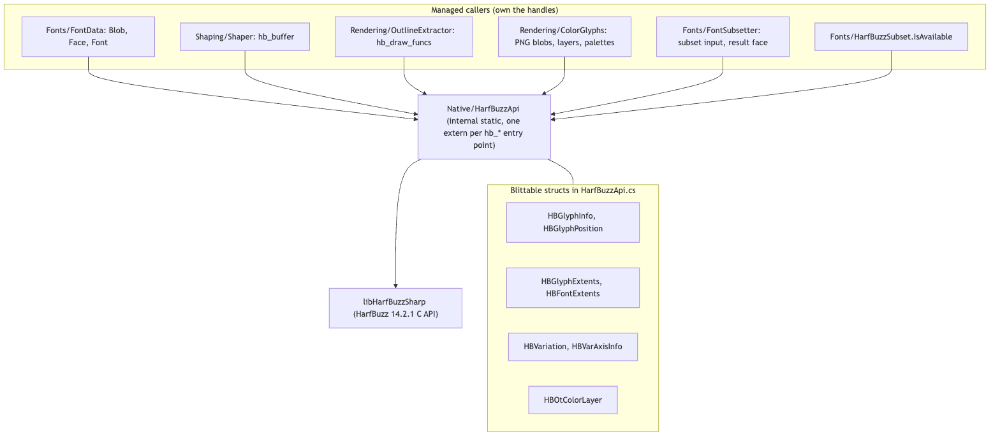
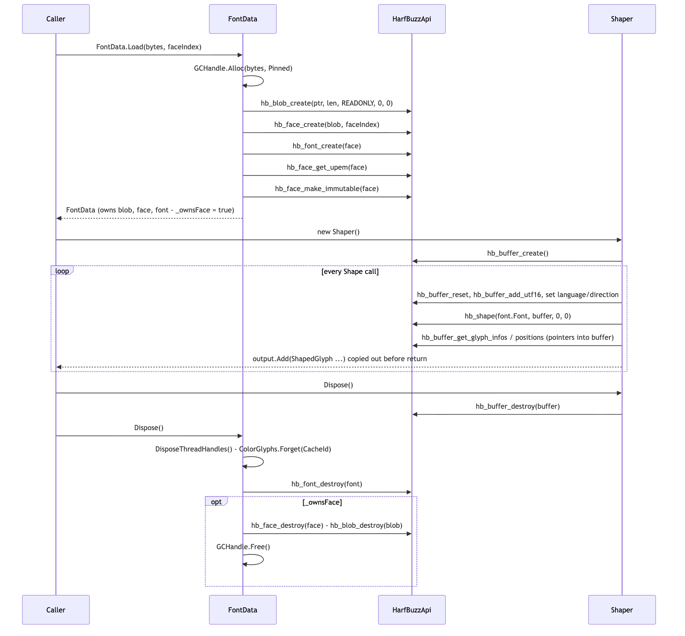
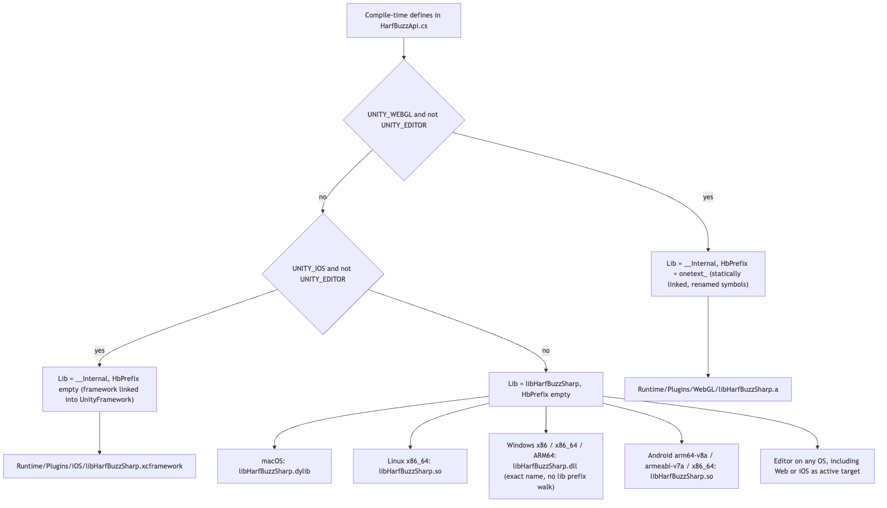

# Runtime/Core/Native

`Runtime/Core/Native` is the package's only P/Invoke surface: `HarfBuzzApi`, one `[DllImport]` per HarfBuzz C entry point the engine uses (59 externs), plus the blittable structs those calls read and write. It sits under every stage that touches a font: shaping (`hb_shape`), metrics (`hb_font_get_h_extents`, `hb_ot_metrics_get_position_with_fallback`), outline extraction for rasterization (`hb_font_draw_glyph`), colour glyphs (`hb_ot_color_*`), variable fonts (`hb_ot_var_*`, `hb_font_set_variations`) and subsetting (`hb_subset_*`). The file is deliberately mechanical: it holds no logic, no ownership and no caching; those live in the callers (`FontData`, `Shaper`, `OutlineExtractor`, `ColorGlyphs`, `FontSubsetter`). There is no FreeType binding in the package despite `Docs/ARCHITECTURE.md` mentioning one; outlines come from HarfBuzz's draw API.

## Files

| File | Responsibility |
|---|---|
| `HarfBuzzApi.cs` | `internal static class HarfBuzzApi` in namespace `OneText.Native`: the `Lib` / `HbPrefix` constants chosen by `#if`, every `[DllImport]` (blob/face/font, layout tables, colour, subsetting, sets, metrics, variations, buffer/shaping, language, draw funcs), the `HB_*` constants (`HB_MEMORY_MODE_READONLY`, `HB_DIRECTION_LTR/RTL/TTB`, OpenType tag constants), `TagToString`, the five `Draw*Func` delegate types, and the structs `HBGlyphInfo`, `HBGlyphExtents`, `HBFontExtents`, `HBVariation`, `HBVarAxisInfo`, `HBGlyphPosition`, `HBOtColorLayer`. |

The native binaries themselves are under `Runtime/Plugins/` (see "Runtime/Plugins layout" below), and their provenance is in `Docs/NATIVES.md`.

## Structure

Source: [diagrams/native-structure.mmd](diagrams/native-structure.mmd)

`HarfBuzzApi` is `internal` and so are its structs; nothing outside the `OneText` assembly (and `OneText.Tests`, via `InternalsVisibleTo`) calls it. Every extern is `CallingConvention.Cdecl` and names its `EntryPoint` explicitly as `HbPrefix + "hb_..."`, a concatenation of constants, so the same attribute binds `hb_shape` on nine platforms and `onetext_hb_shape` on Web.

Handles are plain `IntPtr`s. The groups, roughly in file order (in the file `hb_version_string` comes first, and `hb_face_is_immutable` plus the `hb_font_*` calls sit after the sets group):

- **blob / face / font**: `hb_blob_create` (with `HB_MEMORY_MODE_READONLY = 1`), `hb_blob_destroy`, `hb_face_create`, `hb_face_destroy`, `hb_face_get_upem`, `hb_face_make_immutable`, `hb_face_is_immutable`, `hb_font_create`, `hb_font_destroy`, `hb_font_get_h_extents`, `hb_font_get_nominal_glyph`, `hb_font_get_glyph_extents`, `hb_version_string`.
- **layout tables (diagnostics)**: `hb_ot_layout_table_get_feature_tags` with `HB_OT_TAG_GSUB` / `HB_OT_TAG_GPOS` and `TagToString`.
- **colour glyphs**: `hb_ot_color_has_png/layers/palettes`, `hb_ot_color_glyph_reference_png` (returns a blob the caller must destroy), `hb_blob_get_data`, `hb_blob_get_length`, `hb_ot_color_glyph_get_layers`, `hb_ot_color_palette_get_colors`, `hb_ot_color_palette_get_count`.
- **subsetting**: `hb_subset_input_create_or_fail`, `hb_subset_input_destroy`, `hb_subset_input_unicode_set` (set owned by the input), `hb_subset_input_get_flags/set_flags`, `hb_subset_or_fail` (returns a new face), `hb_face_reference_blob`; **sets**: `hb_set_create/destroy/add/add_range`.
- **metrics**: `hb_ot_metrics_get_position_with_fallback` with the four `HB_OT_METRICS_TAG_UNDERLINE_*` / `STRIKEOUT_*` tags. No return value because HarfBuzz always synthesizes something.
- **variable fonts**: `hb_ot_var_has_data`, `hb_ot_var_get_axis_count`, `hb_ot_var_get_axis_infos`, `hb_font_set_variations`.
- **buffer / shaping**: `hb_buffer_create/destroy/reset`, `hb_buffer_add_utf16`, `hb_buffer_guess_segment_properties`, `hb_buffer_set_language`, `hb_buffer_set_direction` (`HB_DIRECTION_LTR = 4`, `RTL = 5`, `TTB = 6`), `hb_shape`, `hb_buffer_get_glyph_infos`, `hb_buffer_get_glyph_positions`; **language**: `hb_language_from_string`, `hb_language_to_string`.
- **draw (outline extraction)**: `hb_draw_funcs_create/destroy`, the five `hb_draw_funcs_set_*_func` setters taking `DrawMoveToFunc`, `DrawLineToFunc`, `DrawQuadraticToFunc`, `DrawCubicToFunc`, `DrawClosePathFunc` (all `[UnmanagedFunctionPointer(Cdecl)]`), and `hb_font_draw_glyph`.

The structs mirror HarfBuzz's layouts with `[StructLayout(LayoutKind.Sequential)]`. Two details worth knowing: `HBFontExtents` carries nine private reserved `int`s after `Ascender`, `Descender`, `LineGap` because `hb_font_extents_t` does; `HBGlyphExtents.Height` is negative (y grows upward, the box runs down from the bearing). `HBGlyphInfo.Cluster` is a UTF-16 code-unit index because the buffer is filled with `hb_buffer_add_utf16`. `HBOtColorLayer.ColorIndex == 0xFFFF` means "the text colour".

## Behaviour

Source: [diagrams/native-handle-lifetime.mmd](diagrams/native-handle-lifetime.mmd)

The binding has no behaviour of its own, so the useful walk-through is how the callers use it.

**Loading a font** (`FontData.Load` in `Runtime/Core/Fonts/FontData.cs`): the managed `byte[]` is pinned with `GCHandle.Alloc(..., Pinned)` and handed to `hb_blob_create` in read-only mode, no copy; `hb_face_create(blob, faceIndex)` and `hb_font_create(face)` follow, `hb_face_get_upem` fills `UnitsPerEm`, and `hb_face_make_immutable` is called immediately because HarfBuzz's rule is that an immutable object may be read from any number of threads. `FontData.CreateVariant` and `FontData.ForCurrentThread` create more `hb_font_t`s over the same face with `_ownsFace = false`. `FontData.Dispose` destroys the font, then (only for the owner) the face, the blob and the pinned handle.

**Shaping** (`Shaper.Shape` in `Runtime/Core/Shaping/Shaper.cs`): one `hb_buffer_t` per `Shaper`, created in the constructor. Each call does `hb_buffer_reset`, `hb_buffer_add_utf16` on the whole span with an item offset/length (so HarfBuzz sees context outside the run), `hb_buffer_guess_segment_properties`, optionally `hb_buffer_set_language` and `hb_buffer_set_direction`, then `hb_shape(font.Font, buffer, IntPtr.Zero, 0)` with no feature array. The glyph info and position pointers returned by `hb_buffer_get_glyph_infos/positions` point into the buffer and are copied out into `ShapedGlyph` before the call returns. See [../Shaping/README.md](../Shaping/README.md).

**Outlines** (`OutlineExtractor.Extract` in `Runtime/Core/Rendering/OutlineExtractor.cs`): a single process-wide `hb_draw_funcs_t` is built once under a lock and published with `Volatile.Write`; the five callbacks are `static readonly` delegate fields (rooted so IL2CPP/Mono never collects the thunks) marked `[MonoPInvokeCallback]`. `hb_font_draw_glyph` calls back into managed code, which writes into `[ThreadStatic]` scratch (`t_current`, `t_contour`, `t_pen`).

**Colour glyphs** (`ColorGlyphs` in `Runtime/Core/Rendering/ColorGlyphs.cs`): `hb_ot_color_glyph_reference_png` returns a blob the caller reads with `hb_blob_get_data` and must `hb_blob_destroy`; `hb_ot_color_glyph_get_layers` and `hb_ot_color_palette_get_colors` follow the HarfBuzz in/out `count` convention (call with `count = 0` and a null array to size, then again to fill).

**Subsetting** (`FontSubsetter` in `Runtime/Core/Fonts/FontSubsetter.cs`): blob, face, input and result face are created in a `try` and every non-zero handle destroyed in `finally`; the result's bytes are read through `hb_face_reference_blob` + `hb_blob_get_data` and that blob destroyed too. `HarfBuzzSubset.IsAvailable` probes `hb_subset_input_create_or_fail` once and catches `EntryPointNotFoundException` / `DllNotFoundException`, because `harfbuzz-subset` is a separate library in HarfBuzz's build and a binary can be a good shaper without it.

Source: [diagrams/native-library-name.mmd](diagrams/native-library-name.mmd)

**Library name.** `Lib` is `"libHarfBuzzSharp"` by default, `"__Internal"` under `UNITY_WEBGL && !UNITY_EDITOR` and under `UNITY_IOS && !UNITY_EDITOR`. `HbPrefix` is `"onetext_"` on Web only. The long comment at the top of `HarfBuzzApi.cs` records the two mistakes that were made here: `__Internal` on iOS was wrong at first because the NuGet family ships iOS as a dynamic framework, and a bare `HarfBuzzSharp` was wrong on Windows because Windows' loader opens exactly the name it is given and never tries `lib` + name. The iOS branch now uses `__Internal` for the opposite reason: the framework is embedded and `UnityFramework` already links it, so the symbols are in the process and a `dlopen` by name would never find the file. The editor is excluded from both branches because in play mode the editor is macOS/Windows/Linux and `UNITY_WEBGL` / `UNITY_IOS` are defined there whenever that is the active target.

## Invariants and conventions

- **`HarfBuzzApi` holds no logic.** The file header says "Keep this file mechanical: one extern per hb_* entry point, no logic." Ownership, caching and error handling belong to the caller.
- **Ownership is the caller's.** `FontData` owns blob/face/font (variants and thread handles own only their `hb_font_t`); `Shaper` owns its buffer; `OutlineExtractor` owns the single `hb_draw_funcs_t` for the process lifetime (never destroyed); `ColorGlyphs` and `FontSubsetter` destroy every blob/face/input they create before returning. `hb_language_t` values from `hb_language_from_string` are interned by HarfBuzz and never freed; `Shaper.s_languages` caches them only to skip the string marshal.
- **Threading.** An `hb_face_t` made immutable is shareable; an `hb_font_t` is not (it carries variation coordinates and a lazily populated cache), which is why `FontData.ForCurrentThread` hands out a per-thread `hb_font_t` and why a `Shaper` (one buffer) must not be shared between threads. `Tests/Editor/ThreadSafetyTests.cs` creates a `Shaper` per call on each worker thread. Outline callbacks write `[ThreadStatic]` state, so concurrent `hb_font_draw_glyph` calls are safe as long as each thread has its own `GlyphOutline`.
- **Pinned memory.** The font bytes stay pinned for the blob's lifetime (`FontData._bytesHandle`); `FontSubsetter` pins for the duration of one call. `hb_buffer_add_utf16` is passed a `fixed` pointer that is only valid inside the `fixed` block, which is why the glyphs are copied out before `Shape` returns.
- **Units.** Everything HarfBuzz returns is in font design units (`XAdvance`, `XOffset`, extents, metrics); `hb_face_get_upem` is the divisor. Direction constants are HarfBuzz's own integers (`4`, `5`, `6`), tags are packed big-endian four-character `uint`s.
- **Delegates passed to native code must be rooted** (`OutlineExtractor.s_moveTo` etc. are `static readonly`) and marked `[MonoPInvokeCallback]` for IL2CPP.
- **The Web symbol rename is a build-time contract.** `Tools/build_webgl_natives.sh` renames every HarfBuzz identifier to `onetext_*`; `HbPrefix` must match it exactly or every Web call is an unresolved symbol.
- **Every extern added here must exist in every binary.** `Tools/build_linux_natives.sh` checks that all 59 P/Invoke entry points are exported; `Docs/NATIVES.md` records that every vendored binary was checked for `hb_shape`, `hb_font_draw_glyph` and 31 `hb_subset_*` symbols.

## Runtime/Plugins layout

One native library, HarfBuzz 14.2.1 as `libHarfBuzzSharp`, one binary per platform/CPU, all named identically and told apart by their `.meta` import settings (generated by `Editor/Dev/NativePluginSettings.cs`, not hand-written, because Unity refuses a build when two plugins of one name are enabled for the same platform):

| Path under `Runtime/Plugins/` | Platform / CPU | Editor use |
|---|---|---|
| `macOS/libHarfBuzzSharp.dylib` | StandaloneOSX, AnyCPU | macOS editor |
| `Windows/x86_64/libHarfBuzzSharp.dll` | StandaloneWindows64, x86_64 | Windows editor |
| `Windows/x86/libHarfBuzzSharp.dll` | StandaloneWindows, x86 | no |
| `Windows/ARM64/libHarfBuzzSharp.dll` | StandaloneWindows64, ARM64 | Windows-on-ARM editor |
| `Linux/x86_64/libHarfBuzzSharp.so` | StandaloneLinux64, x86_64 (built by `Tools/build_linux_natives.sh`, not vendored) | Linux editor |
| `Android/arm64-v8a/`, `armeabi-v7a/`, `x86_64/libHarfBuzzSharp.so` | Android ARM64 / ARMv7 / X86_64 | no |
| `iOS/libHarfBuzzSharp.xcframework/` | iOS device (`ios-arm64`) and simulator (`ios-arm64_x86_64-simulator`) in one xcframework | no |
| `WebGL/libHarfBuzzSharp.a` | Web, statically linked by Emscripten, symbols prefixed `onetext_` (built by `Tools/build_webgl_natives.sh`) | no |
| `HarfBuzz-COPYING.txt`, `HarfBuzzSharp-LICENSE.txt` | MIT notices covering every binary above | - |

Provenance (which NuGet package each came from, the iOS `Info.plist` fix and thinning, the Linux `-Wl,-Bsymbolic` story, the Web symbol rename, what has and has not been executed on device) is in [`Docs/NATIVES.md`](../../../../Docs/NATIVES.md). `Tests/Editor/NativesTests.cs` asserts the layout: `EveryPlatformHasABinary`, `EveryBinaryIsTaggedForExactlyItsOwnPlatform`, `AndroidSixtyFourBitBinariesAre16KbAligned`, `IosShipsOneXcframeworkCarryingDeviceAndSimulator`, `SubsettingIsAvailable_OnThisPlatform`, `HarfBuzzLoadsAndReportsItsVersion`.

## Extending

- **A new HarfBuzz call**: add one `[DllImport(Lib, EntryPoint = HbPrefix + "hb_...", CallingConvention = CallingConvention.Cdecl)] internal static extern ...` to `HarfBuzzApi.cs` in the matching group; add any struct it needs with `[StructLayout(LayoutKind.Sequential)]` and HarfBuzz's exact field order (including reserved fields). Then: confirm the symbol is exported by every binary (the Linux build script's entry-point list and the Web rename both have to know it; see `Docs/NATIVES.md` "Re-vendoring" and the Web section), and put the ownership logic in the caller, not here. If the call returns a handle, the caller destroys it.
- **A new platform binary**: drop it under `Runtime/Plugins/<Platform>/<CPU>/libHarfBuzzSharp.<ext>`, add a `Target` to `NativePluginSettings.Targets` and run it to generate the `.meta`, then extend `NativesTests.cs` (platform list and tagging test). If the loader on that platform needs a different `Lib` or prefix, add a `#elif` branch in `HarfBuzzApi.cs` with a comment as long as the existing ones.
- **Tests that cover this folder**: `Tests/Editor/NativesTests.cs` (binaries, tagging, version, subsetting), `Tests/Editor/ShapingTests.cs` (`NativeLibrary_Loads_AndReportsVersion`), `Tests/Editor/ThreadSafetyTests.cs` (concurrent shaping, variations, ink bounds, outline extraction, thread handles), `Tests/Editor/SubsetTests.cs`, `Tests/Editor/ColorGlyphTests.cs`, `Tests/Editor/OutlineFormatTests.cs`, `Tests/Editor/VariableSweepTests.cs`. No test references `HarfBuzzApi` directly; they all go through the callers.

## Gotchas

1. **`DllNotFoundException` on Windows only** means the library name lost its `lib`: Windows opens exactly the name given. Keep `Lib = "libHarfBuzzSharp"`. (`HarfBuzzApi.cs` header; `Docs/NATIVES.md` "The name in DllImport".)
2. **`__Internal` is right on Web and iOS players and wrong everywhere else**, and both branches must exclude `UNITY_EDITOR`: with Web or iOS as the active target the editor still loads the desktop dynamic library.
3. **Unity ships its own HarfBuzz.** On Web it is statically linked into every player (8.0.1), so ours is renamed `onetext_*`; in the Linux editor it is in the process's global symbol scope, so our `.so` must be linked `-Bsymbolic` or `hb_font_create` ends up calling Unity's `hb_font_set_var_coords_normalized` and crashes in `free` (`Docs/NATIVES.md`, "Linux: the one that had to stop being vendored"). A macOS-only test pass cannot catch this: Mach-O's two-level namespace binds a dylib's calls to itself.
4. **Subsetting may be missing from a binary** without anything else failing. Always go through `HarfBuzzSubset.IsAvailable`; `NativesTests.SubsettingIsAvailable_OnThisPlatform` pins it for the host.
5. **An `hb_font_t` is not thread-safe.** Use `FontData.ForCurrentThread()` on worker threads, never the owner's `Font` pointer; the failure is wrong variation coordinates, not a crash (`FontData.cs` comment on `ForCurrentThread`).
6. **Draw-func delegates must stay rooted**; a collected thunk is a crash inside `hb_font_draw_glyph` at some later time, not at the call site.
7. **Blobs returned by `hb_ot_color_glyph_reference_png` and `hb_face_reference_blob` are owned by you**; forgetting `hb_blob_destroy` leaks the PNG or the subset bytes.
8. **`hb_ot_metrics_get_position_with_fallback` never fails**, which is the point: a subset or bitmap-only face can lack `post`/`OS/2`, and a zero underline thickness draws nothing. Do not replace it with the non-fallback call.

## Related

- [../Shaping/README.md](../Shaping/README.md) (the main consumer of the buffer API), [../Fonts/README.md](../Fonts/README.md) (`FontData`, `FontStack`, `FontSubsetter`, `HarfBuzzSubset`), [../Rendering/README.md](../Rendering/README.md) (`OutlineExtractor`, `ColorGlyphs`).
- [`Docs/NATIVES.md`](../../../../Docs/NATIVES.md) for provenance and re-vendoring; `Tools/build_linux_natives.sh`, `Tools/build_webgl_natives.sh`; `Editor/Dev/NativePluginSettings.cs` for the `.meta` generator.
- [`Docs/ARCHITECTURE.md`](../../../../Docs/ARCHITECTURE.md) "Native strategy (M1)" for the original plan (note it mentions FreeType, which the shipped code does not use).
