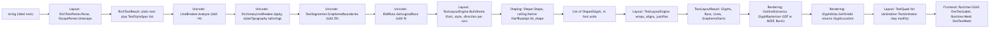
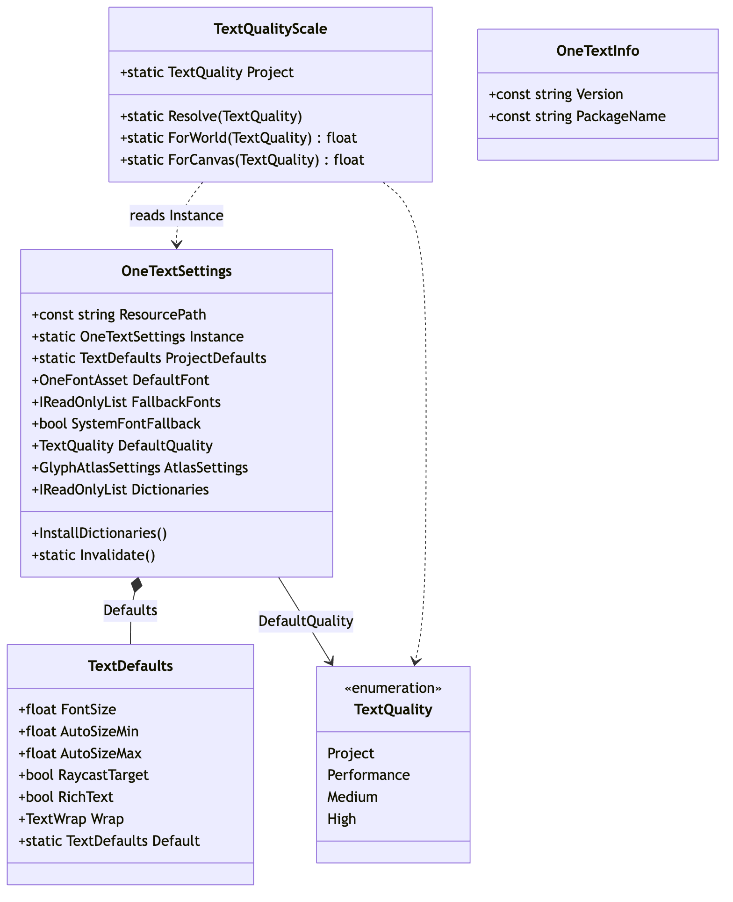
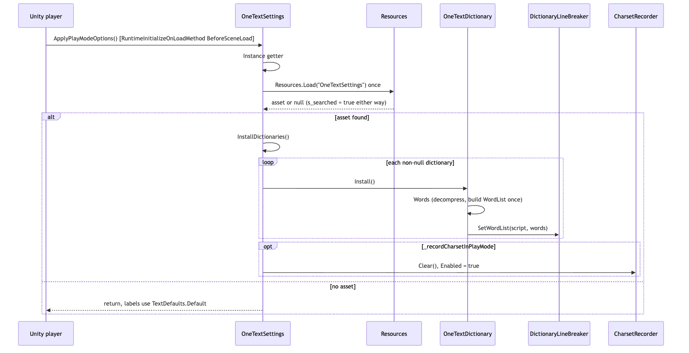

# Runtime/Core

`Runtime/Core` is the `OneText` assembly: the whole text pipeline from a C# string to positioned, atlas-addressed quads, with no reference to any UI framework. Everything the frontends (`Runtime/UGUI`, `Runtime/Mesh`) and the editor (`Editor/`) build on lives here. The four C# files directly in this folder (beside `OneText.asmdef`) are the assembly's identity and project-wide configuration (`OneTextInfo`, `OneTextSettings`, `TextQuality`, `AssemblyInfo`); the pipeline stages themselves live in the sub-folders, each of which has its own README. This document is the map: what the assembly is, what it depends on, how the stages connect, and where to read next.

## Files

Files directly in `Runtime/Core` (sub-folders are listed in the next table):

| File | Responsibility |
|---|---|
| `OneText.asmdef` | Assembly definition for `OneText` (root namespace `OneText`). References `Unity.Burst`, `Unity.Collections`, `Unity.Mathematics`; `allowUnsafeCode: true`; auto-referenced; no platform restrictions. |
| `AssemblyInfo.cs` | `[assembly: InternalsVisibleTo("OneText.Tests")]` so tests can reach `internal` members (the comment names `OneFontAsset.DropPackedData` as the motivating case). |
| `OneTextInfo.cs` | `OneTextInfo.Version` (`"0.3.2"`) and `OneTextInfo.PackageName` (`"com.onetext.core"`): the package identity a player build can read, since it has no package manager. A test keeps `Version` equal to `package.json`. |
| `OneTextSettings.cs` | `OneTextSettings : ScriptableObject`, loaded from `Resources/OneTextSettings`: default font, fallback chain, system-font fallback switch, new-text defaults (`TextDefaults`), project `TextQuality`, atlas size/layers, prewarm charset, charset recording, and the `OneTextDictionary` list installed before the first scene. |
| `TextQuality.cs` | `TextQuality` enum (`Project`, `Performance`, `Medium`, `High`) and `TextQualityScale`, which resolves `Project` against the settings asset and maps a rung to a texel multiplier on the world ladder (1, 2, 4) or the canvas ladder (1, 1.5, 2). |

Sub-folders, each documented separately:

| Folder | Stage | Doc |
|---|---|---|
| `Animation/` | Per-quad effects and reveal (`TextAnimator`, `TextEffect`, `BuiltInEffects`, `RevealUnits`) applied after layout | [Animation/README.md](Animation/README.md) |
| `Editing/` | Editing model for input fields (`TextEditingModel`, `ImeComposition`, `ImeCommitArbiter`) | [Editing/README.md](Editing/README.md) |
| `Fonts/` | Font bytes to HarfBuzz handles (`FontData`), fallback chains (`FontStack`), assets (`OneFontAsset`, `OneTextCharset`, `OneTextStyle`, `OneTextSpriteSheet`), system fonts, subsetting | [Fonts/README.md](Fonts/README.md) |
| `Layout/` | Parse (`RichTextParser`, `EscapeParser`) and layout (`TextLayoutEngine`, `TextLayoutResult`, `TextQuad`, `TextHitTest`, ruby, decorations, links) | [Layout/README.md](Layout/README.md) |
| `Native/` | The single P/Invoke surface, `HarfBuzzApi` | [Native/README.md](Native/README.md) |
| `Rendering/` | Outline extraction, SDF/MSDF rasterization (Burst jobs), glyph atlas, colour glyphs, prewarm, diagnostics | [Rendering/README.md](Rendering/README.md) |
| `Shaping/` | `Shaper` and `ShapedGlyph`: one HarfBuzz buffer per engine, text run to glyphs | [Shaping/README.md](Shaping/README.md) |
| `Unicode/` | UAX #9 bidi, UAX #14 line breaking, UAX #29 segmentation, UAX #50 vertical orientation, East Asian tailorings, dictionary breaking, generated UCD tables | [Unicode/README.md](Unicode/README.md) |

## Structure

Source: [diagrams/core-pipeline.mmd](diagrams/core-pipeline.mmd)

The pipeline reads left to right. A frontend label holds a `TextLayoutEngine` (`OneTextLabel._engine` in `Runtime/UGUI/OneTextLabel.cs`) and calls `TextLayoutEngine.Layout(text, in TextLayoutSettings, TextLayoutResult)`. Before that it runs `RichTextParser.Parse` when `RichTextParser.MightHaveMarkup` says so, producing a `RichTextResult` whose plain text and `TextStyleSpan` list become the engine's input. Inside `Layout`, the engine calls the Unicode stage in a fixed order (`LineBreaker.Analyze`, then `DictionaryLineBreaker.Apply`, `AsianTypography.ApplyKoreanWordWrap`, `AsianTypography.ApplyKinsoku`, then `TextSegmenter.GraphemeBoundaries`), then per paragraph `BidiRuns.GetLogicalRuns` and its own `BuildItems`, then `Shaper.Shape` per item, then wrapping. The result's `Glyphs` (a `List<ShapedGlyph>`), `Runs`, `Lines` and `GraphemeStarts` are what rendering reads: the label splits runs into clusters (`GlyphClusters`), asks `GlyphAtlas.GetOrAdd` / `GetOrAddCluster` for a `GlyphLocation`, and builds `TextQuad`s that `TextAnimator` may modify before the frontend turns them into mesh data. Rasterization happens inside the atlas on a miss, through `OutlineExtractor` (HarfBuzz `hb_font_draw_glyph`) and `GlyphRasterizer`.

The stage boundary that matters most for a contributor is the unit change: Unicode works in UTF-16 offsets of the source string, shaping returns font design units, layout converts to render units by `FontSize / FontData.UnitsPerEm`, and the atlas works in texels at a quantized pixels-per-em. See the Shaping and Unicode docs for the first two, Layout and Rendering for the rest.

Source: [diagrams/core-settings-structure.mmd](diagrams/core-settings-structure.mmd)

The root-level types are configuration, not pipeline. `OneTextSettings.Instance` is a lazily loaded singleton (`Resources.Load<OneTextSettings>("OneTextSettings")`, searched once, `s_searched` remembers a miss). `OneTextSettings.ProjectDefaults` returns a `TextDefaults` value struct: the asset's answer when one exists, `TextDefaults.Default` otherwise, and the two are written to agree so creating the asset changes nothing until it is edited. `TextQualityScale.Resolve` turns `TextQuality.Project` into the asset's `DefaultQuality` (or `Performance` without an asset, and `Performance` again if an asset somehow says `Project`, to avoid a loop); `ForWorld` returns the member's own integer value, `ForCanvas` returns 1 / 1.5 / 2.

## Behaviour

Source: [diagrams/core-startup-sequence.mmd](diagrams/core-startup-sequence.mmd)

The only runtime behaviour at this level is startup. `OneTextSettings.ApplyPlayModeOptions` is a `[RuntimeInitializeOnLoadMethod(RuntimeInitializeLoadType.BeforeSceneLoad)]`: it reads `Instance`, returns if there is no asset, otherwise calls `InstallDictionaries()` (each non-null `OneTextDictionary.Install()`, which builds its `WordList` once and registers it with `DictionaryLineBreaker.SetWordList`) and, when `_recordCharsetInPlayMode` is set, clears and enables `CharsetRecorder`. This runs before any scene so a label laid out in `Awake` wraps Thai the same way a later one does.

Two values are read at different times on purpose, and the source comments spell out why:

- The "new text defaults" (`DefaultFontSize`, `TextDefaults`) are read once, when a label or world text is created. They describe what a new object starts as.
- `DefaultQuality` is read at draw time through `TextQualityScale`, not copied at creation, because a project that already has thousands of serialized labels needs one field that fixes all of them; `TextQuality.Project` is the enum's zero so that a field added to existing prefabs reads back as "ask the project".

Everything else in this assembly happens inside a `TextLayoutEngine.Layout` call or an atlas request; follow the sub-folder docs for those paths, starting with [Layout/README.md](Layout/README.md).

## Invariants and conventions

- **Core never references a UI framework.** The asmdef references only Burst, Collections and Mathematics plus the engine. `Runtime/UGUI` and `Runtime/Mesh` depend on `OneText`, never the reverse (`Docs/ARCHITECTURE.md`, "Module map").
- **No per-frame allocations** is a repo-wide rule, enforced by `Tests/Editor/AllocationTests.cs` (`Shaping_A_Run_Does_Not_Allocate`, `Laying_Out_Fresh_Text_Does_Not_Allocate`, `Steady_State_Redraw_Does_Not_Allocate`, ...). New pipeline code should reuse the scratch-buffer patterns the Unicode and Shaping docs describe.
- **Internals are visible to `OneText.Tests` only** (`AssemblyInfo.cs`). `HarfBuzzApi`, the generated `BidiData` / `BreakData` / `VerticalData` tables and similar are `internal`; public API is what the frontends use.
- **`OneTextInfo.Version` must equal `package.json`.** `Tests/Editor/PackageVersionTests.cs` (`TheConstantAndTheManifest_AgreeOnTheVersion`) enforces it; the comment records that it was wrong for two releases before the test existed.
- **`OneTextSettings` is found once.** `Instance` caches both a hit and a miss; editor code that creates the asset must call `OneTextSettings.Invalidate()` or the runtime keeps answering "none".
- **`TextDefaults.Default` and the serialized field initializers must agree.** `Tests/Editor/ProjectDefaultsTests.cs` (`A_Fresh_Settings_Asset_Agrees_With_The_Built_In_Answer`) checks it.
- **The quality ladders are asymmetric by design**: world 1/2/4 (the member value), canvas 1/1.5/2. `TextQualityTests.cs` pins both (`The_World_Ladder_Is_The_Member_Value_Itself`, `The_Canvas_Ladder_Is_Half_The_World_Above_Performance`). The source comment explains the ceiling: the atlas density ladder stops at 256 px/em, so a rung above `High` would change the setting without changing the picture.
- **Threading**: the pipeline is main-thread by default. `FontData.ForCurrentThread` exists for concurrent shaping (see the Native and Fonts docs); `DictionaryLineBreaker` is explicitly not synchronized (its comment says layout is main-thread).

## Extending

- **A new project-wide setting**: add a `[SerializeField]` to `OneTextSettings.cs` with a `[Tooltip]`, expose a read-only property, and if it is a "new object starts as" value add it to `TextDefaults`, `TextDefaults.Default` and the `Defaults` getter, keeping the three in agreement (then extend `ProjectDefaultsTests.cs`). The editor page that draws the asset is under `Editor/` (see `Tests/Editor/SettingsPageTests.cs` for what it covers).
- **A new pipeline stage or feature**: it belongs in a sub-folder, not here. The sub-folder docs each have an "Extending" section; the Core-level rule is only that it must not pull a UI framework or an editor reference into `OneText.asmdef`.
- **A new assembly reference**: edit `OneText.asmdef` `references`. Anything beyond Burst/Collections/Mathematics needs a reason, because every consumer of the package inherits it.
- **A new `InternalsVisibleTo`**: `AssemblyInfo.cs`. Today only the test assembly.
- **Bumping the version**: `OneTextInfo.Version`, `package.json`, and `CHANGELOG.md` together; `PackageVersionTests.cs` fails on a mismatch.

Tests that exercise this folder directly: `Tests/Editor/ProjectDefaultsTests.cs`, `Tests/Editor/TextQualityTests.cs`, `Tests/Editor/PackageVersionTests.cs`, `Tests/Editor/SettingsPageTests.cs`; `OneTextSettings` is also touched by `DecorationChannelTests.cs`, `FontRecoveryTests.cs`, `HubTests.cs`.

## Gotchas

1. **`TextQuality.Project` is zero on purpose.** Do not reorder the enum or give `Project` another value: thousands of already-serialized components read back `0`, and `0` must mean "ask the project" (`TextQuality.cs`).
2. **Canvas labels are not "one texel per pixel" on a scaled canvas.** The `TextQuality` comment records the 0.2.0 mistake: a `CanvasScaler` at 3x draws a 36-point label at 108 screen pixels, and nothing in the package reads the scale factor, so the label was baked at the 32 bucket and blown up. `TextQuality` is the knob that says so; it does not read the scale factor either.
3. **A settings asset whose own quality says `Project`** cannot happen through the inspector but can through hand-edited YAML; `TextQualityScale.Resolve` and `OneTextSettings.DefaultQuality` both collapse it to `Performance`.
4. **`Resources.Load` misses are cached.** After creating the asset in the editor, call `OneTextSettings.Invalidate()`.
5. **`Docs/ARCHITECTURE.md` still describes the M1 plan** (FreeType for outlines, a "font stack asset"). The shipped code extracts outlines through HarfBuzz's draw API and configures fallback on `OneTextSettings`; trust the sub-folder docs and the code over that file where they differ.
6. **System-font fallback is on by default and runs in the player** (`_systemFontFallback`), so two devices can draw the same string from different faces, and Web finds nothing. The tooltip in `OneTextSettings.cs` is the authoritative description.

## Related

- Sub-folder docs: [Animation](Animation/README.md), [Editing](Editing/README.md), [Fonts](Fonts/README.md), [Layout](Layout/README.md), [Native](Native/README.md), [Rendering](Rendering/README.md), [Shaping](Shaping/README.md), [Unicode](Unicode/README.md).
- Frontends: `Runtime/UGUI` (`OneTextLabel`, `OneTextInputField`, `OneTextDropdown`), `Runtime/Mesh` (`OneTextMesh`).
- `../../../Docs/ARCHITECTURE.md` (pipeline overview and module map), `../../../Docs/NATIVES.md` (native binaries), `../../../Docs/BENCHMARKS.md`, `../../../Docs/ROADMAP.md`.
