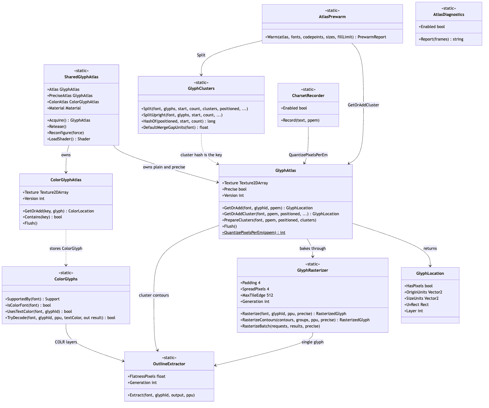
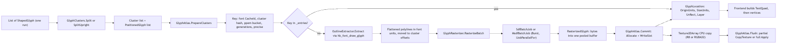
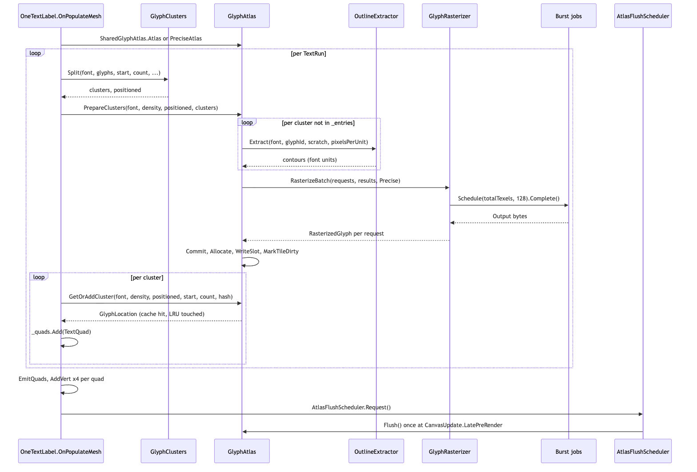
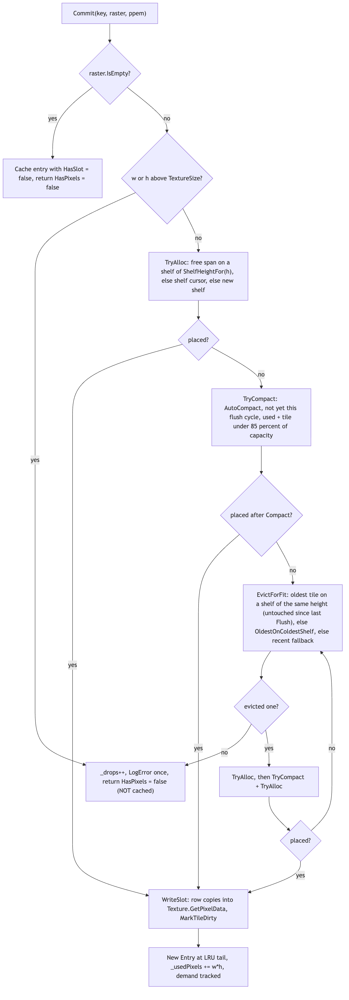
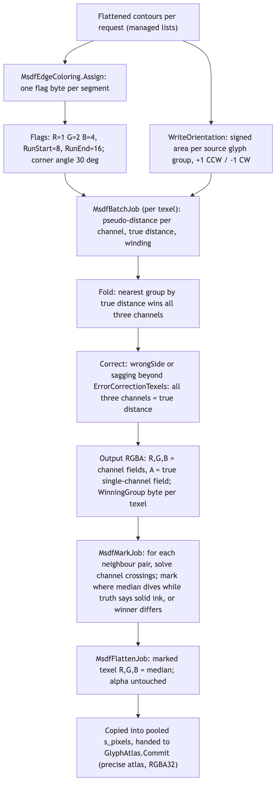
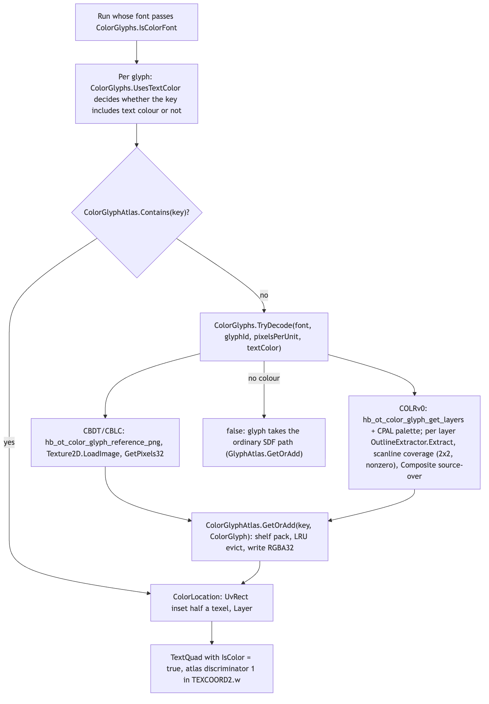

# Runtime/Core/Rendering

This folder turns shaped glyphs into texels and tells the frontend where to find them. It is the "render" stage of the pipeline (string -> parse -> analyze -> shape -> layout -> **render** -> frontend): it takes a run's `ShapedGlyph` list, groups glyphs whose ink touches into clusters (`GlyphClusters`), extracts and flattens their outlines through HarfBuzz's draw API (`OutlineExtractor`), rasterizes each cluster into a signed-distance tile with a Burst job (`GlyphRasterizer`, `SdfBatchJob`, `MsdfBatchJob`), shelf-packs the tiles into a `Texture2DArray` with LRU eviction and compaction (`GlyphAtlas`), decodes colour emoji into a second RGBA array (`ColorGlyphs`, `ColorGlyphAtlas`), and hands back a `GlyphLocation` (quad extents in font units plus a UV rect and layer). The frontends (`Runtime/UGUI/OneTextLabel`, `Runtime/Mesh/OneTextMesh`) build `TextQuad`s and vertices from those locations; the shader in `Runtime/Shaders` reconstructs coverage from the field. Nothing here produces mesh data itself. Note that, despite what `Docs/ARCHITECTURE.md` says, outline extraction does not use FreeType: `OutlineExtractor` is built on `hb_font_draw_glyph`.

## Files

| File | Responsibility |
| --- | --- |
| `GlyphAtlas.cs` | `GlyphLocation`, `GlyphAtlasSettings`, `GlyphAtlasStats`, and `GlyphAtlas`: the shelf-packed `Texture2DArray` SDF cache. Cache key, ppem buckets, LRU eviction, compaction, partial/full GPU upload, demand tracking. |
| `SharedGlyphAtlas.cs` | Process-wide singletons: the plain atlas, the precise (MSDF) atlas, the colour atlas, the shared `Material`, shader loading from `Resources`, ref-counting (`Acquire`/`Release`), `Reconfigure`, and play-session recovery. |
| `GlyphRasterizer.cs` | `RasterizedGlyph` and the constants every tile obeys (`Padding`, `SpreadPixels`, `MaxTileEdge`), `Generation` for bake-time settings, `MsdfErrorCorrectionTexels`, and the single-glyph / single-contour-set entry points that forward to the batch. |
| `GlyphRasterizerBatch.cs` | `RasterizeRequest` and `GlyphRasterizer.RasterizeBatch`: sizes tiles, flattens requests into persistent `NativeArray` buffers, schedules the SDF or MSDF jobs, copies results into one pooled byte array. Owns and releases the persistent buffers. |
| `SdfBatchJob.cs` | `SdfTileDesc` and `SdfBatchJob`: Burst `IJobParallelFor` over every texel of a batch; per-group signed distance (min distance + winding), unioned across groups, encoded to one byte. |
| `MsdfBatchJob.cs` | `MsdfBatchJob`: the multi-channel counterpart. Pseudo-distance per colour channel past run ends, nearest-group fold, per-texel error correction (`Correct`), true distance in alpha, `WinningGroup` per texel. |
| `MsdfEdgeColoring.cs` | Assigns each flattened segment a channel mask (R/G/B pairs) and run-start/run-end bits; corner detection on polylines (`CornerAngleDegrees`). |
| `MsdfInterpolationJobs.cs` | `MsdfMarkJob` / `MsdfFlattenJob`: the between-texel half of MSDF error correction (median rank swaps between neighbours, seams between cluster glyphs), plus `MsdfTiles.Find`. |
| `OutlineExtractor.cs` | `GlyphOutline` (pooled contour lists) and `OutlineExtractor`: hb-draw callbacks that flatten quadratic/cubic curves to polylines at a pixel-tolerance (`FlatnessPixels`), thread-static state, `Generation`. |
| `GlyphClusters.cs` | `PositionedGlyph`, `GlyphClusters.Cluster`, `Split` (interval union over ink extents), `SplitUpright` (one tile per glyph for vertical columns), `HashOf` (cluster cache key). |
| `ColorGlyphs.cs` | `ColorGlyph` and `ColorGlyphs`: detects CBDT/CBLC and COLRv0+CPAL support per face, decodes PNG strikes via `Texture2D.LoadImage`, composites COLR layers with a scanline coverage filler. |
| `ColorGlyphAtlas.cs` | RGBA32 `Texture2DArray` for emoji and inline sprites: shelves + LRU, no compaction, half-texel inset UVs, `ColorLocation`. |
| `AtlasPrewarm.cs` | `PrewarmReport` and `AtlasPrewarm.Warm`: shapes and bakes a charset ahead of time under the same keys labels will look up, stops at a fill limit or on the first eviction. |
| `CharsetRecorder.cs` | Records codepoints and ppem buckets a session actually draws, for saving as an `OneTextCharset`. |
| `AtlasDiagnostics.cs` | Opt-in `Stopwatch` counters for rebuild, layout, outline, rasterize, job wait, tile copy and upload; `Report` and `TakeSetupSummary`. |

## Structure

Source: [diagrams/rendering-types.mmd](diagrams/rendering-types.mmd)

`SharedGlyphAtlas` is the entry point a frontend uses. `SharedGlyphAtlas.Atlas` lazily creates the R8 `GlyphAtlas` from `OneTextSettings.Instance.AtlasSettings` (and runs `settings.PrewarmCharset.Prewarm` when playing); `SharedGlyphAtlas.PreciseAtlas` creates the RGBA32 `GlyphAtlas(settings, precise: true)` on first request, `SharedGlyphAtlas.ColorAtlas` the `ColorGlyphAtlas`. `SharedGlyphAtlas.Material` builds one `Material` on the `OneText/SDF` shader and binds `_GlyphTex`/`_GlyphTexelSize`, `_MsdfTex`/`_MsdfTexelSize` and `_ColorTex` to whichever atlases exist. Labels call `Acquire()` when they first draw and `Release()` when destroyed; when the count reaches zero every atlas and the material are destroyed.

`GlyphAtlas` is the cache. Its public surface is `GetOrAdd` (one glyph), `GetOrAddCluster` (a merged cluster), `PrepareClusters` (bake every missing cluster of a run in one dispatch), `Contains`, `Flush`, `Compact`, `GetStats`, `Version`, and the static `QuantizePixelsPerEm`. Internally it owns `_entries` (a `Dictionary<Key, Entry>`), `_lru` (a `LinkedList<Entry>`, oldest at the head), one `LayerState` per slice holding `Shelf`s with free `Span`s, and the upload bookkeeping (`_pendingTiles`, `_fullUpload`, `_staging`).

`GlyphRasterizer` is a static partial class split over `GlyphRasterizer.cs` and `GlyphRasterizerBatch.cs`. Everything goes through `RasterizeBatch`; `Rasterize` and `RasterizeContours` are batches of one. The two Burst jobs share the `SdfTileDesc` layout and the flattened contour arrays; `MsdfBatchJob` additionally takes `SegmentFlags` from `MsdfEdgeColoring` and `ContourOrientation`. `OutlineExtractor` is the only thing that talks to `hb_font_draw_glyph`; `GlyphRasterizer.Rasterize`, `GlyphAtlas.BuildClusterContours` and `ColorGlyphs.Rasterize` all call `OutlineExtractor.Extract`.

## Behaviour

### From a run to a tile

Source: [diagrams/glyph-pipeline.mmd](diagrams/glyph-pipeline.mmd)

Source: [diagrams/rebuild-sequence.mmd](diagrams/rebuild-sequence.mmd)

1. **Clustering** (`GlyphClusters.Split`). For each glyph in the run the caller's font answers `FontData.TryGetInkBounds`; glyphs with ink become `InkSpan`s (`Min`/`Max` in font units from the run start, pen + `XOffset` + ink x). Spans are sorted by `Min` and merged by interval union: a span joins the current group while `spans[s].Min <= groupMax + mergeGapUnits` and `spans[s].Max - groupMin <= maxWidthUnits`. The callers pass `GlyphClusters.DefaultMergeGapUnits(font)` (1% of an em) and `1000f * unitsPerTilePixel` as the width cap. `Emit` anchors every offset to the group's smallest glyph index so the same word hashes the same wherever it appears, records `TextStart`/`TextEnd` (UTF-16 cluster range), and computes `Hash` with `HashOf` (FNV-1a over glyph id, X, Y with the top bit set so it never collides with a plain glyph id). `SplitUpright` (vertical, upright columns) skips the union and emits one cluster per glyph with the glyph at the origin, so its hash equals the same glyph anywhere else.

2. **Density bucket.** The caller passes a *density* in pixels per em (the uGUI label's `DensityFor`, which is font size times quality scale times the measured canvas scale, capped at `OneTextLabel.PpemCap`). `GlyphAtlas.QuantizePixelsPerEm` rounds it down to the largest entry of `PpemBuckets` (`24, 28, 32, 40, 48, 56, 64, 80, 96, 112, 128, 160, 192, 224, 256`) not above it; anything under 24 becomes 24. The static `RoundBucketUp` flag flips to round-up and is documented in the source as a measurement switch, not something to ship. `pixelsPerUnit = ppem / font.UnitsPerEm` is the density handed to extraction and rasterization, so tiles from one bucket line up with each other exactly (this is what keeps joined glyphs seam-free).

3. **Cache key** (`GlyphAtlas.Key`). `FontData.CacheId` (a process-monotonic counter, never the native handle), the glyph id or cluster hash, the ppem bucket, `FontData.Generation` (variable-font instance), `OutlineExtractor.Generation`, `GlyphRasterizer.Generation`, and `Precise`. `PrepareClusters` walks the run's clusters, skips keys already in `_entries` or already queued in `_batchPending`, and builds one `RasterizeRequest` per missing cluster.

4. **Outline extraction** (`OutlineExtractor.Extract`). `EnsureDrawFuncs` builds one `hb_draw_funcs_t` (double-checked with `Volatile.Read`/`Write`) whose callbacks are the static `MoveTo`/`LineTo`/`QuadTo`/`CubicTo`/`ClosePath`. Because hb-draw passes no user data here, the outline under construction lives in `[ThreadStatic]` fields (`t_current`, `t_contour`, `t_pen`, `t_pixelsPerUnit`). Curves are flattened adaptively: `StepsFor` takes the curve's chord-error coefficient in font units, converts it to pixels at `t_pixelsPerUnit`, and picks `ceil(sqrt(errorPixels / FlatnessPixels))` segments, clamped to `MaxCurveSegments = 24`; with no density given (`pixelsPerUnit = 0`, editor tooling and ink bounds) it uses `DefaultCurveSegments = 8`. `FlatnessPixels` defaults to 0.05 px; setting it bumps `OutlineExtractor.Generation`. `ClosePath` appends the contour's first point, so every closed contour ends where it starts. `GlyphAtlas.BuildClusterContours` offsets each glyph's contours by its `PositionedGlyph.X/Y` and tags every contour with its glyph index in `groups`.

5. **Batch rasterization** (`GlyphRasterizer.RasterizeBatch`). First pass: for each request, compute the bounding box of all contours with at least two points; tile `Width = min(MaxTileEdge, ceil(inkWidth * ppu) + 2 * Padding)` (same for height), `OriginUnits = min - Padding * unitsPerPixel`; requests with no points become `RasterizedGlyph { IsEmpty = true }`. Second pass: flatten every point into `s_points` (`float2`), one `(start, count)` per contour into `s_ranges`, group ids into `s_groups`, contour bounds into `s_bounds`; for precise batches also per-segment flags (`MsdfEdgeColoring.Assign`) and per-group orientation (signed area). Then it schedules `SdfBatchJob` or `MsdfBatchJob` over `totalTexels` with batch size 128 and calls `Complete()` immediately (the source is explicit that `Run()` was measured at twice the frame cost; `JobWaitTicks` is the work, not overhead). Output bytes are copied once into the pooled managed `s_pixels`; each `RasterizedGlyph` points into it via `Pixels` + `PixelStart` and is only valid until the next call.

6. **The single-channel field** (`SdfBatchJob.Execute`). Each texel finds its tile with a binary search over `TileEnds`, computes its centre `p` in font units, and walks the tile's contours. Contours are grouped by source glyph: within a group it keeps the minimum squared distance to any segment and a winding count; at a group boundary `FoldGroup` turns that into a signed distance (negative inside when winding != 0) and the union keeps the minimum. With `Cull` on, a contour whose bounds are more than one reach away is skipped for distance, and skipped for winding unless `p.y` is inside its vertical extent; per-segment boxes are checked too. Encoding: `v = saturate(0.5 - sdPixels / (2 * SpreadPixels))`, so 0.5 is the outline, values above 0.5 are inside, and the field hits 0 exactly one `SpreadPixels` (4 texels) outside the ink, which is also the `Padding` ring. The shader's `REACH_TEXELS 4.0` / `REACH_FIELD 0.5` depend on these two constants.

7. **Commit and packing** (`GlyphAtlas.Commit`, see the allocation diagram below). An empty result is cached as an `Entry` with `HasSlot = false` and `HasPixels = false`. Otherwise `Allocate` finds a slot, `WriteSlot` copies rows into `Texture.GetPixelData<byte>(0, layer)` and marks the tile dirty, and the `Entry` is appended to the LRU tail. The returned `GlyphLocation` has `OriginUnits` from the raster, `SizeUnits = (Width, Height) * UnitsPerPixel`, `UvRect` from `UvRectOf` (no inset; the padding ring is what keeps neighbours apart) and `Layer`.

8. **Read-back and quads.** After `PrepareClusters` the frontend calls `GetOrAddCluster` per cluster, which now hits `_entries` (`TryTouch` moves the entry to the LRU tail and stamps `LastUse`). `OneTextLabel` turns `OriginUnits`/`SizeUnits` plus the cluster pen into a `TextQuad` and later into four vertices (`AddVert`, see `../../Shaders/README.md`). A tile that did not fit returns `HasPixels = false` and the quad is skipped for this frame.

9. **Upload** (`GlyphAtlas.Flush`). Called once per frame by `OneText.UGUI.AtlasFlushScheduler` (at `CanvasUpdate.LatePreRender`) or by `OneTextMesh`'s own scheduler; outside play mode the scheduler flushes immediately. If fewer than `MaxPartialTiles = 64` tiles are dirty, no compaction happened, and `SupportsPartialUpload` (needs `CopyTextureSupport.Basic | DifferentTypes` and a real graphics device), `UploadPendingTiles` packs the dirty tiles into one pooled power-of-two staging `Texture2D` (same format as the array, `StagingEdgeFor` sizes it), applies that once, and issues one `Graphics.CopyTexture` per tile. Otherwise `Texture.Apply` uploads the whole array. `Flush` also records `_flushStamp = _useStamp`, which eviction uses to spare tiles touched since the last upload, and clears `_compactedSinceFlush`.

### Allocation, eviction, compaction

Source: [diagrams/atlas-allocate.mmd](diagrams/atlas-allocate.mmd)

Layers are filled with shelves. A shelf owns `Capacity` rows, currently serves one bucket `Height` from the `ShelfHeights` ladder (`8 ... 512`, ~25% steps), has a fill cursor `X` and a list of free `Span`s. `TryAlloc` walks layers in order and, per shelf: an empty shelf re-types itself to the wanted height if it fits in its `Capacity`; a live shelf must already be the wanted height. It then takes the first free span wide enough, else the shelf cursor, else opens a new shelf at the layer's `YCursor`. `ShelfHeightFor(h)` is the smallest ladder entry >= h.

When `TryAlloc` fails, `Allocate` tries `TryCompact` (only if `AutoCompact`, not already compacted since the last `Flush`, and `_usedPixels + w*h <= 85%` of capacity), then loops `EvictForFit` + `TryAlloc` (+ `TryCompact`) until placed or nothing is left to evict. `EvictForFit` is not plain LRU: it prefers the oldest tile on a shelf of the *wanted* height whose `LastUse <= _flushStamp`; failing that, `OldestOnColdestShelf` picks the oldest tile on the shelf whose newest tile is the oldest (so emptying it frees a band that can re-type); failing that, a recently used tile on a right-height shelf. `Release` returns the span via `FreeSpan`, which pulls the cursor back when the last tile goes, coalesces neighbouring free spans, resets an empty shelf to its full `Capacity`, and removes empty *trailing* shelves so `YCursor` shrinks (non-trailing shelves are never removed, so `ShelfIndex` stays valid). Every eviction bumps `Version`.

`Compact` snapshots every live tile's bytes into a temporary managed array, clears all layers and shelves, re-places tiles tallest-first (then widest) through `TryAlloc`, rewrites their pixels and `UvRect`s, recounts `_usedPixels`/prewarmed counters, bumps `Version`, and forces a full upload. A tile that cannot be re-placed is dropped from the cache (the source says this cannot happen for tiles that already fitted).

A tile that still does not fit is **not cached as a failure**: `_drops++`, one `Debug.LogError` per atlas instance, `HasPixels = false`. The next frame retries. `GlyphAtlasStats.Drops` counts them.

`Version` is what keeps meshes honest: `OneTextLabel` caches its quads against `atlas.Version` (and the colour atlas's), and `OneText.UGUI.AtlasInvalidation` polls the three versions every frame and rebuilds registered graphics when any changes (with a thrash back-off after 30 consecutive changing frames).

### The multi-channel (precise) field

Source: [diagrams/msdf-pipeline.mmd](diagrams/msdf-pipeline.mmd)

A `GlyphAtlas` constructed with `precise: true` is RGBA32 and every request through it is baked by `MsdfBatchJob`. The pieces:

- `MsdfEdgeColoring.Assign` writes one flag byte per segment: channel bits `Red=1, Green=2, Blue=4` (`White=7` means every channel sees it) plus `RunStart=8` / `RunEnd=16`. A corner is a turn of at least `CornerAngleDegrees` (30; msdfgen's 3 degrees would call every flattening bend a corner). A closed contour with no corner stays white (reproduces the single-channel field: right for an 'o'); a closed contour with exactly one corner is split into three runs; runs cycle through yellow/cyan/magenta (R|G, G|B, R|B) and the last run is recoloured if it would match the first. Setting `CornerAngleDegrees` calls `GlyphRasterizer.BumpGeneration()`.
- `MsdfBatchJob.Execute` mirrors `SdfBatchJob` but tracks, per channel, the nearest segment that carries that channel. When the closest point is past a segment end that is a run boundary (`raw < 0 && RunStart` or `raw > 1 && RunEnd`) the channel's value is the *pseudo*-distance to the segment's infinite line, signed by which side of the line the texel is on times the group's `ContourOrientation` (+1 CCW, -1 CW, from the signed area so TrueType and CFF both work). Ties in the wedge beyond a corner are broken by obliqueness (`nearDot`). `Fold` signs unextended values by winding and lets the nearest group (by true distance) win all three channels at once. `Correct` replaces all three channels with the true distance when the median disagrees in sign with it beyond `ErrorCorrectionTexels`, or when the true distance says solidly inside (`< -(ErrorCorrectionTexels + GuardTexels)`) while the median has sagged to within `ErrorCorrectionTexels` of the outline. Output: R, G, B = channel fields, A = true distance (the ordinary single-channel field), all with the same `Encode` as the SDF; `WinningGroup` gets the winning glyph index.
- `MsdfMarkJob` then looks *between* texels: for the right, up and both diagonal neighbours it solves where each channel pair swaps rank, interpolates the median and the true distance to that point, and marks the texel if the median is on the outline while the truth says solid ink. It also marks texels whose `WinningGroup` differs from any 4-neighbour (the seam between two cluster glyphs). `MsdfFlattenJob` sets R, G, B of a marked texel to its median; alpha is never touched. Both run only when `GlyphRasterizer.MsdfErrorCorrectionTexels > 0` (default 0.5; setting it bumps `Generation`).

### Colour glyphs and sprites

Source: [diagrams/color-glyph-path.mmd](diagrams/color-glyph-path.mmd)

`ColorGlyphs.SupportedBy` asks HarfBuzz once per `FontData.CacheId` whether the face has PNG strikes (`hb_ot_color_has_png`) and/or COLR layers with a palette; `FontData.Dispose` calls `ColorGlyphs.Forget`. `TryDecode` tries bitmaps first, then layers. A CBDT strike is decoded with a throwaway `Texture2D.LoadImage`; the tile's glyph-space box is the glyph's ink bounds, or the em box (`Descender..Ascender`) when ink bounds are unavailable. A COLRv0 glyph is a list of (glyph, palette index) layers: the tile covers the union of the layers' ink bounds at `pixelsPerUnit` plus one texel of padding (capped at 1024 texels per side), and each layer is extracted with `OutlineExtractor.Extract`, scan-converted by `ColorGlyphs.Rasterize` (2x2 supersampling, nonzero winding), and composited source-over in straight alpha with the palette colour (index `0xFFFF` means the text colour, as does an out-of-range index). Palette colours come from `hb_ot_color_palette_get_colors` with HarfBuzz's byte order (blue in the high byte, alpha in the low). `UsesTextColor` tells the caller whether the cache key must include the text colour.

`ColorGlyphAtlas.GetOrAdd(key, glyph)` packs the `ColorGlyph` into an RGBA32, sRGB `Texture2DArray` (default 1024 x 1024 x 1). Packing is shelves with a cursor and plain LRU `EvictOne`; an evicted tile's pixels are wiped to transparent; an empty shelf re-types within its own `Capacity` only. UVs are inset by half a texel because there is no padding ring. `Flush` is a full `Texture.Apply`. The key is the caller's: `OneTextLabel.ColorKey` / `SpriteKey` mix font, glyph, ppem, and (for sprites) the sprite instance id.

### Prewarm, recording, diagnostics

`AtlasPrewarm.Warm(atlas, fonts, codepoints, sizes, fillLimit)` shapes each codepoint alone with a fresh `Shaper`, splits it with the same `Split` parameters a label uses, and calls `GetOrAddCluster` for each cluster not already `Contains`ed. It sets `atlas.MarkingPrewarmed` for the duration so `GlyphAtlasStats.PrewarmedTiles/Pixels` can split occupancy into predicted and discovered. It stops (`StoppedAtBudget`, skipped pairs counted) as soon as `UsedFraction >= fillLimit` (default 0.85) or any eviction happened since it started. Joined forms (Arabic) cannot be prewarmed this way because their tiles depend on neighbours. `OneTextCharset.Prewarm` and `SharedGlyphAtlas.Create` drive it.

`CharsetRecorder.Record(span, ppem)` (off unless `Enabled`) collects codepoints (surrogate pairs combined, whitespace and controls skipped) and the *bucketed* ppem. `AtlasDiagnostics` holds `Stopwatch` tick accumulators that cost nothing when `Enabled` is false (`Now` returns 0 and `Add` returns early); `Report(frames)` and `TakeSetupSummary()` format them. `GlyphAtlas.TrackDemand` (static, defaults to `Debug.isDebugBuild`) keeps an unbounded `_demand` dictionary of every key ever committed so `DemandTiles/DemandPixels` can say what budget a session wanted.

## Invariants and conventions

- **Main thread only for the atlas and rasterizer.** `GlyphAtlas`, `GlyphRasterizer.RasterizeBatch` (static buffers), `ColorGlyphAtlas` and `SharedGlyphAtlas` are single-threaded; `RasterizeBatch` does `Schedule(...).Complete()` inline. `OutlineExtractor.Extract` is safe from several threads as long as each thread passes its own `FontData` (`FontData.ForCurrentThread`): the callback state is `[ThreadStatic]` and the draw-funcs object is written once. `ColorGlyphs` keeps its palette/outline scratch `[ThreadStatic]` too, but its `s_support` dictionary is not synchronized.
- **No per-frame allocation on the warm path.** `GlyphOutline` pools contour lists; `GlyphAtlas` pools `RasterizeRequest` contour/group/line lists (`RentContours`/`RentGroups`/`RentLine`) and the batch lists; `RasterizeBatch` keeps every `NativeArray` (`Allocator.Persistent`, grown to the next power of two, never shrunk) and the managed `s_pixels`/`s_flagBytes`. Known allocating paths: a cache miss allocates an `Entry` and a `LinkedListNode`; `Compact` allocates the snapshot arrays and a `List<Entry>`; `OldestOnColdestShelf` allocates a `Dictionary`; `ColorGlyphs.TryDecode` allocates per decode (a colour glyph is baked once). `Tests/Editor/AllocationTests.cs` guards the steady state.
- **Units.** Outlines and `GlyphLocation.OriginUnits/SizeUnits` are font design units (y-up, glyph origin); `PositionedGlyph.X/Y` and `Cluster.PenX/PenY` are font units relative to the cluster pen / run start; `pixelsPerUnit = ppem / UnitsPerEm`; `RasterizedGlyph` and tile sizes are texels; `UvRect` is 0..1 of `TextureSize`. Row 0 of a tile is the bottom (y-up, matching Unity textures).
- **Field encoding.** `byte = round(saturate(0.5 - sdPixels / (2 * SpreadPixels)) * 255)`. `Padding == SpreadPixels == 4` and the shader's `REACH_TEXELS`/`REACH_FIELD` assume it. A precise tile's alpha is the same encoding of the true distance.
- **Cache keys must include every bake-time input.** `Key` carries `FontData.CacheId` (never the native pointer: freed handles are reused), `FontData.Generation`, `OutlineExtractor.Generation`, `GlyphRasterizer.Generation`, and `Precise`. Any new static that changes a tile's bytes must bump one of the generations (`GlyphRasterizer.BumpGeneration()` is internal for that purpose; `MsdfEdgeColoring.CornerAngleDegrees` is the example).
- **`Version` means "UVs you baked may be stale".** Bumped by every eviction and compaction in both `GlyphAtlas` and `ColorGlyphAtlas`. Frontends must compare it before reusing cached quads; `AtlasInvalidation` polls it.
- **A tile that does not fit is never cached as missing.** Both atlases return `HasPixels = false` and count a drop; the next frame retries.
- **Texture lifetime.** Atlas textures and staging textures are `HideFlags.HideAndDontSave`; `IsUsable` (`Texture != null`) is the only signal that the engine destroyed them (Domain Reload off). `SharedGlyphAtlas` checks it in every getter and in `ResetForPlaySession`, disposes the dead atlas, and rebinds the material. `Dispose` destroys the texture and staging textures with `DestroyImmediate`.
- **Upload cadence.** Tiles are written into the CPU copy immediately; the GPU sees them only at `Flush`. Frontends must not call `Flush` per label (`AtlasFlushScheduler` batches it); `Compact` and more than 64 dirty tiles force a full `Apply`.
- **Shelf bookkeeping.** Only trailing empty shelves are removed, so an `Entry.ShelfIndex` never moves except through `Compact`, which rewrites every entry. A live shelf never changes `Height`; an empty one re-types within `Capacity`.
- **`RasterizedGlyph.Pixels` is borrowed.** It points into `GlyphRasterizer`'s pooled buffer and is valid until the next `RasterizeBatch`; `GlyphAtlas.WriteSlot` copies it out immediately. Use `CopyPixels()` to keep one.
- **Persistent native buffers are released** on `AssemblyReloadEvents.beforeAssemblyReload` (editor) and `Application.quitting`, and `ReleaseOnQuit` (`RuntimeInitializeLoadType.SubsystemRegistration`) releases leftovers from the previous play session first.

## Extending

- **A new ppem bucket or shelf height.** Edit `PpemBuckets` / `ShelfHeights` in `GlyphAtlas.cs` (both must stay ascending). Buckets change which tiles get baked for a given density; `Tests/Editor/SdfTests.cs` (`Atlas_SizeBuckets_AreSeparateEntries`), `Tests/Editor/DynamicPpemTests.cs` and `Tests/Editor/OneTextMeshTests.cs` read `QuantizePixelsPerEm`.
- **A new bake-time setting** (anything a job or the extractor reads from a static). Give it a property whose setter bumps `OutlineExtractor.Generation` or `GlyphRasterizer.Generation` (`BumpGeneration`), as `FlatnessPixels`, `MsdfErrorCorrectionTexels` and `CornerAngleDegrees` do. `Tests/Editor/AtlasTests.cs` (`ChangingFlatness_RebakesInsteadOfMixingTolerances`) and `Tests/Editor/MsdfTests.cs` (`ChangingTheCorrection_IsANewCacheKey`) show the pattern.
- **A new field format / job.** Follow `MsdfBatchJob`: share `SdfTileDesc`, `TileEnds` and `MsdfTiles.Find`, add buffers to `RasterizeBatch` via `Grow`, release them in `ReleaseBuffers`, set `RasterizedGlyph.Channels`, and give it an atlas of the right `TextureFormat` (a `Texture2DArray` has one format for all slices, which is why precise and colour are separate atlases). The shader needs a new discriminator value and sampler (see `../../Shaders/README.md`).
- **A new colour format (COLRv1, sbix).** Add a `ColorGlyphs.Support` flag, detect it in `SupportedBy`, decode into a `ColorGlyph` in `TryDecode`. The atlas and shader need no change. `Tests/Editor/ColorGlyphTests.cs` uses the generated font from `Tests/Fonts~/generate_color_test_font.py`.
- **Atlas packing changes.** `GlyphAtlas.TryAlloc`, `EvictForFit`, `FreeSpan`, `Compact`. Covered by `Tests/Editor/AtlasTests.cs` (eviction, free-span reuse, compaction keeps pixels and reclaims fragmented space), `Tests/Editor/AtlasPressureTests.cs` (overflow loses nothing permanently, oversize tiles retried, mixed-size overflow terminates), `Tests/Runtime/RuntimeAtlasPressureTests.cs`, and `Tests/Editor/PerformanceTests.cs` (`Atlas_Upload_Partial_Versus_Full`, `Atlas_Capacity_Diagnostic`, `Atlas_Cached_Lookup_Is_Far_Cheaper_Than_Rasterizing`).
- **Tests that cover this module**, by area: rasterizer `Tests/Editor/SdfTests.cs`, `SdfCullingTests.cs`, `OutlineFormatTests.cs` (CFF, counters, adaptive flattening error), `RasterizerCostTests.cs`; MSDF `Tests/Editor/MsdfTests.cs` (edge colouring, median reconstruction, both error-correction halves, cache keys, precise atlas eviction, precise labels); clusters `Tests/Editor/AtlasTests.cs`, `SdfCullingTests.cs` (merged clusters); colour `Tests/Editor/ColorGlyphTests.cs`; prewarm/recorder `Tests/Editor/AtlasTests.cs`, `HubTests.cs`, `SubsetTests.cs`; lifecycle `Tests/Editor/DomainReloadTests.cs`, `MaterialLifecycleTests.cs`, `Tests/Runtime/LabelLifecycleTests.cs`; threading `Tests/Editor/ThreadSafetyTests.cs` (`ConcurrentOutlineExtraction_ProducesWholeGlyphs`); end-to-end pictures `Tests/Editor/GoldenImageTests.cs` and `TextQualityTests.cs`; allocation `Tests/Editor/AllocationTests.cs`.

## Gotchas

1. **Density, not font size.** `GetOrAdd*` take pixels per em. The uGUI label passes `DensityFor(runSize)` (quality scale and measured canvas scale applied, capped by `PpemCap = 128`), and the quad size is still derived from the font size. Passing the raw font size bakes too coarse a tile under any canvas scale above 1.
2. **Tile edge cap vs cluster width cap.** `RasterizeBatch` clamps tiles to `MaxTileEdge = 512` texels, but the frontends cap a cluster's ink at `1000f * unitsPerTilePixel` (1000 texels). A cluster wider than ~504 texels at its bucket is rasterized with its right/top cut off. Unclear from the source whether this is intended; the limits do not agree.
3. **Generation must be bumped for any new bake-time static**, or the atlas keeps serving old tiles and the setting looks inert (`GlyphRasterizer.Generation` comment). `MsdfErrorCorrectionTexels`, `FlatnessPixels` and `CornerAngleDegrees` all do it through their setters; assigning the backing field directly would not.
4. **`FontData.CacheId`, never the handle, in keys.** `GlyphAtlas.Key` and `ColorGlyphs.s_support` both say why: HarfBuzz reuses freed addresses, and a `SetVariations` per frame lands on the same pointer every time (`GlyphAtlas.cs`, `Key._font` comment).
5. **Blank text on the second play session** (Domain Reload off): textures must be `HideAndDontSave`, `IsUsable` must be checked, the shared material must be rebound, the rasterizer's persistent buffers must be released and re-grown (`GlyphAtlas` constructor, `SharedGlyphAtlas.DiscardIfUnusable`, `GlyphRasterizer.ReleaseOnQuit`). `Tests/Editor/DomainReloadTests.cs` covers it.
6. **`Run()` is slower than `Schedule().Complete()` even for three tiles**; `JobWaitTicks` is field work on worker threads, not scheduling overhead (`GlyphRasterizerBatch.cs`, `AtlasDiagnostics.JobWaitTicks`).
7. **Eviction during a rebuild.** `EvictForFit` spares tiles with `LastUse > _flushStamp` while anything colder exists, so a single label's rebuild cannot evict the tiles it just placed; but a frame that needs more than the atlas holds will still drop tiles (`Drops`) and `AtlasInvalidation` will back off after 30 thrashing frames with a warning.
8. **`Compact` runs at most once per flush cycle and only below 85% occupancy**; a full atlas goes straight to eviction. Turning `AutoCompact` off is how its value is measured.
9. **Partial upload needs the same format for staging and array** and a device with `CopyTextureSupport.DifferentTypes`; a mismatch is a silent no-op on some devices (`GetStaging`). `GraphicsDeviceType.Null` (headless CI) always takes the full `Apply`.
10. **Precise tiles are invalid in the median below the 0.5 isoline.** `MsdfBatchJob.Correct` deliberately overrules legitimate reflex-corner reconstruction deep inside the ink, relying on the shader never reading the median there. An inward threshold (faux bold, inner outline) would break that contract; see the `Correct` comment.
11. **MSDF error correction flattens, it does not replace.** `MsdfFlattenJob` sets the three channels to their median; replacing with the true distance was measured worse (step artifacts). Alpha is never rewritten by either pass.
12. **`ColorGlyphAtlas.UvRectOf`'s comment says evicted pixels are never cleared; `EvictOne` does wipe them.** The half-texel inset is still needed because tiles pack flush with no padding ring.
13. **hb_color_t byte order**: blue is bits 24-31, alpha bits 0-7. Getting it backwards yields a plausible wrong colour, not garbage (`ColorGlyphs.ReadPalette`).
14. **`OutlineExtractor` with `pixelsPerUnit = 0`** falls back to 8 segments per curve regardless of size; only pass 0 when you do not know the density (ink bounds, tooling).
15. **Arabic cannot be prewarmed** by `AtlasPrewarm`: each codepoint is shaped alone, so joined forms are not produced; isolated scripts (Latin, CJK, Hangul, Kana) warm correctly.
16. **`TrackDemand` grows without bound** (one dictionary entry per distinct key ever baked). It defaults to `Debug.isDebugBuild`.

## Related

- `../Layout/README.md` — `TextQuad`, `TextDecoration` (the packing helpers `Pack`, `Quantize`, `QuantizeSigned`, `PackNibbles` live there), `TextLayoutResult`.
- `../Shaping/README.md` — `ShapedGlyph`, `Shaper`, where `XOffset`/`XAdvance`/`Cluster` come from.
- `../Fonts/README.md` — `FontData` (`CacheId`, `Generation`, `UnitsPerEm`, `TryGetInkBounds`, `ForCurrentThread`), `FontStack`, `OneTextCharset`, `OneTextSettings.AtlasSettings`.
- `../../Shaders/README.md` — the shader that samples these atlases and the vertex channel contract.
- `../../UGUI/README.md` — `OneTextLabel` (quad generation, `AddVert`), `AtlasFlushScheduler`, `AtlasInvalidation`.
- `../../Mesh/README.md` — `OneTextMesh`, the world-space frontend.
- `../../../../Docs/ARCHITECTURE.md`, `../../../../Docs/BENCHMARKS.md`.
