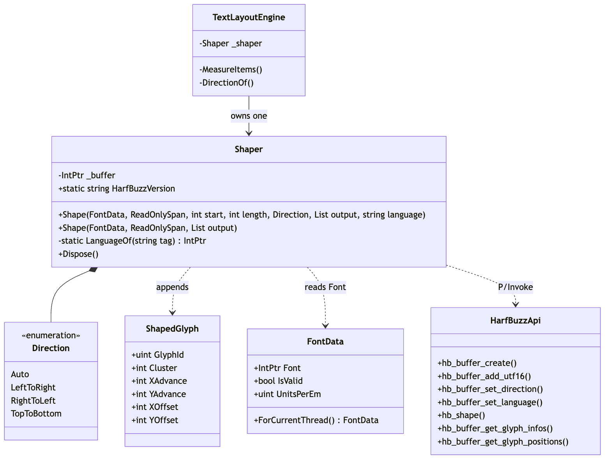
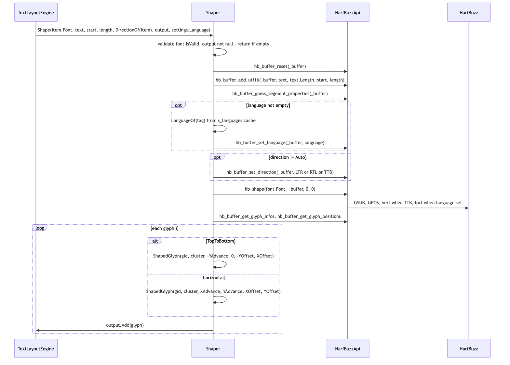
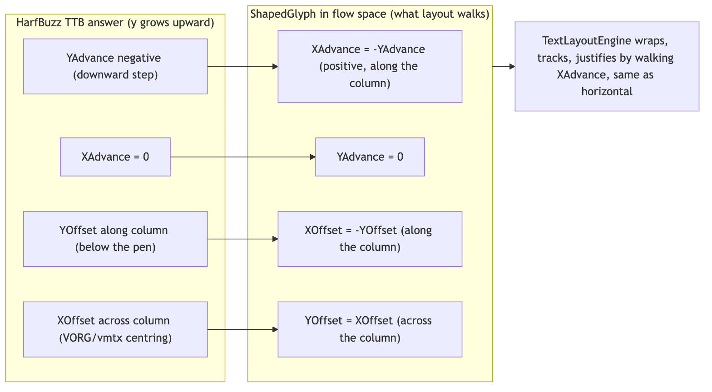

# Runtime/Core/Shaping

`Runtime/Core/Shaping` is the shaping stage: given a font, a span of UTF-16 text, a direction and optionally a BCP 47 language, `Shaper.Shape` asks HarfBuzz for the glyph ids, advances and offsets (GSUB/GPOS: ligatures, contextual forms, kerning, mark positioning, `vert`, `locl`) and appends one `ShapedGlyph` per glyph to a caller-owned list. It sits between analysis and layout: `TextLayoutEngine` has already split the paragraph into bidi runs and items (one font, one style, one direction each) and calls `Shape` once per item; the result is what layout wraps and what rendering later turns into atlas tiles. The folder is small (two files) because the work is HarfBuzz's; what this stage owns is the buffer, the direction mapping, and the vertical "flow space" convention.

## Files

| File | Responsibility |
|---|---|
| `Shaper.cs` | `Shaper : IDisposable`, one `hb_buffer_t` per instance; `Shaper.Direction` enum (`Auto`, `LeftToRight`, `RightToLeft`, `TopToBottom`); the `Shape` overloads (string / `ReadOnlySpan<char>`, with and without a language tag, whole-string convenience); `Shaper.HarfBuzzVersion`; the interned-language cache `LanguageOf` / `s_languages`; the vertical flow-space rotation. |
| `ShapedGlyph.cs` | `readonly struct ShapedGlyph`: `GlyphId`, `Cluster` (UTF-16 code-unit index), `XAdvance`, `YAdvance`, `XOffset`, `YOffset`, all in font design units. |

## Structure


<sub>Source: [diagrams/shaping-structure.mmd](diagrams/shaping-structure.mmd)</sub>

`Shaper` is a thin stateful wrapper: its only field is `_buffer`, created by `hb_buffer_create` in the constructor and destroyed in `Dispose` (also from the finalizer). `TextLayoutEngine` owns one (`_shaper`) for the lifetime of the engine; `AtlasPrewarm.WarmMarked` and `ShapedTextDebugView` create their own. A `Shaper` is not shared between threads; each worker in `Tests/Editor/ThreadSafetyTests.cs` creates its own.

The entry point callers use is

```
void Shape(FontData font, ReadOnlySpan<char> text, int start, int length,
           Direction direction, List<ShapedGlyph> output, string language)
```

with overloads that take a `string`, omit `language`, or shape a whole span as one `Direction.Auto` run (`Shape(font, text, output)`). `font` must be `IsValid` (an `ArgumentException` otherwise), `output` non-null; an empty span or non-positive length returns without touching the buffer. Glyphs are appended, never cleared, so a caller can accumulate several runs into one list (the engine does exactly this into `TextLayoutResult.Glyphs`).

`ShapedGlyph` is immutable and carries no scale: "divide by `FontData.UnitsPerEm` and multiply by point size to get render units" (its doc comment). `Cluster` is the UTF-16 index of the first code unit the glyph came from, relative to the whole `text` span, not to `start`, because the buffer is filled with the whole span and an item offset/length.

## Behaviour


<sub>Source: [diagrams/shaping-sequence.mmd](diagrams/shaping-sequence.mmd)</sub>

Step by step through `Shaper.Shape(FontData, ReadOnlySpan<char>, int, int, Direction, List<ShapedGlyph>, string)`:

1. **Validate** `font` / `output`; return early on empty input.
2. **`hb_buffer_reset(_buffer)`** so the buffer carries nothing from the previous call (contents, direction, language, script).
3. **`hb_buffer_add_utf16(_buffer, text, text.Length, start, length)`** inside a `fixed (char* p = text)` block: HarfBuzz gets the whole span as context and shapes only `[start, start+length)`. This is why Arabic joining forms at item boundaries are right and why `Cluster` values are absolute.
4. **`hb_buffer_guess_segment_properties`** sets script, direction and language from content.
5. **Language**: if `language` is non-empty, `LanguageOf(tag)` returns the interned `hb_language_t` (cached in `s_languages`, case-insensitive) and `hb_buffer_set_language` applies it. This is what drives OpenType `locl`, so a Han codepoint can draw its Japanese or Chinese form; `AsianTypographyTests.Locale_ReachesShaping` covers it.
6. **Direction**: `LeftToRight` / `RightToLeft` / `TopToBottom` call `hb_buffer_set_direction` with `HB_DIRECTION_LTR` (4) / `RTL` (5) / `TTB` (6); `Auto` leaves the guess in place. Setting TTB is the whole shaping side of vertical writing: HarfBuzz turns on `vert` and answers with `vmtx`/`VORG` metrics.
7. **`hb_shape(font.Font, _buffer, IntPtr.Zero, 0)`**: no feature array, so the font's defaults apply.
8. **Read back** `hb_buffer_get_glyph_infos` and `hb_buffer_get_glyph_positions` (pointers into the buffer) and append one `ShapedGlyph` per glyph. Glyphs come back in visual order for the run (RTL runs are reversed by HarfBuzz); `ShapingTests.Arabic_OutputsVisualOrder_RightToLeft` asserts this.


<sub>Source: [diagrams/shaping-vertical-flow-space.mmd](diagrams/shaping-vertical-flow-space.mmd)</sub>

For `Direction.TopToBottom` the read-back is different, and the comment in `Shape` explains why. HarfBuzz places a vertical run with y growing upward and the pen at the glyph's vertical origin: `YAdvance` is negative (downward) and the offsets already carry the VORG/vmtx correction. `Shaper` negates the y axis and swaps the roles so that the `ShapedGlyph` comes out in **flow space**: `XAdvance = -YAdvance` (positive, along the column), `YAdvance = 0`, `XOffset = -YOffset` (along the column), `YOffset = XOffset` (across the column). Everything above shaping (wrapping, tracking, justification, ruby, hit testing) measures a run by walking `XAdvance`, so a vertical column is the same walk in a frame turned ninety degrees, and the layout engine needs no second arithmetic. `VerticalTests.VerticalGlyphs_ComeBackInFlowSpace` and `TopToBottomShaping_SelectsTheVerticalForms` pin both halves.

How the engine picks the direction (`TextLayoutEngine.DirectionOf`): in a vertical layout, a rotated item (Latin inside a CJK column) is shaped `LeftToRight` and an upright item `TopToBottom`; in a horizontal layout, odd bidi level means `RightToLeft`, even means `LeftToRight`. `Auto` is what the whole-string convenience overload passes, and that overload is used by `AtlasPrewarm.WarmMarked` (one codepoint at a time), `ShapedTextDebugView` and tests, never by the layout path. The engine also uses two throwaway shapes per (font, codepoint) in `HasVerticalForm` to find out whether a UAX #50 `Tr` character has a `vert` form, by comparing the LTR and TTB glyph ids, and caches the answer in `_verticalForms`.

## Invariants and conventions

- **Units**: everything in `ShapedGlyph` is font design units; `Cluster` is a UTF-16 code-unit index into the span passed to `Shape`. Layout converts with `FontSize / UnitsPerEm`.
- **One `Shaper` per thread.** The buffer is mutable state; concurrent `Shape` calls on one instance corrupt each other. The font side has its own rule: pass `FontData.ForCurrentThread()` on worker threads (an `hb_font_t` is not shareable even when the face is).
- **No allocation on the hot path.** `Shape` allocates nothing after the first call for a given language tag (`LanguageOf` caches the interned pointer; HarfBuzz never frees `hb_language_t`). `AllocationTests.Shaping_A_Run_Does_Not_Allocate` enforces it. `HarfBuzzVersion` does allocate (a string) and is for diagnostics.
- **Output is appended, not replaced.** Callers that want a fresh list clear it first (`_probe.Clear()`, `_scratch.Clear()` in the engine).
- **Buffer pointers do not escape.** `hb_buffer_get_glyph_infos/positions` return pointers valid until the next buffer call; `Shape` copies into `ShapedGlyph` before returning.
- **Direction is the caller's decision**, from bidi level parity or orientation; `Auto` is a convenience for single-run callers, not something the layout path uses.
- **Flow-space rotation happens here and only here.** Anything that reads a TTB `ShapedGlyph` must treat `XAdvance` as "along the column" and `YOffset` as "across the column"; the raw HarfBuzz axes are not available above this layer.
- **No features are passed to `hb_shape`.** Ligatures, kerning, `vert`, `locl` are whatever the font enables by default for the direction and language; there is no per-run feature control today.

## Extending

- **Per-run OpenType features** (e.g. `smcp`, `tnum`, turning `liga` off): `hb_shape` takes a feature array that is currently `IntPtr.Zero, 0`. Add an `HBFeature` struct and the array parameter in `Native/HarfBuzzApi.cs`, thread a feature list through `Shape`, and have `TextLayoutEngine.MeasureItems` / the emit-time `Shape` call pass it from the style. Measure and emit must see the same features or a line will measure one width and draw another (the engine comments make this point about tracking). Cover it in `Tests/Editor/ShapingTests.cs`.
- **A new direction** (e.g. bottom-to-top) means a new `Direction` member, a new `HB_DIRECTION_*` constant in `HarfBuzzApi`, and a decision about flow space in the read-back loop.
- **Script-aware shaping** (explicit `hb_buffer_set_script`) is not bound today; `hb_buffer_guess_segment_properties` does it from content per run. If itemization ever produces script runs, add the extern and set it after the guess.
- **Tests that cover this folder**: `Tests/Editor/ShapingTests.cs` (library loads and reports version, Latin one glyph per letter, Arabic contextual forms, RTL visual order, zero-advance marks, outline extraction), `Tests/Editor/VerticalTests.cs` (vertical forms, flow space), `Tests/Editor/EmojiSequenceTests.cs` (every supported sequence in `Tests/UnicodeData~/emoji-test.txt` shapes to one glyph; ZWJ families, regional-indicator flags, skin-tone modifiers, keycaps, variation selectors, tag sequences; needs a colour emoji font from `Tools/fetch_coverage_fonts.py`), `Tests/Editor/AsianTypographyTests.cs` (`Locale_ReachesShaping`), `Tests/Editor/AllocationTests.cs` (`Shaping_A_Run_Does_Not_Allocate`), `Tests/Editor/ThreadSafetyTests.cs` (`ConcurrentShaping_MatchesSingleThreadedShaping`), `Tests/Editor/CodepointCoverageTests.cs`, `Tests/Editor/NativesTests.cs` (`HarfBuzzLoadsAndReportsItsVersion`).

## Gotchas

1. **`Cluster` is absolute, not relative to `start`.** The engine clamps it into `[item.Start, item.End - 1]` when indexing per-character arrays (`MeasureItems`); do the same in new code.
2. **Vertical glyphs are already rotated.** Reading a TTB `ShapedGlyph` as if `XAdvance` were horizontal draws the column sideways; reading HarfBuzz's sign convention into it double-negates. The comment block in `Shape` is the reference.
3. **Measure and emit must shape the same way.** `TextLayoutEngine.Measure` picks the same direction the run will be shaped in because "vertical metrics are a different table, not a rotation of the horizontal ones"; the same applies to language. A mismatch is a line that fits on measure and overflows on draw.
4. **A `Shaper` must be disposed** or its `hb_buffer_t` lives until the finalizer; `TextLayoutEngine.Dispose` disposes its shaper, `AtlasPrewarm` uses `using`.
5. **No language means no `locl`.** A label without `settings.Language` gets the font's default regional forms; the tests `Locale_SelectsTheRegionalForm` and `Locale_DecidesWhichFontDrawsAUnifiedCodepoint` show what the tag changes.
6. **`Direction.Auto` can surprise on mixed text**: it is one guess for the whole run. The layout path never uses it; if you add a new caller, take the direction from `BidiRuns` like the engine does.
7. **The `HarfBuzzVersion` getter marshals a string every call**; it is for `NativesTests` and diagnostics, not for per-frame code.

## Related

- [../Native/README.md](../Native/README.md) for the externs used here and library-name rules.
- [../Unicode/README.md](../Unicode/README.md) for where runs and directions come from (`BidiRuns`, `VerticalOrientationLookup`).
- [../Layout/README.md](../Layout/README.md) for `TextLayoutEngine.BuildItems`, `MeasureItems`, `DirectionOf`, and how `ShapedGlyph` becomes `TextQuad`.
- [../Fonts/README.md](../Fonts/README.md) for `FontData` (the `Font` handle, `UnitsPerEm`, `ForCurrentThread`).
- [`Docs/ARCHITECTURE.md`](../../../../Docs/ARCHITECTURE.md), stage 3.
