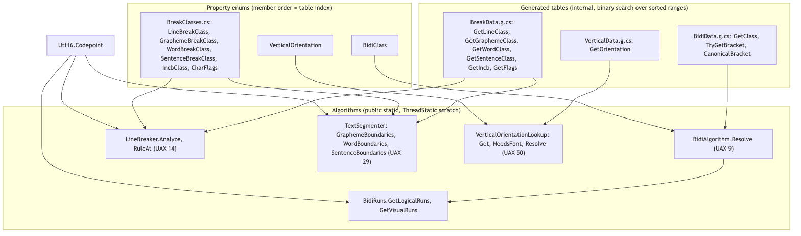
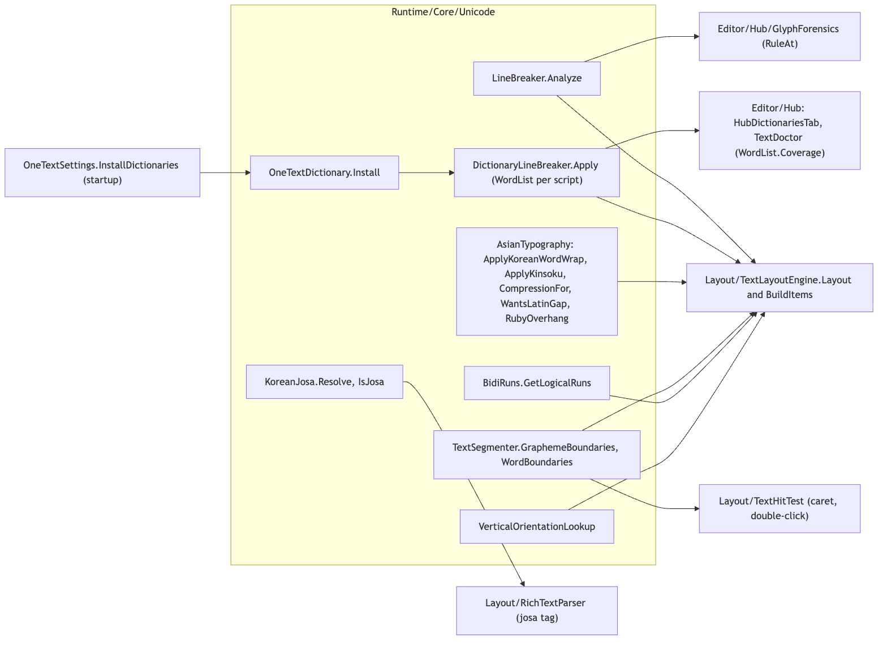
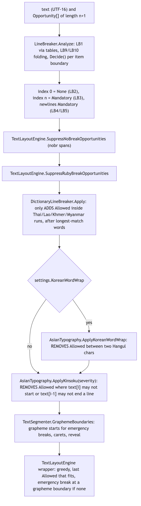
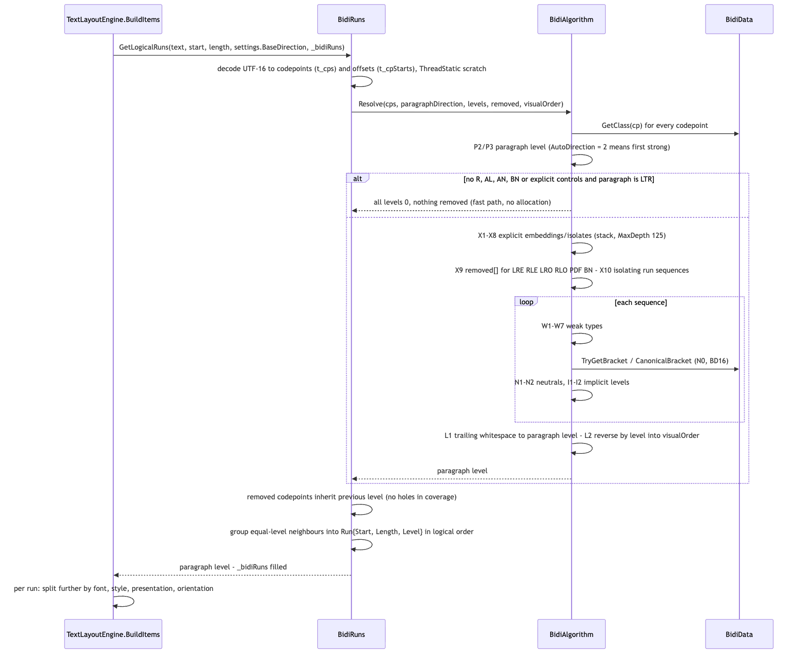
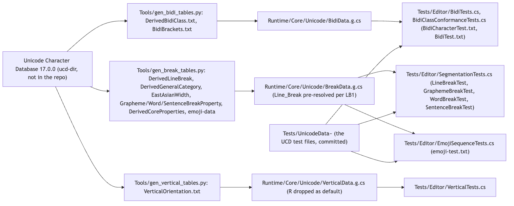

# Runtime/Core/Unicode

`Runtime/Core/Unicode` (namespace `OneText.Unicode`) is the analysis stage: everything that has to be known about a string before it can be shaped or wrapped, and that does not depend on a font. It implements the Unicode Bidirectional Algorithm (UAX #9, `BidiAlgorithm` + `BidiRuns`), line breaking (UAX #14, `LineBreaker`), text segmentation (UAX #29, `TextSegmenter`), vertical orientation (UAX #50, `VerticalOrientationLookup`), the East Asian tailorings UAX #14 leaves to implementations (`AsianTypography`: kinsoku, Korean word wrap, punctuation compression, CJK-Latin gap, ruby overhang), dictionary line breaking for the scripts that write no spaces (`DictionaryLineBreaker`, `WordList`, `OneTextDictionary`), Korean particle selection (`KoreanJosa`), and the generated UCD property tables behind all of it. `TextLayoutEngine` calls these in a fixed order at the start of every `Layout` and per paragraph; `RichTextParser` and `TextHitTest` call two of them directly. Every algorithm here is validated against the official UCD conformance files committed under `Tests/UnicodeData~`.

"Script itemization" and "emoji" are not separate files in this folder: itemization into runs happens in `TextLayoutEngine.BuildItems` (by bidi level, then font, style, emoji presentation selector and vertical orientation, all per grapheme cluster), and emoji are handled through the `CharFlags.Pictographic` / `Extended_Pictographic` data in `BreakData`, the `RegionalIndicator` and `ZWJ` rules in `LineBreaker` and `TextSegmenter`, and the `FontStack.Presentation` chosen from U+FE0E/U+FE0F in the engine. This doc points at those places rather than inventing a module for them.

## Files

| File | Responsibility |
|---|---|
| `BidiClass.cs` | `enum BidiClass : byte` with the 23 Bidi_Class values in UAX #9 Table 4 order (`L, R, AL, EN, ES, ET, AN, CS, NSM, BN, B, S, WS, ON, LRE, RLE, LRO, RLO, PDF, LRI, RLI, FSI, PDI`). |
| `BidiData.g.cs` | Generated by `Tools/gen_bidi_tables.py` (UCD 17.0.0). `internal static BidiData`: `GetClass(int)` (binary search over sorted ranges, default `L`), `TryGetBracket(cp, out paired, out isOpen)`, `CanonicalBracket` (BD16: U+3008/3009 to U+2329/232A). |
| `BidiAlgorithm.cs` | `public static BidiAlgorithm.Resolve(IReadOnlyList<int> codepoints, byte paragraphDirection, byte[] levels, bool[] removed, List<int> visualOrder)`: the full UAX #9 (X1-X10, W1-W7, N0 brackets, N1-N2, I1-I2, L1-L2) with an all-LTR fast path. `AutoDirection = 2`. |
| `BidiRuns.cs` | Bridge to shaping: `BidiRuns.Run { Start, Length, Level, IsRightToLeft }`; `GetLogicalRuns(text, start, length, paragraphDirection, output)` (used by the engine) and `GetVisualRuns(text, paragraphDirection, output)`; both UTF-16 in, runs out. |
| `BreakClasses.cs` | The break-property enums: `LineBreakClass` (after LB1 resolution), `GraphemeBreakClass`, `WordBreakClass`, `SentenceBreakClass`, `IncbClass`, and `[Flags] CharFlags` (`InitialPunctuation`, `FinalPunctuation`, `EastAsianWide`, `Pictographic`, `Unassigned`). |
| `BreakData.g.cs` | Generated by `Tools/gen_break_tables.py` (UCD 17.0.0). `internal static BreakData`: `GetLineClass` (default `AL`), `GetGraphemeClass`, `GetWordClass`, `GetSentenceClass` (default `Other`), `GetIncb` (default `None`), `GetFlags` (default `None`). |
| `LineBreaker.cs` | `public static LineBreaker`: `Opportunity` enum (`None`, `Allowed`, `Mandatory`), `Analyze(text, Opportunity[])` implementing LB1-LB31 of Unicode 17 (LB9/LB10 folding, LB25 numbers, LB28a Brahmic), `RuleAt(text, index)` naming the rule that decided a boundary (diagnostics, allocates). |
| `TextSegmenter.cs` | `public static TextSegmenter`: `GraphemeBoundaries` (GB1-GB999 incl. GB9c), `WordBoundaries` (WB1-WB999), `SentenceBoundaries` (SB1-SB998), `CountGraphemes`; all fill a `List<int>` of UTF-16 offsets. |
| `DictionaryLineBreaker.cs` | `WordList` (UTF-16 trie, `Add`, `AddAll` in ICU newline format, `LongestMatch`, `Coverage`) and `public static DictionaryLineBreaker` (`Apply`, `SetWordList`, `GetWordList`, `ScriptOf`, `NeedsDictionary`, `EnsureDefaults`, `ClearAll`, `ResetToDefaults`, `BuiltInThai`). |
| `OneTextDictionary.cs` | `OneTextDictionary : ScriptableObject` (namespace `OneText`): a deflate-compressed word list asset with `Script`, `SourcePath`, `Notice`, `WordCount`; `Words` builds the trie once, `Install()` registers it, `Initialize(...)` is the editor-side import. |
| `AsianTypography.cs` | `public static AsianTypography`: `Kinsoku` severity enum (`Off`, `Loose`, `Normal`, `Strict`), `ForbiddenAtLineStart/End`, `ApplyKinsoku`, `ApplyKoreanWordWrap`, `IsHangul`, `CompressionFor`, `CompressionAtLineStart/End`, `MayCompress`, `IsCompressible`, `IsOpeningPunctuation`, `RubyOverhangBefore/After`, `WantsLatinGap`, `IsIdeographic`, `IsLatinish`, `TailoredCharacters`. |
| `KoreanJosa.cs` | `public static KoreanJosa`: `IsJosa`, `Resolve(preceding, particle)`, `TryGetFinalConsonant`; ten particle pairs, the (으)로-after-ㄹ exception, digits read aloud. |
| `VerticalOrientation.cs` | `enum VerticalOrientation : byte` (`Rotated`, `Upright`, `TransformedUpright`, `TransformedRotated`) and `public static VerticalOrientationLookup` (`Get`, `IsUpright`, `Resolve(orientation, hasVerticalForm)`, `NeedsFont`). |
| `VerticalData.g.cs` | Generated by `Tools/gen_vertical_tables.py` (UCD 17.0.0). `internal static VerticalData.GetOrientation(int)`, default `Rotated`. |
| `Utf16.cs` | `Utf16.Codepoint(ReadOnlySpan<char>, int)`: the span overload `char.ConvertToUtf32` lacks; a lone surrogate is returned as itself, not thrown. |

## Structure

Source: [diagrams/unicode-structure.mmd](diagrams/unicode-structure.mmd)

Three layers. At the bottom, the three `*.g.cs` tables: sorted, non-overlapping codepoint ranges in parallel `int[]` start / `int[]` end / `byte[]` value arrays (`RangeStarts`/`RangeEnds`/`RangeClasses` in `BidiData`, `LineStarts`/`LineEnds`/`LineValues` and so on per property in `BreakData`, `RangeStarts`/`RangeEnds`/`RangeValues` in `VerticalData`), looked up by binary search, with the most common value dropped from the table and returned as the default (`L`, `AL`, `Other`, `Rotated`). They are `internal`, carry the Unicode licence header, and say "Do not edit by hand". Above them, the enums in `BidiClass.cs`, `BreakClasses.cs`, `VerticalOrientation.cs` whose member order is the table's index order (the generator and the enum must agree; `gen_break_tables.py` lists the same class strings). At the top, the public static algorithms. There is no instance state anywhere in the folder except `WordList` / `OneTextDictionary` and the static dictionary registry in `DictionaryLineBreaker`.

Entry points a caller uses, in the order `TextLayoutEngine.Layout` calls them:

1. `LineBreaker.Analyze(text, opportunities)` once per layout (skipped for the engine's ASCII "simple" fast path).
2. `DictionaryLineBreaker.Apply(text, opportunities)`, `AsianTypography.ApplyKoreanWordWrap` (if `settings.KoreanWordWrap`), `AsianTypography.ApplyKinsoku(text, opportunities, settings.Kinsoku)`.
3. `TextSegmenter.GraphemeBoundaries(text, _graphemes)`; the result is published as `TextLayoutResult.GraphemeStarts`.
4. Per paragraph: `BidiRuns.GetLogicalRuns(text, start, length, settings.BaseDirection, _bidiRuns)` (horizontal only; a vertical layout uses one level-0 run), then `VerticalOrientationLookup.Get / NeedsFont / Resolve` per grapheme in a vertical layout.
5. During measurement and emit: `AsianTypography.CompressionFor`, `CompressionAtLineStart/End`, `MayCompress`, `WantsLatinGap`, `RubyOverhangBefore/After`, `IsOpeningPunctuation`; and `ForbiddenAtLineStart/End` as a preference in the emergency break.

Source: [diagrams/unicode-consumers.mmd](diagrams/unicode-consumers.mmd)

Outside the engine: `RichTextParser` resolves `<josa=...>` with `KoreanJosa.Resolve(result.TextSpan, josa)` at parse time; `TextHitTest` uses `TextSegmenter.GraphemeBoundaries` and `WordBoundaries` for caret and double-click; `Editor/Hub/GlyphForensics.cs` uses `LineBreaker.RuleAt`; the Hub dictionaries tab and `TextDoctor` use `WordList.Coverage`.

## Behaviour

Source: [diagrams/unicode-break-table-passes.mmd](diagrams/unicode-break-table-passes.mmd)

**Line breaking is a table that several passes edit.** `LineBreaker.Analyze` fills `opportunities[i]` with what is allowed *before* UTF-16 index `i`; the array must be `text.Length + 1` long, index 0 is always `None` (LB2) and index `n` always `Mandatory` (LB3). Internally it decodes the text into `Item`s (`Offset`, `Class`, `Flags`, `DottedCircle`, `ZwjBefore`), applying LB1 through the table (the generator pre-resolves AI/SG/XX to AL, CJ to NS, SA to CM or AL) and folding LB9 (a CM/ZWJ after a non-space base takes the base's class and disappears from the rule stream) and LB10 (a leftover mark becomes AL). `Decide(items, k, out rule)` then runs the rules LB4 through LB31 in order for each adjacent item pair and returns the first that fires; `RuleAt` re-runs `Decide` to report the rule name. Items are a `[ThreadStatic] List<Item>` reused across calls.

The engine then edits the table: `SuppressNoBreakOpportunities` and `SuppressRubyBreakOpportunities` (engine-side), then `DictionaryLineBreaker.Apply`, which only ever **adds** `Allowed` after dictionary words inside a run of one dictionary script and never before the run's first character; then `ApplyKoreanWordWrap`, which only **removes** `Allowed` between two `IsHangul` characters (UAX #14 gives Hangul class ID, correct for Japanese, wrong for Korean, and per-locale rather than global); then `ApplyKinsoku`, which only **removes** `Allowed` where `text[i]` is forbidden at a line start or `text[i-1]` at a line end for the chosen `Kinsoku` severity (`Off` = return without touching the table, `Loose` = punctuation lists only, `Normal` adds `SmallKana`, `Strict` adds `StrictOnly`). Because tailoring only removes, a run like "！！！！" can end up with no legal break at all; the wrapper then falls back to an emergency grapheme-cluster break, consulting kinsoku only as a preference between boundaries that fit (`AsianTypographyTests.RepeatedExclamation_DoesNotBreakWrappingEntirely`, `EmergencyBreak_PrefersALegalBoundary`).

**Dictionary breaking** (`DictionaryLineBreaker.Segment`): longest match left to right through the script's `WordList` trie (bounded by `LongestWord`), with the standard fallback of skipping one character when nothing matches, so names and loanwords do not turn the rest of a sentence into one unbreakable line. `ScriptOf(char)` recognizes the Thai, Lao, Khmer and Myanmar blocks by range; lists are keyed by those names. `EnsureDefaults` installs `BuiltInThai()` (an 89-word starter list) on first `Apply` unless a list was set or `ClearAll` was called; `OneTextSettings.InstallDictionaries` replaces it with project `OneTextDictionary` assets before the first scene (see the Core README). `WordList.Coverage(sample)` reports matched/total characters so "Thai wraps" can be checked rather than assumed.

**Segmentation** (`TextSegmenter`): each of the three public methods decodes into `[ThreadStatic]` codepoint and offset lists, then asks `GraphemeBreaks` / `WordBreaks` / `SentenceBreaks` at every codepoint boundary. Graphemes are what "one character" means for caret movement, selection, backspace, reveal and per-cluster effects (the engine also uses them to keep font and style choices from splitting a mark from its base). The word rules look through `WB4` ignorables with `PreviousSignificant` / `NextSignificant`; the sentence rules implement SB8's unbounded right-context scan (`LowerAheadOfSB8`) rather than a windowed approximation, and the comments explain why SB4's ordering makes the optional ParaSep in SB11 unnecessary.

Source: [diagrams/unicode-bidi-sequence.mmd](diagrams/unicode-bidi-sequence.mmd)

**Bidi.** `BidiRuns.GetLogicalRuns` decodes the paragraph into codepoints (`t_cps`) and their UTF-16 starts (`t_cpStarts`, with an end sentinel), calls `BidiAlgorithm.Resolve`, gives every X9-removed codepoint the level of its predecessor so runs cover the range without holes, and groups equal-level neighbours into `Run`s in logical order. Line breaking works in logical order; each line reorders its own runs afterwards (`TextLayoutEngine.ReorderVisually` applies L2 to whole runs by descending level). `GetVisualRuns` returns visual-order runs for a whole paragraph and is not used by the runtime today. `BidiAlgorithm.Resolve` itself: classes from `BidiData.GetClass`; P2/P3 when `paragraphDirection == AutoDirection`; then the fast path: if nothing `IsDirectionallyHard` (R, AL, AN, BN, or any explicit control) and the paragraph is LTR, every level is 0 and nothing allocates. Otherwise X1-X8 with a `Status` stack (`MaxDepth = 125`, overflow counters), X9 `removed[]`, X10 isolating run sequences, and per sequence `ResolveSequence` (W1-W7, `ResolveBrackets` for N0/BD16 with the 63-deep stack limit, N1-N2, I1-I2, using `xlevels` so later sequences see pre-I-rule levels), then L1 and L2. The full path allocates lists per call; the comment on `s_types` notes the scratch arrays are reused per thread.

**Vertical orientation.** `VerticalOrientationLookup.Get` reads the UAX #50 value; `U` and `Tu` are upright, `R` is rotated, and `Tr` ("transformed, fallback rotated") needs the font: `NeedsFont` is true only for `Tr`, and `Resolve(orientation, hasVerticalForm)` takes the answer the engine gets by shaping the character both ways (`TextLayoutEngine.HasVerticalForm`). The table drops `R` (Unicode's default) so it is essentially the CJK half of the property.

**Korean particles.** `KoreanJosa.Resolve(preceding, particle)` accepts either spelling of a pair, walks back over trailing space/punctuation to the last syllable or digit, computes jongseong as `(c - 0xAC00) % 28` (or from the digit's reading: 0/1/3/6/7/8 have one), applies the ㄹ exception for `으로`/`로서`/`로써`, and returns the particle unchanged for non-Korean text or unknown particles.

## Invariants and conventions

- **Units and indices**: every public API takes UTF-16 `string` / `ReadOnlySpan<char>` and returns UTF-16 code-unit offsets. Codepoint decoding uses `Utf16.Codepoint`, which returns a lone surrogate as itself rather than throwing. `Opportunity[]` is indexed by "break before this code unit" and needs `Length + 1` entries.
- **Tailoring direction**: `LineBreaker.Analyze` decides; `DictionaryLineBreaker.Apply` only adds `Allowed`, and only inside runs of its four scripts; `ApplyKoreanWordWrap` and `ApplyKinsoku` only remove `Allowed`. None of them touch `Mandatory`. Keep that so a tailoring can never break text far from what it is about.
- **Order of passes is fixed** in `TextLayoutEngine.Layout`: analyze, engine suppressions, dictionary, Korean, kinsoku, then graphemes. The engine comment explains the ordering ("the Korean rule decides where syllables may break at all, then kinsoku takes away the breaks that would strand punctuation").
- **Allocation**: `LineBreaker`, `TextSegmenter`, `BidiRuns` and `BidiAlgorithm`'s fast path use `[ThreadStatic]` scratch (`t_items`, `t_cps`, `t_offsets`, `t_levels`, `t_removed`, `s_types`, `s_orig`, `s_xlevels`) and allocate nothing in steady state; the engine owns the `Opportunity[]` and grows it geometrically. The allocating conveniences (`LineBreaker.Analyze(text)` returning an array, `RuleAt`, `CountGraphemes`) are for tests and diagnostics. `BidiAlgorithm.Resolve`'s full (non-LTR) path does allocate lists per call. `AllocationTests.Laying_Out_Fresh_Text_Does_Not_Allocate` covers the LTR path through the engine.
- **Threading**: the `[ThreadStatic]` scratch makes the pure algorithms safe to call from several threads at once. `DictionaryLineBreaker`'s registry is explicitly *not* synchronized ("layout is main-thread, and a dictionary is installed at startup rather than mid-frame"). `AsianTypography`'s arrays are sorted once in the static constructor and read-only afterwards.
- **Tables are generated, never edited.** `BidiData.g.cs`, `BreakData.g.cs`, `VerticalData.g.cs` come from `Tools/gen_*_tables.py` against UCD 17.0.0; enum member order in `BidiClass.cs`, `BreakClasses.cs`, `VerticalOrientation.cs` is the table's value encoding and must match the generator's class lists. Defaults (`L`, `AL`, `Other`, `None`, `Rotated`) are what an unlisted codepoint gets.
- **`LineBreakClass` is post-LB1**: `SA`, `AI`, `SG`, `XX`, `CJ` do not exist at runtime. Thai/Lao/Khmer/Myanmar letters arrive as `AL`/`CM`, which is why the dictionary pass exists.
- **Kinsoku lists are `char`-based** (BMP only), and `IsHangul` / `IsIdeographic` / `IsLatinish` / `ScriptOf` are range tests on `char`; supplementary-plane CJK is not covered by the tailorings.
- **`MayCompress` must never reject a mark `IsCompressible` accepts**; `AsianTypographyTests.CompressionPrefilter_NeverRejectsAMarkTheRulesAccept` enforces it, because the prefilter is a hand-written range test over three blocks.
- **Dictionary registry lifecycle**: `SetWordList` sets `s_installedDefaults = true` so an explicit list is never overwritten by the built-in one; `ClearAll` leaves Thai unbroken; tests use `ResetToDefaults`.

## Extending

Source: [diagrams/unicode-table-generation.mmd](diagrams/unicode-table-generation.mmd)

- **A new UAX #14 rule or a Unicode version bump**: regenerate the three tables with `python3 Tools/gen_bidi_tables.py <ucd-dir> Runtime/Core/Unicode/BidiData.g.cs`, `gen_break_tables.py`, `gen_vertical_tables.py` (each script's docstring lists the UCD files it needs), update the version in the file headers and the class doc comments, replace the conformance files in `Tests/UnicodeData~` (`BidiCharacterTest.txt`, `BidiTest.txt`, `LineBreakTest.txt`, `GraphemeBreakTest.txt`, `WordBreakTest.txt`, `SentenceBreakTest.txt`, `emoji-test.txt`, `UnicodeData.txt`), and add the rule to `LineBreaker.Decide` in rule-number order with a `Rule("LBxx", ...)` wrapper so `RuleAt` can name it. If a rule needs a new property, add a `CharFlags` bit and teach `gen_break_tables.py` to emit it. A new `LineBreakClass` member must be appended in the generator's `LINE_CLASSES` order.
- **A new kinsoku character or compression mark**: add it to the relevant `char[]` in `AsianTypography.cs` (order does not matter; the static constructor sorts), and if it is a compression mark make sure `MayCompress`'s three ranges still contain it (the prefilter test will fail otherwise). `TailoredCharacters()` exposes the lists to tooling.
- **A new dictionary script**: extend `DictionaryLineBreaker.ScriptOf` with the block and name, ship a starter `WordList` if wanted, and the `OneTextDictionary` inspector's script field (a string) already accepts it. Full lists are project assets created in the Hub dictionaries tab (`Editor/Hub/HubDictionariesTab.cs`), stored deflate-compressed with the licence `Notice`.
- **A new josa pair**: add a `Pair` to `KoreanJosa.Pairs`; `IsJosa` and the parser's tag recognition pick it up. Cover it with a `[TestCase]` in `AsianTypographyTests` (`Josa_ResolvesEitherSpelling` and neighbours).
- **A new segmentation consumer** (e.g. sentence-at-a-time reveal): `SentenceBoundaries` already exists and is validated; take a `List<int>` and reuse it.
- **Tests that cover this folder**: `Tests/Editor/BidiTests.cs` (complete `BidiCharacterTest.txt` plus a mixed-direction sanity check), `Tests/Editor/BidiClassConformanceTests.cs` (complete `BidiTest.txt`, 700,000+ expanded cases, plus a check that each representative character really has its class), `Tests/Editor/SegmentationTests.cs` (complete `LineBreakTest.txt`, `GraphemeBreakTest.txt`, `WordBreakTest.txt`, `SentenceBreakTest.txt`, `Wrapping_Basics`, `Graphemes_Keep_Emoji_And_Marks_Together`), `Tests/Editor/AsianTypographyTests.cs` (kinsoku, severity, emergency break, Korean wrap, CJK-Latin gap, compression, josa, Thai dictionary, ICU format, locale), `Tests/Editor/VerticalTests.cs` (`VerticalOrientation_MatchesTheProperty`, `Emoji_IsUpright`, `OnlyTheTransformedRotatedClass_HasToAskTheFont`, and the column layout tests), `Tests/Editor/EmojiSequenceTests.cs` (every supported sequence in `emoji-test.txt` through shaping and the whole label path), `Tests/Editor/RubyTests.cs` (overhang rules), `Tests/Editor/HubTests.cs` / `HubWindowTests.cs` (dictionary assets and coverage), `Tests/Editor/AllocationTests.cs`.

## Gotchas

1. **`Opportunity[]` is "before index i" and one longer than the text.** Off-by-one here shows up as a word that never wraps or a break at index 0. `Analyze` clears `n + 1` entries and sets `[n] = Mandatory` itself.
2. **Korean wraps between syllables unless `settings.KoreanWordWrap` is on.** That is UAX #14's ID class behaving as designed; the tailoring is per label/locale, not global (`AsianTypographyTests.KoreanWordWrap_IsPerLocale_NotGlobal`).
3. **Kinsoku can remove every break.** By design; the wrapper's emergency grapheme break is what keeps the text on screen. If a new tailoring is added, it must also only remove, or the emergency path's assumptions change.
4. **Thai out of the box is a starter list.** `BuiltInThai` is 89 words; `WordList.Coverage` on real text will say so. Projects that ship Thai should import ICU's list as an `OneTextDictionary` (`AsianTypographyTests.WordList_LoadsIcuFormat_AndReportsCoverage`). Unknown words do not stop the segmenter (`UnknownWords_DoNotStopTheSegmenter`).
5. **`BidiAlgorithm.Resolve`'s full path allocates.** Only the all-LTR fast path is allocation-free. Arabic/Hebrew labels that re-layout every frame pay for `List<Status>`, `runs`, `sequences`, `runByStart`, bracket stacks. The source comment on `s_types` documents only the reused scratch arrays; the full-path lists are plain `new` per call with no comment. Not a correctness issue.
6. **Vertical text skips bidi.** `BuildItems` uses one level-0 run in a vertical layout ("Bidi inside a column is out of scope for this milestone"); an Arabic word in a Japanese column is not reordered.
7. **`Tr` needs a font.** `VerticalOrientationLookup.Resolve` with the wrong `hasVerticalForm` turns 「 the wrong way; only the engine, which can shape, can answer it, and it caches the answer per (font, codepoint) in `_verticalForms`. `VerticalTests.OnlyTheTransformedRotatedClass_HasToAskTheFont` guards the cost.
8. **Josa skips trailing punctuation and spaces but stops at anything else.** `사과)` and `사과 ` resolve; `Item을` (Latin before the particle) is left exactly as written, which the comment calls a real case where guessing would be worse (`Josa_LeavesNonKoreanAlone`).
9. **SB8 scans ahead without a bound.** `LowerAheadOfSB8` is the one segmentation rule that cannot be decided from a fixed window; it is cheap in prose because any letter or terminator stops it, but a very long run of digits and punctuation after a period will walk all of it.
10. **`RuleAt` and `LineBreaker.Analyze(string)` allocate** and re-run the whole analysis; they are for the Hub's forensics, not for layout.
11. **Emoji presentation is decided by the fallback walk, not here.** U+FE0E/U+FE0F are read in `TextLayoutEngine.PresentationAt` and passed to `FontStack.Resolve`; this folder only keeps the variation selector inside the grapheme (GB9) and the ZWJ/RI sequences together (GB11, GB12/13, LB8a, LB30a, WB3c, WB15/16).

## Related

- [../Layout/README.md](../Layout/README.md): `TextLayoutEngine.Layout`, `BuildItems`, `SuppressNoBreakOpportunities`, `ReorderVisually`, `PresentationAt`, the emergency break, `TextHitTest`.
- [../Shaping/README.md](../Shaping/README.md): what happens to a `BidiRuns.Run` once it is an item, and `Direction.TopToBottom` for the `vert` half of UAX #50.
- [../Fonts/README.md](../Fonts/README.md): `FontStack.Presentation` and fallback resolution.
- [../README.md](../README.md): `OneTextSettings.InstallDictionaries` and startup order.
- `Tools/gen_bidi_tables.py`, `Tools/gen_break_tables.py`, `Tools/gen_vertical_tables.py`; `Tests/UnicodeData~` for the conformance files.
- [`Docs/ARCHITECTURE.md`](../../../../Docs/ARCHITECTURE.md), stage 2 and "Testing strategy".
