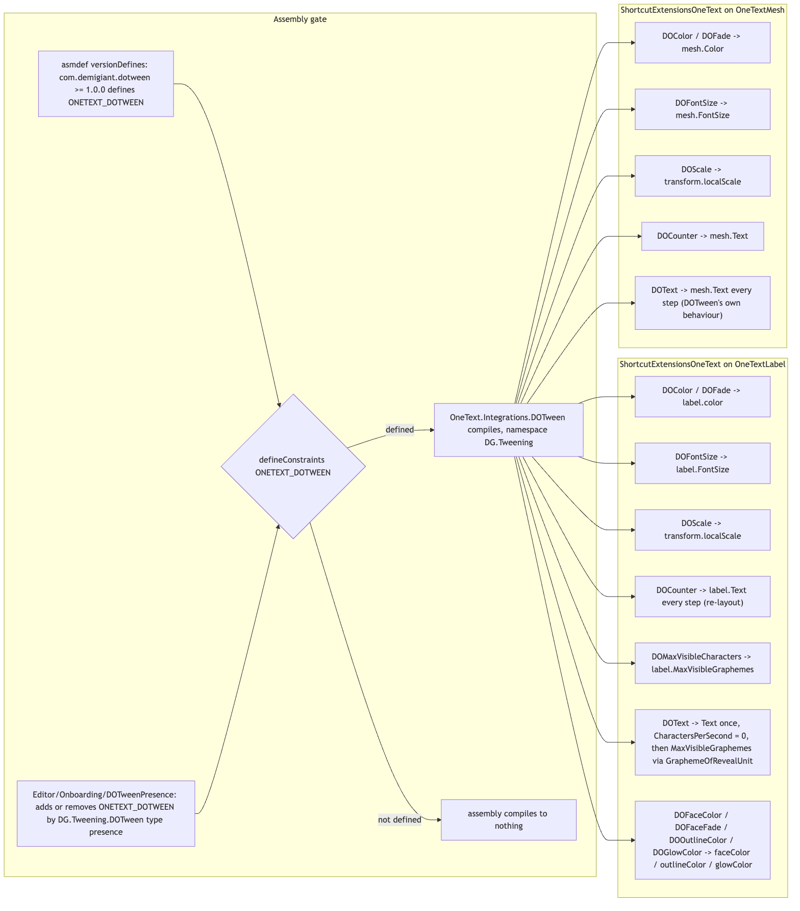

# Runtime/Integrations/DOTween

DOTween Pro's TextMesh Pro shortcuts (`DOText`, `DOColor`, `DOFade`, `DOFontSize`, `DOScale`,
`DOCounter`, `DOMaxVisibleCharacters`, ...) re-pointed at `OneTextLabel` and `OneTextMesh`, with
the same names, argument order, defaults, return types and `SetTarget`/`SetOptions` conventions, so
a call site written against `TMP_Text` compiles unchanged after a migration. It is a thin layer
over the **frontend** end of the pipeline (string -> parse -> analyze -> shape -> layout ->
render -> frontend): every shortcut drives a public property of the label or mesh — or, for
`DOScale`, its `transform.localScale` — and nothing else. The assembly exists only when DOTween
does: it is constrained on the `ONETEXT_DOTWEEN` define and compiles to nothing without it. This is the only third-party integration OneText ships,
and the source says so explicitly: a decision about DOTween, not a plugin framework.

## Files

| File | Responsibility |
|---|---|
| `OneTextDOTweenShortcuts.cs` | `DG.Tweening.ShortcutExtensionsOneText`: extension methods on `OneTextLabel` and `OneTextMesh`, plus the private `MatchingPrefix` helper used by `DOText`. |
| `OneText.Integrations.DOTween.asmdef` | Assembly `OneText.Integrations.DOTween`, root namespace `DG.Tweening`, references `OneText`, `OneText.UGUI`, `OneText.Mesh`, `UnityEngine.UI`; `defineConstraints: ["ONETEXT_DOTWEEN"]`; `versionDefines` maps `com.demigiant.dotween` `1.0.0` to `ONETEXT_DOTWEEN`; `autoReferenced: true`, `overrideReferences: false`. |

## Structure

Source: [diagrams/shortcut-mapping.mmd](diagrams/shortcut-mapping.mmd)

One static class, `ShortcutExtensionsOneText`, in DOTween's own namespace `DG.Tweening`. That
namespace is deliberate: every call site the assembly rescues already has `using DG.Tweening;`,
because that is where DOTween Pro put the TMP shortcuts; putting the replacements anywhere else
would mean editing every file that tweens text.

Each shortcut is a one-liner over `DOTween.To` / `DOTween.ToAlpha` with a getter/setter pair on
the target, followed by `t.SetTarget(target)` (for `DOText`, `SetOptions(richTextEnabled,
scrambleMode, scrambleChars)` first, with `SetTarget` chained off it). The return types are the
concrete `TweenerCore<T1,T2,TPlugOptions>` DOTween Pro returns, never narrowed to `Tweener`.

### How the assembly is gated

- `defineConstraints: ONETEXT_DOTWEEN` — without the symbol the assembly is not compiled at all,
  so a project without DOTween carries no reference to a type it does not have.
- `versionDefines` — an OpenUPM install of `com.demigiant.dotween` (any version from `1.0.0`)
  defines the symbol through the asmdef with nothing further.
- The Asset Store build (a DLL under `Assets/Plugins/Demigiant`, no package manifest) cannot be
  matched by a version expression. For that case `Editor/Onboarding/DOTweenPresence.cs`
  (`[InitializeOnLoad]`, deferred via `EditorApplication.delayCall`) checks whether any loaded
  assembly contains the type `DG.Tweening.DOTween` and adds **or removes** `ONETEXT_DOTWEEN` in
  the Scripting Define Symbols of the selected build target group so the symbol always matches
  what is installed. Removal matters more than addition: a symbol left behind after DOTween is
  deleted makes the integration assembly fail to compile and stops the project building. The Hub
  onboarding tab (`Editor/Hub/HubOnboardingTab.cs`) also tells the user to define it by hand per
  build target.
- The asmdef names **no DOTween assembly** in `references`, and must not: the Asset Store install
  has no asmdef to name, and a reference that resolves to nothing is a hard error. Both installs
  are auto-referenced (the plugin DLL by its importer, the OpenUPM package by its own asmdefs), which
  is why `overrideReferences` stays `false`.

## Behaviour

Most shortcuts are direct property tweens; five are worth walking through.

**`DOText(OneTextLabel, string, float, bool richTextEnabled = true, ScrambleMode = None, string
scrambleChars = null)`** is the one shortcut that is not a transcription. TMP's `DOText` assigns a
longer prefix of the string each step; on a `OneTextLabel` that would re-shape and re-wrap every
frame, cut clusters at UTF-16 boundaries (flipping Arabic joining forms), and — the fatal one —
assigning `Text` rewinds a running reveal, so a label with a typewriter would restart every frame
and show nothing. Instead:

1. DOTween still tweens a local `typed` string from `""` to `endValue` with its own string plugin
   (so `SetOptions` and scramble behave as DOTween's code expects).
2. On the **first step** (not at creation, so a tween under `SetDelay` or in a `Sequence` leaves
   the label alone until its turn), the setter sets `target.CharactersPerSecond = 0f` (switching
   the label's own typewriter off — two typewriters on one counter is a fight, not a blend),
   `target.Text = final` once, and `target.MaxVisibleGraphemes = 0`.
3. Every step computes `progress = MatchingPrefix(x, final) / final.Length` (a leading-match
   count, so scrambled tails and whole rich-text tags do not move it backwards), maps it with
   `FloorToInt(progress * target.RevealUnitCount)` onto a reveal unit, and assigns
   `target.MaxVisibleGraphemes = target.GraphemeOfRevealUnit(unit)`. The label therefore reveals in
   its own `RevealGranularity` (syllables stay syllables), lays the text out once, and rebuilds
   only the mesh. The mapping from DOTween's string position to a unit is proportional, not exact;
   both ends line up.
4. Consequence spelled out in the source: scrambled characters never appear on screen (a reveal
   shows real text or nothing), and `richTextEnabled` is honoured by construction because the
   reveal counts laid-out clusters and a tag never was one.

**`DOMaxVisibleCharacters(OneTextLabel, int, float)`** keeps TMP's name but the unit is OneText's:
grapheme clusters. The getter reads `target.MaxVisibleGraphemes < 0 ? target.GraphemeCount :
target.MaxVisibleGraphemes`, because `-1` is OneText's resting value ("nothing is holding text
back") and tweening from a literal `-1` would blank the label for a frame and count up from
nothing.

**`DOCounter`** (both targets) assigns `Text` every step with `v.ToString("N0", culture)` or
`v.ToString()`; the source notes this is the one place re-layout per step is the feature, and it
is a handful of digits.

**`DOText(OneTextMesh, ...)`** is DOTween's implementation verbatim (`Text` assigned every step)
because `OneTextMesh` has no reveal counter; it carries TMP's cost and TMP's mid-cluster frames.

**`DOFaceColor` / `DOFaceFade` / `DOOutlineColor` / `DOGlowColor` (`OneTextLabel` only)** tween the
TMP-compatibility properties `faceColor` (an alias of `color`), `outlineColor` and `glowColor`
declared in `Runtime/UGUI/OneTextLabel.TextInfo.cs`, where outline and glow are per-quad
decoration rather than material floats. See Gotchas 1 — the file's own summary and the tests say
these do not exist.

`DOScale` scales `transform.localScale` uniformly, as the TMP shortcut did. `DOFontSize` on a label
does nothing visible while `OneTextLabel.AutoSize` is on, for the same reason assigning the
property does.

## Invariants and conventions

- **Signature parity is the contract.** Names, parameter order, defaults and concrete
  `TweenerCore<...>` return types are transcribed from DOTween Pro's `DOTweenTextMeshPro.cs`;
  `Tests/Editor/DOTweenCompatTests.cs` asserts every expected signature by reflection and that
  nothing unexpected is public.
- **No DOTween reference in the asmdef; everything resolves by auto-reference.** Do not add one.
- **Do not re-layout per step unless the text really changes.** `DOText` on a label drives
  `MaxVisibleGraphemes`; `DOCounter` is the acknowledged exception.
- **Reveal values are grapheme clusters**, never UTF-16 counts; `-1` means "all".
- **Arming on first step, not creation**, for anything that touches the label's state (see `DOText`).
- The migration rewriter (`Editor/Onboarding/TmpScriptRewriter.ReplacedExtensions`) discovers
  which shortcut names OneText provides by reflecting over loaded assemblies for public static
  extension methods whose first parameter type starts with `OneText.`; a caller of a name found
  there is allowed to convert alone and leave DOTween Pro's vendored TMP file where it is. When the
  integration is switched off nothing is found and the grouping rule holds again. Adding a shortcut
  here therefore changes migration behaviour without any list to update.
- Allocation: DOTween's own closures allocate at tween creation; per-step work is a property set
  (and for `DOText` a `MatchingPrefix` scan). `DOCounter` is the exception at both ends: its
  `v.ToString(...)` allocates a string every step, on top of the re-layout.

## Extending

- **A new shortcut that mirrors a TMP one**: add the extension method in
  `OneTextDOTweenShortcuts.cs` with DOTween Pro's exact signature, `SetTarget(target)`, and add
  the rendered signature string to `ExpectedSignatures` in `Tests/Editor/DOTweenCompatTests.cs`
  (`Offers` / `Offers_Nothing_It_Cannot_Honour` both read it). If it has a behavioural twist, add a
  behaviour test next to `DOText_Reveals_The_Text_Instead_Of_Retyping_It`. Update the Hub
  onboarding copy in `Editor/Hub/HubOnboardingTab.cs` if the list of counterparts changes.
- **A shortcut that has no honest counterpart**: leave it out. `DOTweenCompatTests.Does_Not_Fake`
  enumerates `DeliberatelyAbsent` and fails if a method with that name appears; a wrong tween is
  worse than a missing one because missing is a compile error the user reads.
- **Another integration**: the source says this assembly is not the first entry of a plugin
  framework; a second one would need the same gate pattern (define constraint + version define +
  an editor presence syncer) and its own asmdef under `Runtime/Integrations/`.
- **Covering tests**: `Tests/Editor/DOTweenCompatTests.cs` (`[Category("DOTween")]`, reflection
  based so it reports "not applicable" where DOTween is absent rather than failing to compile;
  signatures, absences, no `*Animator` types, DOTween defaults, namespace, `DOText` reveal and
  typewriter takeover, `DOMaxVisibleCharacters` start value, `DOCounter` formatting,
  `DOFontSize`, `DOFade`). CI has no DOTween, so these only run in a project that does.

## Gotchas

1. **The source disagrees with itself about `DOFaceColor`/`DOFaceFade`/`DOOutlineColor`/`DOGlowColor`.**
   The class summary says they are left out; `DOTweenCompatTests.DeliberatelyAbsent` +
   `Does_Not_Fake` + `Offers_Nothing_It_Cannot_Honour` assert they are absent; the Hub onboarding
   text lists them under "no counterpart". But the "DOTween Pro parity" region at the bottom of
   `OneTextDOTweenShortcuts.cs` (commit `8d3f396`, later than the tests) defines all four on
   `OneTextLabel` over the `faceColor`/`outlineColor`/`glowColor` compatibility properties, and
   they are not in `ExpectedSignatures`. In a project with DOTween installed `Does_Not_Fake` and
   `Offers_Nothing_It_Cannot_Honour` would fail as written. Which side is intended is unclear
   from the source; whoever touches this next has to pick one and align the tests, the summary
   and the Hub copy.
2. **`DOText` on a label turns the label's typewriter off** (`CharactersPerSecond = 0`) on its
   first step and does not turn it back on.
3. **Scramble is invisible on a label.** `ScrambleMode` still shapes DOTween's string, but the
   reveal never shows non-final text. Code that wants the scramble must tween `Text` itself.
4. **`DOMaxVisibleCharacters` counts clusters**, so a Hangul line or flag emoji takes fewer steps
   than under TMP, and the start value is read from `GraphemeCount` when the label is at `-1`.
5. **A stale `ONETEXT_DOTWEEN`** after removing DOTween breaks the build; `DOTweenPresence.Sync`
   removes it on the next editor reload, but only for the *selected* build target group.
6. **Two `DOText(this OneTextLabel, ...)` in `DG.Tweening`** (one here, one in a rewritten copy of
   DOTween Pro's file) make every call ambiguous; the migration deliberately leaves the vendored
   TMP file untouched rather than rewriting it.
7. **`DOTweenAnimation` components** set to `TargetType.TextMeshPro(UGUI)` dispatch inside
   DOTween's compiled code on the component type and animate nothing after conversion; the
   onboarding text says they must be re-authored. `DOTweenTMPAnimator` has no counterpart because
   OneText's per-character animation is `ITextQuadModifier` (`../../Core/Animation/README.md`).
8. **Pro setup marker**: the onboarding card notes that DOTween Pro guards its TMP files with a
   marker only its Utility Panel flips; with TMP gone and the marker set, its source stops
   compiling until "Setup DOTween" is re-run.

## Related

- `../../Core/Animation/README.md` — `MaxVisibleGraphemes`, `RevealGranularity`,
  `ITextQuadModifier`; `RevealUnitCount` and `GraphemeOfRevealUnit` are documented only on
  `OneTextLabel` itself (`Runtime/UGUI/OneTextLabel.cs`).
- `../../UGUI/README.md` — `OneTextLabel` (`FontSize`, `color`, `faceColor`, `outlineColor`,
  `glowColor`, `Text`, typewriter); `../../Mesh/README.md` — `OneTextMesh`.
- `Editor/Onboarding/DOTweenPresence.cs`, `Editor/Onboarding/TmpScriptRewriter.cs`,
  `Editor/Hub/HubOnboardingTab.cs` (the migration side of this integration).
- `../../../../Docs/ARCHITECTURE.md`
