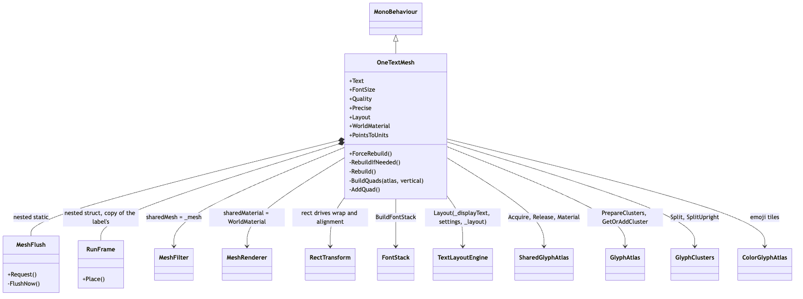
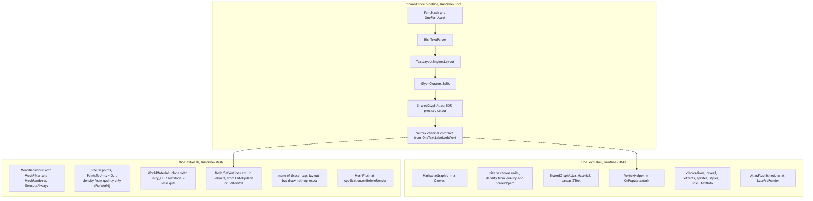
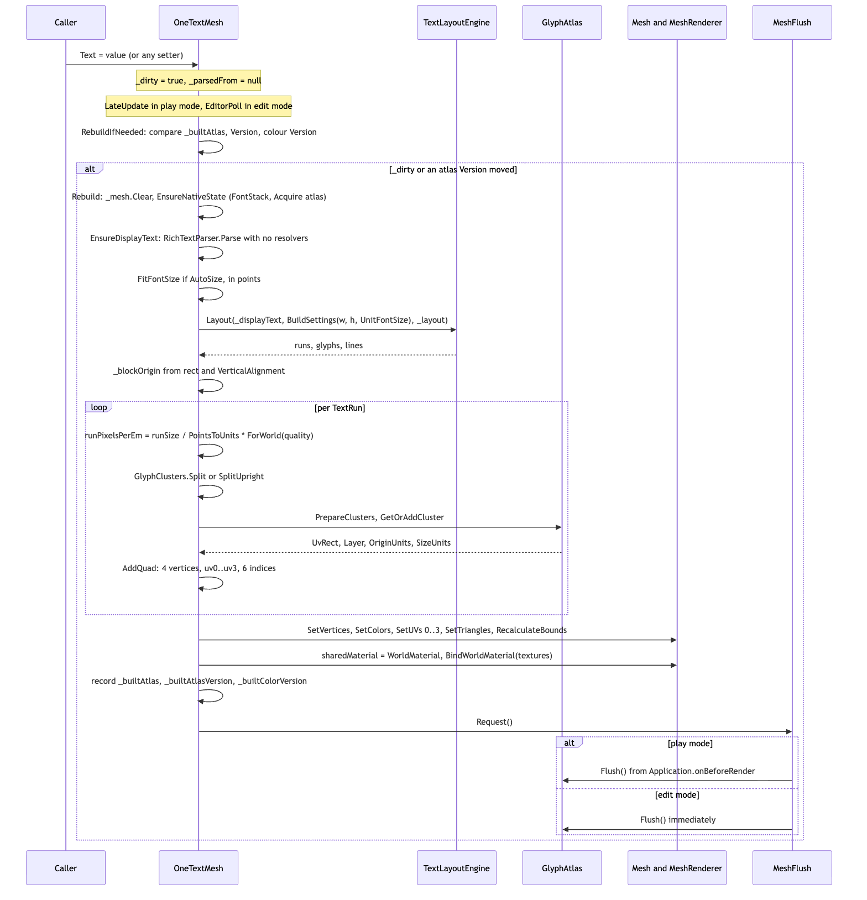

# Runtime/Mesh

World-space text. `OneTextMesh` runs the same core pipeline as `OneTextLabel` (parse -> layout -> cluster -> atlas tile) but writes the result into a `UnityEngine.Mesh` on a `MeshFilter`/`MeshRenderer` instead of a `CanvasRenderer`. It is for nameplates, signs and diegetic UI: place it in the scene like any renderer, no `Canvas` required. The assembly `OneText.Mesh` references only `OneText` (core) — deliberately not `OneText.UGUI` or `UnityEngine.UI` — so world text exists without the uGUI package. The type lives in namespace `OneText`, not `OneText.UGUI`.

## Files

| File | Responsibility |
|---|---|
| `OneText.Mesh.asmdef` | Assembly `OneText.Mesh`, root namespace `OneText`, references `OneText` only. No version defines. |
| `OneTextMesh.cs` | The whole component: serialized fields and properties, font stack, parse/layout, auto-size in points, `RebuildIfNeeded`/`Rebuild`/`BuildQuads`/`AddQuad`, the static `WorldMaterial` and `BindWorldMaterial`, the nested `MeshFlush` upload scheduler, a copy of the label's `RunFrame`, and the TMP parity aliases. |

## Structure

Source: [diagrams/mesh-structure.mmd](diagrams/mesh-structure.mmd)

`OneTextMesh` is a `[ExecuteAlways]` `MonoBehaviour` with `[RequireComponent(typeof(RectTransform))]` and `[RequireComponent(typeof(MeshFilter), typeof(MeshRenderer))]`, menu item "OneText/OneText Mesh (World)". The rect of the `RectTransform` is the layout box, in local units, exactly as for a label. Public API: `Text`, `FontSize`, `Quality`, `AutoSize`/`AutoSizeMin`/`AutoSizeMax`, `FittedFontSize`, `Color`, `Alignment`, `VerticalAlignment`, `WritingMode`, `Wrap`, `Overflow`, `LineSpacing`, `RichText`, `Precise`, `Layout` (the `TextLayoutResult`, rebuilding first if stale), `SetFont(byte[], params byte[][])`, `SetVariations`, `ForceRebuild`, `ApplyProjectDefaults`, the static `WorldMaterial`, and the constant `PointsToUnits = 0.1f`. Every setter sets `_dirty = true` (and the text/markup ones also null `_parsedFrom`); there are no equality guards on the setters.

Two nested types: `MeshFlush` (static) batches atlas uploads, and `RunFrame` (readonly struct) is a verbatim copy of `OneTextLabel.RunFrame` — the same placement arithmetic for horizontal, upright-vertical and rotated-vertical runs. The TMP aliases at the bottom (`text`, `fontSize`, `color`, `alpha`, `richText`, `enableAutoSizing`, `fontSizeMin`, `fontSizeMax`, `ForceMeshUpdate`, `GetParsedText`, `SetText(string)`, `SetText(string, bool)`, `SetText(StringBuilder)`) forward to the PascalCase API; `alignment`, `lineSpacing`, `textWrappingMode`, `enableWordWrapping` and `overflowMode` are absent because their unit conversion lives in `OneText.UGUI.TmpCompat`, which this assembly cannot reference (comment in the parity block).

## Behaviour

### Shared with the label, and different from it

Source: [diagrams/label-vs-mesh.mmd](diagrams/label-vs-mesh.mmd)

Shared: `FontStack` built from `OneFontAsset`s (or raw bytes), `RichTextParser`, `TextLayoutEngine.Layout`, `GlyphClusters.Split`/`SplitUpright`, `SharedGlyphAtlas` (the same SDF, precise and colour atlases and the same tiles — a glyph at the same ppem is baked once for both components, `OneTextMeshTests.The_Mesh_Component_Shares_The_Label_Atlas`), `ColorGlyphs` for emoji, and the vertex channel contract documented above `OneTextLabel.AddVert`.

Different:

- **Units.** `FontSize` is in points at TMP's world-text convention: `UnitFontSize = EffectiveFontSize * PointsToUnits`, so size 36 is 3.6 local units per em and a TMP world text ports with the same numbers. `ScaledSpans` multiplies each markup span's `SizeAbsolute` by `PointsToUnits` so `<size=44>` is points too; em-relative values pass through. Auto-size searches in points (`FitFontSize`, tolerance `(max - min) / 256`, no half-point snapping, floor 0.01) and only `FitsAt` converts.
- **Density.** There is no canvas scale and no camera distance the component can see, so `runPixelsPerEm = runSize / PointsToUnits * TextQualityScale.ForWorld(_quality)` — back to points, times the world ladder (1, 2, 4; default `TextQuality.Medium` = 2x). No `ScreenPpem`, no hysteresis, no `PpemCap`. Passing `runSize` (units) to the atlas was the bug that baked every world mesh at 24 ppem (comment in `BuildQuads`).
- **Material.** `WorldMaterial` is a static clone of `SharedGlyphAtlas.Material` named "OneText SDF (world)" with `unity_GUIZTestMode` pinned to `CompareFunction.LessEqual`, because the canvas drives that property per canvas and nothing drives it for a `MeshRenderer`. `BindWorldMaterial` re-sets `_GlyphTex`, `_GlyphTexelSize`, and when they exist `_MsdfTex`, `_MsdfTexelSize`, `_ColorTex` on every rebuild, since atlases are recreated by settings changes and play-mode transitions.
- **Output.** `_vertices`, `_colors`, `_uv0..3`, `_indices` lists -> `Mesh.SetVertices/SetColors/SetUVs/SetTriangles/RecalculateBounds`. The `Mesh` is created in `OnEnable` (`HideFlags.DontSave`, `MarkDynamic`), cleared in `OnDisable`, destroyed in `OnDestroy`. The renderer gets shadows, light probes and reflection probes turned off in `OnEnable`.
- **Colour.** `_color` is multiplied into the vertex colour in `BuildQuads` (`Multiply(runColor, tint)`), so a tint change is a full rebuild here, where on the label it is an emit-only change.
- **Not implemented** (the label has them): reveal and typewriter, `TextAnimator` effects, `ITextQuadModifier`, decorations (outline/shadow/glow; TEXCOORD1/3 are written zero), `<mark>`/underline/strikethrough bands, inline sprites (sprite runs are skipped, leaving their advance as a gap), style assets and named fonts (the parser is called with null resolvers), links and hit-testing, `textInfo`, `ILayoutElement`. Tags still parse and lay out; they just draw nothing extra.
- **Scheduling.** No `Canvas`, so no `AtlasFlushScheduler` and no `AtlasInvalidation`: `MeshFlush.Request` hooks `Application.onBeforeRender` once in play mode (immediate flush otherwise), and `RebuildIfNeeded` compares `_builtAtlas`/`_builtAtlasVersion`/`_builtColorVersion` itself every tick.

### A rebuild, end to end

Source: [diagrams/mesh-rebuild-sequence.mmd](diagrams/mesh-rebuild-sequence.mmd)

1. A setter, `OnValidate`, `OnRectTransformDimensionsChange`, `OnEnable` or `ForceRebuild` sets `_dirty`. `_dirty` is `[NonSerialized]` and initialised `true` so a domain reload rebuilds.
2. `LateUpdate` (play mode) or the static `EditorPoll` on `EditorApplication.update` (edit mode, one subscription for all instances via `s_active`) calls `RebuildIfNeeded`. It returns unless `isActiveAndEnabled` and `_mesh != null`. If not dirty, it checks whether the atlas it last baked from (`_precise` picks the precise atlas when it exists) is still the same object at the same `Version` and the colour atlas at the same `Version`; any difference sets `_dirty`. Then `_dirty = false; Rebuild()`.
3. `Rebuild`: `_mesh.Clear()`; return if text empty or `EnsureNativeState` fails (`BuildFontStack` — bytes override loads owned `FontData`s via `FontData.Load`, no `SharedFontBytes`; asset route is `_font` > `OneTextSettings.DefaultFont` with `GetVariant(_variations)` and `BoldFace`, then `_fallbackFonts`, then project fallbacks; `MissingFonts.Warn` once if nothing valid; `SharedGlyphAtlas.Acquire` once; `WorldMaterial != null`).
4. `EnsureDisplayText`: re-parses when `_parsedFrom != _text` (reference compare) or `_parsedRich != _richText`; `RichTextParser.Parse(_text, _markup, null, null, null)` if markup is possible, else `_markup.Clear()` and `_displayText = _text`.
5. `maxWidth`/`maxHeight` from the rect, with the same writing-mode/budget logic as `OneTextLabel.EnsureLayout`; `FitFontSize(rect)` if `_autoSize`; `_engine.Layout(_displayText, BuildSettings(maxWidth, maxHeight, UnitFontSize), _layout)`; `_blockOrigin` from `VerticalAlignment` and `BlockExtent`.
6. `BuildQuads(atlas, vertical)`: per run — skip sprites; `runSize` (already in units), `scale = runSize / font.UnitsPerEm`, `runPixelsPerEm` as above, `color = Multiply(run.Style.ResolveColor(), _color)`, `FrameOf`; colour fonts through `EmitColorRun` (per-glyph `ColorGlyphs.UsesTextColor`/`TryDecode` into `SharedGlyphAtlas.ColorAtlas`, SDF fallback per glyph); otherwise `GlyphClusters.Split`/`SplitUpright` -> `atlas.PrepareClusters` -> `atlas.GetOrAddCluster` -> `frame.Place` -> `AddQuad(position, size, rotation, uv, layer, color, atlasSelector)` with selector 0 (SDF), 1 (colour) or 2 (precise).
7. `AddQuad` appends four vertices (BL, TL, TR, BR; rotated about the centre if `rotation != 0`), `uv0 = (u, v, Pack(layer, 0), uv.yMin)`, `uv2 = (uv.yMax, uv.xMin, uv.xMax, Pack(atlasSelector, QuantizeSigned(0, 1)))`, `uv1 = uv3 = 0`, and two triangles.
8. Mesh upload, `renderer.sharedMaterial = WorldMaterial` if it differs, `BindWorldMaterial`, record the built atlas/versions, `MeshFlush.Request()`.

## Invariants and conventions

- **Main thread, one rebuild per dirty tick.** All work happens in `RebuildIfNeeded` from `LateUpdate`/`EditorPoll`; nothing runs inside a canvas pass.
- **Points in, units out.** Public sizes (`FontSize`, `AutoSizeMin/Max`, `FittedFontSize`, markup `<size=N>`) are points; layout, `_layout`, `TextRun.FontSize` and the mesh are local units. Convert once (`UnitFontSize`, `ScaledSpans`, `FitsAt`), and convert back to points before asking the atlas for a density. `PointsToUnits` is a constant on purpose: a knob would make every ported size mean something else per scene.
- **Atlas reference**: `SharedGlyphAtlas.Acquire` once in `EnsureNativeState`, `Release` in `OnDestroy`; `_atlasHeld` is `[NonSerialized]` for the same domain-reload reason as the label.
- **Font ownership**: every `FontData` from the bytes route (main and fallbacks) is in `_ownedFonts` and disposed by `ReleaseFonts`; asset faces are never disposed here. `_fontBytesOverride` is length-checked, not null-checked.
- **Vertex contract**: identical to `OneTextLabel.AddVert`. `Pack(layer, 0)` — layer in the high byte — and `Pack(atlasSelector, QuantizeSigned(0, 1))` — neutral face dilate is 128, not 0 — are load-bearing (`OneTextMeshTests.Its_Vertices_Say_Neutral_Face_And_Put_The_Layer_In_The_High_Byte`).
- **Material is static and shared** by every `OneTextMesh`; its textures are rebound per rebuild. Never instantiate per component.
- **Atlas staleness is self-checked.** The component is not registered with `AtlasInvalidation`; `RebuildIfNeeded` compares versions itself, so a mesh that stops ticking (disabled) does not notice evictions until it is re-enabled, at which point `OnEnable` sets `_dirty`.
- **Allocation**: the vertex lists and `_scaledSpans` are reused; `_displayText`/`_parsedFrom` are strings (this component parses strings, not spans). `FitFontSize` runs several layouts per rebuild when auto-size is on.

## Extending

- **A new layout property**: add the field and a setter that sets `_dirty = true`, pass it in `BuildSettings`, and if it needs a string re-parse also null `_parsedFrom`. There is no `LayoutKey` here — any dirty flag rebuilds everything. Tests: `Tests/Editor/OneTextMeshTests.cs`.
- **A feature the label has and this does not** (decorations, sprites, reveal): the hook points are `BuildQuads` (decoration packing would go into `_uv1`/`_uv3` via `TextDecoration.Pack`, mirroring `OneTextLabel.Pack`/`DecorationChannels`), a sprite sheet field plus an `EmitSprite` equivalent, or a per-quad filter before `AddQuad`. Keep the channel layout in lock-step with `OneTextLabel.AddVert` and `OneText-SDF.shader`; `OneTextMeshTests.Vertex_Channels_Follow_The_Shader_Contract` and `Precise_Rides_The_Msdf_Discriminator` assert the layout.
- **The missing TMP aliases** (`alignment`, `lineSpacing`, wrap/overflow modes): blocked on `TmpCompat` moving from `Runtime/UGUI` into core; do not duplicate the arithmetic here (parity block comment). `TmpApiParityTests.cs` and `TmpScriptRewriteTests.cs` enumerate what exists.
- Tests that touch this component: `OneTextMeshTests.cs` (vertices without a canvas, world material ZTest, channel contract, MSDF discriminator, vertical writing, colour tags, points-to-units, markup sizes, auto-size, quality ladder and density, shared atlas), `TextQualityTests.cs`, `MaterialLifecycleTests.cs`, `MissingFontTests.cs`, `ProjectDefaultsTests.cs`, `ComponentMigrationTests.cs` (TMP world text -> `OneTextMesh`), `DOTweenCompatTests.cs`.

## Gotchas

1. **Handing the atlas the unit size.** `runSize` is a tenth of the point size; every density argument must be `runSize / PointsToUnits * ForWorld(quality)` or the mesh bakes at the smallest bucket and looks melted (SDF) or torn (MSDF). Comment in `BuildQuads`.
2. **Zeroed channels are not neutral.** `uv0.z` must be `Pack(layer, 0)` (layer high byte) and `uv2.w` must be `Pack(atlas, 128)`; a raw `layer` reads slice 0 and a raw 0 dilate erodes every glyph. Comment above `AddQuad`.
3. **Edit mode ticks from `EditorApplication.update`**, not `LateUpdate`; `EnsureEditorDriver` subscribes once. A mesh that draws in play mode but not in the editor is usually not in `s_active` (disabled) or `_mesh` is null.
4. **Every setter rebuilds.** There is no same-value guard and no cache key; setting `Text` to the same string every frame re-parses and re-lays out every frame. Guard at the call site.
5. **Colour is baked.** `Color`/`alpha` trigger a full rebuild (unlike the label, where tint is applied at emit).
6. **The material's textures go stale** if something recreates the atlas; `BindWorldMaterial` runs per rebuild, so a mesh that is not dirty after an atlas recreation relies on the version check in `RebuildIfNeeded` to notice.
7. **Sprite runs leave a gap**; there is no sheet to draw from.
8. **`Layout` and `FittedFontSize` rebuild synchronously** (`RebuildIfNeeded`), including the mesh upload, if anything is dirty.
9. **No `ScreenPpem`**: a camera dollying in does not re-bake; pick `Quality` for how close the player will get (`High` is 4x and the last rung; comment on `TextQuality.High`).

## Related

- [../UGUI/README.md](../UGUI/README.md) — `OneTextLabel`, whose `RunFrame`, `FrameOf`, `ColorKey`, `Multiply` and vertex packing this file copies, and whose `AddVert` comment is the channel contract.
- [../Core/Layout/README.md](../Core/Layout/README.md) — `TextLayoutEngine`, `TextLayoutSettings`, `RichTextParser`, `TextDecoration.Pack`.
- [../Core/Rendering/README.md](../Core/Rendering/README.md) — `SharedGlyphAtlas`, `GlyphAtlas`, `GlyphClusters`, `ColorGlyphAtlas`.
- [../Core/Fonts/README.md](../Core/Fonts/README.md) — `FontStack`, `OneFontAsset`, `MissingFonts`.
- [../Shaders/README.md](../Shaders/README.md) — `OneText-SDF.shader` and `unity_GUIZTestMode`.
- [../../../Docs/ARCHITECTURE.md](../../../Docs/ARCHITECTURE.md) — module map; this is the "world-space frontend" the architecture note anticipates.
