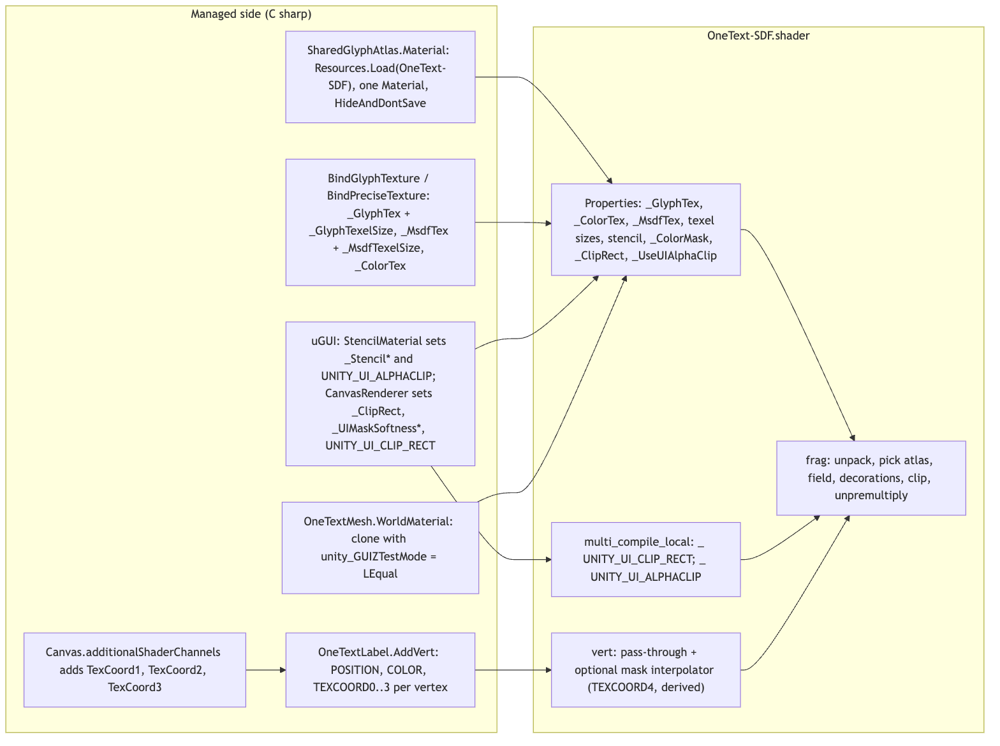
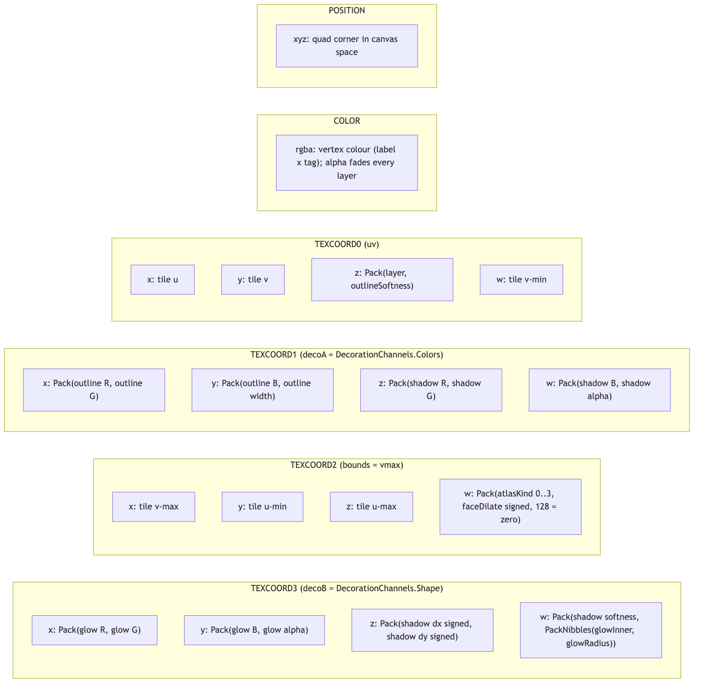
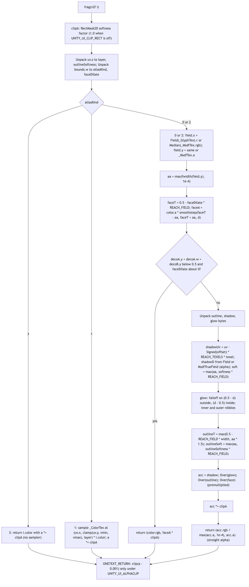
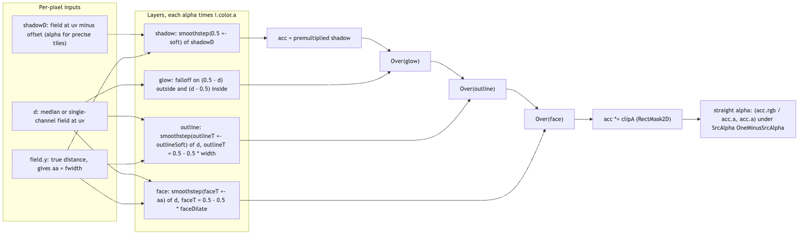

# Runtime/Shaders

The one shader every OneText label and world mesh draws with: `OneText/SDF`, in `Runtime/Shaders/Resources/OneText-SDF.shader`. It is the last step of the render stage (string -> parse -> analyze -> shape -> layout -> render -> **frontend/GPU**): it samples the three `Texture2DArray` atlases that `Runtime/Core/Rendering` fills (single-channel SDF, multi-channel "precise" field, RGBA colour), reconstructs antialiased coverage from the 0.5 isoline, draws outline / shadow / glow / face-dilate from parameters packed into the vertex channels, and honours both uGUI masking mechanisms (`Mask` via stencil, `RectMask2D` via `_ClipRect`). Everything is one material and one pass so that plain, decorated, precise, emoji, sprite and underline tiles batch together. The C# half of the contract lives in `SharedGlyphAtlas` (which textures/vectors are bound), `OneTextLabel.AddVert` / `OneTextMesh` (what each vertex channel carries) and `TextDecoration` (how bytes are packed into floats).

## Files

| File | Responsibility |
| --- | --- |
| `Resources/OneText-SDF.shader` | The `OneText/SDF` shader: properties, stencil/blend state, two `multi_compile_local` keywords, `vert` (pass-through plus the derived RectMask2D interpolator) and `frag` (atlas pick, field reconstruction, decorations, clipping). |
| `Resources/` (folder) | Exists so the shader ships: nothing in a scene references it (the material is built at runtime), so outside a `Resources` folder a player build would strip it (`SharedGlyphAtlas.ShaderResourcePath` comment). |

## Structure

Source: [diagrams/shader-bindings.mmd](diagrams/shader-bindings.mmd)

The shader is loaded by `SharedGlyphAtlas.LoadShader()` (`Resources.Load<Shader>("OneText-SDF")`, falling back to `Shader.Find("OneText/SDF")`) and wrapped in one `HideAndDontSave` material by `SharedGlyphAtlas.Material`. `OneTextMesh.WorldMaterial` clones it and pins `unity_GUIZTestMode` to `LessEqual`, because only a canvas drives that global.

**Properties and who sets them**

| Property / uniform | Set by | Read for |
| --- | --- | --- |
| `_GlyphTex` (2DArray), `_GlyphTexelSize` | `SharedGlyphAtlas.BindGlyphTexture`, `OneTextMesh.BindWorldMaterial` | R8 SDF atlas; texel size converts the shadow offset from texels to uv |
| `_MsdfTex` (2DArray), `_MsdfTexelSize` | `SharedGlyphAtlas.BindPreciseTexture` (only once a precise atlas exists) | RGBA32 multi-channel atlas |
| `_ColorTex` (2DArray) | `SharedGlyphAtlas` (only once a colour atlas exists) | RGBA32 emoji/sprite atlas |
| `_Stencil*`, `_ColorMask`, `_UseUIAlphaClip` | uGUI's `StencilMaterial` when the label sits under or is a `Mask` | Stencil block; `_UseUIAlphaClip` itself is unread, the keyword beside it is what acts |
| `_ClipRect`, `_UIMaskSoftnessX/Y` | `CanvasRenderer` for a `RectMask2D` (never by OneText) | Soft rect clipping, only in the `UNITY_UI_CLIP_RECT` variant |
| `unity_GUIZTestMode` | The canvas system; `OneTextMesh.WorldMaterial` for world meshes | `ZTest` |

**Render state**: `Queue=Transparent`, `Cull Off`, `ZWrite Off`, `ZTest [unity_GUIZTestMode]`, `Blend SrcAlpha OneMinusSrcAlpha`, `ColorMask [_ColorMask]`, a `Stencil` block driven by the `_Stencil*` properties, `#pragma target 3.5`.

**Keywords**: `#pragma multi_compile_local _ UNITY_UI_CLIP_RECT` and `#pragma multi_compile_local _ UNITY_UI_ALPHACLIP`. Four variants in total. Both are `multi_compile` on purpose: no serialized material ever carries these keywords (uGUI turns them on at draw time, and OneText's material is runtime-built), so `shader_feature` would strip the masked variants from a player build. `_local` keeps them out of the global keyword budget.

### The vertex channel contract

Source: [diagrams/vertex-channels.mmd](diagrams/vertex-channels.mmd)

Read from both ends: `appdata` in the shader and `OneTextLabel.AddVert` (uGUI) / `OneTextMesh` (world) on the C# side. `TextDecoration.Pack(hi, lo)` is `hi * 256f + lo`, an exact integer below 65536; the shader's `Unpack` does `floor(v + 0.5)` and splits it back into two 0..1 values. `TextDecoration.Quantize` maps 0..1 to a byte; `QuantizeSigned(value, range)` maps -range..range to a byte with 128 meaning exactly zero (the shader's `Signed` reverses it); `PackNibbles(hi, lo)` puts two 0..1 values in one byte, four bits each.

| Semantic | Component | C# source | Meaning in the shader |
| --- | --- | --- | --- |
| `POSITION` | xyz | quad corner | `UnityObjectToClipPos`; under `UNITY_UI_CLIP_RECT` also the mask distance (already root-canvas space) |
| `COLOR` | rgba | run colour (`OneTextLabel.Multiply` of label and tag colour) | face colour; its alpha fades every layer (shadow, glow, outline, colour tile) |
| `TEXCOORD0` `uv` | x, y | `uvRect` corner | tile uv sampled on the SDF/MSDF/colour array |
| | z | `Pack((byte)layer, OutlineSoftness)` | high byte = array slice (0..15), low byte = outline softness 0..1 |
| | w | `uvRect.yMin` | tile v-min (clamp floor) |
| `TEXCOORD1` `decoA` | x | `Pack(OutlineColor.r, OutlineColor.g)` | outline R, G |
| | y | `Pack(OutlineColor.b, outlineWidth)` | outline B; width in reaches 0..1 (0 = no outline) |
| | z | `Pack(ShadowColor.r, ShadowColor.g)` | shadow R, G |
| | w | `Pack(ShadowColor.b, shadowAlpha)` | shadow B; alpha (0 = no shadow) |
| `TEXCOORD2` `bounds` | x | `uvRect.yMax` | tile v-max |
| | y | `uvRect.xMin` | tile u-min |
| | z | `uvRect.xMax` | tile u-max |
| | w | `Pack((byte)atlas, FaceDilate)` | high byte = atlas discriminator 0..3; low byte = face dilate, signed, 128 = zero |
| `TEXCOORD3` `decoB` | x | `Pack(GlowColor.r, GlowColor.g)` | glow R, G |
| | y | `Pack(GlowColor.b, glowAlpha)` | glow B; alpha (0 = no glow) |
| | z | `Pack(QuantizeSigned(ShadowOffset.x), QuantizeSigned(ShadowOffset.y))` | shadow offset in reaches, -1..1 each |
| | w | `Pack(Quantize(ShadowSoftness), PackNibbles(GlowInner, GlowRadius))` | shadow softness; glow inner (high nibble) and outer (low nibble) reach |
| `TEXCOORD4` `mask` | xyzw | **not a mesh channel** | derived in `vert` under `UNITY_UI_CLIP_RECT` only |

The atlas discriminator values come from `OneTextLabel.AtlasOf`: `0` single-channel field, `1` colour picture, `2` multi-channel field, `3` solid bar (underline, strikethrough, `<mark>` wash; samples nothing). `OneTextMesh` writes the same layout with `TEXCOORD1`/`TEXCOORD3` zero, `Pack(layer, 0)` in `uv.z` and `Pack(kind, QuantizeSigned(0, 1))` in `bounds.w`, so world text is always undecorated.

The canvas is asked for `TexCoord1 | TexCoord2 | TexCoord3` in `OneTextLabel` (`additionalShaderChannels`), never Normal or Tangent; the `AddVert` comment spells out why (every graphic in the canvas would pay seven floats per vertex). Decorations added no channel: `TEXCOORD1`, `TEXCOORD3` and `TEXCOORD2.yz` were repurposed from dead sweep-line samples.

## Behaviour

Source: [diagrams/fragment-flow.mmd](diagrams/fragment-flow.mmd)

**Vertex stage.** `vert` copies colour and the four channels through. Under `UNITY_UI_CLIP_RECT` it also computes `o.mask`: `xy = v.vertex.xy * 2 - clipRect.xy - clipRect.zw` (doubled distance from the rect's centre; the mesh is already in root-canvas space so no matrix is needed, and a `RectMask2D` in a world canvas works like one in a screen canvas) and `zw = 0.25 / (0.25 * softness + pixelSize)`, where `pixelSize` is one screen pixel in canvas units derived from `UNITY_MATRIX_P`, `_ScreenParams` and `o.pos.w`. `_ClipRect` is clamped to +-2e10 so a degenerate rect cannot produce a NaN that makes the label vanish.

**Fragment stage**, in order:

1. `clipA`: under `UNITY_UI_CLIP_RECT`, `saturate((_ClipRect.zw - _ClipRect.xy - abs(mask.xy)) * mask.zw)` per axis, multiplied; otherwise the literal `1.0` so every `* clipA` folds away.
2. `Unpack(i.uv.z)` gives `layer` (x * 255) and `outlineSoftness`; `Unpack(i.bounds.w)` gives `atlasKind` (x * 255) and `faceDilate = (y * 255 - 128) / 127`.
3. `atlasKind > 2.5` (solid bar): return `i.color` with alpha scaled by `clipA`. No sampler.
4. `atlasKind` between 0.5 and 1.5 (colour tile): sample `_ColorTex` at `(uv.x, clamp(uv.y, vmin, vmax), layer)`, multiply by `i.color`, scale alpha only by `clipA`. Decorations are deliberately not drawn for colour tiles (no distance to threshold, no padding ring to sample into).
5. Otherwise the field. `tileMin = (bounds.y, uv.w)`, `tileMax = (bounds.z, bounds.x)`; every sample is clamped into that rect so an offset sample can never read the neighbouring tile on the shelf (the padding ring the rasterizer guarantees reads exactly 0 there). For `atlasKind 0`: `d = _GlyphTex.r`, and the width field is the same value. For `atlasKind 2` (`precise`): `MsdfFieldAndWidth` returns `x = Median(_MsdfTex.rgb)` (used for thresholds) and `y = _MsdfTex.a` (the true single-channel distance, used for `fwidth`). `aa = max(fwidth(field.y), 1e-4)`: the antialiasing width is taken off the true distance, never off the median, because the median's gradient collapses along the bisector of a sharp corner and `fwidth` there would smear a spike below an 'A'.
6. Face: `faceT = 0.5 - faceDilate * REACH_FIELD`; `faceA = color.a * smoothstep(faceT - aa, faceT + aa, d)`. Positive dilate thickens.
7. Early out: if `decoA.y + decoA.w + decoB.y < 0.5` (outline width, shadow alpha and glow alpha bytes all zero) and `|faceDilate| < 0.002`, return `(color.rgb, faceA * clipA)`. This is the path all undecorated text takes.
8. Decorations (diagram below). `Unpack` the six colour floats, the offset and the soft/radius float. Shadow: `shadowUv = uv - Signed(offset) * REACH_TEXELS * texel` (texel from `_MsdfTexelSize` or `_GlyphTexelSize`), one more clamped sample (`MsdfTrueField`, i.e. alpha, for precise tiles; the median is not used for the displaced sample), `soft = max(aa, softness * REACH_FIELD)`, `shadowA = shadowAlpha * color.a * smoothstep(0.5 - soft, 0.5 + soft, shadowD)`. Glow: no extra sample; `outward = saturate((0.5 - d) / REACH_FIELD)`, `inward = saturate((d - 0.5) / REACH_FIELD)`, outer falloff `1 - outward / glowOuter`, inner falloff `1 - inward / glowInner` (an inner nibble of 0 means full glow under the face), `glowA = glowAlpha * color.a * (d < 0.5 ? outA : inA)`. Outline: `outlineT = max(0.5 - REACH_FIELD * width, aa * 1.5)`, `outlineSoft = max(aa, outlineSoftness * REACH_FIELD)`, `outlineA = step(0.5/255, width) * color.a * smoothstep(outlineT - outlineSoft, outlineT + outlineSoft, d)`.
9. Composite premultiplied, bottom to top: `acc = shadow`, then `Over(glow)`, `Over(outline)`, `Over(face)` where `Over(src, dst) = src + dst * (1 - src.a)`. Then `acc *= clipA` (uniform scaling of a premultiplied result is the only operation that commutes with `Over`; scaling per-layer alphas first would let a shadow bleed through a face at the mask edge). Finally convert back to straight alpha: `(acc.rgb / max(acc.a, 1e-4), acc.a)`, because the blend state is `SrcAlpha OneMinusSrcAlpha` like every other uGUI graphic in the batch.
10. Every return goes through `ONETEXT_RETURN`, which is a plain `return` unless `UNITY_UI_ALPHACLIP` is on, where it `clip(a - 0.001)`s so a text `Mask` writes stencil only where there is ink, not over the whole quad. It is at the end because `fwidth` needs all four fragments of a quad alive.

Source: [diagrams/decoration-stack.mmd](diagrams/decoration-stack.mmd)

**Units.** All decoration distances are in *reaches*: one reach is `REACH_TEXELS = 4.0` texels at the tile's own density (`GlyphRasterizer.SpreadPixels`, which is also `GlyphRasterizer.Padding`), and `REACH_FIELD = 0.5` of the 0..1 field because the rasterizer encodes `0.5 - signedDistance / (2 * spread)`. So the field is 1.0 deep inside, 0.5 on the outline, 0.0 at one reach outside and flat beyond; that is why outline width, glow radius and shadow offset are capped at 1 reach in `TextDecoration`, and why a shadow offset sample clamped into the tile reads 0, the right answer.

## Invariants and conventions

- `REACH_TEXELS` must equal `GlyphRasterizer.SpreadPixels` (and `Padding`), and `REACH_FIELD` must match the rasterizer's encoding. Nothing checks this at compile time; a mismatch draws shadows at the wrong distance.
- Two bytes per float, never three. At three-byte magnitudes an interpolator error of one ulp borrows across a field and jumps a colour channel by 255 (`TextDecoration.Pack` comment). The shader's `Unpack` rounds first for the same reason.
- `TEXCOORD0.z` and `TEXCOORD2.w` each carry two values. Every read of the layer or the atlas kind must go through `Unpack`; comparing the raw float would sample the wrong slice or the wrong atlas silently.
- The only byte that holds two parameters is `TEXCOORD3.w`'s low byte (glow inner/outer nibbles), chosen because borrowing across them only reshapes a blur by a sixteenth.
- "Undecorated" is a value, not a branch: `DecorationChannels.None` writes zero in every byte the shader tests and 128 (not 0) for the face dilate. A zero face-dilate byte would erode every glyph by a whole reach.
- The atlas discriminator is a branch in the fragment shader, not a keyword: one material is what keeps emoji, precise and underlined text in one draw call with plain text. Anything per-material (blend, stencil) cannot be switched per tile.
- The texel-size vectors are set from C# (`_GlyphTexelSize`, `_MsdfTexelSize`), not relied on from Unity's automatic `_TexelSize`, which is documented for 2D textures and not arrays.
- Nothing in the shader reads the MSDF median deeper than the 0.5 isoline: the face thresholds at 0.5, the outline threshold only moves outward, the glow's inside falloff uses `(d - 0.5)` but only to fade, the shadow reads alpha. `MsdfBatchJob.Correct` depends on this (it overrules reflex-corner reconstruction deep inside the ink). An inward threshold such as an inner outline would break that contract on both sides.
- `TEXCOORD4` is derived in `vert`, not carried in the mesh; do not add it to `additionalShaderChannels`.
- The shader must stay under a `Resources` folder (or be added to Always Included Shaders by the project); `ShaderShippingTests` asserts the location and that the material uses the shipped asset.
- Clipping multiplies alpha only (colour tiles and the final premultiplied stack); scaling rgb would darken toward the mask edge.

## Extending

- **A new decoration parameter.** Find a byte: the budget table above is full except what `TextDecoration` already uses, so it either shares a byte (as glow inner/outer do; only for two soft, same-unit values) or displaces something. Then: add the field to `TextDecoration` (`Runtime/Core/Layout/TextDecoration.cs`, including `Over`, `Equals`, `Clamped`), pack it in `OneTextLabel.Pack` / `DecorationChannels`, make sure `DecorationChannels.None` writes the right "nothing" value, unpack it in `frag`, and include its byte in the early-out test if it can make a plain-looking tile non-plain (the face dilate is the example that had to be added separately). Tests: `Tests/Editor/DecorationChannelTests.cs` (byte packing round trips, zero stays zero, shared-byte independence), `Tests/Editor/DecorationTests.cs` (`OutlineReachesTheVertexChannels`, `ShadowOffset_SurvivesQuantization_AndZeroStaysZero`, `PlainText_CarriesNoDecorationBytes`, `TileBounds_ReachTheChannelThatClampsTheShadowSample`, `Decorations_AskTheCanvasForNoExtraChannels`, `MixedCanvas_KeepsOneVertexLayout`, `DecoratedAndPlainLabels_ShareOneMaterial`), and the golden images in `Tests/Editor/GoldenImageTests.cs`.
- **A new atlas / tile kind.** Take the next discriminator value (`OneTextLabel.AtlasOf`, `TextQuad` flag), declare the sampler with `UNITY_DECLARE_TEX2DARRAY`, bind it in `SharedGlyphAtlas.Material` and `OneTextMesh.BindWorldMaterial`, branch on it in `frag` before the field path. Keep it a branch, not a keyword. `Tests/Editor/MsdfTests.cs` (`APreciseLabel_DrawsFromThePreciseAtlas`, `PreciseAndPlainLabels_ShareOneMaterial`) and `Tests/Editor/DecorationTests.cs` (`Bars_AreSolidAndSampleNoAtlas`, `UnderlinedAndPlainLabels_ShareOneMaterial`) show the pattern for the last two additions.
- **A new uGUI-driven feature** (another mask type, a new canvas global): use `multi_compile_local`, never `shader_feature`, for any keyword a runtime-built material or the canvas toggles.
- **Tests that exercise the shader**: `Tests/Editor/ShaderShippingTests.cs` (loads from Resources, asset location, shared material uses it, doctor silent), `Tests/Editor/DecorationChannelTests.cs`, `Tests/Editor/DecorationTests.cs`, `Tests/Editor/MsdfTests.cs` (median reconstruction, precise labels), `Tests/Editor/GoldenImageTests.cs` and `Tests/Editor/TextQualityTests.cs` (rendered pixels), `Tests/Editor/MaterialLifecycleTests.cs`, `Tests/Editor/DomainReloadTests.cs` (text still draws in a second session), `Tests/Editor/Tmp/MaterialEffectTests.cs` (TMP material effects migrated onto these channels).

## Gotchas

1. **Stencil is not RectMask2D.** `Mask` uses the stencil block; `RectMask2D` sets `_ClipRect` and `UNITY_UI_CLIP_RECT` per renderer. An earlier comment claimed the stencil covered both and every ScrollRect's text hung over its viewport (header comment of the shader).
2. **`shader_feature` would ship a build where masks silently stop working**, because no material asks for the keyword until draw time. Both keywords are `multi_compile_local`.
3. **The shader can be missing for two different reasons**: a broken import (error) or no graphics device at all (headless CI: warning, text still lays out). `SharedGlyphAtlas.ReportMissingShader` says which, once per domain; `EditorShaderDiagnosis` appends whether the asset loads from the package path, how many `OneText-SDF` shaders the database holds, and whether `Shader.Find` works.
4. **A precise tile's shadow samples alpha, not the median**; the face, outline and glow use the median. Reading the median for the displaced sample puts a corner claim where this pixel has no corner.
5. **`fwidth` on the median spikes below sharp corners**; the width comes from the true field (alpha for MSDF, the same field for SDF). Changing `aa` to use `field.x` brings the 'A'/'W' whisker back.
6. **A face dilate byte of 0 is "thin by a whole reach"**; 128 is zero. `DecorationChannels.None` and `OneTextMesh` both write 128 via `QuantizeSigned(0f, 1f)`. `DecorationChannelTests.NoDilate_IsExactlyZero_NotNearlyZero` guards it.
7. **The plain early-out must be extended** whenever a new parameter can make a tile non-plain without touching `decoA.y`, `decoA.w` or `decoB.y`; the face dilate is the precedent (`frag` comment).
8. **Clipping after compositing, not before.** Scaling each layer's alpha by `clipA` and then compositing lets a quarter of an opaque shadow bleed into pure face colour at half coverage; scale the premultiplied result instead.
9. **`ZTest [unity_GUIZTestMode]`** is driven by the canvas. Anything rendering a canvas by hand (editor/headless capture) or a `MeshRenderer` must set it itself; `OneTextMesh.WorldMaterial` pins `LessEqual`.
10. **Colour tiles get no decorations**, by design; an outline guessed from an alpha edge and a glow with no padding ring to land in are two different wrong pictures.
11. **Alpha clip is behind a keyword because `discard` costs on tile-based mobile GPUs**; only a label that is someone's `Mask` pays it, and it runs last so quad derivatives stay defined.

## Related

- `../Core/Rendering/README.md` — the atlases this shader samples, the field encoding, `SpreadPixels`/`Padding`, the MSDF invariants.
- `../Core/Layout/README.md` — `TextDecoration` (units in reaches, `Pack`/`Quantize`/`QuantizeSigned`/`PackNibbles`), `TextQuad` (`IsColor`, `IsPrecise`, `IsSolid`).
- `../UGUI/README.md` — `OneTextLabel.AddVert`, `EnsureMaterial`, `AtlasFlushScheduler`, `AtlasInvalidation`.
- `../Mesh/README.md` — `OneTextMesh` and `WorldMaterial`.
- `../../../Docs/ARCHITECTURE.md`.
