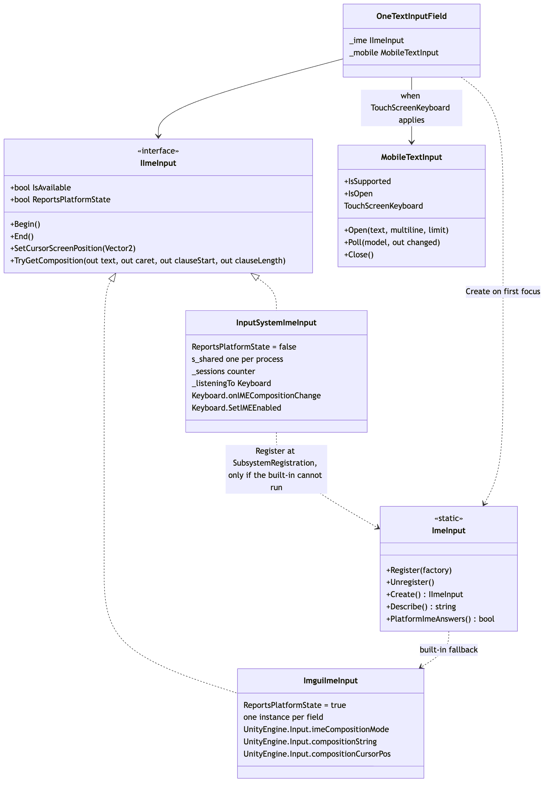
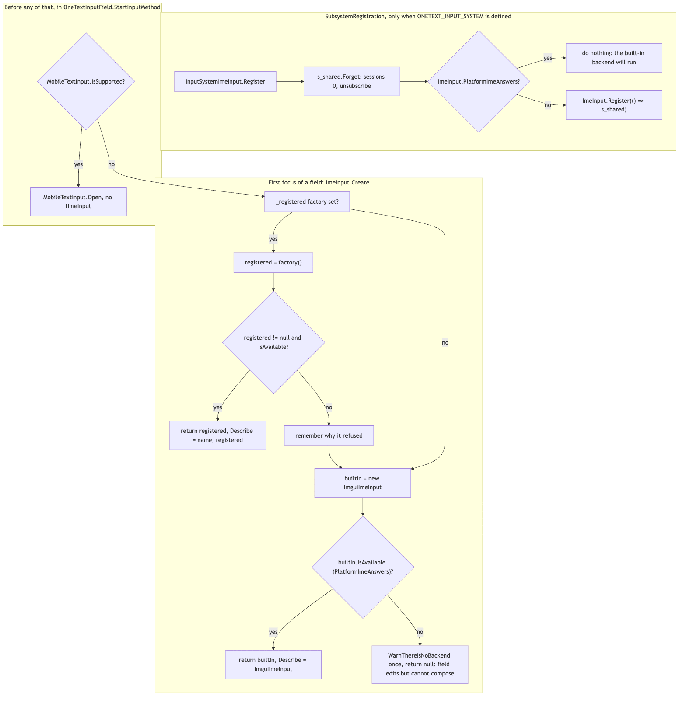
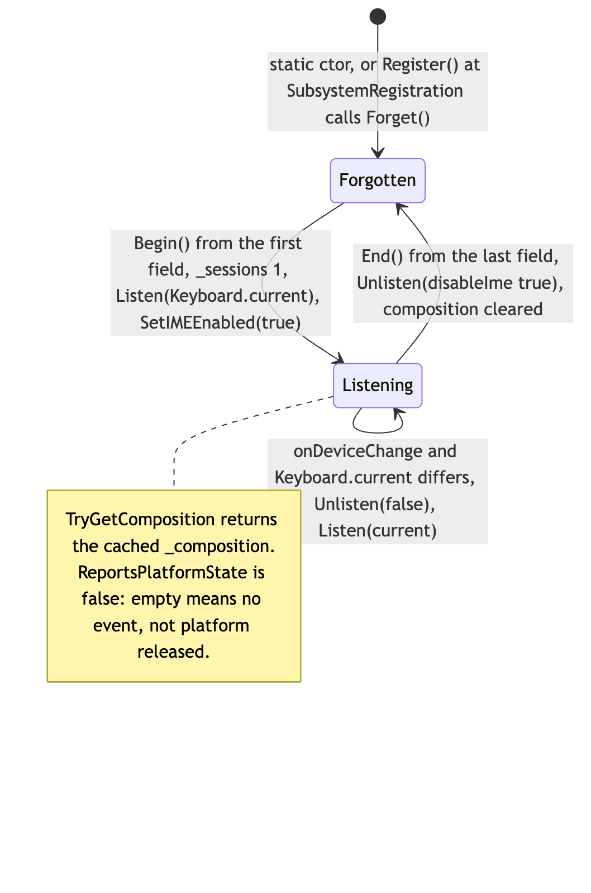
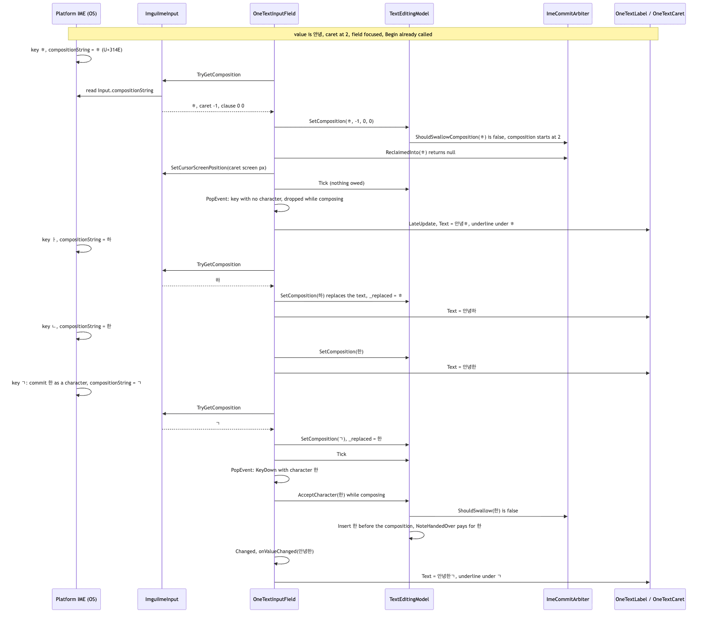

# Runtime/UGUI/Ime

`Runtime/UGUI/Ime/` is the thin layer between `OneTextInputField` and the platform's input method. It defines `IImeInput` — the four things a field needs from an IME (turn it on, tell it where the caret is, read what it is composing, turn it off) plus one flag about what "nothing" means — and ships two desktop backends: `ImguiImeInput` over `UnityEngine.Input`'s input-method members (the one that runs everywhere measured) and `InputSystemImeInput` over the Input System package's `Keyboard` (compiled only when that package is installed, registered only where the built-in one cannot run). `MobileTextInput` is the separate soft-keyboard path for Android/iOS, where the OS owns the buffer and there is no composition to show. Nothing here interprets the composition: `OneTextInputField` polls the backend once per update and feeds `TextEditingModel` / `ImeCommitArbiter` (`Runtime/Core/Editing`, see [../../Core/Editing/README.md](../../Core/Editing/README.md)), which decide what becomes text.

## Files

| File | Responsibility |
|---|---|
| `IImeInput.cs` | The `IImeInput` interface, and the static `ImeInput` chooser: `Register`/`Unregister` a factory, `Create()` a backend for a field, `Describe()` the last choice, `PlatformImeAnswers()` probe, and the once-per-session "no backend" warning. |
| `ImguiImeInput.cs` | Built-in backend: `Input.imeCompositionMode`, `Input.compositionString`, `Input.compositionCursorPos`. One instance per field. `ReportsPlatformState = true`. |
| `MobileTextInput.cs` | `TouchScreenKeyboard` bridge for Android/iOS: opens the OS keyboard with the field's text, mirrors the OS buffer back into the model via `TextEditingModel.SetExternalText`. Not an `IImeInput`. |
| `InputSystem/InputSystemImeInput.cs` | Input System backend: `Keyboard.onIMECompositionChange` cached into a string, `Keyboard.SetIMEEnabled`, `SetIMECursorPosition`. One shared instance per process with a session counter. `ReportsPlatformState = false`. Whole file inside `#if ONETEXT_INPUT_SYSTEM`. |
| `InputSystem/OneText.UGUI.InputSystem.asmdef` | The assembly that only exists when `com.unity.inputsystem` is installed (see Structure). |

## Structure

Source: [diagrams/ime-structure.mmd](diagrams/ime-structure.mmd)

### The `IImeInput` contract

| Member | Meaning |
|---|---|
| `bool IsAvailable` | False when this backend cannot run in the current project. `ImguiImeInput`: `ImeInput.PlatformImeAnswers()`. `InputSystemImeInput`: `Keyboard.current != null`. |
| `bool ReportsPlatformState` | True when `TryGetComposition` reads the platform's own state, so reporting nothing means the platform is composing nothing (`ImguiImeInput`). False when it reports a cache of what the platform last pushed, emptied when a session ends, so reporting nothing is only "no news" (`InputSystemImeInput`). The field uses it to decide whether an idle poll may call `ImeCommitArbiter.NotePlatformReleased()`; the arbiter retires its refusal-of-replay guard on evidence, and this says whether silence is any. |
| `void Begin()` | Start accepting composition. Called by the field when it takes focus — once per editing session per field (`OneTextInputField._imeBegun`). |
| `void End()` | Stop accepting composition and drop anything in flight. Called only by the field that called `Begin`. |
| `void SetCursorScreenPosition(Vector2)` | Caret position in screen pixels, so the candidate window opens beside the text. The field calls it on every update while composing. |
| `bool TryGetComposition(out string text, out int caret, out int clauseStart, out int clauseLength)` | The text being composed now; false when nothing is. `caret` is -1 when the backend cannot report one, `clauseLength` is 0 when it reports no converting clause — which, the interface comment says, on every backend Unity ships today is always. Both shipped backends answer `-1, 0, 0`. |

Per-frame ordering, from the field's side (`OneTextInputField.UpdateEditing` → `PollInputMethod`): `TryGetComposition` is read **before** the IMGUI key queue is drained; the result is compared ordinally with the model's current composition and only a differing report reaches `TextEditingModel.SetComposition`; then, if both sides are idle and `ReportsPlatformState`, `NotePlatformReleased()`; then `SetCursorScreenPosition` if composing; then `TextEditingModel.Tick()`; then the keys. Nothing in `IImeInput` can tell the platform that the field committed or cancelled a composition — that gap is what `ImeCommitArbiter`'s replay and echo guards exist for.

### `ImeInput` — choosing a backend

`ImeInput.Create()` is called lazily by a field on its first `StartInputMethod` (`_ime ??= ImeInput.Create()`). If a factory was `Register`ed and the instance it returns `IsAvailable`, that wins (this is how tests install a fake, and how `InputSystemImeInput` offers itself). Otherwise a new `ImguiImeInput` is returned if `IsAvailable`. Otherwise `null`: the field still edits but cannot compose, `WarnThereIsNoBackend` logs one warning per session (re-armed by `Register`/`Unregister`) describing which of the two shapes it is, and `Describe()` answers with a one-line reason for bug reports.

`PlatformImeAnswers()` asks by trying rather than by define: it reads and writes back `Input.imeCompositionMode` and reads `Input.compositionString`, returning false only on `InvalidOperationException` (the shape of "you switched Active Input Handling"). Any other exception propagates. The comment records why: `ENABLE_LEGACY_INPUT_MANAGER` answers a different question, and gating on it is "exactly the mistake that left Korean broken for every project using the Input System".

### Assembly gating of the Input System backend

`InputSystem/OneText.UGUI.InputSystem.asmdef` references `OneText`, `OneText.UGUI` and `Unity.InputSystem`, and carries a `versionDefines` entry — `com.unity.inputsystem` expression `1.0.0` defines `ONETEXT_INPUT_SYSTEM` — plus `defineConstraints: ["ONETEXT_INPUT_SYSTEM"]`. So when the package is absent the define is never set, the constraint fails, and the assembly is not compiled at all (an asmdef that references a missing package fails to compile rather than failing to find it). `InputSystemImeInput.cs` is additionally wrapped in `#if ONETEXT_INPUT_SYSTEM`. `autoReferenced` is true. Nothing in `OneText.UGUI` references the type by name; the backend reaches `ImeInput` only through its own `[RuntimeInitializeOnLoadMethod(SubsystemRegistration)]` `Register`.

## Behaviour

### Backend selection

Source: [diagrams/ime-backend-selection.mmd](diagrams/ime-backend-selection.mmd)

At `SubsystemRegistration`, `InputSystemImeInput.Register()` first calls `s_shared.Forget()` (session count to 0, composition cleared, `Unlisten(disableIme: false)` — needed because statics survive a play session when domain reload is skipped, and a subscription dropped by forgetting the reference is still there, called twice on the next run). Then, if `ImeInput.PlatformImeAnswers()`, it returns without registering; only when the built-in members do not answer does it `ImeInput.Register(() => s_shared)`. The comment is explicit that this condition "so far is nowhere": the backend is kept because the built-in one working is a measurement, not a guarantee.

Before any of that, `OneTextInputField.StartInputMethod` checks `MobileTextInput.IsSupported` and takes the soft-keyboard path without creating an `IImeInput` at all.

### `ImguiImeInput`

`Begin` sets `Input.imeCompositionMode = IMECompositionMode.On`; `End` sets it to `Auto` (not `Off`, which would disable the IME for the whole application and break the next field, including a built-in one). `SetCursorScreenPosition` writes `Input.compositionCursorPos`. `TryGetComposition` returns `Input.compositionString` with caret -1 and clause 0/0 — the API is a poll of one string, and the moment it empties the composition is over. The class comment explains why this, and not the Input System, is the default: OneText reads keystrokes out of the IMGUI event queue with `Event.PopEvent`, and `imeCompositionMode` is the switch that makes the platform compose into *that* queue. On macOS, switching the IME on through the Input System device left the IMGUI path uncomposed and every jamo arrived already committed (안녕하세요 as ㅇㅏㄴㄴㅕㅇㅎㅏㅅㅔㅇㅛ).

### `InputSystemImeInput`

Source: [diagrams/ime-inputsystem-sessions.mmd](diagrams/ime-inputsystem-sessions.mmd)

One `s_shared` instance is handed to every field, because everything it touches is process-wide: one `Keyboard`, one IME switch, one composition. `Begin` increments `_sessions`, clears `_composition` (a composition must never survive into a session that did not start it) and `Listen(Keyboard.current)`. `Listen` is idempotent on the same device; on a new one it `Unlisten(disableIme: false)`s the old, subscribes `onIMECompositionChange`, calls `SetIMEEnabled(true)`, records `_listeningTo`, and (re)subscribes `InputSystem.onDeviceChange`. `OnCompositionChange` copies the `IMECompositionString` into `_composition` through a reused `StringBuilder` (one string allocation per change, event-driven). `OnDeviceChange` follows `Keyboard.current` when it is replaced while sessions are open, clearing the cached composition. `End` decrements; only the last field out calls `Unlisten(disableIme: true)` — `SetIMEEnabled(false)` because there is no `Auto` here — and clears the cache. `SetCursorScreenPosition` forwards to `Keyboard.current?.SetIMECursorPosition`. `TryGetComposition` returns the cache.

### One Korean syllable, composed and committed

Source: [diagrams/ime-korean-syllable-sequence.mmd](diagrams/ime-korean-syllable-sequence.mmd)

Value `안녕`, caret 2, field focused (`Begin` already called). The user presses ㅎ, ㅏ, ㄴ, then ㄱ (starting the next syllable). On each of the first three keys the OS composes and `Input.compositionString` reads `ㅎ`, `하`, `한` in turn; the keystroke itself reaches the IMGUI queue without a character because the IME consumed it before the platform translated it.

1. `UpdateEditing` → `PollInputMethod` → `ImguiImeInput.TryGetComposition` → `"ㅎ"`. It differs from the model's (empty) composition, so `TextEditingModel.SetComposition("ㅎ", -1, 0, 0)`: the arbiter's `ShouldSwallowComposition` says no, the composition becomes active at index 2. The field asks `Arbiter.ReclaimedInto("ㅎ")` (null here — nothing was just committed), sets `_visualsDirty`, calls `SetCursorScreenPosition` with the caret's screen position, then `model.Tick()`.
2. The key loop pops a `KeyDown` with no character; while composing, `ProcessKeyEvent` drops it (the IME's key). `LateUpdate` → `UpdateVisuals`: the label draws `DisplayText` `안녕ㅎ`, the caret graphic underlines index 2–3.
3. ㅏ and ㄴ repeat the same path; `SetComposition("하")` and `SetComposition("한")` replace the composition text (the model records the replaced text for one update — see the Core/Editing README).
4. ㄱ: the OS commits `한` and starts a new composition. In the same update the poll reads `"ㄱ"` → `SetComposition("ㄱ")` (`_replaced = "한"`), `Tick`, and then the key loop pops a `KeyDown` whose `character` is `한` (Windows: `GCS_RESULTSTR` → `WM_CHAR`; macOS: `insertText:`). Printable, no modifiers, arriving mid-composition → `model.AcceptCharacter('한')`: `Arbiter.ShouldSwallow` is false, the model inserts it and `NoteHandedOver` pays for the replaced `한`; the field raises `onValueChanged("안녕한")`. The label now shows `안녕한ㄱ` with the underline under ㄱ.

Two other ways a composition ends, same boundary:

- **The composition empties with no character.** `SetComposition("")` ends it and calls `Arbiter.AwaitPlatformCommit(previous)`. If no character arrives within `ImeCommitArbiter.DefaultGraceUpdates` (2) updates, `model.Tick()` (called by the field after every poll) hands the text back and the field inserts it.
- **Focus leaves mid-composition.** `OneTextInputField.EndEditing` → `model.FlushCommit()` then `model.CommitComposition()` → `Arbiter.SuppressEchoOf(composed)`; the platform's later character echo and any re-reported composition are swallowed. Which of those two the platform does, and whether `End()` makes it let go of the syllable, is exactly what `ReportsPlatformState` and the arbiter's evidence-based guards exist for.

### `MobileTextInput`

`IsSupported` is `TouchScreenKeyboard.isSupported && !TouchScreenKeyboard.isInPlaceEditingAllowed` — a tablet with a hardware keyboard or the editor remote keeps the desktop path, IME and all. `Open(text, multiline, characterLimit)` calls `TouchScreenKeyboard.Open` with `TouchScreenKeyboardType.Default`, `autocorrection: false`, `secure: false`, `alert: false`, empty placeholder and the limit clamped at 0. `Poll(model, out changed)` reads `_keyboard.text` each update, and only when it differs from `_lastText` calls `model.SetExternalText(current, selection.start, selection.length)` — using `_keyboard.selection` while `status == Visible`, or a caret at the end otherwise, because "after Done the platforms disagree about what selection reports". It returns `status == Visible`; the field deactivates itself on false. `Close` sets `active = false` and drops the reference.

## Invariants and conventions

- **One IME switch per process.** `Input.imeCompositionMode` and `Keyboard.SetIMEEnabled` are global. Only the field that called `Begin` may call `End` (`OneTextInputField._imeBegun`); `InputSystemImeInput` additionally counts `_sessions` so a panel's `OnDisable` cannot switch the IME off under another field.
- **`End` means `Auto` on the built-in backend, `SetIMEEnabled(false)` on the Input System one.** Never `IMECompositionMode.Off`.
- **Silence semantics are load-bearing.** `ReportsPlatformState` must be true only if an empty `TryGetComposition` is the platform's own answer. A cached backend must return false, or `ImeCommitArbiter.NotePlatformReleased()` will be called on no evidence.
- **A composition never survives into a session that did not start it.** `InputSystemImeInput.Begin` clears the cache; `Forget` clears it at `SubsystemRegistration`.
- **Subscriptions follow the device object, not a bool.** `_listeningTo` is the `Keyboard` actually subscribed; `Keyboard.current` can be replaced, and a bool cannot tell "subscribed to a dead device" from "subscribed".
- **Domain-reload-off safety.** `Register()` calls `Forget()` so a static that outlived the last play session does not start the next one with a stale session count and a doubled subscription.
- **Allocation.** `ImguiImeInput` allocates nothing of its own per poll (it returns the engine's `Input.compositionString`). `InputSystemImeInput` allocates one string per composition-change event, not per frame. `MobileTextInput.Poll` allocates only when the OS buffer changed. `ImeInput.Create` builds a `_lastChoice` string once per creation (once per field).
- **Units.** `SetCursorScreenPosition` is screen pixels, as `RectTransformUtility.WorldToScreenPoint` returns them (the field computes it in `OneTextInputField.CaretScreenPosition`). `caret`, `clauseStart`, `clauseLength` are UTF-16 code-unit offsets into the composition text.
- **Main thread only.** All members touch Unity input APIs; nothing in the source suggests otherwise.
- **Platform facts recorded in the source** (and only these): measured on Unity 6000.0.77f1 under Active Input Handling "Input System Package (New)", `Input.imeCompositionMode` (get/set), `compositionString`, `compositionCursorPos` and `imeIsSelected` answer while `Input.mousePosition`/`Input.GetKey` throw; macOS routinely delivers 한 as three conjoining jamo (arbiter comment), sends extra key events around a backspace that empties a composition, and commits via `insertText:`; Windows commits via `GCS_RESULTSTR`→`WM_CHAR`; Android/iOS go through `TouchScreenKeyboard`. WebGL is not mentioned anywhere in this folder — behaviour there is unclear from the source.

## Extending

- **A new backend** (another input stack, or a platform where neither shipped one answers): implement `IImeInput`, answer `ReportsPlatformState` honestly, and install it with `ImeInput.Register(() => instance)` — from a `[RuntimeInitializeOnLoadMethod(RuntimeInitializeLoadType.SubsystemRegistration)]` if it lives in its own assembly, exactly as `InputSystemImeInput.Register` does. If it depends on a package, copy the `OneText.UGUI.InputSystem.asmdef` pattern: `versionDefines` → a define, `defineConstraints` on that define, and `#if` the source. No change to `OneTextInputField` is needed. Add a `Describe()`-readable reason if it can refuse.
- **Reporting a caret or converting clause** (a backend that knows them): return them from `TryGetComposition`; `TextEditingModel.SetComposition` clamps them and moves them off the tail of a surrogate pair (`BoundaryBefore`) and `OneTextInputField.BuildCompositionMarks` draws the clause block (`OneTextCaret.ClauseColor`). `EditingTests.A_Japanese_Clause_Is_Reported_As_A_Range_To_Underline` covers the model side.
- **Changing what `Begin`/`End` do**: re-read the `_sessions` / `_imeBegun` comments first; both exist because `End` was once reached from a field that never began.
- **Tests**: `Tests/Editor/EditingTests.cs` — `FakeIme` (a hand-driven `IImeInput` registered in `[SetUp]` via `ImeInput.Register`, with `KeepsComposingAfterEnd` choosing which real backend's silence it imitates, and `ReportsPlatformState => KeepsComposingAfterEnd`), `The_Platform_Input_Method_Answers_Whatever_The_Input_Backend_Is` (asserts `ImeInput.PlatformImeAnswers()` — the measurement the default rests on), `A_Field_With_Nothing_Registered_Gets_The_Built_In_Input_Method`, `A_Read_Only_Field_Never_Starts_An_Input_Method`, `The_Soft_Keyboards_Buffer_Reports_One_Change_Per_Change` (the `SetExternalText` side of `MobileTextInput`), and the recorded-bug replays (`Typing_An_Then_Backspacing_The_Jamo_Off_It_Replayed_From_A_Recording`, the `A_Syllable_The_Platform_Reclaims_*` / `..._Is_Not_Delivered_Twice` family, `A_Backend_That_Goes_Blank_While_Focus_Is_Away_Is_Still_Guarded`, `A_Syllable_Abandoned_In_One_Field_Does_Not_Arrive_In_The_Next`). `InputSystemImeInput` and `MobileTextInput` themselves have no automated test — both need a device. `Tests/Runtime/RuntimeInputFieldTests.cs` deliberately touches no platform IME.
- **Probes**: `Tools/ImeProbe~/OneTextImeProbe.cs` (copy into a project; logs `Input.compositionString` changes, key events seen in `OnGUI` without consuming them, selection changes and holds, with an F9 marker (`markKey`); when `enableImeMyself` is set it switches the IME `On` in `OnEnable` and back to `Auto` in `OnDisable`) and `Tools/ImeProbe~/OneTextImeProbeInputSystem.cs` (same for `Keyboard.onIMECompositionChange`, `Keyboard.onTextInput` and IMGUI side by side; prints `ImeInput.Describe()` via reflection first). The `~` keeps them out of every compile; the recordings they produce are what the CHANGELOG fixes were read from.

## Gotchas

1. **`ENABLE_LEGACY_INPUT_MANAGER` is the wrong gate.** `ImguiImeInput` used to be `LegacyImeInput` under that define, and the Input System backend won unconditionally; on macOS that left the IMGUI queue uncomposed and Korean arrived as loose jamo. The input-method members of `UnityEngine.Input` are exempt from the Active Input Handling guard; `PlatformImeAnswers()` asks by trying.
2. **`InputSystemImeInput` is not a poll.** Its empty report after `End()` means "no event since", not "the platform let go". Any logic that treats silence as release must check `ReportsPlatformState` (the field does, before `NotePlatformReleased`).
3. **No backend is silent by default.** A project where `Create()` returns null types ASCII fine and composes nothing; the only signal is one `Debug.LogWarning` and `ImeInput.Describe()`. Ask for `Describe()` in any "Korean is broken" report.
4. **`End()` is `Auto`, not `Off`.** Setting `Off` disables the IME for everything else, including built-in fields.
5. **`Keyboard.current` is not constant.** Unplug/replug, remote sessions, device re-creation: without `OnDeviceChange` the subscription stays on a dead device and composition never arrives again, silently.
6. **Statics survive when domain reload is off.** `Register()`'s `Forget()` is what stops a second play session starting with `_sessions > 0` and a doubled `onIMECompositionChange` subscription.
7. **Nothing in `IImeInput` can tell the platform the field committed.** A forced commit (focus loss, Escape, assignment to `text`) may be echoed as characters and/or re-reported as a composition; both channels are guarded in `ImeCommitArbiter`, not here.
8. **Both shipped backends report caret -1 and clause 0/0.** The field therefore underlines the whole composition as one run; clause highlighting only appears with a backend that reports one.
9. **`MobileTextInput` only when in-place editing is not allowed.** On a tablet with a hardware keyboard (or the editor remote) the desktop path runs, IME and all. `_keyboard.selection` is only trusted while the keyboard is `Visible`.
10. **Tests share `ImeCommitArbiter.Shared`.** `EditingTests` calls `ImeCommitArbiter.Shared.Forget()` in `[SetUp]`/`[TearDown]`; a new test fixture that registers a fake backend must do the same or inherit a syllable from the previous test.

## Related

- [../InputField.md](../InputField.md) — `OneTextInputField`: the poll loop, key routing, focus and session, visuals.
- [../../Core/Editing/README.md](../../Core/Editing/README.md) — `TextEditingModel`, `ImeComposition`, `ImeCommitArbiter` (grace window, echo, replay, reclaim, `NotePlatformReleased`, `SetExternalText`).
- [../README.md](../README.md) — the rest of `Runtime/UGUI`.
- `../../../../Docs/ARCHITECTURE.md`, `../../../../CHANGELOG.md` (the "Korean composes in a project that uses the Input System" and backspace/echo entries).
- `Tools/ImeProbe~/` — the two diagnostics described above.
