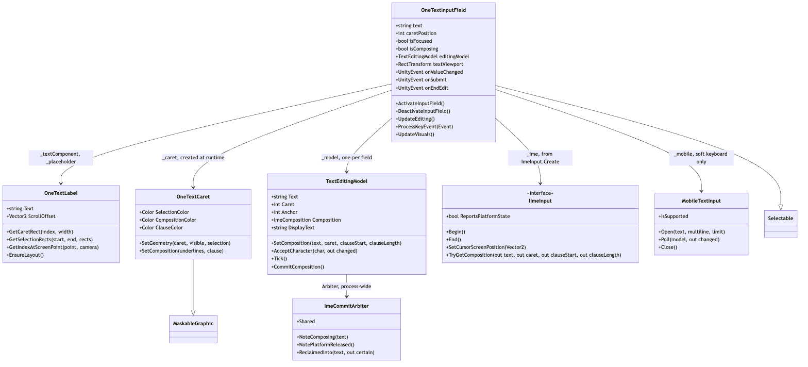
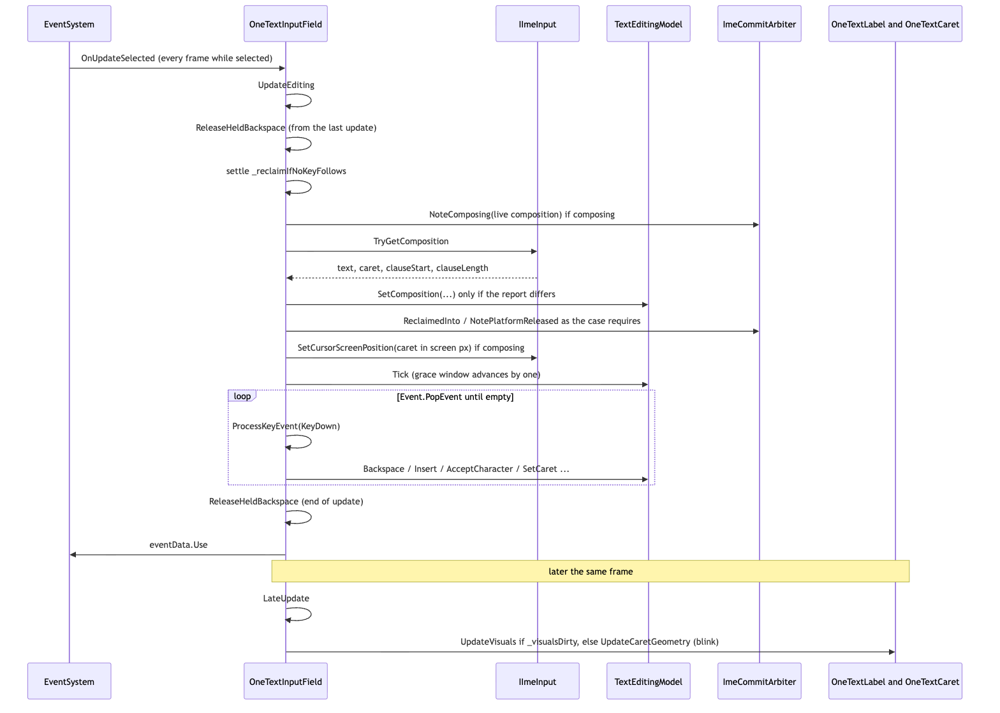
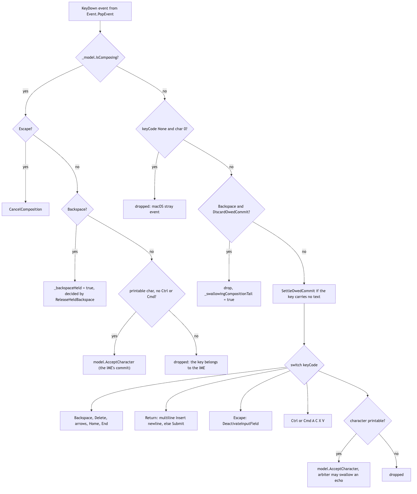
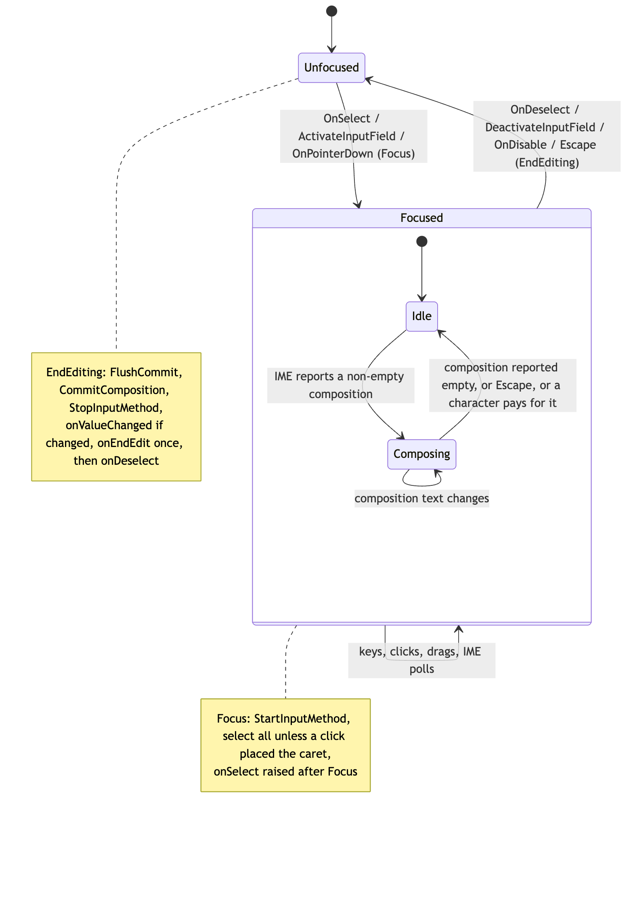
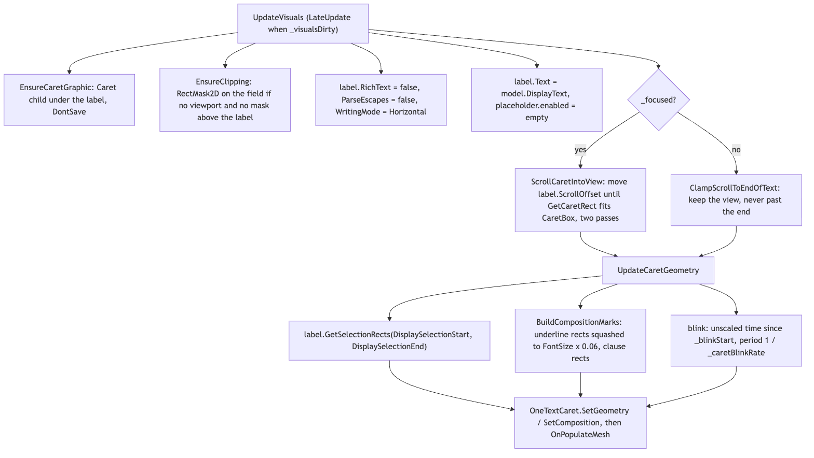

# Runtime/UGUI — OneTextInputField

`OneTextInputField` is the uGUI text field. It is a `Selectable` that owns three children — a text `OneTextLabel`, an optional placeholder `OneTextLabel`, and an `OneTextCaret` graphic it creates at runtime — and drives one `TextEditingModel` (`Runtime/Core/Editing`, documented in [../Core/Editing/README.md](../Core/Editing/README.md)). The model holds the committed string, caret, selection and the live IME composition; the field does everything that needs a scene: focus through the `EventSystem`, the per-frame poll of the platform input method (`IImeInput`, see [Ime/README.md](Ime/README.md)), the IMGUI key queue, pointer hit-testing, scrolling the label so the caret stays in view, clipping, and drawing the caret, selection and composition marks. In the pipeline it sits at the frontend end: the field writes `model.DisplayText` into the label's `Text`, and the label does parse/shape/layout/render as for any other text.

## Files

| File | Responsibility |
|---|---|
| `OneTextInputField.cs` | The field. Focus and editing session, `IImeInput` poll, key routing, pointer selection, scrolling and clipping, caret geometry, events, and the TextMesh Pro parity members (`onEndEdit`, `lineType`, `stringPosition`, ...). |
| `OneTextCaret.cs` | A `MaskableGraphic` that draws the selection highlight, the composition underline, the converting-clause block and the caret bar from rects the field hands it. Created by the field (`[AddComponentMenu("")]`, `HideFlags.DontSave`). |
| `Ime/` | The input-method backends the field polls. Own README: [Ime/README.md](Ime/README.md). |

Related code outside this folder: `Editor/OneTextInputFieldEditor.cs` (inspector, the "Add Text Area" button, the viewport warnings), `Editor/OneTextMenuItems.cs` (`CreateInputField`, the `GameObject > UI > OneText > Input Field` hierarchy), `Runtime/Core/Editing/` (the model and `ImeCommitArbiter`), `TextHitTest` (word/line/vertical caret motion used here).

## Structure

Source: [diagrams/inputfield-structure.mmd](diagrams/inputfield-structure.mmd)

`OneTextInputField` implements `IUpdateSelectedHandler`, `IPointerClickHandler`, `IBeginDragHandler`, `IDragHandler` and `ISubmitHandler` on top of `Selectable`. Its serialized references are `_textComponent`, `_placeholder`, `_caret` and `_textViewport` (the masked "Text Area" box; optional). Its private state is the model (`_model`, one per field), the backend (`_ime`, created lazily by `ImeInput.Create()`), the soft-keyboard bridge (`_mobile`), four reusable `List<Rect>` scratch lists, one reusable `Event _processingEvent`, and a handful of flags: `_focused`, `_imeBegun`, `_pointerIsFocusing`, `_backspaceHeld`, `_swallowingCompositionTail`, `_reclaimIfNoKeyFollows`, `_visualsDirty`, `_endEditReported`, `_desiredCaretX`, `_blinkStart`.

Entry points a caller uses: the `text` property (raises `onValueChanged`), `SetTextWithoutNotify`, `caretPosition` / `selectionAnchorPosition` / `selectionFocusPosition` / `stringPosition`, `SetSelection`, `SelectAll`, `MoveTextStart` / `MoveTextEnd`, `ActivateInputField` / `DeactivateInputField`, and the events `onValueChanged`, `onSubmit`, `onEndEdit`, `onSelect`, `onDeselect`. For tests and tools there are `editingModel` (the `TextEditingModel` itself), `UpdateEditing()` (one editing update without an `EventSystem`), `ProcessKeyEvent(Event)` (one key, exactly as the key loop would apply it), `UpdateVisuals()`, and the static `LogEditing` flag that makes `Trace` log every decision.

`OneTextCaret` is deliberately dumb: `SetGeometry(caret, caretVisible, selection)` and `SetComposition(underlines, clause)` replace its rect lists and call `SetVerticesDirty()`; `OnPopulateMesh` emits one quad per rect in the order selection, clause, composition underline, caret (the caret uses the graphic's own `color`). It shares the label's rect and pivot, so the rects it receives are already in the right space. `raycastTarget` is forced false in `Awake`.

## Behaviour

### One editing update

Source: [diagrams/inputfield-update-sequence.mmd](diagrams/inputfield-update-sequence.mmd)

While the field is the `EventSystem`'s selected object, `OnUpdateSelected` runs every frame. It calls `UpdateEditing()`, then (desktop only, `_mobile == null`) drains the IMGUI queue with `Event.PopEvent(_processingEvent)` and hands every `KeyDown` to `ProcessKeyEvent`, then calls `ReleaseHeldBackspace()`, then `eventData.Use()`. `LateUpdate` runs `UpdateEditing()` itself on frames where the `EventSystem` did not (`_lastEditingFrame != Time.frameCount`) — no `EventSystem`, or the soft keyboard reporting on its own schedule.

`UpdateEditing()` in order:

1. `ReleaseHeldBackspace()` — anything held by the previous update and not released in it.
2. If `_reclaimIfNoKeyFollows` is set and nothing carrying a key or character arrived behind it, the composition the platform started on its own is a syllable it took back: `Reclaim(...)` removes it from the value (`model.TakeBackCommitted`, then `Arbiter.ForgetPlatformCommit()`).
3. `_swallowingCompositionTail = false`.
4. If composing, `Arbiter.NoteComposing(composition)` — the arbiter decides whether a live composition retires its guards.
5. Mobile: `_mobile.Poll(_model, out changed)`; a false return means the keyboard was dismissed, so `DeactivateInputField()`; `changed` raises `Changed()`. Return.
6. `PollInputMethod()` — below.
7. `_model.Tick()` — the arbiter's grace window advances one update; if it hands back a commit the platform never delivered, the value changes and `Changed()` fires.

`PollInputMethod()` reads `_ime.TryGetComposition(out text, out caret, out clauseStart, out clauseLength)` (a miss is normalized to `""`, `-1`, `0`, `0`). It compares against the model's current composition (`Ordinal` on the text, plus clause start/length when composing) and only when the report **differs** calls `model.SetComposition(...)`. If that started a composition (`!wasComposing && IsComposing`) it asks `Arbiter.ReclaimedInto(text, out certain)`: a certain answer is reclaimed now, an uncertain one is parked in `_reclaimIfNoKeyFollows` for this update to settle. `_visualsDirty` is set only if something is or was on screen — a composition the model refused as a replay must not redraw every frame. If nothing differed, both sides are idle, and `_ime.ReportsPlatformState` is true, it calls `Arbiter.NotePlatformReleased()` (the platform saying it holds nothing is evidence; a cached backend's silence is not). Finally, while composing, `_ime.SetCursorScreenPosition(CaretScreenPosition())` so the candidate window opens at the caret (`GetCaretRect(model.DisplayCaret, _caretWidth)` → world → `RectTransformUtility.WorldToScreenPoint`, with the canvas camera unless the canvas is `ScreenSpaceOverlay`).

Composition is read **before** the key queue is drained, on purpose: the frame an IME commits is then a frame that already knows the composition ended, so the committed characters are not counted twice.

### Key routing

Source: [diagrams/inputfield-key-routing.mmd](diagrams/inputfield-key-routing.mmd)

`ProcessKeyEvent(Event)` resets the blink and clears `_reclaimIfNoKeyFollows` for any event that carries a key code or a character. Then:

**While composing** — Escape cancels the composition (`model.CancelComposition`) and keeps the field. Backspace is *held* (`_backspaceHeld = true`) rather than applied or dropped; `ReleaseHeldBackspace` decides at the end of the update: composition still live → it was the IME's, dropped; composition gone → `DiscardOwedCommit()` (the press emptied the composition; swallow the tail) or else `SettleOwedCommit()` then `model.Backspace()`. Any other key with a printable character and no Ctrl/Cmd is the IME's **commit** (Windows `GCS_RESULTSTR` → `WM_CHAR`, macOS `insertText:`) and goes to `model.AcceptCharacter`; everything else (arrows, Return, Tab, control characters) belongs to the IME and stops here.

**Not composing** — an event with `KeyCode.None` and character 0 does nothing (macOS sends one ahead of the real press when a composition terminates). Backspace while the platform still owes a just-ended composition → `DiscardOwedCommit()`, `_swallowingCompositionTail = true`, return; a repeat Backspace with character 0 while swallowing is dropped. A key carrying no text settles an owed commit first (`SettleOwedCommit`, so the key acts on the whole value). Then the switch: `Backspace`, `Delete`, `Left/Right` (`MoveHorizontally`, word jump with Ctrl/Cmd or Alt, Shift extends), `Up/Down` (`MoveVertically`, keeps `_desiredCaretX` across moves), `Home/End` (`LineEdge` from the label's layout lines), `Escape` → `DeactivateInputField()`, `Return`/`KeypadEnter` → `Insert("\n")` if `_multiline` else `Submit()`, Ctrl/Cmd+`A`/`C`/`X`/`V` (`GUIUtility.systemCopyBuffer`; paste into a single-line field strips `\r` and turns `\n` into a space), `Tab` ignored. Anything left with a printable character (not `\t`, not with Ctrl/Cmd; `\n`/`\r` insert a newline only when multiline) goes to `model.AcceptCharacter`, which the arbiter may refuse as an echo of a composition the field already committed.

Every change the keys, the IME or the model make to the value goes through `Changed()`: copies `model.Text` into `_text`, clears `_desiredCaretX`, sets `_visualsDirty`, clears `_endEditReported`, invokes `onValueChanged`. The `text` setter and `SetTextWithoutNotify` write `_text`, `_visualsDirty` and `_endEditReported` themselves (the setter also invokes `onValueChanged`) without touching `_desiredCaretX`.

### Focus, session, events

Source: [diagrams/inputfield-focus-state.mmd](diagrams/inputfield-focus-state.mmd)

Focus arrives through `OnSelect` (→ `Focus()` then `onSelect`), `ActivateInputField()` (selects the object in the `EventSystem`, then `Focus()`), or `OnPointerDown` (`Selectable.OnPointerDown` selects synchronously, which reaches `Focus()` inside the call — `_pointerIsFocusing` is raised for exactly that call so `Focus` can tell a click from a Tab). `Focus()` resets the blink, clears `_endEditReported`, and on a real transition calls `StartInputMethod()` and, if `_onFocusSelectAll && !_pointerIsFocusing`, `SelectAll()`. A click then places the caret with `SetCaret(IndexAt(eventData))`.

`StartInputMethod()` returns early when `_readOnly` or `!_inputMethodEnabled`. If `MobileTextInput.IsSupported` it opens the soft keyboard (`Open(text, multiline, characterLimit)`) and returns. Otherwise it creates the backend once (`_ime ??= ImeInput.Create()`), and calls `_ime.Begin()` once per session (`_imeBegun`). `StopInputMethod()` calls `_ime.End()` only if this field began (`_imeBegun`) — the IME is one process-wide switch and `EndEditing` is also reached from `OnDisable` on fields that never had focus — and closes `_mobile`.

`EndEditing()` (from `OnDeselect`, `DeactivateInputField`, `OnDisable`, the Escape key, and mobile dismissal): if not focused, just `StopInputMethod()`. Otherwise `model.FlushCommit()` first (a commit the platform owed), then `model.CommitComposition()` (the live composition becomes text; the arbiter will swallow the platform's echo), `_focused = false`, `StopInputMethod()`, `Changed()` if either changed, then `RaiseEndEdit()`. `OnDeselect` invokes `onDeselect` after that, so both carry the committed value.

Event order, for reference: Return on a single-line field → `onSubmit` then `onEndEdit` (`Submit()`); `ISubmitHandler.OnSubmit` does the same when `!_multiline`. Focus leaving → `onValueChanged` (if the commit changed the value) → `onEndEdit` → `onDeselect`. `onEndEdit` is raised once per edit (`_endEditReported`): Return then click-away is one end-edit; any change to the value, or focusing again, re-arms it. `onSelect` fires after `Focus()` with the value as it stood.

Pointer behaviour: double-click selects the word (`TextHitTest.GetWordAt`), triple-click selects all, drag extends the selection — and all of `OnPointerDown`, `OnPointerClick`, `OnBeginDrag`, `OnDrag` do nothing while `_model.IsComposing`, because moving the caret out from under a live composition would make the platform's later commit land in the wrong place.

### Visuals, scrolling, clipping

Source: [diagrams/inputfield-visuals.mmd](diagrams/inputfield-visuals.mmd)

`LateUpdate` calls `UpdateVisuals()` when `_visualsDirty`, else — if focused and `_caretBlinkRate > 0` — only `UpdateCaretGeometry()` so the caret blinks without re-laying-out text.

`UpdateVisuals()`: `EnsureCaretGraphic()` (creates the "Caret" child under the label with `HideFlags.DontSave`, stretched anchors, the label's pivot), `EnsureClipping()`, forces `RichText = false`, `ParseEscapes = false`, `WritingMode = TextWritingMode.Horizontal` on the label, sets `label.Text = model.DisplayText`, toggles `_placeholder.enabled` on empty display text, then `ScrollCaretIntoView()` and `UpdateCaretGeometry()`.

`CaretBox()` is the box the caret must stay inside, in the label's local space: the `_textViewport` rect converted through world space into label space, or `label.rect` when there is no viewport (or it *is* the label). `ScrollCaretIntoView()` while focused nudges `label.ScrollOffset` (two passes) until `GetCaretRect(DisplayCaret, _caretWidth)` is inside the box, and never lets the offset go past the start (`x >= 0`, `y <= 0`). While unfocused it does **not** rewind; it calls `ClampScrollToEndOfText()`, which only pulls the view back if the end of the text has moved left of the box edge (a shorter value assigned from script).

`EnsureClipping()` runs on every visual update but exits on the first `GetComponent` when a viewport is authored or the field already has a `RectMask2D`. Otherwise it walks up from the label's parent: any `RectMask2D` or `Mask` found before reaching the field means somebody already clips — leave it; reaching the field means add a `RectMask2D` to the field's own object with `HideFlags.DontSave`; never reaching the field (the label lives elsewhere) means do nothing. The mask cannot go on the label itself because `MaskUtilities` skips the clippable's own object.

`UpdateCaretGeometry()` pushes the four colours onto the caret graphic every time (they are serialized on the field, because the caret object is not saved), clears the geometry when unfocused, otherwise collects selection rects from `label.GetSelectionRects(DisplaySelectionStart, DisplaySelectionEnd, ...)`, builds the composition marks, computes blink visibility as `(Time.unscaledTime - _blinkStart) % (1/_caretBlinkRate) < 0.5/_caretBlinkRate` (or always visible when the rate is `<= 0`), and calls `SetGeometry(caretRect, visible && no selection, selectionRects)`. `BuildCompositionMarks()` uses `model.TryGetCompositionRange` / `TryGetClauseRange` and the same `GetSelectionRects`, squashing the composition rects to an underline of `Mathf.Max(1f, FontSize * 0.06f)` at the bottom of each rect; the clause rects are left full height.

### Mobile keyboard

When `MobileTextInput.IsSupported` (`TouchScreenKeyboard.isSupported && !isInPlaceEditingAllowed`), the field never drains the key queue and never creates an `IImeInput`. Each update `_mobile.Poll(model, out changed)` copies the OS buffer into the model through `model.SetExternalText(text, selectionStart, selectionLength)`; the field raises `Changed()` when that reports a change and deactivates itself when the keyboard is no longer `Visible`. Details in [Ime/README.md](Ime/README.md).

### Submit and validation

There is no validation. `characterLimit` is enforced by the model (`CharacterLimit`, 0 = unlimited); `readOnly` makes the model refuse edits and cancels any live composition. The code explicitly declines `contentType` (password/email/integer masking and validation): the parity region says it "will not be" added because OneText has neither validation nor masking. `lineType` is a lossy alias of `multiline` (`MultiLineSubmit` sets multiline and reads back as `MultiLineNewline`).

## Invariants and conventions

- **Main thread only.** Everything here is Unity API (`Input`, `Event`, `EventSystem`, graphics). Nothing in the source says otherwise.
- **Per-frame allocation.** The rect lists (`_selectionRects`, `_compositionRects`, `_clauseRects`, `_rectScratch`) and the single `_processingEvent` are reused. `Trace` returns at once when `LogEditing` is off, but its callers build the interpolated message (and `Quote`) before the call, so a key event, a differing composition report or a reclaim still allocates a string or two; an idle frame adds none of these. `PollInputMethod` reads one string per frame from the backend (on `ImguiImeInput` that is `Input.compositionString` itself) and compares ordinally; it does not copy it unless the report differs. `_visualsDirty` is not set for a refused replay so the label is not rebuilt every frame.
- **Indices are UTF-16 code units** of `text` (`caretPosition`, `stringPosition`, `selectionAnchorPosition`, `selectionFocusPosition` all answer the same number). Grapheme and word stepping happen inside the model / `TextHitTest`.
- **Rect spaces.** Everything the label reports (`GetCaretRect`, `GetSelectionRects`) and everything the caret draws is in the label's local space; `CaretBox` converts the viewport into that space. `SetCursorScreenPosition` takes screen pixels. `ScrollOffset` is in label-local units. Blink is in Hz on `Time.unscaledTime`.
- **Ordering inside an update.** IME poll, then `Tick`, then the key queue, then `ReleaseHeldBackspace`. Several model and arbiter rules (the `_replaced` register that `Tick` ages out, the owed-commit settle before a text-less key, the held backspace) assume exactly this order. Do not move `UpdateEditing()` after the key loop.
- **`EndEditing` order.** `FlushCommit` before `CommitComposition` — the other way round arms the echo guard and the flush immediately disarms it. `RaiseEndEdit` last so the event carries the committed value.
- **One IME switch per process.** `Begin`/`End` are guarded by `_imeBegun`; a field that never began must never call `End`. `ImeCommitArbiter.Shared` is process-wide: the field that incurs an owed commit settles it (`EndEditing` flushes before focus can move).
- **Runtime-created objects.** The caret graphic and the self-added `RectMask2D` carry `HideFlags.DontSave`; nothing the field does at runtime changes the user's saved hierarchy. Colours live on the field (`_caretColor`, `_selectionColor`, `_compositionColor`, `_clauseColor`) and are pushed to the graphic on every geometry update.
- **The label is the field's.** `UpdateVisuals` overrides `RichText`, `ParseEscapes` and `WritingMode` on every rebuild; setting them on the label has no lasting effect.
- **`_text` mirrors `_model.Text`.** `OnEnable` and `OnValidate` (editor, not playing) push `_text` into the model; `Changed()`, the `text` setter and `SetTextWithoutNotify` push the model back into `_text`.

## Extending

- **A new key binding or shortcut**: the `switch (keyEvent.keyCode)` in `ProcessKeyEvent`, below the owed-commit settle. If the key can arrive while composing, decide explicitly in the `if (_model.IsComposing)` block first — by default everything that is not a printable character is left to the IME there. Cover it in `Tests/Editor/EditingTests.cs` (drive with `field.ProcessKeyEvent(Key(...))` against the `FakeIme`) or `Tests/Runtime/RuntimeInputFieldTests.cs` (with a real `EventSystem` and frames).
- **A new event or parity member**: the "Input-field parity" region at the bottom of `OneTextInputField.cs`; serialize `UnityEvent` fields so they can be wired in the inspector; raise them from `Changed()`, `Submit()`, `EndEditing()` or `Focus()` in the documented order. `Tests/Editor/TmpApiParityTests.cs` has the existing `OnEndEdit_*`, `SetTextWithoutNotify_*`, `LineType_*`, `StringPosition_*` cases to copy.
- **Caret or selection appearance**: `OneTextCaret.OnPopulateMesh` and `BuildCompositionMarks` / `UpdateCaretGeometry`; add a serialized colour on the field and push it in `UpdateCaretGeometry`. Surface it in `Editor/OneTextInputFieldEditor.cs`.
- **Scrolling or clipping**: `CaretBox`, `ScrollCaretIntoView`, `ClampScrollToEndOfText`, `EnsureClipping`; tests in `Tests/Editor/InputFieldViewportTests.cs` (viewport present/absent/masked, scroll preserved after focus loss, caret kept inside the viewport) and the menu/inspector helpers in `Editor/OneTextMenuItems.cs` and `Editor/OneTextInputFieldEditor.cs`.
- **Another input-method backend**: implement `IImeInput` and call `ImeInput.Register`; the field needs no change. See [Ime/README.md](Ime/README.md).
- **A model-level rule** (what a composition does to the value, how an echo is recognised): `Runtime/Core/Editing`, not here — the field only sequences calls.

Tests that exercise this module: `Tests/Editor/EditingTests.cs` (the field half: composition drawn inline, held backspace, same-syllable-twice, focus-loss commit, reclaim, select-on-focus vs click, Escape), `Tests/Editor/InputFieldViewportTests.cs`, `Tests/Editor/InteractionTests.cs` (`InputField_Text_Drives_The_Label_And_Fires_Events`, caret/selection tracking, clamp on shrink), `Tests/Editor/TmpApiParityTests.cs` (parity members and event semantics), `Tests/Editor/InputFieldMigrationTests.cs` and `Tests/Editor/ComponentMigrationTests.cs` (converting a uGUI/TMP field), `Tests/Runtime/RuntimeInputFieldTests.cs` (EventSystem-driven focus, typing across frames, caret destroyed with the field). `Tools/ImeProbe~/` holds two throwaway diagnostics (`OneTextImeProbe.cs`, `OneTextImeProbeInputSystem.cs`) for recording what a real platform IME sends; see the Ime README.

## Gotchas

1. **A click while composing does nothing.** `OnPointerDown`, `OnPointerClick`, drags all return early while `_model.IsComposing`; the caret belongs to the IME until the syllable is finished. Committing on click was tried and the platform offered the syllable back as a new composition a frame later.
2. **Backspace while composing is held, not applied.** See `ReleaseHeldBackspace` and the comments on `_backspaceHeld` / `_swallowingCompositionTail`: macOS sends four events for the backspace that empties a Hangul composition (a key-less event, the backspace, the handed-back jamo, the backspace again). Modelling that as one event in a test passes while the real field deletes two characters.
3. **Composition is polled before keys are drained**, and a key carrying no text settles an owed commit before acting. Reordering either is how "강ㄱ, one backspace, both gone" happened.
4. **`Begin` on one field, `End` from another.** `EndEditing` is reached by `OnDisable` on fields that were never focused (a panel being hidden); without `_imeBegun` that switched the IME off under the field that was composing.
5. **Focus-select-all does not apply to clicks.** `_pointerIsFocusing` is only true inside `OnPointerDown`; `Focus()` reached from there places the caret instead of selecting. This is a deliberate divergence from TextMesh Pro (`onFocusSelectAll` doc comment).
6. **Unfocused fields keep their scroll.** Unlike uGUI/TMP the field does not rewind to the start on focus loss (CHANGELOG "keeps the view the user left"); a value assigned from script is clamped by `ClampScrollToEndOfText`. A long value may therefore show its middle when unfocused.
7. **`EnsureClipping` adds a `RectMask2D` to the field object itself** when no viewport is authored and nothing above the label masks. It clips everything under the field, at the field's edge, not at a padded text area. Authoring a viewport (inspector "Add Text Area") removes all three costs.
8. **Visuals dirty vs. refused replays.** `PollInputMethod` sets `_visualsDirty` only if `wasComposing || IsComposing`. A backend that keeps reporting a composition the arbiter refuses would otherwise rebuild the label every frame.
9. **`onEndEdit` is raised once per edit**, not once per Return: Return then focus-out is one event; typing in between re-arms it. `RaiseEndEdit` explains why TMP's behaviour (Return deactivates) is not copied.
10. **`lineType = MultiLineSubmit` never reads back as itself.** The setter compares the one bit it keeps, so a compare-then-assign loop does not redraw every frame — but a field that wants several lines and a committing Return must stay multiline and submit from its own key handler.
11. **`UpdateVisuals` forces `RichText = false` and `ParseEscapes = false`** on the text label every rebuild; typed `<b>` is text, typed `\n` is two characters.
12. **`LogEditing`** is the switch for the one-line-per-decision trace in `Trace`. It is what the recorded-bug fixes in CHANGELOG were read from; turn it on before reasoning about an IME bug.

## Related

- [Ime/README.md](Ime/README.md) — `IImeInput`, the two desktop backends, `MobileTextInput`, backend selection.
- [../Core/Editing/README.md](../Core/Editing/README.md) — `TextEditingModel`, `ImeComposition`, `ImeCommitArbiter` (owed commits, echo suppression, replay refusal, reclaim).
- [README.md](README.md) — the rest of `Runtime/UGUI` (`OneTextLabel`, `OneTextDropdown`, invalidation).
- `../../../Docs/ARCHITECTURE.md` — the pipeline the label sits in.
- `../../../CHANGELOG.md` — the "Fixed" entries on Korean input are the narrative behind most of the guards in `ProcessKeyEvent`.
