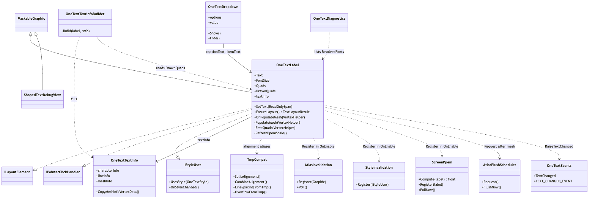
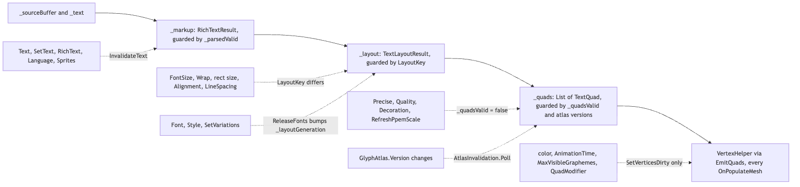
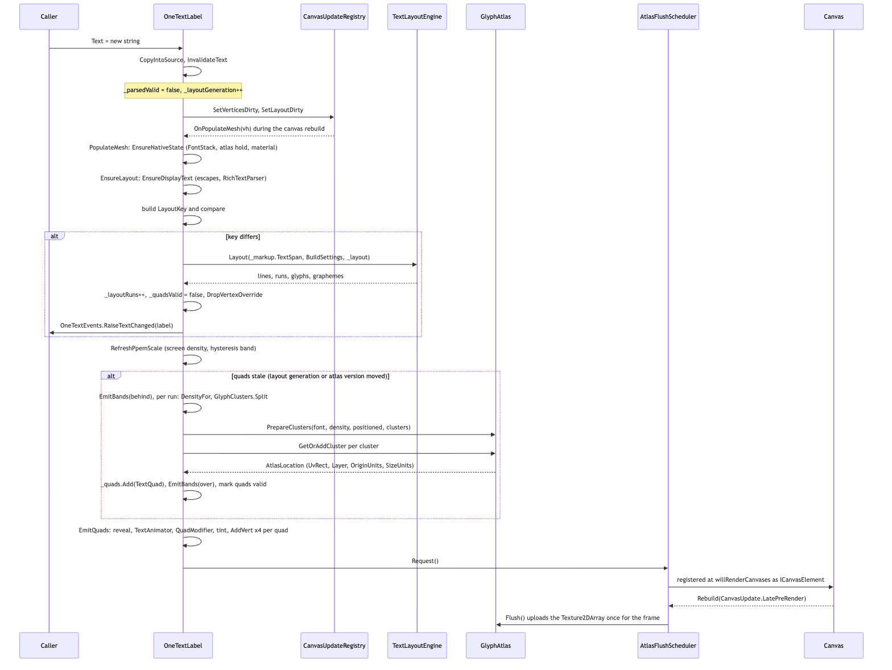
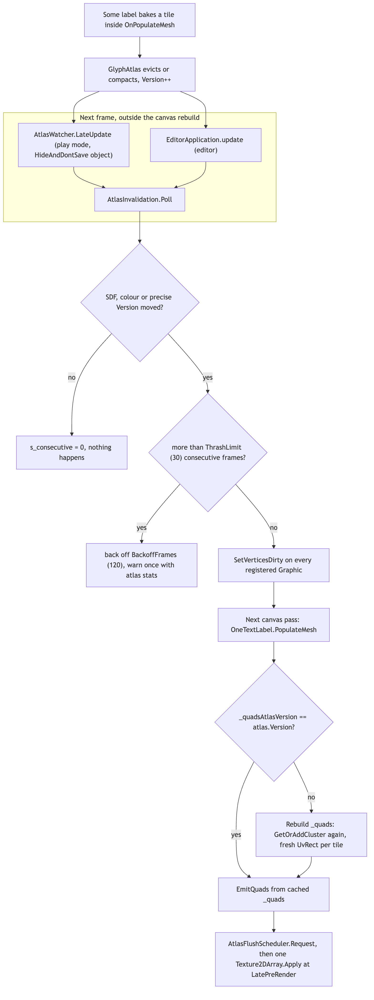
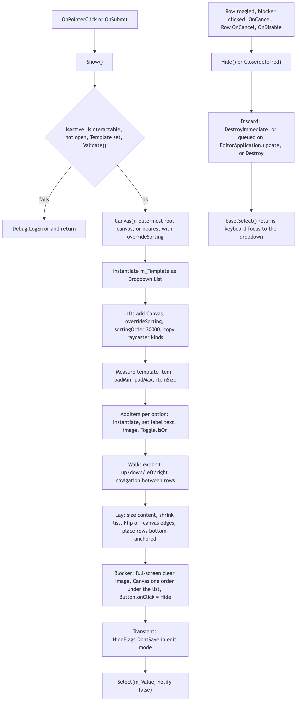

# Runtime/UGUI

The uGUI frontend. `OneTextLabel` is a `MaskableGraphic` that turns the output of the core pipeline (parse -> analyze -> shape -> layout -> atlas tiles) into canvas geometry, and the rest of the folder is what a label needs to live inside a `Canvas`: one atlas upload per frame (`AtlasFlushScheduler`), rebuilds when the atlas moves tiles (`AtlasInvalidation`), rebuilds when a style asset is edited (`StyleInvalidation`), the measured screen density that picks the atlas bucket (`ScreenPpem`), a TextMesh Pro-shaped `textInfo` facade, a dropdown whose labels are OneText labels, and a development-build overlay. The input field, caret and IME bridges live in this folder too but are documented separately (see [InputField.md](InputField.md) and [Ime/README.md](Ime/README.md)). The assembly is `OneText.UGUI`; it references `OneText` (core) and `UnityEngine.UI` and nothing else.

## Files

| File | Responsibility |
|---|---|
| `OneText.UGUI.asmdef` | Assembly `OneText.UGUI`, root namespace `OneText.UGUI`. References `OneText` and `UnityEngine.UI`. Defines `ONETEXT_UGUI_HAS_MAX_SIZE` when `com.unity.ugui` >= 2.6.0 (the `ILayoutElement.maxWidth/maxHeight` members). |
| `AssemblyInfo.cs` | `InternalsVisibleTo("OneText.Tests")`, so tests can read `OneTextLabel.ResolvedFonts` and friends. |
| `OneTextLabel.cs` | The label: serialized fields, text buffer and `SetText` overloads, font stack, the three-tier cache (parse / layout / quads), `OnPopulateMesh`, vertex packing (`AddVert`), auto-size, hit-testing, link clicks, reveal and typewriter, `ILayoutElement`, and the TMP parity aliases at the bottom. |
| `OneTextLabel.TextInfo.cs` | `partial OneTextLabel`: the `textInfo` property, `UpdateVertexData`/`UpdateGeometry` (vertex override), `faceColor`/`outlineColor`/`glowColor`/`outlineWidth`, `fontSharedMaterial`/`fontMaterial`, and `EmitOverrideQuad`. |
| `OneTextTextInfo.cs` | The TMP-shaped data types: `OneTextTextInfo`, `OneTextCharacterInfo`, `OneTextLineInfo`, `OneTextWordInfo`, `OneTextLinkInfo`, `OneTextMeshInfo`, `OneTextVertexDataUpdateFlags`. |
| `OneTextTextInfoBuilder.cs` | `internal static OneTextTextInfoBuilder.Build(label, info)`: translates `TextLayoutResult` + `DrawnQuads` into the structs above. |
| `TmpCompat.cs` | `TextAlignmentOptions`, `TextWrappingModes`, `TextOverflowModes` enums (TMP values, bit for bit) and `TmpCompat`, the one place that converts between TMP units and OneText units. Shared with the editor's Onboarding migration. |
| `OneTextDropdown.cs` | `Selectable` dropdown, member for member like `UnityEngine.UI.Dropdown`, whose `captionText`/`itemText` are `OneTextLabel`. Builds the open list, blocker and keyboard navigation in code. |
| `ScreenPpem.cs` | Screen pixels per canvas unit at a label (`Compute`), per-canvas `Context`, and the `willRenderCanvases` watcher that re-measures every registered label once per canvas pass (`PollNow`). |
| `AtlasInvalidation.cs` | Static registry of graphics that baked atlas UVs; polls `GlyphAtlas.Version` (SDF, colour, precise) once a frame and calls `SetVerticesDirty` on a change, with thrash back-off. |
| `AtlasFlushScheduler.cs` | `ICanvasElement` singleton that uploads the shared atlases once per frame at `CanvasUpdate.LatePreRender`; `FlushNow` for code with no canvas pass. |
| `StyleInvalidation.cs` | Static registry of `IStyleUser`; subscribes to `OneTextStyle.Changed` (and `OneFontAsset.Changed` in the editor) and calls `OnStyleChanged` on users of that style. |
| `OneTextEvents.cs` | Global `TextChanged` event (`Action<OneTextLabel>`) plus the TMP-shaped `TEXT_CHANGED_EVENT.Add/Remove`; raised from `EnsureLayout` after a re-layout, before the mesh is emitted. |
| `OneTextDiagnostics.cs` | Development-build `OnGUI` overlay (F9): atlas stats, per-label font chain, characters no font covers. Destroys itself in release builds. |
| `ShapedTextDebugView.cs` | M1 proof-of-life `MaskableGraphic`: shapes a string and draws glyph outlines as line quads. Debug only; not part of the rendering path. |
| `OneTextInputField.cs` | Input field built on a label. See [InputField.md](InputField.md). |
| `OneTextCaret.cs` | Caret/selection graphic for the input field. See [InputField.md](InputField.md). |
| `Ime/` | IME bridges (`IImeInput`, IMGUI and Input System implementations, mobile). See [Ime/README.md](Ime/README.md). |

## Structure

Source: [diagrams/ugui-structure.mmd](diagrams/ugui-structure.mmd)

`OneTextLabel` is the only type most callers touch. It is a `MaskableGraphic` (so masks, `CanvasRenderer` batching and `raycastTarget` work as for an `Image`), an `ILayoutElement` (so `ContentSizeFitter` and layout groups read `preferredWidth`/`preferredHeight`), an `IPointerClickHandler` (for `<link=id>` clicks) and a `StyleInvalidation.IStyleUser`. The public surface is the PascalCase properties (`Text`, `FontSize`, `Alignment`, `Wrap`, `Overflow`, `Precise`, `Quality`, `MaxVisibleGraphemes`, `CharactersPerSecond`, `QuadModifier`, `AnimationTime`, ...), the allocation-free `SetText(ReadOnlySpan<char>)` / `SetText(int)` / `SetText(float, int)` overloads, `EnsureLayout()` returning the `TextLayoutResult`, the read-only `Quads` / `DrawnQuads` lists of `TextQuad`, and the hit-test helpers (`GetIndexAtLocalPoint`, `GetCaretRect`, `GetSelectionRects`, `TryGetLinkAtLocalPoint`, `LayoutToLocal`). Everything lowercase (`text`, `fontSize`, `alignment`, `textInfo`, `ForceMeshUpdate`, ...) is a TMP parity alias marked `[EditorBrowsable(Never)]` that forwards to the real API; the six TMP members OneText cannot honour (`characterSpacing`, `wordSpacing`, `margin`, `autoSizeTextContainer`, `havePropertiesChanged`, `firstVisibleCharacter`) are declared `[Obsolete(..., true)]` so the compiler error says what to use instead.

Three of the static helpers (`AtlasInvalidation`, `StyleInvalidation`, `ScreenPpem`) are registries a label joins in `OnEnable` and leaves in `OnDisable`. All three keep static state, and all three reset in a `[RuntimeInitializeOnLoadMethod(SubsystemRegistration)]` because with Domain Reload off the lists would otherwise carry destroyed graphics from the previous play session. `AtlasFlushScheduler` is the fourth static helper but not a registry: a label only calls `Request()`, and the scheduler hooks `Canvas.willRenderCanvases` once (at `BeforeSceneLoad`, or on the first `Request`) and has no reset. `OneTextEvents` is the global "some label re-laid out" event. The `textInfo` family (`OneTextLabel.TextInfo.cs`, `OneTextTextInfo.cs`, `OneTextTextInfoBuilder.cs`) and `TmpCompat.cs` exist so code written against TextMesh Pro compiles and behaves after a rename; they are facades over `TextQuad` and are not consulted by the rendering path.

## Behaviour

### The three cache tiers

Source: [diagrams/label-cache-tiers.mmd](diagrams/label-cache-tiers.mmd)

A label holds its text as characters in `_sourceBuffer` (the serialized `_text` string is synced into it by `SyncSourceFromSerialized` on enable and in `OnValidate`). Downstream of that are three caches, each guarded by its own validity:

1. **Parse** — `EnsureDisplayText` fills `_markup` (a `RichTextResult`) from the source span: `EscapeParser.Unescape` first if `ParseEscapes` is on and the text has a backslash, then `RichTextParser.Parse` if `RichText` is on and `MightHaveMarkup`, else `_markup.SetPlain`. Guarded by `_parsedValid`, `_parsedRich`, `_parsedEscapes`. `InvalidateText` clears it and bumps `_layoutGeneration`.
2. **Layout** — `EnsureLayout` builds a `LayoutKey` (text length + FNV-1a hash, rect width/height, base font size, line spacing, alignment, wrap, overflow, `_layoutGeneration`, auto-size triple) and only calls `_engine.Layout(_markup.TextSpan, BuildSettings(...), _layout)` when the key differs from `_layoutKey`. A hit costs the key compare. On a miss it also runs `FitFontSize` when auto-size is on, increments `_layoutRuns`, drops `_quadsValid`, calls `DropVertexOverride` and raises `OneTextEvents.RaiseTextChanged`. Anything the key cannot see (font, style, variations, language, writing mode, sprites) bumps `_layoutGeneration` instead.
3. **Quads** — `PopulateMesh` rebuilds `_quads` only when `_quadsValid` is false or `_quadsLayoutGeneration`, `_quadsAtlasVersion`, `_quadsColorVersion` or `_quadsSpriteVersion` differ from the live values. `Precise`, `Quality`, `Decoration` and a ppem-scale change drop `_quadsValid` without touching the layout.

Below the quads, `EmitQuads` runs on every `OnPopulateMesh` and is the only per-frame work an animated label pays: reveal filtering, `TextAnimator.Modify`, the user's `ITextQuadModifier`, the label colour multiply, and `AddVert` x4 per quad. `color`, `AnimationTime`, `MaxVisibleGraphemes`, `ScrollOffset` and `QuadModifier` call `SetVerticesDirty` only.

### A label rebuild, end to end

Source: [diagrams/label-rebuild-sequence.mmd](diagrams/label-rebuild-sequence.mmd)

1. `Text = value` checks `SourceEquals` (a same-value assignment only restarts a running typewriter), copies into `_sourceBuffer`, and calls `InvalidateText`, which ends in `SetVerticesDirty` + `SetLayoutDirty`. uGUI queues the graphic and calls `OnPopulateMesh` during the canvas rebuild.
2. `PopulateMesh` clears the `VertexHelper`, then `EnsureNativeState`: builds the `FontStack` if missing (`BuildFontStack`: bytes override through `SharedFontBytes`, or style font > label font > `OneTextSettings.DefaultFont`, then `_fallbackFonts`, then project fallbacks), creates the `TextLayoutEngine`, takes the atlas reference (`HoldAtlas`) and calls `EnsureMaterial` (assigns `SharedGlyphAtlas.Material` and ORs `TexCoord1|2|3` into `canvas.additionalShaderChannels`). A missing font warns once through `MissingFonts.Warn` and draws nothing.
3. `EnsureLayout` as above. `maxWidth`/`maxHeight` passed to the engine depend on `_writingMode` and whether `_overflow != Overflow` ("budgeted"). After layout it computes `_blockOrigin`, the local-space corner every `LayoutToLocal` conversion is measured from (top-left horizontally, top-right for `VerticalRightToLeft`).
4. `RefreshPpemScale()` re-measures the screen density (see below) and may drop `_quadsValid`. `CharsetRecorder.Record` is fed the display span and density for prewarm recording.
5. If the quads are stale: `EmitBands(behind: true)` adds `<mark>` washes, then per `TextRun`: `runSize` (run or effective font size), `runDensity = DensityFor(runSize)`, `runPpem = GlyphAtlas.QuantizePixelsPerEm(runDensity)`, `scale = runSize / font.UnitsPerEm`, `runColor = run.Style.ResolveColor()`, `frame = FrameOf(run, vertical, scale)`. Sprite runs go to `EmitSprite`, colour fonts to `EmitColorRun` (per-glyph COLR decode into the `ColorGlyphAtlas`, SDF fallback per glyph), everything else through `GlyphClusters.Split` (or `SplitUpright` in an upright column) -> `atlas.PrepareClusters` (one batched bake dispatch) -> `atlas.GetOrAddCluster` per cluster -> `frame.Place` -> `_quads.Add(new TextQuad{...})`. Then `EmitBands(behind: false)` for underline/strikethrough, and the cache stamps are armed.
6. `EmitQuads` writes the mesh. Then `AtlasFlushScheduler.Request()` and, if it exists, `SharedGlyphAtlas.ColorAtlas.Flush()`.
7. `AtlasFlushScheduler` registered itself as an `ICanvasElement` from `Canvas.willRenderCanvases` (before the rebuild loop, because uGUI refuses new elements during it) and its `Rebuild(CanvasUpdate.LatePreRender)` calls `FlushNow`, which uploads the SDF atlas and, if it exists, the precise atlas once for the whole frame. Outside play mode `Request` flushes immediately unless `DeferOutsidePlayMode` is set.

### Screen density (ppem) and the quality rung

The font size is in canvas units; the atlas wants pixels per em. `DensityFor(runSize)` is `runSize * TextQualityScale.ForCanvas(_quality)`, raised to `runSize * _ppemScale` when the measured scale is above 1 (the larger wins, they are not multiplied), and capped at `OneTextLabel.PpemCap` (128, public static). `_ppemScale` is written only by `RefreshPpemScale`, which calls `ScreenPpem.Compute` (lossy scale for overlay canvases; times `pixelHeight / (2 * orthographicSize)` under an orthographic camera; times `pixelHeight / (2 * depth * tan(fov/2))` under a perspective camera, depth along the camera's forward axis) and applies it only if the ratio to the last applied value leaves the `PpemScaleBand` (0.1) hysteresis. Minification is floored at 1; `DynamicPpem = false` forces 1. `ScreenPpem.PollNow` runs from `willRenderCanvases` for every registered label and dirties those whose scale escaped the band; `PopulateMesh` also calls `RefreshPpemScale` so a one-shot render bakes at the right density.

### Atlas invalidation

Source: [diagrams/atlas-invalidation.mmd](diagrams/atlas-invalidation.mmd)

A `TextQuad` bakes its tile's `UvRect` and `Layer`. When the `GlyphAtlas` evicts or compacts, those are stale, and the atlas reports it as a `Version` bump. `AtlasInvalidation.Poll` runs once per frame from a hidden `AtlasWatcher` MonoBehaviour's `LateUpdate` in play mode, and from `EditorApplication.update` in the editor (taken once and kept). It compares the SDF atlas reference and `Version`, `ColorAtlas.Version` and `PreciseAtlas.Version` against what it saw last; on a change it calls `SetVerticesDirty` on every registered `Graphic`, so the next canvas pass enters `PopulateMesh`, finds `_quadsAtlasVersion != atlas.Version`, and rebuilds the quads with fresh locations. A rebuild can itself evict, so after `ThrashLimit` (30) consecutive invalidating frames it backs off for `BackoffFrames` (120) and warns once with `GetStats()`. The poll is deliberately not inline: the version changes in the middle of a canvas rebuild, and uGUI refuses to queue a rebuild from inside one.

`StyleInvalidation` has the same shape: `OneTextStyle.Changed` -> every registered `IStyleUser` whose `UsesStyle` is true (the label checks `_style`, `_namedStyles`, and one level of `Extends`) gets `OnStyleChanged`, which on the label is `ReleaseFonts` + `_parsedValid = false` + `_layoutGeneration++` + dirty. In the editor `OneFontAsset.Changed` rebuilds every user.

### Reveal, typewriter, animation

`MaxVisibleGraphemes` (-1 = all) filters quads in `EmitQuads` by `quad.LastGrapheme >= reveal` (a merged tile shows only when every cluster it covers is revealed). `CharactersPerSecond > 0` turns on the label's own typewriter: `Update` calls `AdvanceReveal(Time.deltaTime)`, which walks `_unitStarts` (built by `RevealUnits.Build` under `RevealGranularity`) with a budget/pause pair honouring `_punctuationDelays` and `<wait>` markup, and assigns `MaxVisibleGraphemes`. Events: `GraphemeRevealed(int)`, `CharacterRevealed(int)` (per reveal unit), `RevealComplete`. `SkipToEnd` sets -1 and fires only `RevealComplete`. Effects from markup are built into `_animator` (a `TextAnimator`) by `EnsureAnimator`, addressed by grapheme; `Update` advances `AnimationTime` only while `HasAnimationWorkLeft`. Outside play mode a stale reveal is drawn as "all" (`EffectiveMaxVisibleGraphemes`) and frozen effects are shown finished.

### textInfo facade

`label.textInfo` calls `EnsureLayout`, forces a mesh update if nothing has been drawn yet (`_drawn.Count == 0`), and rebuilds the `OneTextTextInfo` through `OneTextTextInfoBuilder.Build` when `_textInfoStamp != _layoutRuns`. Characters are grapheme clusters; `vertexIndex` is `quadIndex * 4` in BL, TL, TR, BR order (TMP's order); `meshInfo` has exactly one entry. `UpdateVertexData` / `UpdateGeometry(Mesh, int)` set `_vertexOverride` and dirty the mesh; `EmitQuads` then draws each quad through `EmitOverrideQuad` from the caller's `meshInfo[0].vertices/colors32`, while UVs, layer, atlas discriminator and decoration still come from the tile. Any re-layout calls `DropVertexOverride`.

### Dropdown

Source: [diagrams/dropdown-show.mmd](diagrams/dropdown-show.mmd)

`OneTextDropdown.Show` duplicates `m_Template`, lifts the copy onto its own `Canvas` at `ListSortingOrder` (30000, Unity's number) with the same raycaster kinds as the canvas above it, instantiates one row per option (`AddItem`), wires explicit navigation (`Walk`), lays the rows out in code (`Lay`, bottom-anchored, first option on top, `Flip` if off-canvas), and creates a full-screen `Blocker` one sorting order under the list whose `Button.onClick` is `Hide`. Rows carry a `Row` component for `OnPointerEnter` (select on hover) and `OnCancel` (Escape closes). `Close(deferred)` drops the references first, then `Discard`s: `DestroyImmediate` in the editor, or queued on `EditorApplication.update` when called from `OnDisable` (a destroy under a deactivating parent is refused), or `Destroy` in play mode. `m_AlphaFadeSpeed` is carried for migration parity (exposed as `alphaFadeSpeed`) and read by nothing in `Show`/`Hide`.

## Invariants and conventions

- **Main thread only.** Everything here runs inside uGUI callbacks or `Update`/`LateUpdate`. The engine and atlas are not called from other threads by this module.
- **No per-frame allocations on the animated path.** `EmitQuads` allocates nothing; the three layout resolver delegates (`_resolveFontOverride`, `_resolveNamedStyle`, `_resolveSpriteAspect`) and the three parser resolvers are cached in fields because a method-group conversion allocates; `SetText(ReadOnlySpan<char>)` writes into `_sourceBuffer` and `Text` only builds a string when read. `EscapeParser.Unescape` is the one allocating path and runs only for text containing a backslash. `AllocationTests.cs` measures this.
- **Atlas reference lifetime.** `HoldAtlas` in `OnEnable` (or first `EnsureNativeState`), `SharedGlyphAtlas.Release` in `OnDestroy`, never on disable. `_atlasHeld` is `[NonSerialized]` on purpose: a domain reload resets the static refcount and a serialized `true` would release a reference the new domain never counted (`MaterialLifecycleTests.TheAtlasHold_DoesNotSurviveSerialization`).
- **Font ownership.** Faces from `FontData.Load` (bytes override with variations) are in `_ownedFonts` and disposed by `ReleaseFonts`; faces from `SharedFontBytes.Acquire` are in `_sharedFonts` and released, not disposed; asset faces (`OneFontAsset.Font` / `GetVariant`) are never disposed by the label. `_fontBytesOverride` must be length-checked, not null-checked: serialization resurrects `null` as `byte[0]`.
- **Units.** Font size and rect are canvas units. Glyph geometry comes out of the engine in font design units and is scaled by `runSize / font.UnitsPerEm` in `RunFrame`. Atlas density is pixels per em and is chosen by `DensityFor`, *never* by the size the text is drawn at; `scale` must keep reading `runSize`, or a quality rung would resize the text. Layout space is x along the inline axis, y along the block axis, from `_blockOrigin`; only `LayoutToLocal`/`LocalToLayout` know about vertical writing.
- **Vertex channel contract** (documented above `AddVert`, shared with `OneText-SDF.shader` and `OneTextMesh`): TEXCOORD0 = tile uv, layer|outline softness packed, tile v-min; TEXCOORD1 = outline/shadow colours; TEXCOORD2 = v-max, u-min, u-max, atlas discriminator|face dilate packed; TEXCOORD3 = glow colour, shadow offset, shadow softness|glow in:out. Atlas discriminator: 0 SDF, 1 colour, 2 precise (MSDF), 3 solid bar (`AtlasOf`). `DecorationChannels.None` is not `default`: face dilate is signed with zero at 128. Normal/tangent are never enabled on the canvas.
- **One material for every label** (`SharedGlyphAtlas.Material`), assigned from `EnsureMaterial` on enable / canvas change, never from inside `OnPopulateMesh` (uGUI logs an error for a rebuild queued during the rebuild loop).
- **Cache keys.** The layout key uses the base font size, not the fitted one. `_layoutGeneration` is the escape hatch for anything the key cannot hash. `_unitStarts` is keyed on `_layoutRuns` because a rect resize re-lays out without bumping the generation.
- **Quads are cached, drawn quads are not.** `_quads` survives frames; `_drawn` is rewritten by every `EmitQuads`. Label `color` is multiplied at emit, never baked into `_quads` or into colour tiles (`ColorKey` only includes a tint for glyphs that use the text colour).
- **Static registries reset on play.** `AtlasInvalidation`, `StyleInvalidation`, `ScreenPpem` clear their lists at `SubsystemRegistration`; `AtlasInvalidation` also nulls `s_watcher` because the scene object died with the session.
- **Ordering of bands.** `<mark>` washes are emitted before any glyph, underline/strikethrough after all glyphs; `_quads` order is draw order.
- **Grapheme clusters are the addressing unit** for reveal, effects, `TextQuad.FirstGrapheme/LastGrapheme` and `textInfo.characterInfo`. Never UTF-16 chars.

## Extending

- **A new label property that changes layout** (a new `TextLayoutSettings` field): add the serialized field and property, call `SetVerticesDirty(); SetLayoutDirty();`, and either add it to `LayoutKey` or bump `_layoutGeneration` in the setter (the `WritingMode` setter is the pattern). Pass it in `BuildSettings`. If it affects measurement, check `preferredWidth`/`preferredHeight` and `FitsAt` still build the settings you expect. Add the inspector field in `Editor/` and a case in `LayoutTests.cs` or `VerticalTests.cs`.
- **A property that changes tiles but not layout** (like `Precise`, `Quality`, `Decoration`): set `_quadsValid = false; SetVerticesDirty();` in the setter. If it changes what the atlas bakes, include it in the atlas key (see `Runtime/Core/Rendering`). `MsdfTests.cs` and `DecorationTests.cs` assert `QuadBuilds`/`LayoutRuns` counts for this distinction; `TextQualityTests.cs` asserts a denser tile and an unchanged `preferredWidth` instead.
- **A property that only moves or tints finished quads**: `SetVerticesDirty()` only and handle it in `EmitQuads`, or write an `ITextQuadModifier` and assign `QuadModifier`. `AnimationTests.cs` and `Tests/Runtime/RuntimeMutationTests.cs` check that `LayoutRuns` does not move.
- **A new vertex payload**: there is no spare channel. Read the `AddVert` comment; the only free bits are inside already-packed bytes. Update `OneTextMesh.AddQuad`, the shader, and `DecorationChannelTests.cs` / `OneTextMeshTests.Vertex_Channels_Follow_The_Shader_Contract` together.
- **A new TMP alias**: add it in the "TMP parity" block, forwarding only; unit conversions go in `TmpCompat` so the Onboarding migration (`Editor/`) shares them. Enum additions must match TMP values (`Tests/Editor/Tmp/TmpEnumParityTests.cs`). `TmpParityAliasTests.cs` and `TmpApiParityTests.cs` enumerate the surface; `TmpScriptRewriteTests.cs` covers the rewriter; `DOTweenCompatTests.cs` covers the `textInfo` consumers.
- **A new reveal or typewriter behaviour**: `AdvanceReveal`, `EnsureUnits`, `BuildWaits`; tests in `RevealTests.cs`, `TypewriterTests.cs`, `Tests/Runtime/RuntimeTypewriterTests.cs`.
- **A new registry/watcher**: copy the `StyleInvalidation` shape, including the `SubsystemRegistration` reset; register in `OnEnable`, unregister in `OnDisable`. `DomainReloadTests.cs` runs two play sessions with reload off.
- **Dropdown changes**: `DropdownCreationTests.cs`, `DropdownMigrationTests.cs`, `Tests/Runtime/DropdownSelectionTests.cs`.
- Other tests that exercise this folder: `DynamicPpemTests.cs` (`ScreenPpem`, hysteresis, cap), `StyleTests.cs` (`StyleInvalidation`), `MaterialLifecycleTests.cs`, `Tests/Runtime/LabelLifecycleTests.cs`, `Tests/Runtime/LabelClickBubblingTests.cs` (`BubbleUnhandledClick`), `AutoSizeTests.cs`, `InteractionTests.cs` (hit-testing, links), `TextBufferTests.cs` (`SetText` overloads), `FontShareTests.cs`, `VariableSweepTests.cs` (`RevaryOwnedFace`), `MissingFontTests.cs`, `ProjectDefaultsTests.cs`, `PerformanceTests.cs`, `RuntimeAtlasPressureTests.cs`. `AtlasInvalidation`, `AtlasFlushScheduler`, `OneTextEvents`, `OneTextDiagnostics` and `ShapedTextDebugView` have no test that names them directly.

## Gotchas

1. **Same-value `Text` assignment is a no-op** (`SourceEquals`) except that a running typewriter restarts. If you need a forced re-parse, call `ForceMeshUpdate(false, forceTextReparsing: true)`.
2. **`OnValidate` must sync the buffer and drop caches by hand.** The inspector writes `_text` and other serialized fields directly, never through the properties; `OnValidate` calls `SyncSourceFromSerialized`, clears `_parsedValid` and `_animatorBuilt`, and `ReleaseFonts`. Forgetting `_animatorBuilt = false` left effect tags static for the rest of the editor session (comment in `OnValidate`).
3. **Never assign `material` or register a canvas element from inside `OnPopulateMesh`**: uGUI logs "Trying to add ... for graphic rebuild while we are already inside a graphic rebuild loop". This is why `HoldAtlas`/`EnsureMaterial` run in `OnEnable` and why `AtlasFlushScheduler` hooks `willRenderCanvases` (`AtlasFlushScheduler.EnsureHooked`, `OneTextLabel.OnEnable`).
4. **Density vs scale.** Multiply density in `DensityFor` and nowhere else. Using `runSize` for both means a quality rung silently scales the text (`PopulateMesh` comments).
5. **`DecorationChannels.None` vs `default`.** A zeroed struct erodes every glyph by a whole reach (face dilate zero is 128), and the layer is the *high* byte of its packed float. `OneTextMesh.AddQuad` carries the same warning.
6. **Domain Reload off.** Every static list in this folder survives the play session; the resets at `SubsystemRegistration` exist for that. `AtlasInvalidation.s_watcher` must be nulled or the second session never rebuilds after a compaction (blank labels, ghost quads).
7. **`_fontBytesOverride` is `byte[0]` after a recompile**, not null; check `Length` (`BuildFontStack`).
8. **The label eats Button clicks unless it bubbles them.** `OneTextLabel` implements `IPointerClickHandler`, so `ExecuteEvents.GetEventHandler` stops at it; `BubbleUnhandledClick` re-dispatches via `ExecuteEvents.ExecuteHierarchy` to the parent unless another enabled handler on the same GameObject already received it.
9. **Merged tiles and reveal.** A ligature/joined cluster tile is one `TextQuad` spanning several graphemes; it appears only once `LastGrapheme` is revealed. `ClusterRange` finds the cluster end as the next glyph's cluster start; getting it wrong reveals a ligature one step early.
10. **`textInfo` indices are grapheme clusters**, and they stop meaning anything after any re-layout (`DropVertexOverride`). `lineCount` is 0 for empty text even though the engine lays out one line box.
11. **TMP alias readbacks are not bit-equal** (`lineSpacing` round trip, approximated `alignment`/`overflowMode`); the setters compare the re-converted value so compare-then-assign idioms do not re-layout every frame.
12. **`ScreenPpem` measures depth along the camera forward axis**, returns 0 when it cannot know (caller keeps the last value), and `RefreshPpemScale` floors the result at 1 — zooming out never invalidates.
13. **`AtlasFlushScheduler.Request` outside play mode flushes immediately**; benchmarks that want to batch set `DeferOutsidePlayMode` and call `FlushNow` themselves.
14. **Dropdown close from `OnDisable` must be deferred** to the editor update loop, not `delayCall` (which a batch test run never drained) — `Discard` comment.
15. **`OneTextDiagnostics` reads `Event.current`, not `UnityEngine.Input`**, because the new input system throws on `Input`.

## Related

- [../Core/Layout/README.md](../Core/Layout/README.md) — `TextLayoutEngine`, `TextLayoutResult`, `TextQuad`, `RichTextParser`, `TextHitTest`, `TextDecoration`.
- [../Core/Rendering/README.md](../Core/Rendering/README.md) — `GlyphAtlas`, `SharedGlyphAtlas`, `ColorGlyphAtlas`, `GlyphClusters`, `AtlasDiagnostics`, `CharsetRecorder`.
- [../Core/Fonts/README.md](../Core/Fonts/README.md) — `FontStack`, `FontData`, `OneFontAsset`, `OneTextStyle`, `SharedFontBytes`, `MissingFonts`.
- [../Core/Animation/README.md](../Core/Animation/README.md) — `TextAnimator`, `BuiltInEffects`, `RevealUnits`.
- [../Shaders/README.md](../Shaders/README.md) — `OneText-SDF.shader`, the other half of the vertex channel contract.
- [../Mesh/README.md](../Mesh/README.md) — `OneTextMesh`, the world-space sibling.
- [InputField.md](InputField.md), [Ime/README.md](Ime/README.md) — the input field, caret and IME bridges in this folder.
- [../../../Docs/ARCHITECTURE.md](../../../Docs/ARCHITECTURE.md) — pipeline overview and module map.
