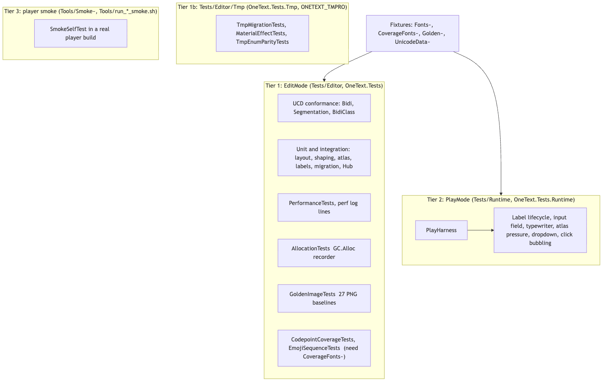
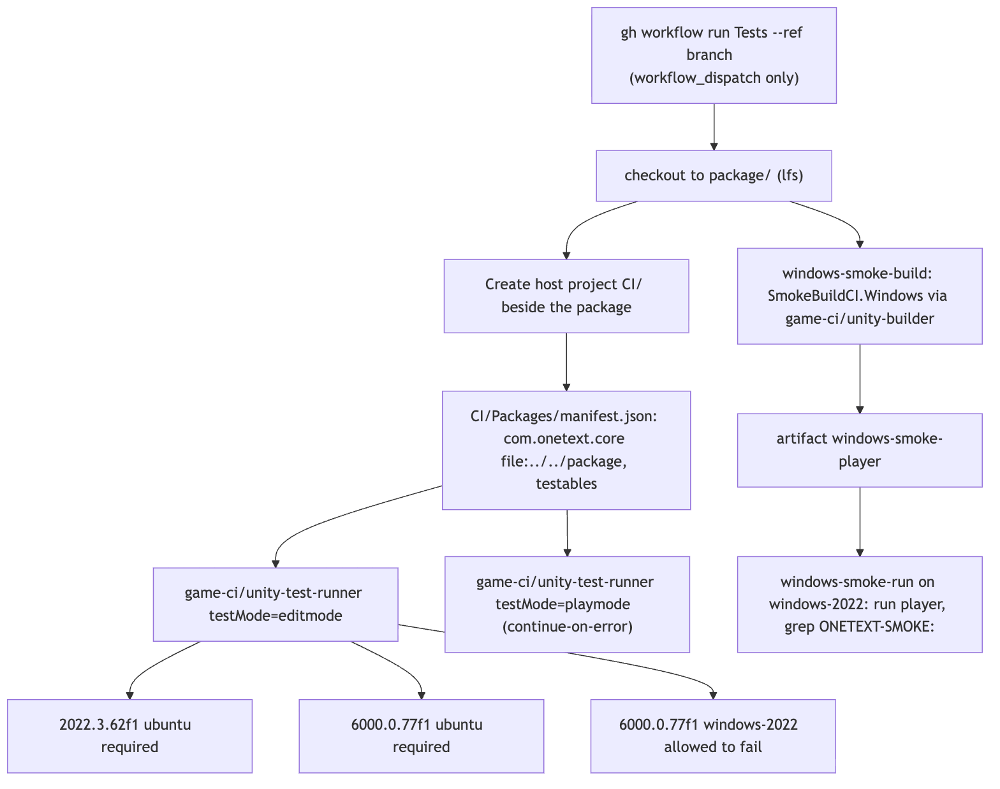
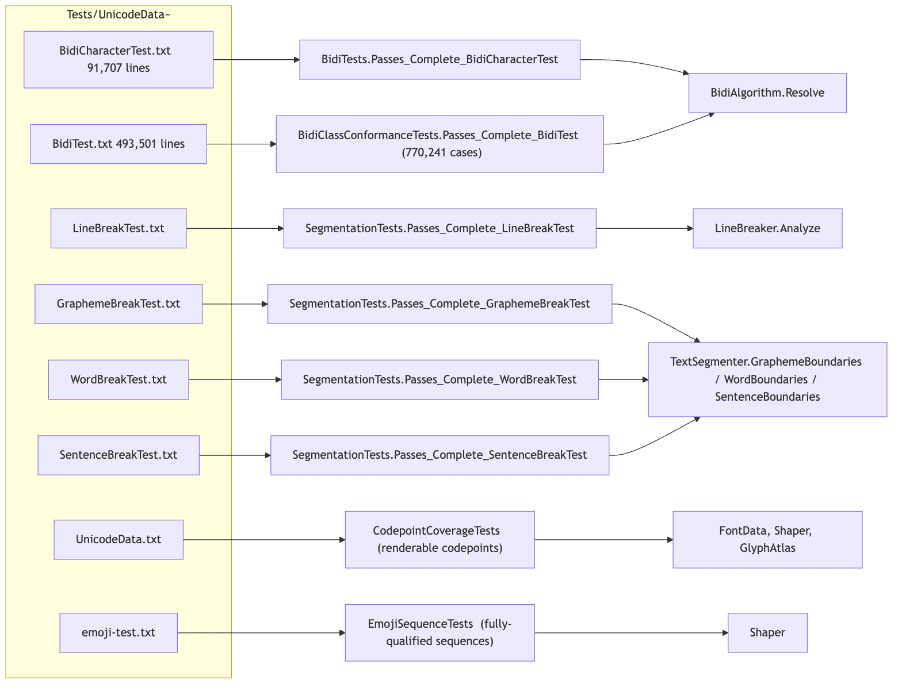
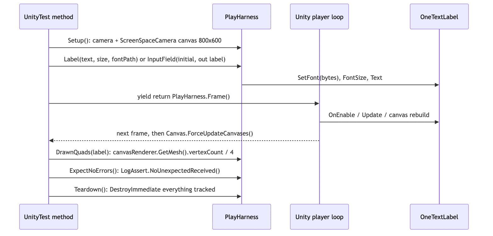

# Tests

`Tests/` is the package's test suite and its fixtures. Three test assemblies live here: `OneText.Tests` (`Tests/Editor/`, EditMode, the bulk of the suite), `OneText.Tests.Tmp` (`Tests/Editor/Tmp/`, EditMode, compiled only where TextMesh Pro is installed) and `OneText.Tests.Runtime` (`Tests/Runtime/`, PlayMode, driven by a real player loop). Beside them sit four fixture folders whose trailing `~` keeps Unity from importing them: `Fonts~` (six small committed faces, three of them authored by scripts in the same folder), `CoverageFonts~` (about 213 Noto faces, gitignored and fetched by `Tools/fetch_coverage_fonts.py`), `Golden~` (27 baseline PNGs plus `renderer.txt`) and `UnicodeData~` (the UCD conformance files). The suite covers every stage of the pipeline (string -> parse -> analyze -> shape -> layout -> render -> frontend) plus the editor tooling; the table in [Files](#files) groups each test file by the module it exercises and is what the module READMEs link back to. A fourth tier, the player smoke test, is not in this folder at all: its sources are carried in `Tools/Smoke~/` and described in [../Tools/README.md](../Tools/README.md).

## Files

Every assembly has `"defineConstraints": ["UNITY_INCLUDE_TESTS"]`, so none of it compiles in a project that does not list `com.onetext.core` under `testables`.

| File | Responsibility |
| --- | --- |
| `Editor/OneText.Tests.asmdef` | EditMode assembly. References `OneText`, `OneText.UGUI`, `OneText.Mesh`, `OneText.Editor`, `OneText.Editor.Dev`, `OneText.Tests.Runtime`, `UnityEngine.UI`, the test runners, `Unity.Burst`; precompiled `nunit.framework.dll`; `rootNamespace OneText.Tests`. |
| `Editor/Tmp/OneText.Tests.Tmp.asmdef` | EditMode assembly gated on `ONETEXT_TMPRO` as well as `UNITY_INCLUDE_TESTS`; `versionDefines` set `ONETEXT_TMPRO` when `com.unity.textmeshpro >= 3.0.0` or `com.unity.ugui >= 2.0.0` (Unity 6 folds TMP into uGUI). References `Unity.TextMeshPro` and `OneText.Editor.Onboarding.Tmp`. |
| `Runtime/OneText.Tests.Runtime.asmdef` | PlayMode assembly (`includePlatforms: []`), `rootNamespace OneText.Tests.Play`. References `OneText`, `OneText.UGUI`, `UnityEngine.UI` and the test runners only (no editor assemblies). |
| `Runtime/PlayHarness.cs` | The PlayMode scene and bookkeeping: `Setup` (camera + 800x600 `ScreenSpaceCamera` canvas), `Label`, `InputField` (wires `_textComponent` by reflection, `inputMethodEnabled = false`), `EventSystem`, `Track`, `Teardown` (`DestroyImmediate`), `DrawnQuads`, `Frame`/`Frames` (yield then `Canvas.ForceUpdateCanvases`), `ExpectNoErrors`, font constants and `HasFont`. |
| `Editor/CrossContainerHolder.cs` | A `ScriptableObject` fixture with a wide `Label` field and a narrow `Typed` field pointing at a label in a prefab, for the migration tests. Its own file because Unity binds one `MonoScript` per file. |
| `Runtime/Fixtures/CrossContainerTyped.cs` | A `MonoBehaviour` fixture with one narrowly typed `Text` field naming a component in another file; in the runtime assembly because an editor-assembly `MonoBehaviour` cannot be attached to a GameObject. |
| `Runtime/Fixtures/CrossContainerRewritten.cs` | The same component after the script rewrite: the field keeps its name and takes the `OneTextLabel` type, reproducing the state Unity reads as None between rewrite and conversion. |
| `Fonts~/NotoSans.ttf`, `NotoSansArabic.ttf`, `NotoSansVariable.ttf` | The three vendored faces (OFL, `Fonts~/OFL.txt`): Latin/Greek/Cyrillic/Devanagari, Arabic, and a `wght` variable face. |
| `Fonts~/CffShapes.otf` + `generate_cff_test_font.py` | Authored CFF face: a counter (O), overlapping contours (Q), a shallow cubic S, a rectangle control. For the cubic outline path. |
| `Fonts~/ColorGlyphs.ttf` + `generate_color_test_font.py` | Authored 1.3 KB colour face exercising the CBDT and COLRv0/CPAL decoders without vendoring Noto Color Emoji. |
| `Fonts~/LoclRegional.ttf` + `generate_locl_test_font.py` | Authored face with three glyphs for U+76F4 selected by `locl` under `ja` / `zh-Hans`. |
| `CoverageFonts~/` | Fetched, not committed: `Noto*-Regular.ttf` per script family plus `NotoSansCJK{jp,sc,tc,kr}-Regular.otf` and `NotoColorEmoji.ttf`. Needed by the coverage, emoji, ruby, vertical, CJK decoration, rasterizer-cost and several golden tests. |
| `Golden~/*.png`, `Golden~/renderer.txt` | 27 baselines named after `GoldenCases` entries, and the `graphicsDeviceType|graphicsDeviceName|colorSpace` stamp of the machine that drew them (currently `Metal|Apple M4 Pro|Gamma`). |
| `UnicodeData~/` | `BidiCharacterTest.txt`, `BidiTest.txt`, `LineBreakTest.txt`, `GraphemeBreakTest.txt`, `WordBreakTest.txt`, `SentenceBreakTest.txt`, `UnicodeData.txt`, `emoji-test.txt`, as shipped by Unicode. |

### Test files by module

The module column names the source folder under test; the linked README is the module's own doc. Files are listed once, under the module they mostly exercise; the second column notes other modules a file reaches into.

| Module | Test file | What it covers |
| --- | --- | --- |
| [Runtime/Core/Unicode](../Runtime/Core/Unicode/README.md) | `Editor/BidiTests.cs` | `BidiCharacterTest.txt` end to end through `BidiAlgorithm.Resolve` (levels, removed flags, visual order, paragraph level); a mixed-direction sanity case. |
| | `Editor/BidiClassConformanceTests.cs` | `BidiTest.txt` (class-written, 493,501 lines expanded by the direction bitset to 770,241 cases) through one representative codepoint per bidi class; the representatives are checked against the engine's own class table first. |
| | `Editor/SegmentationTests.cs` | `LineBreakTest.txt` through `LineBreaker.Analyze`; `GraphemeBreakTest.txt`, `WordBreakTest.txt`, `SentenceBreakTest.txt` through `TextSegmenter`; wrapping basics; emoji/mark grapheme counts. |
| | `Editor/AsianTypographyTests.cs` | M10: `AsianTypography` kinsoku classes and `Kinsoku.Off/Loose/Normal/Strict`, punctuation compression, CJK-Latin spacing, `DictionaryLineBreaker` word lists (Thai with and without a dictionary, `ScriptOf`), `locl` through `LoclRegional.ttf`; reaches `TextLayoutEngine`. |
| | `Editor/VerticalTests.cs` | M15: `VerticalOrientation` / `VerticalOrientationLookup` (UAX #50), top-to-bottom shaping (`vert` forms, `vmtx`), columns as turned lines (wrap, kinsoku, ruby), and horizontal output unchanged. Needs `NotoSansCJKjp-Regular.otf`. |
| [Runtime/Core/Shaping](../Runtime/Core/Shaping/README.md) | `Editor/ShapingTests.cs` | HarfBuzz loads and reports a version; Latin one-glyph-per-letter with positive advances; Arabic contextual forms, RTL visual order, zero-advance marks; outline extraction returns contours. |
| | `Editor/EmojiSequenceTests.cs` | Every fully-qualified sequence in `emoji-test.txt` the font covers shapes to one glyph; ZWJ / flag / keycap / skin-tone kinds each merge; sequences survive the label path. Needs `NotoColorEmoji.ttf`. |
| | `Editor/ThreadSafetyTests.cs` | Concurrent shaping, variations, ink bounds and outline extraction from several threads agree with single-threaded results; thread handles share the face and are released with it. |
| [Runtime/Core/Fonts](../Runtime/Core/Fonts/README.md) | `Editor/FontAssetTests.cs` | `OneFontAsset`: compression round trip, one parsed face shared, variant cache per axis combination, packed/unpacked/dropped/repacked states, variant disposal. |
| | `Editor/FontShareTests.cs` | `SharedFontBytes`: a hundred labels given the same bytes parse once; the last label out frees it; a variated face stays private. |
| | `Editor/SubsetTests.cs` | `FontSubsetter` / hb-subset: GSUB/GPOS survive (Arabic still joins, marks and kerning intact), `OneTextCharset` and `CharsetRecorder` as inputs. |
| | `Editor/SystemFontTests.cs` | The system-font tier: a character no project font covers (Hangul) is found on the machine; shape of the behaviour, `Assert.Ignore` when the machine has nothing. |
| | `Editor/SystemFontMemoryTests.cs` | `SystemFonts` remembers the file that answered for a script, counted in files probed rather than milliseconds. |
| | `Editor/MissingFontTests.cs` | A project with no font at all: `FontStack.Resolve` still reaches the system tier, `MissingFonts` reports, labels log instead of drawing nothing; `OneFontRecovery`. |
| | `Editor/VariableSweepTests.cs` | Dragging a `wght` axis: atlas and label font stack rebake for the new coordinate instead of reusing tiles from the old one. |
| | `Editor/InkBoundsTests.cs` | `FontData.TryGetInkBounds` (the font-table ink box) still contains the ink of `OutlineExtractor`'s flattened outline (Latin and Arabic). |
| [Runtime/Core/Layout](../Runtime/Core/Layout/README.md) | `Editor/LayoutTests.cs` | M4: single line metrics, newlines, wrapping, grapheme emergency break, alignment, justification, bidi run reordering, `FontStack` fallback, ellipsis, variable axes, empty text reserves a line. |
| | `Editor/RichTextTests.cs` | M8 markup: every well-formed tag changes exactly what it says; every malformed tag leaves the text alone (`5 < 6`); decorations, sizes, colours, fonts, links through `RichTextParser`. |
| | `Editor/EscapeTests.cs` | `EscapeParser`: `\n`-style escapes resolve, anything not well-formed (Windows paths) is untouched; on the label too. |
| | `Editor/InteractionTests.cs` | M5: `TextHitTest` (clicks clamp, caret x along LTR, RTL carets, selection rects per line, vertical movement keeps the column, grapheme and word steps), `<link>` ranges, input-field text/caret/selection events. |
| | `Editor/RubyTests.cs` | M15 ruby: `RubyPlacement` per the W3C simple-placement rules, line grows, base and reading never split, ruby glyphs carry the base cluster. Needs `NotoSansCJKjp-Regular.otf`. |
| | `Editor/DecorationChannelTests.cs` | The vertex-channel packing for `TextDecoration` and the HLSL unpacking written out in C# against the real packer: a contract with `OneText-SDF.shader`. |
| [Runtime/Core/Rendering](../Runtime/Core/Rendering/README.md) | `Editor/SdfTests.cs` | `GlyphRasterizer` full distance range, density matches the requested scale, empty glyph; `GlyphAtlas` caches, distinct slots, separate size buckets. |
| | `Editor/SdfCullingTests.cs` | Segments the rasterizer culls are provably discardable: same glyphs with `GlyphRasterizer.Cull` on and off compared byte for byte. |
| | `Editor/OutlineFormatTests.cs` | The CFF/PostScript outline path (`OutlineExtractor`, `GlyphRasterizer`) on `CffShapes.otf`: counters, overlapping contours, long cubic curves rasterize correctly; adaptive flattening error. |
| | `Editor/MsdfTests.cs` | M14 `precise`: MSDF keeps corners the bilinear sampler loses (reconstructed the way the GPU does), `MsdfEdgeColoring`, tiles cached apart, same material, off by default. |
| | `Editor/AtlasTests.cs` | M6 atlas under pressure: flatness rebake, settings validation, per-tile eviction, LRU keeps recent glyphs, freed spans reused, compaction moves tiles and keeps pixels, `AtlasPrewarm` budget, `CharsetRecorder`, `OneTextCharset` expansion. |
| | `Editor/AtlasPressureTests.cs` | One frame asking for more tiles than fit: every glyph comes back afterwards. |
| | `Editor/ColorGlyphTests.cs` | M8 colour glyphs: `ColorGlyphs` decodes CBDT and COLRv0 from `ColorGlyphs.ttf` into `ColorGlyphAtlas`, same shader and draw call; layout and label integration. |
| | `Editor/RasterizerCostTests.cs` | Prints, via `AtlasDiagnostics`, how a cold first paint splits between outline extraction, tile sizing, flattening, the job and the copy-back; asserts almost nothing. Uses the CJK face when present. |
| | `Editor/CodepointCoverageTests.cs` | Every renderable codepoint in `UnicodeData.txt` through `FontData`/`Shaper`/`GlyphAtlas` across all of `CoverageFonts~`: tier 1 (has a glyph -> a real tile), tier 2 (survives, `Timeout(600000)`), and a report of what the set cannot cover. `Assert.Ignore` without the fonts. |
| | `Editor/ShaderShippingTests.cs` | The SDF shader lives under `Resources` so a player build cannot strip it; `SharedGlyphAtlas.LoadShader`. |
| | `Editor/MaterialLifecycleTests.cs` | The shared material refcount: a label holds the atlas from `OnEnable`, the hold does not survive serialization; no "inside a graphic rebuild loop" re-dirtying. |
| | `Editor/DomainReloadTests.cs` | Two play sessions with Domain Reload off: statics holding the `Texture2DArray`, graphic registry and `NativeArray`s recover; the second session draws as well as the first. |
| | `Editor/GoldenImageTests.cs` | Tier 1 pictures: one test per `GoldenCases` entry against `Golden~/*.png` through `GoldenComparer`, skipped unless `renderer.txt` matches this machine; plus the registry sanity test. See [../Editor/Dev/README.md](../Editor/Dev/README.md). |
| [Runtime/Core/Animation](../Runtime/Core/Animation/README.md) | `Editor/AnimationTests.cs` | M9 tag-driven effects address grapheme clusters through `TextAnimator`, `BuiltInEffects`, `TextEffectInput/Output`; animating costs vertex writes, not rebuilds. |
| | `Editor/RevealTests.cs` | M8 cluster mapping, the reveal built on it, and the quad hook (`TextQuadContext`) on scripts where counting characters is wrong. |
| | `Editor/TypewriterTests.cs` | What one step is (`RevealGranularity`, `RevealUnits`), Thai/Khmer/Japanese units, `PunctuationDelays`, callbacks; no covering font required. |
| [Runtime/Core/Editing](../Runtime/Core/Editing/README.md) and [Runtime/UGUI/Ime](../Runtime/UGUI/Ime/README.md) | `Editor/EditingTests.cs` | M12: `TextEditingModel` and `ImeCommitArbiter` driven through a fake `IImeInput` (`ImeInput.Register`), the Korean bug reports (last syllable on focus loss, backspace behind a composition, Enter confirming a candidate), which backend `ImeInput.Create()` picks (`ImguiImeInput` vs `InputSystemImeInput`) and how each hands over a composition. The largest file in the suite. |
| [Runtime/Core](../Runtime/Core/README.md) (settings, quality, info) | `Editor/TextQualityTests.cs` | `TextQuality` / `TextQualityScale` rungs on the label and on `OneTextMesh`, from `OneTextSettings`; dynamic ppem switched off throughout. |
| | `Editor/ProjectDefaultsTests.cs` | `OneTextSettings` / `TextDefaults`: a project that said nothing gets the documented answer, one that said something gets what it said, for labels and world text. |
| | `Editor/PackageVersionTests.cs` | `OneTextInfo.Version` and `package.json` agree on the version (and the package name). |
| [Runtime/Core/Native](../Runtime/Core/Native/README.md) | `Editor/NativesTests.cs` | Every platform has a `libHarfBuzzSharp` binary, each tagged for exactly its own platform (`PluginImporter`), Android 64-bit libraries 16 KB aligned, iOS ships one xcframework, subsetting available, HarfBuzz loads and reports its version. |
| [Runtime/UGUI](../Runtime/UGUI/README.md) | `Editor/PerformanceTests.cs` | Throughput budgets with `[perf]` log lines (see below) and the sharing guarantees; idle-animation rebuild behaviour. |
| | `Editor/AllocationTests.cs` | GC.Alloc-recorder attribution per rebuild stage; steady-state redraw, unchanged layout, shaping, fresh layout and the animate query allocate nothing; resolvers built once per label; equal-string reassignment rebuilds nothing. |
| | `Editor/TextBufferTests.cs` | The no-string setters (`SetText` for int, float with decimals, span and char array) produce exactly what `ToString` would; the same number twice rebuilds nothing; markup still reaches the label. |
| | `Editor/StyleTests.cs` | M8 `OneTextStyle`: a label holds a reference; editing the asset updates every label (`StyleInvalidation`, `IStyleUser`). |
| | `Editor/DynamicPpemTests.cs` | `ScreenPpem` measurement (canvas scale, transform scale, ortho/perspective), hysteresis near bucket boundaries, `PpemCap`. |
| | `Editor/AutoSizeTests.cs` | `OneTextLabel.AutoSize` picks the largest size in [min, max] that fits, clamps, tracks the rect, vertical mode, no relayout on repeat asks, half-point grid. |
| | `Editor/DecorationTests.cs` | M14 decorations on the label: outline/shadow/glow cost no second material and no extra vertex stream, the vertex bytes they write, underline/strikethrough/`<mark>` bars, `OneTextStyle` and component-level decoration precedence; reaches `RichTextParser` for the tag rules; CJK vertical bars (needs the CJK face). |
| | `Editor/InputFieldViewportTests.cs` | The field's text viewport: a clipping layer with a mask exists with both labels beneath it, text overflows a box that does not grow, fields authored before it still work. |
| | `Editor/DropdownCreationTests.cs` | `OneTextDropdown` as the menu creates it, opened with `Show`: row count, labels, value changes, caption, list-versus-blocker sorting. |
| | `Editor/TmpParityAliasTests.cs` | The lowercase TMP-parity aliases (`text`, `alignment`, `TextAlignmentOptions`, `TextWrappingModes`): writing one name and reading the other agrees both ways. |
| | `Editor/TmpApiParityTests.cs` | The TMP members a real migration needed: `ForceMeshUpdate` lays out, `alpha` moves the colour, `SetTextWithoutNotify` is silent, `TextOverflowModes`, `LineType`, input-field `onEndEdit`. |
| | `Editor/DOTweenCompatTests.cs` | `Runtime/Integrations/DOTween`: every promised shortcut exists with DOTween's exact signature (via reflection, `Assert.Ignore` where DOTween is absent), and the two implemented differently still behave. |
| [Runtime/Mesh](../Runtime/Mesh/README.md) | `Editor/OneTextMeshTests.cs` | World-space text through MeshFilter/MeshRenderer with no canvas: quality rungs, atlas sharing, vertical mode. |
| [Editor](../Editor/README.md) (font assets, menu items, settings provider) | `Editor/SettingsPageTests.cs` | Project Settings > OneText mounts through `OneTextSettingsProvider` and shows the Hub's `HubSettingsTab` / `HubForensicsTab`. |
| [Editor/Hub](../Editor/Hub/README.md) | `Editor/HubTests.cs` | M11 headless Hub: `TextSourceScanner`, `TextDoctor`, `TextEntry`, dictionary coverage, atlas demand. |
| | `Editor/HubWindowTests.cs` | Every `Tab` of `OneTextHub` builds its visual tree without a skin; `HubUI`, `HubShell`, `HubSparkline`, `HubDonut`. |
| | `Editor/HubFindingsScaleTests.cs` | The onboarding tab's card count is bounded when the `MigrationReport` is twenty times bigger. |
| | `Editor/HubSelectionTests.cs` | The partial-conversion affordance is on screen and says how much work it will do. |
| [Editor/Onboarding](../Editor/Onboarding/README.md) | `Editor/MigrationMappingTests.cs` | `MigrationMapping` arithmetic (alignment bits, line spacing, overflow, wrap) without TMP present. |
| | `Editor/ComponentMigrationTests.cs` | `ComponentMigration` swapping uGUI `Text` and `Button` references in memory: references mended, `ContainerReferences`, `DoctorSeverity` findings, `OneTextMesh` and `OneTextInputField` targets. |
| | `Editor/ContainerFileTests.cs` | `ContainerFile`: the YAML reader that finds references a scene/prefab file still spells out, against Unity's own output snippets. |
| | `Editor/SeveredInsideTests.cs` | A field naming a label in its own file after the script rewrite widened it: the census finds and mends it. |
| | `Editor/WithheldReferenceTests.cs` | A component whose conversion would leave a narrow `Text` field naming nothing is not converted; a wide field beside it is. |
| | `Editor/InputFieldMigrationTests.cs` | The uGUI `InputField` swap keeps its pressed colour and `onEndEdit` wiring. |
| | `Editor/DropdownMigrationTests.cs` | The uGUI `Dropdown` swap keeps `OptionData` and its event. |
| | `Editor/TmpScriptRewriteTests.cs` | `TmpScriptRewriter` edits only code: strings, comments, verbatim paths untouched; residual TMP names reported by name and line; `TmpAssemblyGraph`. |
| | `Editor/FontRecoveryTests.cs` | `FontRecovery`, `FontSourceCatalog`, `FontWeightNames`, `FontMetadata`: what is left behind when TMP font packs have no font files; no network. |
| | `Editor/OnboardingGitTests.cs` | `OnboardingGit`: parsing real git output (including a Korean filename's escaping) as pure functions; real-repository tests `Assert.Ignore` without git. |
| [Editor/Onboarding/Tmp](../Editor/Onboarding/README.md) (TMP installed only) | `Editor/Tmp/TmpMigrationTests.cs` | Real `TMP_Text`, `TMP_InputField`, `TMP_Dropdown` built in memory, converted by `ComponentMigration`, read back. |
| | `Editor/Tmp/MaterialEffectTests.cs` | TMP material outline/underlay/glow carried onto `TextDecoration` with the units asserted to cross unscaled. |
| | `Editor/Tmp/TmpEnumParityTests.cs` | `OneText.UGUI.TextAlignmentOptions` and `TextWrappingModes` match TMPro's enums member for member and value for value. |
| PlayMode, [Runtime/UGUI](../Runtime/UGUI/README.md) | `Runtime/LabelLifecycleTests.cs` | Tier 2: enable/disable pairs, shared atlas acquired and released as objects come and go, destroy mid-rebuild, across real frames. |
| | `Runtime/RuntimeMutationTests.cs` | Text changing every frame and a font (`FontVariation`) changing under it: caches keyed correctly, no stale glyph ids, no per-frame allocation. |
| | `Runtime/RuntimeTypewriterTests.cs` | The typewriter off `Update` with `Time.captureDeltaTime` fixed: no drift or stall over a hundred frames, completion fires once. |
| | `Runtime/RuntimeAtlasPressureTests.cs` | A label whose tile was evicted rebuilds against the new UVs and keeps drawing, over time, with labels still drawing. |
| | `Runtime/RuntimeInputFieldTests.cs` | The field with an `EventSystem` and frames: selection changes, `UpdateEditing` per frame, `OneTextCaret` created/moved/destroyed by the component, no platform IME. |
| | `Runtime/LabelClickBubblingTests.cs` | A click the label had no link for reaches the parent `Button` (`IPointerClickHandler` routing through the same calls `StandaloneInputModule` makes). |
| | `Runtime/DropdownSelectionTests.cs` | Keyboard focus lands on a row when the list opens (`EventSystem.current` only exists in play mode). |

## Structure


<sub>Source: [diagrams/test-tiers.mmd](diagrams/test-tiers.mmd)</sub>

Tier 1 is EditMode: plain NUnit `[Test]`s that build components in code, call `Rebuild` or `Layout` by hand and read results back, with no player loop. It carries the UCD conformance suites, everything that can be asserted as numbers, the performance budgets, the allocation counts, and the golden pictures (which are EditMode tests because they render through a camera into a `RenderTexture`, not to a screen). `Tests/Editor/Tmp/` is the same tier behind the `ONETEXT_TMPRO` define, so it disappears rather than fails in a project that has removed TextMesh Pro. Tier 2 is PlayMode (`[UnityTest]` coroutines yielding frames) for what only a running player loop shows: `OnEnable`/`OnDisable` pairs, `Update`, `EventSystem.current`, a component destroyed mid-rebuild. Tier 3 is a real player build on a real device, and lives in `Tools/`.

The fixtures are the other half of the structure. `Fonts~` is small and committed; `CoverageFonts~` is large and fetched; `Golden~` is committed and only rewritten by `GoldenRegen`; `UnicodeData~` is vendored from Unicode unchanged. Every file path in the tests is package-relative (`Packages/com.onetext.core/Tests/...`) and resolved with `Path.GetFullPath`, so the tests run wherever the package is referenced from.

## Behaviour

### Running locally

The package has no project of its own. Reference it from a project (locally the dev harness, in CI a throwaway `CI/` folder) that lists it under `testables` in `Packages/manifest.json`; that is what defines `UNITY_INCLUDE_TESTS` and makes the three test assemblies and `OneText.Editor.Dev` compile. Then, from `CONTRIBUTING.md`:

```
Unity -batchmode -projectPath <dev-project> -runTests -testPlatform EditMode -testResults results.xml
```

and the same with `-testPlatform PlayMode` for Tier 2, or the Test Runner window in the editor. Optional fixtures change what runs rather than whether it passes: `python3 Tools/fetch_coverage_fonts.py` populates `CoverageFonts~` so the coverage, emoji, ruby, vertical and CJK golden tests stop reporting `Ignored`; a machine whose `SystemInfo` stamp matches `Golden~/renderer.txt` runs the golden comparisons; a machine with git runs the real-repository half of `OnboardingGitTests`; a project with DOTween runs the signature checks in `DOTweenCompatTests`; a project with TMP compiles `Tests/Editor/Tmp/`. Each of those says why it stood down in its `Assert.Ignore` message, on the principle repeated through the suite that a test that silently checks nothing is worse than no test.

### Running in CI


<sub>Source: [diagrams/ci-flow.mmd](diagrams/ci-flow.mmd)</sub>

`.github/workflows/tests.yml` is `workflow_dispatch` only (`gh workflow run Tests --ref <branch>`): a full run spends a Unity activation per job and most of a quarter hour, and push-triggered runs were mostly cancelled by the next push. The workflow checks the repository out to `package/` and writes a host project at `CI/` beside it, with a manifest that depends on `com.onetext.core` as `file:../../package` and lists it in `testables`. The comment in the workflow records why beside and not inside: nested under the package, the project's AssetDatabase gave every package asset a path and GUID and no imported object, so every test that loaded the SDF shader or the Hub's UXML failed, on Linux and Windows alike. The `editmode` job runs `game-ci/unity-test-runner@v4` with `testMode: editmode` on three matrix entries: `2022.3.62f1` Ubuntu (required; later 2022.3 builds are Extended LTS a personal licence cannot activate), `6000.0.77f1` Ubuntu (required), `6000.0.77f1` `windows-2022` (`continue-on-error`, never yet seen green). The `playmode` job runs `testMode: playmode` on `6000.0.77f1` Ubuntu with `continue-on-error: true`, because it needs a graphics device a headless container may not have. `Library/` is cached under a `Library-v2-...` key (bumped so caches from the nested layout are unreachable). `UNITY_LICENSE`, `UNITY_EMAIL`, `UNITY_PASSWORD` are repository secrets; a free personal licence is enough.

A green CI run is a weaker claim than a green local run: the golden tests skip there (wrong renderer) and the coverage tests skip there (no fonts). The two `windows-smoke-*` jobs in the same workflow are Tier 3 and fail loudly; they are described in [../Tools/README.md](../Tools/README.md).

### Conformance tests


<sub>Source: [diagrams/conformance-data-flow.mmd](diagrams/conformance-data-flow.mmd)</sub>

`BidiTests.Passes_Complete_BidiCharacterTest` reads `BidiCharacterTest.txt` line by line (codepoints; paragraph direction; expected paragraph level; expected levels with `x` for removed; expected visual order), calls `BidiAlgorithm.Resolve(cps, direction, levels, removed, visual)` and compares all four outputs. It asserts more than 90,000 lines loaded (the file has 91,707 cases) and zero failures, naming the first failing line. `BidiClassConformanceTests.Passes_Complete_BidiTest` reads `BidiTest.txt`, which is written in bidi class names with `@Levels:` / `@Reorder:` headers and a per-line bitset of paragraph directions (1 auto, 2 LTR, 4 RTL); it maps each class to one representative codepoint (checked against the engine's table before anything runs), expands each line once per set bit, and asserts over 700,000 cases (the comment says 770,241) with zero failures, logging `[conformance] BidiTest: N cases, M passed`. `SegmentationTests` parses the `÷` / `×` notation shared by the four break files into a sample string and a break flag per UTF-16 index, then runs `LineBreaker.Analyze` (asserting more than 19,000 lines loaded) and `TextSegmenter.GraphemeBoundaries` / `WordBoundaries` / `SentenceBoundaries` (more than 700 / 1,800 / 500 lines). Every conformance test reports `failed/total` and the first failing spec in its message. `UnicodeData.txt` feeds `CodepointCoverageTests.RenderableCodepoints` (every assigned codepoint except `Co`, `Cs`, `Cc`, `Cf`, with `<..., First>`/`<..., Last>` ranges expanded); `emoji-test.txt` feeds `EmojiSequenceTests`. The tables those algorithms read are generated from the UCD by the scripts in `Tools/` (see [../Tools/README.md](../Tools/README.md)); the conformance files here are the same UCD release's test data.

### Performance tests

`PerformanceTests` (14 tests) times the hot paths with a `Stopwatch`, logs the real number as a `[perf]` line and asserts only an order-of-magnitude budget: `Layout_Throughput` (a ~4.5k-character paragraph laid out 10 times, `< 250 ms`), `Shaping_Throughput` (Latin and Arabic, `< 100 ms` each, logged as chars/ms), `Atlas_Cached_Lookup_Is_Far_Cheaper_Than_Rasterizing` (warm `< cold`, cold `< 3000 ms`), `Atlas_Upload_Partial_Versus_Full` (full `Apply` `< 50 ms`), `Atlas_Capacity_Diagnostic` and `Cluster_Granularity_Diagnostic` (logged only, `placed > 0`, joined Arabic letters share a tile), `Many_Labels_Share_One_Atlas_And_One_Material`, `Mesh_Rebuild_Cost_For_A_Screenful_Of_Labels` (`< 5 ms` per label), and six tests about animation idling (`A_Finished_Effect_Stops_Costing_A_Mesh_Rebuild_Every_Frame` and friends count re-emitted frames between bounds). `CONTRIBUTING.md` asks that a PR which moves those `[perf]` numbers say so; the lines in the run log are the trend record. `RasterizerCostTests` is the same idea with no thresholds at all.

### Allocation tests

`AllocationTests` uses `UnityEngine.Profiling.Recorder.Get("GC.Alloc")` filtered to the current thread and counts `sampleBlockCount`, i.e. allocation calls rather than bytes, because the editor's only byte gauge is a whole-process heap delta. `AssertAllocationFree(work, because)` warms the path 200 times, then takes up to 24 readings and asserts the smallest delta is zero, on the reasoning that noise (a finalizer, an asset-database callback, the profiler itself) can only add allocations, so one clean reading proves the steady state is clean and a path that really allocates cannot produce one. `AllocationsPerCall` does the same per-call for the stage report. Note the file comment: the recorder reads zero in batch mode for some paths, which is why `Layout_Resolvers_Are_Built_Once_Per_Label` and `Markup_Resolvers_Are_Built_Once_Per_Label` check by reflection that the cached resolver fields are the same instance after a second layout instead of counting. The tests cover `Steady_State_Redraw`, `Laying_Out_Unchanged_Text`, `Shaping_A_Run`, `Laying_Out_Fresh_Text` and `Asking_Whether_A_Label_Still_Animates`, plus `Reassigning_An_Equal_String_Rebuilds_Nothing` through the label's `LayoutRuns` / `QuadBuilds` counters.

### Golden tests

`GoldenImageTests` turns `GoldenCases.All` into NUnit cases named `Renders_<name>` via `TestCaseSource`. Each renders through `GoldenCase.Render()` and compares with `GoldenComparer.Compare`, writing the result message to `TestContext` even on a pass so the headroom is visible. It `Assert.Ignore`s on a renderer mismatch, a missing coverage font, or a missing baseline, with the regen command in the message. `Every_Case_Has_A_Unique_Name_And_A_Baseline` guards the registry. The harness itself (`GoldenScene`, tolerances, `GoldenRegen`) is documented in [../Editor/Dev/README.md](../Editor/Dev/README.md).

### PlayMode tests


<sub>Source: [diagrams/playmode-harness-sequence.mmd](diagrams/playmode-harness-sequence.mmd)</sub>

Every PlayMode test constructs a `PlayHarness`, calls `Setup()` in `[SetUp]` and `Teardown()` in `[TearDown]`, and yields `PlayHarness.Frame()` (one real frame, then `Canvas.ForceUpdateCanvases()` so geometry is readable in a batch run that presents nothing) or `Frames(n)`. `Teardown` destroys immediately rather than deferring, because a deferred `Destroy` outlives the test and the next `SetUp` starts in a scene with the previous canvas still in it. `DrawnQuads` asks the `CanvasRenderer`'s mesh rather than the label's own ledger. `ExpectNoErrors` wraps `LogAssert.NoUnexpectedReceived()` since PlayMode swallows logged errors by default. `InputField` builds the field inactive, wires `_textComponent` by reflection, sets `inputMethodEnabled = false` (an OS IME cannot be driven from a batch run), and activates last. `RuntimeTypewriterTests` pins `Time.captureDeltaTime` so sixty frames are exactly one second of game time on any machine.

## Invariants and conventions

- **Conformance is total.** The four UCD break files and both bidi files are asserted at zero failures over their full contents, with a minimum-loaded count so a truncated file cannot pass. A new Unicode version means regenerating the tables in `Runtime/Core/Unicode/` and replacing every file in `UnicodeData~` from the same release.
- **Optional inputs skip, they never fail.** Coverage fonts, system fonts, git, DOTween, TMP, a matching renderer: each is `Assert.Ignore` with a message that names the fix. Tests that run only with TMP live in their own assembly so the rest compiles without it.
- **Fixtures are package-relative and resolved with `Path.GetFullPath`.** Nothing assumes the working directory or a project-relative `Assets/` path.
- **Tilde folders stay tilde folders.** `Fonts~`, `CoverageFonts~`, `Golden~`, `UnicodeData~` are never imported; tests read them with `File.ReadAllBytes`/`File.ReadLines`. Renaming one makes Unity import 200 MB of fonts and 27 textures with `.meta` files.
- **Per-frame allocation is asserted, not estimated.** `AllocationTests` is the instrument for "this path allocates nothing"; `Editor/Dev/Benchmarks` only reports whole-frame bytes.
- **Perf budgets are loose on purpose.** They catch an order of magnitude, not a machine; the `[perf]` log line is the number that matters.
- **Golden baselines are written only by `GoldenRegen`**, and only on the machine whose stamp is in `renderer.txt`.
- **PlayMode teardown is `DestroyImmediate`.** Tests that create objects outside `PlayHarness` must `Track` them.
- **Fixture scripts are separate files.** `CrossContainerHolder`, `CrossContainerTyped` and `CrossContainerRewritten` each own a file because Unity binds a `MonoScript` only to the class a file is named after; the `MonoBehaviour`s live in the runtime assembly because an editor-assembly component cannot go on a GameObject.
- **Test process state is reset by the code under test's own helpers**: `SharedGlyphAtlas.Reconfigure(force: true)`, `DictionaryLineBreaker.ResetToDefaults()`, `OneTextSettings.Instance` swaps in `SetUp`/`TearDown`. A test that installs a word list or a settings asset must remove it.

## Extending

- **A new feature in `Runtime/Core/*`**: add an EditMode test file named `<Feature>Tests.cs` under `Tests/Editor/`, `namespace OneText.Tests`, using `Tests/Fonts~` faces; if the feature needs a CJK or emoji face, use the `CoverageFonts~` path and `Assert.Ignore` when `File.Exists` is false, as `RubyTests`/`VerticalTests` do. Add a row to the table above under the module.
- **A new picture-level claim** (a shader change, a mask, a decoration): add a `GoldenCase` in `Editor/Dev/Golden/GoldenCases.cs` rather than a pixel assertion here; `GoldenImageTests` picks it up.
- **A lifecycle or event-routing claim**: write a `[UnityTest]` in `Tests/Runtime/` on `PlayHarness`; EditMode cannot observe `OnEnable` pairs, `Update` or `EventSystem.current`.
- **A TMP-specific claim**: put it in `Tests/Editor/Tmp/` so it compiles only under `ONETEXT_TMPRO`.
- **A new Unicode algorithm**: vendor its UCD test file into `UnicodeData~`, add a `Passes_Complete_<File>` test that asserts a minimum loaded count and zero failures, and regenerate tables with the matching `Tools/gen_*_tables.py`.
- **A new hot path**: add a `PerformanceTests` case that logs a `[perf]` line and asserts a loose budget, and an `AllocationTests` case through `AssertAllocationFree` if it is meant to be allocation-free.
- **A new native binary**: extend `NativesTests` (presence, exact platform tag, alignment) alongside `Editor/Dev/NativePluginSettings.Targets`.
- **A new device-only check**: add it to `SmokeSelfTest` in `Tools/Smoke~` (and its harness twin), not here.

## Gotchas

1. **The suite does not compile in a plain consumer project.** No `testables` entry means no `UNITY_INCLUDE_TESTS`, no test assemblies, no `OneText.Editor.Dev`. Open the dev project, or write a manifest like the CI one.
2. **Green with many Ignored is not green.** On CI and on any non-baseline machine the golden tests skip; without `CoverageFonts~` the coverage, emoji and CJK tests skip. Read the ignore messages.
3. **The coverage sweep is slow and has its own timeout.** `Every_Assigned_Codepoint_Survives_Shaping_And_The_Atlas` carries `Timeout(600000)` because it took ~124 s idle and overran Unity's default 180 s under load (CHANGELOG).
4. **`BidiTest.txt` expands by its direction bitset.** Dropping the expansion silently tests a third of the file; the test asserts `> 700,000` cases to catch that.
5. **`Is.Not.AllocatingGCMemory()` is not used here, on purpose.** One reading in an editor is noisy; `AssertAllocationFree` takes the minimum of many. A new allocation test should go through it.
6. **The GC.Alloc recorder reads zero in batch mode for some paths** (noted in `AllocationTests` and the project memory): the resolver-cache tests check identity by reflection instead of counting. Do not conclude "allocation-free" from a zero recorder count alone in batch.
7. **PlayMode on a headless runner may fail for non-package reasons**; CI marks it `continue-on-error`. Run it locally before trusting a red.
8. **A deferred `Destroy` in PlayMode leaks into the next test.** Use `PlayHarness.Track` and let `Teardown` `DestroyImmediate`.
9. **`EventSystem.current` is null in EditMode.** `Selectable.Select` does nothing there; that is why `DropdownSelectionTests` is PlayMode. `LabelClickBubblingTests` dispatches through the input module's calls rather than a `GraphicRaycaster`, which needs a real render.
10. **Process-wide state leaks between tests unless reset**: the shared atlas, the dictionary breaker's installed word lists, `OneTextSettings.Instance`, `SystemFonts.Enabled`. `GoldenScene.PrepareRendering` lists the three that bit the golden tier.
11. **Fonts under `/System/Library/Fonts/`** are used by the system-font tests and several generators; on Linux CI those tests `Assert.Ignore`.
12. **`Tests/Editor/Tmp` compiles under Unity 6 even without the TMP package**, because `com.unity.ugui >= 2.0.0` also defines `ONETEXT_TMPRO`; TMP types come from uGUI there.

## Related

- [../Editor/Dev/README.md](../Editor/Dev/README.md): `GoldenCases`, `GoldenScene`, `GoldenComparer`, `GoldenRegen`, the benchmarks.
- [../Tools/README.md](../Tools/README.md): `fetch_coverage_fonts.py`, the UCD table generators, `Smoke~` and the mobile/Windows smoke runners (Tier 3).
- [../Runtime/Core/Unicode/README.md](../Runtime/Core/Unicode/README.md): the algorithms the conformance files exercise.
- [../Runtime/UGUI/README.md](../Runtime/UGUI/README.md), [../Runtime/Core/Rendering/README.md](../Runtime/Core/Rendering/README.md): the label and atlas most EditMode and PlayMode tests drive.
- [../../CONTRIBUTING.md](../../CONTRIBUTING.md): the run command, the `[perf]` convention, CI secrets; [../../.github/workflows/tests.yml](../../.github/workflows/tests.yml): the CI definition.
