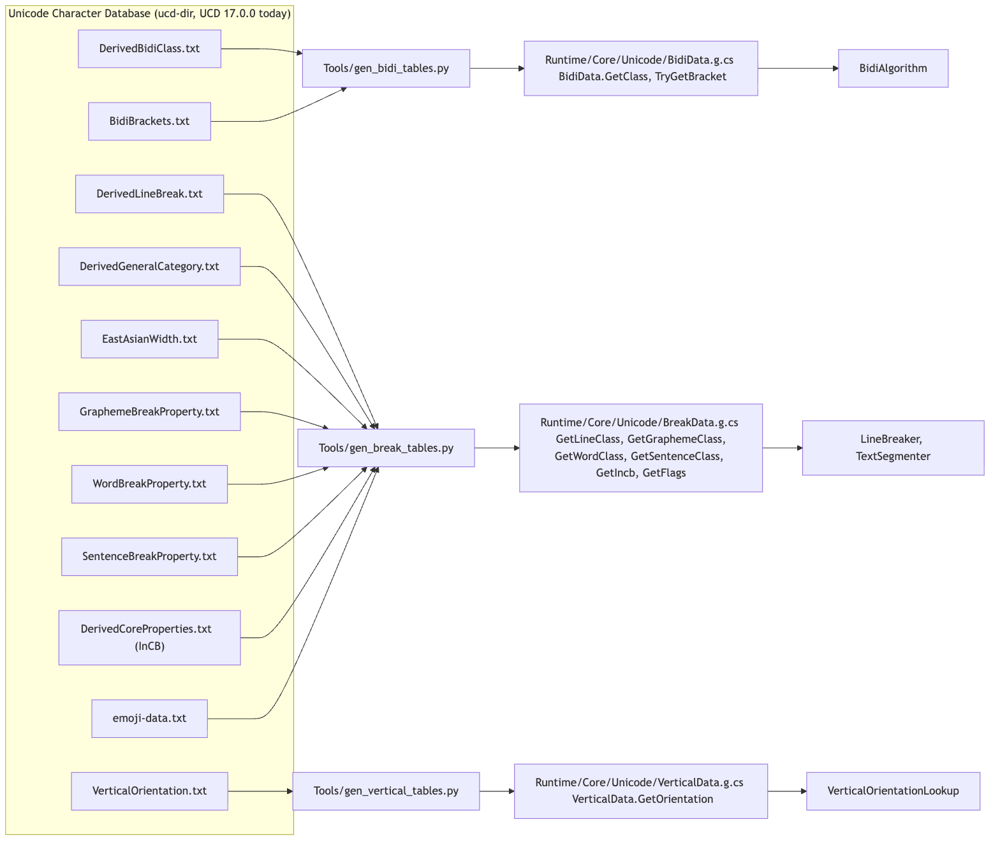
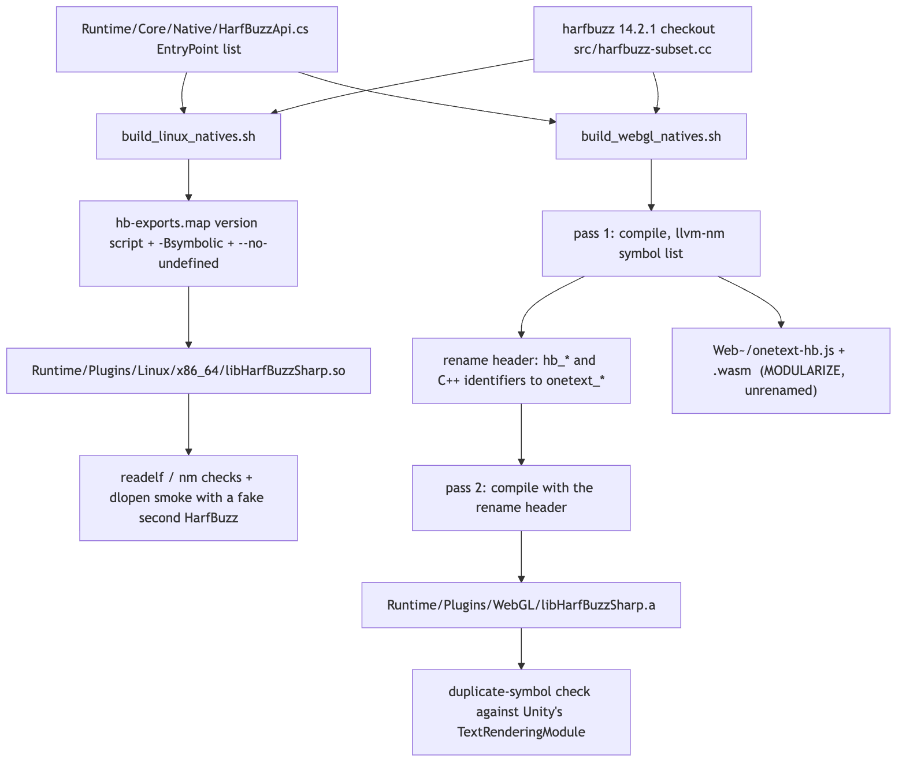
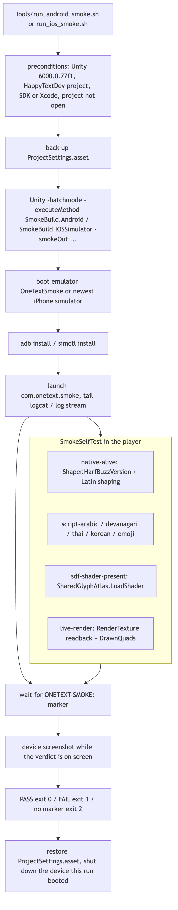

# Tools

`Tools/` holds the scripts that generate, fetch and build inputs to the package, and the sources of the device smoke test and the IME diagnostic probes. Nothing here is compiled by Unity: the Python and shell scripts are run by a contributor (or by a GitHub workflow), and the two C# folders end in `~` so the importer ignores them and the files are copied out by hand or by a workflow before they compile anywhere. In pipeline terms (string -> parse -> analyze -> shape -> layout -> render -> frontend) the generators feed the "analyze" stage (`Runtime/Core/Unicode/*Data.g.cs`), the native build scripts feed the "shape" stage (`Runtime/Plugins/**/libHarfBuzzSharp.*`), the font scripts feed the test and demo fixtures, and the smoke sources and runners sit after the whole thing, checking a real player build.

## Files

| File | Responsibility |
| --- | --- |
| `gen_bidi_tables.py` | `DerivedBidiClass.txt` + `BidiBrackets.txt` -> `Runtime/Core/Unicode/BidiData.g.cs` (`BidiData.GetClass`, `TryGetBracket`, `CanonicalBracket`). |
| `gen_break_tables.py` | Eight UCD files -> `Runtime/Core/Unicode/BreakData.g.cs` (`BreakData.GetLineClass`, `GetGraphemeClass`, `GetWordClass`, `GetSentenceClass`, `GetIncb`, `GetFlags`), with Line_Break pre-resolved per UAX #14 LB1. |
| `gen_vertical_tables.py` | `VerticalOrientation.txt` -> `Runtime/Core/Unicode/VerticalData.g.cs` (`VerticalData.GetOrientation`, UAX #50). |
| `gen_asset_icons.py` | Draws the six Project-window icons (`OneFontAsset`, `OneTextStyle`, `OneTextCharset`, `OneTextDictionary`, `OneTextSettings`, `OneTextSpriteSheet`) as 64 px signed-distance-field PNGs into `Editor/Icons/`, standard library only. |
| `fetch_coverage_fonts.py` | Downloads one Regular weight of every Noto script family plus the four CJK faces and `NotoColorEmoji.ttf` into `Tests/CoverageFonts~/` (about 200 MB, OFL, resumable; `--list`, `--skip-cjk`). |
| `make_demo_font_subsets.py` | Cuts `Samples~/Demo/Fonts/NotoSansJP-DemoSubset.otf.bytes` and `NotoColorEmoji-DemoSubset.ttf.bytes` from the coverage corpus, using only the characters the demo's own `.cs` sources contain that the rest of the chain does not cover. Needs `fontTools`. |
| `extract_glyph_paths.py` | One glyph per writing system -> SVG path data in font units (y-up), printed as `export const GLYPHS = [...]` for the landing page's globe. Needs `fontTools`. |
| `extract_greeting_paths.py` | Twelve greetings shaped through `uharfbuzz`, stamped at their shaped offsets into one SVG path each, printed as `export const GREETINGS = [...]` for the landing page. Needs `uharfbuzz`, `fontTools`. |
| `build_linux_natives.sh` | Builds `Runtime/Plugins/Linux/x86_64/libHarfBuzzSharp.so` from HarfBuzz 14.2.1 with a version script generated from `HarfBuzzApi.cs`, `-Bsymbolic`, `--no-undefined`, then verifies it with `readelf`, `nm` and a `dlopen` smoke that preloads a fake second HarfBuzz. Meant to run inside an old-glibc container (`.github/workflows/build-natives.yml`). |
| `build_webgl_natives.sh` | Builds `Runtime/Plugins/WebGL/libHarfBuzzSharp.a` (every `hb_*` identifier renamed to `onetext_hb_*` so it can link beside Unity's own HarfBuzz) and `Web~/onetext-hb.{js,wasm}` (a MODULARIZE harness build, unrenamed) with Emscripten 3.1.38. |
| `run_android_smoke.sh` | Tier-3 smoke on Android: builds the dev project's smoke APK, boots the `OneTextSmoke` AVD headless, installs, launches, waits for the `ONETEXT-SMOKE:` marker, screenshots, reports. Exit 0 PASS / 1 FAIL / 2 undecidable. |
| `run_ios_smoke.sh` | The same on the iOS Simulator: Unity -> Xcode project, `xcodebuild` for the simulator with `ARCHS` forced to the host arch, `simctl` install/launch, `log stream` for the marker. |
| `Smoke~/README.md` | Explains that `SmokeSelfTest.cs` is a byte-for-byte copy of `HappyTextDev/Assets/Smoke/SmokeSelfTest.cs` and `SmokeBuildCI.cs` is the CI-only Windows build entry. |
| `Smoke~/SmokeSelfTest.cs` | The `MonoBehaviour` that runs in the player: `native-alive`, five `script-*` shaping checks, `sdf-shader-present`, `live-render`; prints `ONETEXT-SMOKE: PASS (n checks)` or `ONETEXT-SMOKE: FAIL - ...`, holds the scene 25 s for a screenshot, then `Application.Quit`. |
| `Smoke~/SmokeBuildCI.cs` | `SmokeBuildCI.Windows`: generates `Assets/Smoke/SmokeScene.unity` with a `SmokeSelfTest`, sets Mono / windowed 800x600 / `runInBackground`, builds `StandaloneWindows64` with `BuildOptions.StrictMode`, exits 1 on any failure. |
| `ImeProbe~/OneTextImeProbe.cs` | `[AddComponentMenu("OneText/Diagnostics/IME Channel Probe")]`: logs `Input.compositionString` changes, key events (read in `OnGUI`, never consumed), `EventSystem` selection moves, held compositions and `F9` MARK lines, to record what the legacy input path actually does during Korean composition. |
| `ImeProbe~/OneTextImeProbeInputSystem.cs` | The Input System half: subscribes to `Keyboard.onIMECompositionChange` and `Keyboard.onTextInput` and watches IMGUI too, to find which channel a committed Hangul syllable arrives on. Compiles only under `ENABLE_INPUT_SYSTEM` with the package installed. |

## Structure

The folder has no types of its own to diagram; its structure is which artefact each script produces and which other file it reads. Three groups:

- **Generators into the source tree**: `gen_bidi_tables.py`, `gen_break_tables.py`, `gen_vertical_tables.py` write `Runtime/Core/Unicode/*.g.cs`; `gen_asset_icons.py` writes `Editor/Icons/*.png`; `extract_glyph_paths.py` and `extract_greeting_paths.py` write JS for the landing page (`page~/glyphs.js`, `page~/greetings.js`; the docstrings say `page/`). All outputs are committed, so a contributor never needs to run these unless the input changed.
- **Fetchers and subsetters for fixtures**: `fetch_coverage_fonts.py` fills `Tests/CoverageFonts~/` (gitignored); `make_demo_font_subsets.py` reads that corpus and writes two committed demo subsets.
- **Build and run scripts around native code and players**: `build_linux_natives.sh`, `build_webgl_natives.sh`, `run_android_smoke.sh`, `run_ios_smoke.sh`, with `Smoke~/` as the sources the runners and the CI workflow copy into a project.

## Behaviour

### Unicode data files to tables

Source: [diagrams/unicode-tables-flow.mmd](diagrams/unicode-tables-flow.mmd)

All three generators take `<ucd-dir> <output.cs>` and share one output shape: sorted, non-overlapping `int[] ...Starts`, `int[] ...Ends` and a `byte[]` of values, looked up by binary search in a generated static method, with the property's most common value dropped from the table and returned as the default. Each file header records the UCD version read from the first line of the primary input (`17.0.0` in the committed files) and the Unicode License. They are run by hand when the UCD is updated; the committed `.g.cs` files are the inputs the runtime compiles.

- `gen_bidi_tables.py` reads `DerivedBidiClass.txt` including its `# @missing:` default ranges (applied first for non-L classes, then overlaid with assigned values), merges per-codepoint classes into ranges and drops `L` (the global default). `BidiBrackets.txt` becomes three parallel arrays (`BracketCodepoints`, `BracketPaired`, `BracketIsOpen`). The output also carries `CanonicalBracket` mapping U+3008/U+3009 to U+2329/U+232A for BD16. The `CLASSES` order (`L R AL EN ES ET AN CS NSM BN B S WS ON LRE RLE LRO RLO PDF LRI RLI FSI PDI`) must match the `BidiClass` enum in `Runtime/Core/Unicode/BidiClass.cs`.
- `gen_break_tables.py` builds six tables over all 0x110000 codepoints. Line_Break is pre-resolved per LB1 (`AI`/`SG`/`XX` -> `AL`, `CJ` -> `NS`, `SA` -> `CM` or `AL` by General_Category `Mn`/`Mc`), after applying `DerivedLineBreak.txt`'s `@missing` defaults (CJK/emoji blocks to `ID`, currency to `PR`, which LB23a and LB30b depend on); Grapheme_Cluster_Break, Word_Break and Sentence_Break come straight from their property files; InCB from `DerivedCoreProperties.txt`; and a flags byte packs `FLAG_PI`, `FLAG_PF`, `FLAG_CN` (General_Category), `FLAG_EA` (East_Asian_Width F/W/H) and `FLAG_PICT` (Extended_Pictographic from `emoji-data.txt`). The class name lists (`LINE_CLASSES`, `GRAPHEME_CLASSES`, `WORD_CLASSES`, `SENTENCE_CLASSES`, `INCB_CLASSES`) are index-for-index the enums in `Runtime/Core/Unicode/BreakClasses.cs`; index 0 is always the default.
- `gen_vertical_tables.py` reads `VerticalOrientation.txt`, drops `R` (the default for all of Unicode) and emits `U`, `Tu`, `Tr` ranges; the lookup returns `VerticalOrientation.Rotated` for anything unlisted. The `CLASSES` order (`R U Tu Tr`) mirrors the `VerticalOrientation` enum.

The conformance files that check the resulting algorithms live in `Tests/UnicodeData~/` and must come from the same UCD release (see [../Tests/README.md](../Tests/README.md)).

### Fonts for tests, demo and page

`fetch_coverage_fonts.py` lists the script families from the GitHub API for `notofonts/notofonts.github.io`, downloads `<Family>-Regular.ttf` from `hinted/ttf/` for each (families that ship only variable or unhinted are reported to stderr, not retried), then the `EXTRAS` (four `NotoSansCJK*-Regular.otf` from `noto-cjk` and `NotoColorEmoji.ttf` from `noto-emoji`) unless `--skip-cjk`. Existing non-empty files are skipped, so an interrupted run resumes. The output folder `Tests/CoverageFonts~/` is in `.gitignore`. `CodepointCoverageTests`, `EmojiSequenceTests`, `RubyTests`, `VerticalTests`, the CJK half of `DecorationTests`, `RasterizerCostTests`, `PlayHarness.JapaneseFont` and several `GoldenCases` read from it and skip when it is absent.

`make_demo_font_subsets.py` collects every non-ASCII character in `Samples~/Demo/**/*.cs`, subtracts the cmaps of the fonts already in the demo chain (`COVERED`: Pretendard, Arabic, Thai, Devanagari, Hebrew), splits what is left into ideographs (`Lo` at or above U+2E80), emoji (at or above U+1F000) and "other" (printed as a warning), and runs `python -m fontTools.subset` with `--text=`, `--layout-features=*` (the vertical page needs `vert`/`vrt2`, the emoji row needs the ZWJ ligatures) and `--name-IDs=*` on `NotoSansCJKjp-Regular.otf` and `NotoColorEmoji.ttf` from the coverage corpus. Emoji are passed as whole sequences (`EMOJI_SEQUENCES`) so the subsetter's closure keeps the ligature that spans them. Re-running after adding a specimen is the whole procedure.

`extract_glyph_paths.py` draws one glyph per script (`WANTED`, with a primary and optional fallback font) through `fontTools`' `SVGPathPen` and prints JSON with `script`, `d`, `upem`; `extract_greeting_paths.py` shapes each greeting with `uharfbuzz` (unscaled font, so positions are font units), stamps every glyph through a `TransformPen` at `x + x_offset, y + y_offset` walking the advances, and prints `text`, `script`, `d`, `upem`, `width`. Both keep y-up font-space coordinates; the page must not flip y (the docstring records an earlier "correction" that turned every glyph upside down).

`gen_asset_icons.py` evaluates signed distance functions (`sd_circle`, `sd_round_rect`, `sd_segment`, `outline`) per pixel on a 64x64 `Canvas`, composites with straight (unpremultiplied) alpha, and writes PNGs with the standard library's `zlib`/`struct`. Palette: green for what text is made of, amber for data it is measured against, violet for decoration.

### Native builds

Source: [diagrams/natives-build-flow.mmd](diagrams/natives-build-flow.mmd)

`build_linux_natives.sh [--clean]` clones HarfBuzz `HB_VERSION=14.2.1` into `$WORK` (or uses `HB_SRC`), greps every `EntryPoint = HbPrefix + "hb_..."` out of `Runtime/Core/Native/HarfBuzzApi.cs` (refusing to continue with fewer than 50), writes an anonymous version script exporting those names plus `hb_subset_*` and localising everything else, and compiles the single amalgamation `src/harfbuzz-subset.cc` with `-O2 -fPIC -shared -fno-exceptions -fno-rtti`, `-Wl,-Bsymbolic -Wl,--version-script -Wl,--no-undefined -Wl,-soname,libHarfBuzzSharp.so -static-libstdc++ -static-libgcc`, then strips it. The header comment is the reason for every flag: ELF resolves a library's calls to its own exported functions through the global scope, Unity's editor already defines `hb_*` for TextCore, and the vendored NuGet `.so` therefore called Unity's `hb_font_set_var_coords_normalized` from its own `hb_font_create` and crashed on the first shaping call; `-Bsymbolic` binds the library to itself. Verification fails the build rather than warning: `DT_SYMBOLIC`/`DF_SYMBOLIC` present; `NEEDED` limited to libc/libm/libpthread/libdl/libgcc_s/ld-linux; highest `GLIBC_` requirement at or below `ONETEXT_GLIBC_CEILING` (2.17); every P/Invoke entry point exported; at least 31 `hb_subset_*`; no undefined `hb_*`; and a compiled C smoke that `dlopen`s a stub library defining a handful of `hb_*` names with `RTLD_GLOBAL` first, then loads the new `.so`, shapes `AVATar Wave` from `Tests/Fonts~/NotoSans.ttf` and exits 2 if the stub counted any interposed call. Only then is it installed to `Runtime/Plugins/Linux/x86_64/`. `.github/workflows/build-natives.yml` runs it in `quay.io/pypa/manylinux2014_x86_64` and uploads the result as an artifact for a human to commit.

`build_webgl_natives.sh [--clean]` needs emsdk at `$EMSDK` or `~/emsdk` activated at `EMSDK_VERSION=3.1.38` (the nearest upstream to the Emscripten bundled with Unity 6; a mismatch is warned, not fatal). It patches the HarfBuzz checkout twice with `sed` (idempotent): renames the five function definitions shadowed by same-named macros (`hb_color_get_*`, `hb_glyph_info_get_glyph_flags`) and downgrades `-Wmissing-prototypes` in `hb.hh`. Pass 1 compiles `harfbuzz-subset.cc` with the `TRIM_INFRA` / `TRIM_API` / `TRIM_SIZE` defines (infrastructure a browser has none of, API `HarfBuzzApi.cs` never names, `HB_OPTIMIZE_SIZE`; never `HB_LEAN`/`HB_MINI`, which remove shaping behaviour) and collects defined symbols with `llvm-nm`. A generated Python script recovers identifiers from Itanium-mangled names by their length prefixes, keeps every `_?hb_*` identifier plus `EXTRA` (shaper data callbacks, two CFF globals, the `cff1`/`cff2`/`graph` namespaces) minus names HarfBuzz itself `#define`s, and writes `hb-rename.h` of `#define x onetext_x` lines. Pass 2 compiles with `-include hb-rename.h` and `emar`s the one object into `Runtime/Plugins/WebGL/libHarfBuzzSharp.a`. Checks: twelve named entry points present as `onetext_*`, at least 31 `onetext_hb_subset_*`, no strong symbol still named `hb_*`, no duplicate symbols, and, when a Unity install is present, no strong symbol in common with `WebGLSupport/.../TextRenderingModule*.a`. Finally the unrenamed pass-1 object is linked into `Web~/onetext-hb.js` with `-sMODULARIZE=1 -sEXPORT_NAME=createHarfBuzz` and an `EXPORTS` list equal to the P/Invoke surface, for `Web~/index.html`. The `HbPrefix` constant in `HarfBuzzApi.cs` is `"onetext_"` on the Web build and `""` elsewhere, which is how C# reaches the renamed symbols.

### The smoke test and its runners

Source: [diagrams/smoke-run-flow.mmd](diagrams/smoke-run-flow.mmd)

`SmokeSelfTest` is the Tier-3 check: the three seams a player build changes at once (IL2CPP stripping, the platform packager's choice of native binaries, shader variant stripping) exercised once at startup. `Start` logs `ONETEXT-SMOKE-BEGIN`, then a coroutine waits one frame and runs, each in its own try/catch through `Run(name, body)`: `native-alive` (`Shaper.HarfBuzzVersion`, Latin shaping of `Hello OneText 0123` yields glyphs), `script-arabic`, `script-devanagari`, `script-thai`, `script-korean`, `script-emoji` (each shapes a string with the matching face and fails if every glyph is `.notdef`), `sdf-shader-present` (`SharedGlyphAtlas.LoadShader()` non-null and `isSupported`), and then `RenderCheck`, which cannot live inside `Run` because C# forbids yielding inside a try with a catch: it builds a `ScreenSpaceOverlay` canvas with a black backdrop and one label set in all six faces through `SetFont(...)` with a six-line text, waits two `WaitForEndOfFrame`, then points a camera at the same canvas rendering into a 1024x1024 `RenderTexture` (Metal's drawable is write-only on iOS, so `ReadPixels` from the screen comes back flat) and reads it back. It fails if `label.DrawnQuads.Count == 0` (lit pixels alone once produced a false pass when Unity painted its red error console over a missing-native crash), if the frame is a single flat colour, or if fewer than `MinInkPixels` (64) pixels exceed `InkThreshold` (0.25 luma). `Report` prints the one line the runners grep for (`Marker = "ONETEXT-SMOKE:"`), `ShowVerdictOnScreen` draws PASS/FAIL in green/red as a label, the scene holds for `HoldSeconds` (25) so a screenshot can be taken, and `Application.Quit(0 or 1)`. Fonts come from `Resources/SmokeFonts/<name>.bytes` (`.ttf` copied as `.bytes` so Unity keeps them whole).

`run_android_smoke.sh [--keep-emulator] [--out <dir>]` and `run_ios_smoke.sh [--keep-simulator] [--out <dir>]` are the local runners. Both hard-code `UNITY` (6000.0.77f1), `PROJECT` (`/Users/mac/Downloads/HappyTextDev`) and `PACKAGE_ROOT`; both write everything under `~/Library/Caches/OneTextSmoke/<Platform>` by default because output written under the package root is package content and a log Unity appends to during a build causes an infinite reimport loop; both `tee` to a log, refuse to run if `Temp/UnityLockfile` is held or a Unity process has the project open (the lockfile is in `Temp/`, not `Library/`, in Unity 6), back up and restore `ProjectSettings/ProjectSettings.asset` because the smoke build rewrites scripting backend, stripping, architectures and bundle id, and shut down the device they booted unless asked to keep it. Android: checks adb, the emulator binary and the `OneTextSmoke` AVD (the `avdmanager create avd` command is in the error), runs `-executeMethod SmokeBuild.Android -smokeOut <apk>` with `-nographics`, boots the AVD headless (300 s timeout), installs, and launches up to `LAUNCH_ATTEMPTS` (4) times with a short first timeout: Unity's player deadlocks before script code on roughly half of this emulator's cold boots (`pthread_cond_wait` on a graphics device), relaunching never recovers, so each retry boots a fresh emulator; only the "never reached script code" case is retried. It captures `logcat`, a screenshot while the verdict is on screen, and prints the `ONETEXT-SMOKE` lines. iOS: requires the full Xcode (not Command Line Tools) and an installed iOS runtime, runs `-executeMethod SmokeBuild.IOSSimulator -smokeOut <xcode dir>`, builds with `xcodebuild` for `iphonesimulator` forcing `ARCHS=$(uname -m)` (Unity writes `x86_64` into simulator configurations and an Apple Silicon simulator cannot run it; the IL2CPP script phase reads `$ARCHS` too), picks the newest available iPhone (anything already booted wins), `simctl install`/`launch`, `log stream` for the marker, `simctl io screenshot`, verdict.

In CI the Windows path replaces both: `.github/workflows/tests.yml` `windows-smoke-build` copies `Smoke~/SmokeSelfTest.cs` into `CI/Assets/Smoke/`, `Smoke~/SmokeBuildCI.cs` into `CI/Assets/Editor/`, the two package fonts plus four downloaded ones (same URLs as `fetch_coverage_fonts.py`) into `CI/Assets/Smoke/Resources/SmokeFonts/*.bytes`, and runs `game-ci/unity-builder` with `buildMethod: SmokeBuildCI.Windows` (Mono, cross-built on the Linux image); `windows-smoke-run` downloads the artifact on `windows-2022`, starts the player with `-logFile`, polls for the marker for up to 240 s, and fails on no marker or a non-PASS line. These jobs fail loudly, unlike the PlayMode and Windows EditMode jobs.

### The IME probes

`ImeProbe~` is a diagnostic to copy into a project's `Assets/`, run, paste the console back, and delete. `OneTextImeProbe` sets `Input.imeCompositionMode = On` (and back to `Auto` on disable), polls `Input.compositionString` in `Update` and `OnGUI`, logs `COMP old -> new` with code points, `KEY` lines (with `compChangedThisFrame` and `sinceComp=+Nf`, the number the recording turns on), `SEL` lines when `EventSystem.current.currentSelectedGameObject` changes, `HOLD` when a composition has stood still for `holdFrames` (90), `IME` when mode/selection flags change, and `MARK #n` on `markKey` (F9), capped at `maxLines` (400). It never calls `Event.Use` or `PopEvent`. The header describes the two recordings wanted (type 한, Enter, click away; type 한, click away without Enter, wait, type 국). `OneTextImeProbeInputSystem` does the same against `Keyboard.current` (`onIMECompositionChange` as COMPOSE, `onTextInput` as TEXT, IMGUI `Event.character` as IMGUI) and first logs which backend OneText chose; it compiles only under `ENABLE_INPUT_SYSTEM` and needs the Input System package installed, not merely selected.

## Invariants and conventions

- **Generated files are committed and stamped.** `*.g.cs` carry `// <auto-generated>`, the generator name and the UCD version; do not edit them by hand, rerun the generator. The class-order lists in the generators are the enums in `Runtime/Core/Unicode/` index for index, and index 0 is the default that is dropped from the table.
- **All three table generators and the conformance files must come from one UCD release.** Today that is 17.0.0.
- **HarfBuzz is 14.2.1 on every platform.** Both build scripts pin `HB_VERSION=14.2.1` to match the vendored `HarfBuzzSharp.NativeAssets.* 14.2.1.1` binaries; `build-natives.yml` reads the version out of the script. A platform that shapes with a different HarfBuzz is the drift `Docs/NATIVES.md` exists to prevent.
- **The export list is `HarfBuzzApi.cs`**, never a copy. `build_linux_natives.sh` greps it for the version script; `build_webgl_natives.sh` checks a named subset and the `hb_subset_*` count; both require at least 31 `hb_subset_*`.
- **The Web archive is renamed, nothing else is.** `HbPrefix` is `"onetext_"` only on the Web build. The harness module `Web~/onetext-hb.js` is built from the unrenamed object on purpose.
- **Native build scripts never warn where they can fail.** Every check exits non-zero; the install step runs last.
- **`Smoke~/SmokeSelfTest.cs` and `HappyTextDev/Assets/Smoke/SmokeSelfTest.cs` are the same file.** Change both. The `Marker` string must stay in sync with `run_*_smoke.sh` and the CI PowerShell step.
- **Smoke output lives outside the package root.** Writing under `PACKAGE_ROOT` during a build reimports the package mid-build.
- **The runners restore what they touch**: `ProjectSettings.asset`, the emulator/simulator they booted.
- **Coverage fonts are fetched, never committed**; `Tests/CoverageFonts~/` is gitignored. Demo subsets are committed and regenerated from it.
- **Path conventions in the Python scripts**: `OUT`/`ROOT` are derived from `__file__`, so they can be run from any working directory; `extract_*` print to stdout and are redirected by the caller.

## Extending

- **A new UCD-backed property**: write `gen_<name>_tables.py` in the same shape (parse `lo..hi ; value` lines and `# @missing:` defaults into a per-codepoint list, `ranges()` to drop the default, emit `Starts`/`Ends`/`Values` arrays and a binary-search lookup, stamp the version), add the matching enum to `Runtime/Core/Unicode/`, commit the `.g.cs`, and add its conformance file under `Tests/UnicodeData~` with a `Passes_Complete_*` test.
- **A new UCD release**: rerun all three generators with the new `<ucd-dir>`, replace every file in `Tests/UnicodeData~`, run `BidiTests`, `BidiClassConformanceTests`, `SegmentationTests`, and note the version in the CHANGELOG.
- **A new P/Invoke entry point**: add it to `HarfBuzzApi.cs` (both scripts read the list from there), rebuild Linux and Web, and for Web make sure the name is caught by the `_?hb_*` rename pattern or add it to `EXTRA`.
- **A new device check**: add a `Run("name", ...)` line to `SmokeSelfTest.RunAll` (or a coroutine if it must cross a frame) in both copies; keep the output on the `ONETEXT-SMOKE-CHECK` / `ONETEXT-SMOKE-INFO` prefixes so the runners' greps still find everything.
- **A new smoke platform**: a `SmokeBuild.<Platform>` method in the dev project (or a `SmokeBuildCI` one for CI), a runner script following the Android/iOS shape (preconditions, settings backup, build, device, marker wait, screenshot, verdict, restore), and a job in `tests.yml` if CI can run it.
- **A new demo specimen**: add it to the demo's `.cs` sources and rerun `make_demo_font_subsets.py`; it prints any character neither the chain nor the cut covers.
- **A new asset type icon**: add a draw function and an `ICONS` entry in `gen_asset_icons.py`, run it, commit `Editor/Icons/<Type>.png`.
- **A new page glyph or greeting**: extend `WANTED` / `GREETINGS` and regenerate the JS.
- Tests that cover this folder's outputs: `Tests/Editor/BidiTests.cs`, `BidiClassConformanceTests.cs`, `SegmentationTests.cs`, `VerticalTests.cs` (the generated tables); `Tests/Editor/NativesTests.cs` (the binaries' presence, tags and alignment); `Tests/Editor/CodepointCoverageTests.cs`, `EmojiSequenceTests.cs` (the fetched fonts); `Tests/Editor/ShaderShippingTests.cs` (the shader the smoke checks for).

## Gotchas

1. **`HB_LEAN`/`HB_MINI`/`HB_TINY` are off limits for the Web build.** They remove `hb_font_draw_glyph`, colour, variations, metrics, AAT and legacy-cmap shaping that `HarfBuzzApi.cs` uses; the trim is hand-picked so `hb_shape` returns the same result on every platform.
2. **Merging `libharfbuzz.a` and `libharfbuzz-subset.a` duplicates symbols.** Both scripts compile the single `harfbuzz-subset.cc` amalgamation for that reason; the duplicate-symbol check in the Web script exists because a broken archive once reached a Unity build.
3. **`-fvisibility=hidden` would silently un-export half the Linux list** when combined with the version script; the script's `local: *` does the whole job. Do not add the flag.
4. **The Linux `.so` must be built against an old glibc.** `GLIBC_CEILING` defaults to 2.17 (manylinux2014); a build on ubuntu-latest passes every other check and fails to load on the oldest Unity images.
5. **Emscripten version drift shows up as an LLVM object version error at Unity link time**, not here. `EMSDK_VERSION` is the knob; do not ship an old `.a` after moving it.
6. **Unity 6 keeps the lockfile in `Temp/UnityLockfile`.** The runners check that path; a check against `Library/UnityLockfile` passes forever.
7. **Half of the Android emulator's cold boots wedge Unity's player before script code.** The runner reboots the emulator per retry and never relaunches on the same one; a genuinely broken build just costs extra boots.
8. **Unity writes `ARCHS = x86_64` into simulator configurations.** The iOS runner overrides it with the host arch; without that an Apple Silicon simulator refuses the bundle.
9. **Screen readback lies on iOS Metal.** `SmokeSelfTest` renders into a `RenderTexture` and reads that; do not "simplify" it back to `ReadPixels` from the backbuffer.
10. **Lit pixels are not proof of text.** A missing native library makes Unity paint its red error console, which passed the ink check once; `DrawnQuads` is asserted first.
11. **`make_demo_font_subsets.py` and the page extractors need the coverage corpus.** Run `fetch_coverage_fonts.py` first; the subsetter exits with that instruction.
12. **`fetch_coverage_fonts.py` hits the GitHub API unauthenticated** for the family listing; rate limits apply. Families without a hinted Regular are reported as holes, not retried.
13. **The probes must be copied out of `ImeProbe~` to run**, and deleted afterwards; `OneTextImeProbeInputSystem` needs the Input System package installed, not merely the Active Input Handling setting.
14. **The runner scripts hard-code this machine's paths** (`UNITY`, `PROJECT`, `PACKAGE_ROOT`, the SDK under `PlaybackEngines/AndroidPlayer`). Edit the constants block before running elsewhere.

## Related

- [../Runtime/Core/Unicode/README.md](../Runtime/Core/Unicode/README.md): `BidiAlgorithm`, `LineBreaker`, `TextSegmenter`, `VerticalOrientationLookup`, the consumers of the generated tables.
- [../Runtime/Core/Native/README.md](../Runtime/Core/Native/README.md): `HarfBuzzApi.cs`, `HbPrefix`, the P/Invoke surface the native builds export.
- [../Tests/README.md](../Tests/README.md): `UnicodeData~`, `CoverageFonts~`, the tests that consume this folder's outputs, CI.
- [../Editor/Dev/README.md](../Editor/Dev/README.md): `NativePluginSettings` (the importer masks for the binaries built here), the golden tier that needs the coverage fonts.
- [../../Docs/NATIVES.md](../../Docs/NATIVES.md): provenance and checks for every vendored and built binary; [../../.github/workflows/build-natives.yml](../../.github/workflows/build-natives.yml) and [../../.github/workflows/tests.yml](../../.github/workflows/tests.yml).
