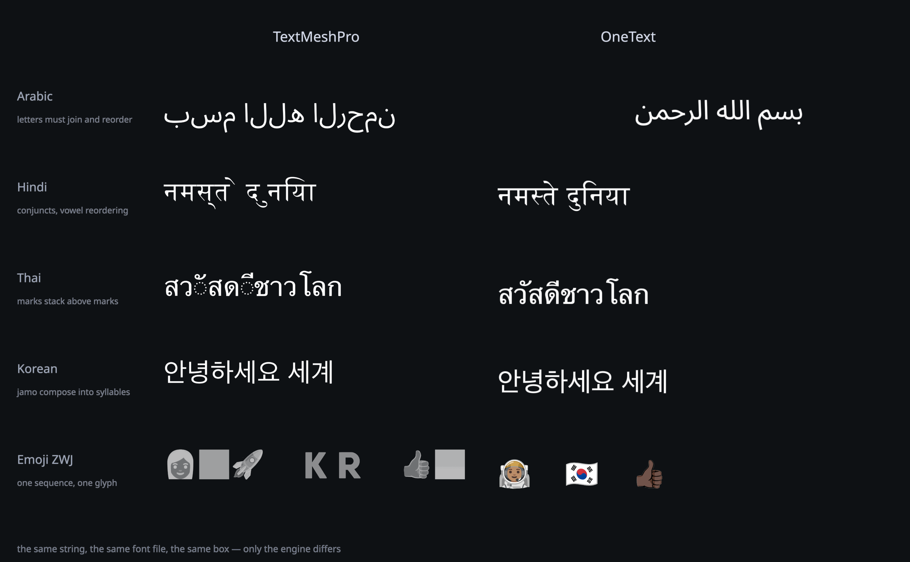

# OneText

**Every language. One draw call.**

Thai stacks. Arabic joins. Emoji stay whole. OneText is a free, MIT-licensed
text engine for Unity uGUI, built on the shaping stack the rest of the world
already trusts: HarfBuzz + FreeType, same as Chrome, Android and InDesign.



*Same string. Same font. Same box. Only the engine differs.*

## Install

Two steps. No baking.

**Window > Package Manager > + > Add package from git URL…**

```
https://github.com/CodeOneLabs/OneText.git
```

That is the whole install; the HarfBuzz/FreeType natives ship inside the
package. Then **GameObject > UI > OneText Label**, assign a font, and type in
any language on Earth. For text in the world rather than on a canvas —
nameplates, signs, diegetic UI — add `OneTextMesh` instead: the same pipeline
through a MeshRenderer, no Canvas and no uGUI dependency at all. Shipping
Thai, Lao, Khmer or Burmese? Import the **Word-break dictionaries** sample so
those scripts wrap on real word boundaries.

## In the box

One package. Every feature. Nothing sold separately.

- **Shaping & bidi** — HarfBuzz GSUB/GPOS and full UAX #9. Arabic, Devanagari,
  Thai, Khmer, Myanmar, Tibetan: contextual forms, reordering, mark stacking.
- **Rich text & emoji** — named styles, inline sprites, colour emoji including
  ZWJ sequences, flags and skin tones.
- **Text animation** — typewriter by grapheme, cluster or syllable,
  per-punctuation pauses, `<wait=>`, skip, per-unit callbacks, an effects API.
- **Asian typography** — kinsoku, punctuation compression, CJK–Latin spacing,
  Korean word wrap, dictionary line breaking for Thai, Lao, Khmer and Burmese,
  and a josa tag.
- **Outline, shadow, glow** — packed into vertex channels already paid for, so
  a decorated label and a plain one share one material and one draw call.
- **Vertical writing & ruby** — 縦書き down right-to-left columns, furigana
  sized and placed by the layout engine.
- **An input field that survives an IME** — Korean, Japanese and Chinese
  composition drawn inline at the caret; no syllable lost on focus change.
- **System-font fallback** — a character no bundled font covers is drawn from
  one the device has, not as a box.
- **World-space text** — `OneTextMesh`: the whole pipeline through a
  MeshRenderer, no Canvas, on TMP's world scale so a nameplate keeps its
  numbers. Labels can size themselves to their rect, too.
- **The Hub, in Project Settings > OneText** — the project's defaults (default
  font and fallback chain, the size and behaviour a new label is created with,
  the atlas budget), plus fonts, charsets, dictionaries, a string gallery, and
  Doctor: a renderability lint that exits 1 so CI can fail the merge. Plus
  Onboarding, which does the mechanical half of leaving TMP.

## Correctness as a number

Unicode publishes a test for every algorithm it defines. OneText runs all of
them, on every commit: **888,289 cases, zero failures** — UAX #9 bidi, UAX #14
line breaking, UAX #29 segmentation, UTS #51 emoji. Then once more against
real fonts: every assigned codepoint in Unicode 17.0.0, all 159,631 of them,
shaped, outlined, rasterized and placed.

## Fast where it hurts

A language pack lands mid-session. TextMeshPro stops for **351.8 ms**. OneText
takes **6.9 ms**. Medians, tails, draw calls — and the runs we lose — are in
[Docs/BENCHMARKS.md](Docs/BENCHMARKS.md), because a comparison that lists only
its wins is an advertisement.

## A look

| | |
|---|---|
|  |  |
| *Vertical writing: kinsoku holding the column ends, ruby beside the column* | *Ruby placed by the W3C rules: distribution, overhang, decorated readings* |
|  |  |
| *The Hub, on the project settings page: defaults, fonts, charsets, dictionaries, atlas and Doctor* | *The atlas, live: per-tile LRU, defragmentation, a budget you set* |

More in the site's [quick tour](page~/index.html): MSDF `precise`,
decorations, Doctor and the word-break dictionaries, screen by screen.

## Migrating from TMP

It is a `MaskableGraphic`, so everything you already know just works:
`RectTransform`, layout groups, `ContentSizeFitter`, masks, raycasting. There
is no atlas to bake first, and `.text` still compiles — the lowercase TMP
names are kept as aliases so a project's four hundred call sites do not have
to change on day one. That includes the ones whose units differ:
`lineSpacing` converts TMP's offset into OneText's multiplier on the way
through, and `alignment` takes a `TextAlignmentOptions` this package declares
under TMP's own names and values, so even the enum-typed lines compile.

The Hub's **Onboarding** tab does the rest. It scans your scenes, prefabs and
scripts, counts every TMP and legacy text component, and reports what will not
survive — a margin with no counterpart, a tag OneText would print literally, a
dropdown that keeps needing TMP — before it changes anything. Then it swaps
the components, re-points every reference and carries the listeners, and
rewrites the mechanical type renames in your own source. Boring, on
purpose.

You do not have to do it all in one afternoon. Tick the scenes and prefabs you
want and convert those; the fields elsewhere in the project that named a
component inside them are found and re-pointed anyway, so the part you did not
convert keeps working. Scan again whenever you want to see what is left.

## Status

**v0.3.0.** Everything above is shipped. v0.1.0 was the first public release,
v0.2.0 added world-space text, self-sizing labels, MSDF error correction and
the Onboarding tab, and this one is about coming from TextMesh Pro and finding
less missing: a migration you can run on part of a project without the rest
going quiet, the rich-text tags a real TMP project turns out to contain, and a
`<b>` that reaches a designed bold instead of silently drawing regular. What
comes next is verification and reach, not features:

| | |
|---|---|
| **Now** | Public remote and CI's first green run, the playable browser demo, the platform and IME matrix verified on real hardware, OpenUPM, a TMP migration guide in prose |
| **Next** | COLRv1, tate-chū-yoko, vertical editing, Thai proven against real data |
| **Later** | UI Toolkit frontend, ECS/DOTS, accessibility |
| **1.0** | A trust claim, not a feature list: every platform verified on real hardware, CI green as a standing condition, external projects shipping on the package |

Reasoning behind the ordering in [Docs/ROADMAP.md](Docs/ROADMAP.md).

## Requirements

Unity 2022.3 LTS or newer. Windows, macOS, Linux, Android, iOS or Web (the
Web native needs Unity 6's toolchain; built against Emscripten 3.1.38). The
natives ship with the package — [Docs/NATIVES.md](Docs/NATIVES.md) says where
they come from and what was verified. Player builds need no project settings
of their own. Only macOS and the Web have been run end to end so far; if
another platform misbehaves, that is a bug worth filing.

## License

[MIT](LICENSE). All of it — no Pro tier, no paid modules. Native dependencies
(HarfBuzz, FreeType) are permissively licensed;
see [THIRD-PARTY-NOTICES.md](THIRD-PARTY-NOTICES.md).

Contributions welcome: [CONTRIBUTING.md](CONTRIBUTING.md), including the
clean-room policy (public specifications and open-source references only).
