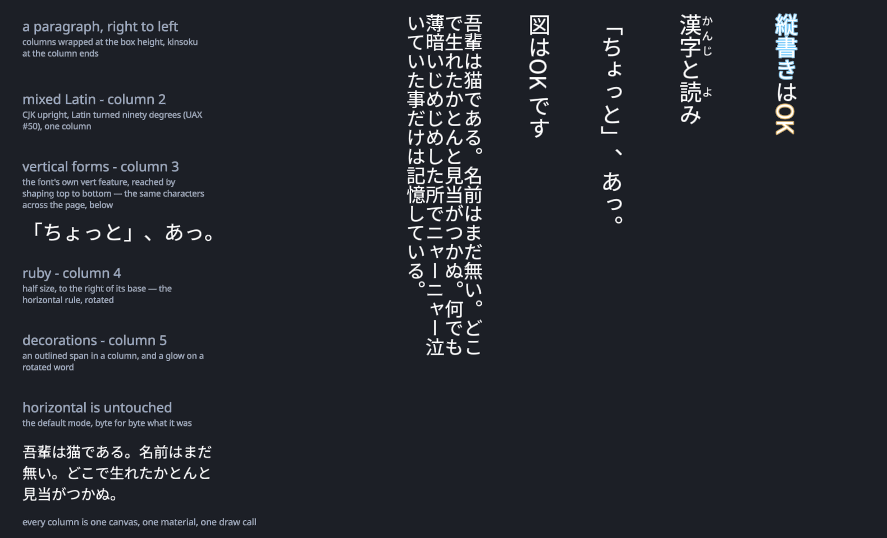
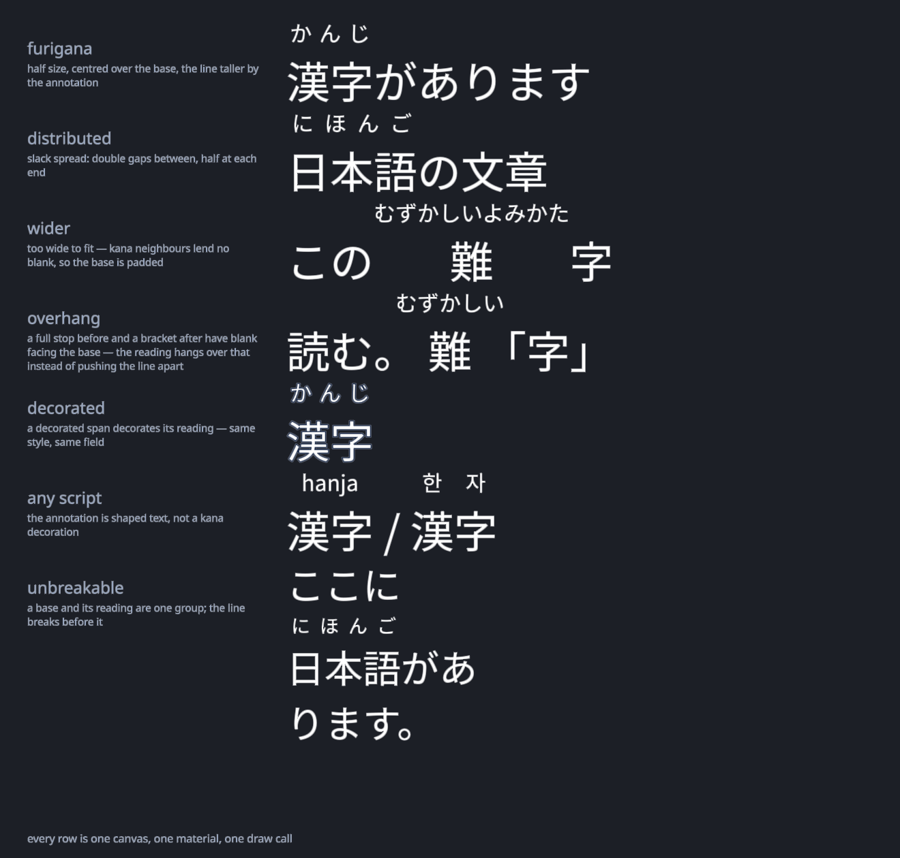
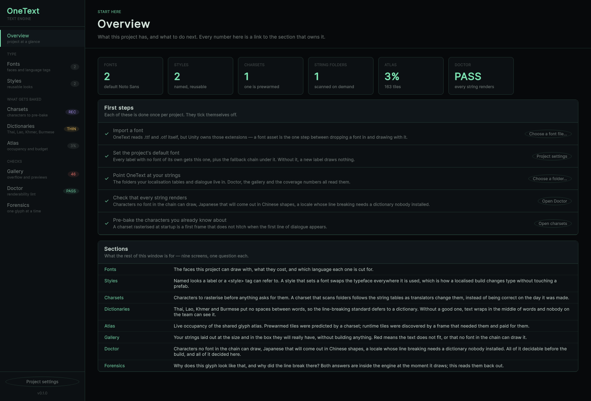
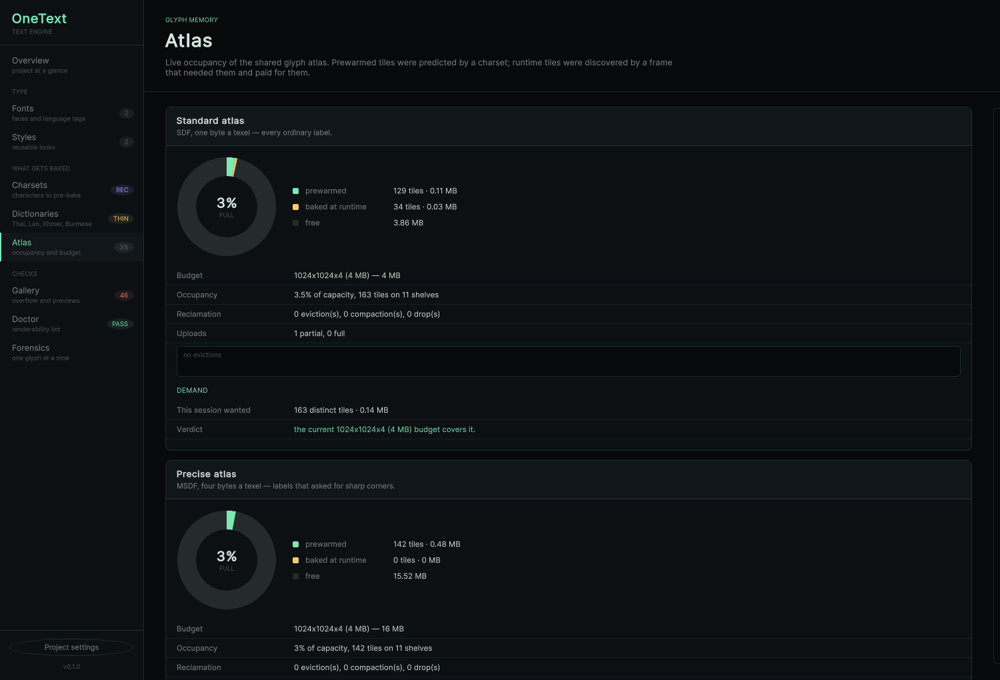

# OneText

**Free, open-source text engine for Unity. Every language, shaped correctly.**

OneText brings real OpenType text shaping to Unity: the same approach used by
Chrome, Firefox, Android, and Adobe InDesign (HarfBuzz + FreeType). Arabic
ligatures, Devanagari conjuncts, Thai clustering, bidirectional text: rendered
correctly, out of the box, for free.

> Status: **v0.1.0, the first public release.** Shaping, SDF rendering (MSDF
> as the opt-in `precise` option), the Unicode algorithms, layout, the uGUI
> components, a per-tile atlas, natives for every platform (including
> HarfBuzz on wasm for the Web, verified in WebGL2 and WebGPU players),
> rich text with named styles, colour emoji and
> inline sprites, tag-driven animation, font subsetting, Asian typography
> (kinsoku, punctuation compression, Thai dictionary breaking, the josa tag),
> text decorations (outline, shadow, glow) without splitting a single draw
> call, ruby (furigana) sized and placed by the layout engine, the Hub (one
> window for fonts, charsets, dictionaries, the atlas, a
> string gallery and Doctor, the renderability lint that CI can fail a merge
> on), and an input field that composes: Korean, Japanese and Chinese input
> methods draw inline at the caret and keep the last syllable when focus
> moves; plus vertical writing (縦書き) down right-to-left columns, and
> system-font fallback, so a character no bundled font covers is drawn from one
> the device has rather than as a box (Doctor warns and names the face either
> way).
> Next up: the playable browser demo.
> Star/watch to follow
> along.

## A look

Vertical writing, with columns right to left, kinsoku holding the column ends,
and ruby beside the column:



Ruby placed by the W3C simple-placement rules, with distribution, overhang and
a decorated reading:



The Hub (one window for fonts, charsets, dictionaries, the atlas, a string
gallery and Doctor), restyled as the tool it is:





More in the site's [quick tour](page/index.html): MSDF `precise`,
decorations, Doctor and the word-break dictionaries, screen by screen.

## Why

Unity's built-in text solutions cannot correctly shape complex scripts. If your
game ships in Arabic, Hindi, Thai, or any script that needs contextual glyph
substitution, you have been living with workarounds. OneText's goal is simple:
**correct text rendering should not be a paid feature.**

## Design pillars

1. **Correctness first.** HarfBuzz for OpenType shaping (GSUB/GPOS), Unicode
   algorithms (UAX #9 BiDi, UAX #14 line breaking, UAX #29 segmentation)
   validated against the official Unicode test suites.
2. **Drop-in uGUI integration.** A `MaskableGraphic`-based component that
   behaves the way you expect: works with `RectTransform`, layout groups,
   `ContentSizeFitter`, masks, and raycasting. Migrating a `Text` or TMP label
   should feel boring.
3. **Modern rendering.** Curve-based SDF/MSDF glyph rasterization (Burst),
   one shared texture-array atlas: per-tile LRU eviction, defragmentation, a
   budget you set, and uploads that carry only the tiles that changed.
4. **Engine/UI separation.** The core (shaping, layout, atlas) has no uGUI
   dependency, so additional frontends (UI Toolkit, world-space text) are
   thin layers.
5. **All-in-one.** Rich text, emoji, text animation, input fields: in the
   box, not spread across paid add-ons that each keep their own broken model
   of where a character is.
6. **Free forever.** MIT licensed. All features. No Pro tier, no paid
   modules.

## Roadmap

Milestones M0 to M15 are **done** and shipped in v0.1.0: everything in the
status note above, from shaping and the Unicode algorithms through the Hub,
the IME-proof input field, decorations, MSDF, ruby and vertical writing. What
comes next is about verification and reach, not features:

| | |
|---|---|
| **Now: M16** | Ship it: a public remote and CI's first green run, the playable browser demo (vs a TMP comparison), the platform and IME matrix verified on real hardware, OpenUPM listing and a TMP migration guide |
| **Next: M17** | The honestly-deferred gaps: COLRv1, MSDF error correction, tate-chū-yoko (縦中横), vertical editing, Thai proven against real data |
| **Later** | The open squares: UI Toolkit frontend, world-space text, ECS/DOTS, accessibility |
| **1.0** | A trust claim, not a feature list: every platform verified on real hardware, CI green as a standing condition, the IME matrix passed, external projects shipping on the package |

See [Docs/ROADMAP.md](Docs/ROADMAP.md) for the full plan and the reasoning
behind the ordering.

## Installing

In Unity, open **Window > Package Manager**, press **+**, choose
**Add package from git URL…**, and paste:

```
https://github.com/CodeOneLabs/OneText.git
```

That is the whole install; the HarfBuzz/FreeType natives ship inside the
package. Then use **GameObject > UI > OneText Label** (or add the
`OneTextLabel` component) and assign a font. Shipping Thai, Lao,
Khmer or Burmese? Import the **Word-break dictionaries** sample from the
package's Samples tab so those scripts wrap on real word boundaries.

## Requirements

- Unity 2022.3 LTS or newer
- Windows, macOS, Linux, Android, iOS or Web. HarfBuzz binaries ship with the
  package; see [Docs/NATIVES.md](Docs/NATIVES.md) for where they come from
  and what was verified. The Web native is built against Emscripten 3.1.38 and
  needs Unity 6's Web toolchain (2023.2+). Player builds need no project
  settings of their own: the SDF shader ships from the package's `Resources`
  folder, so nothing has to be added to Always Included Shaders.
  Only macOS and the Web have been run end to end so far; if another platform
  misbehaves, that is a bug worth filing.

## License

[MIT](LICENSE). Native dependencies (HarfBuzz, FreeType) are permissively
licensed; see [THIRD-PARTY-NOTICES.md](THIRD-PARTY-NOTICES.md).

## Contributing

See [CONTRIBUTING.md](CONTRIBUTING.md), including the project's clean-room
policy (we build from public specifications and open-source references only).
